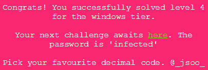
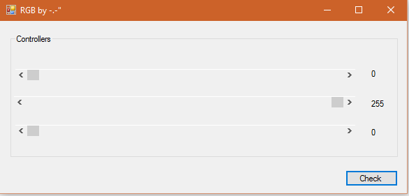
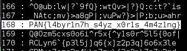

## LabyREnth CTF 2016
# Windows 5 : RGB



Throw the binary into IDA Pro and it reveals that it is a .Net executable. Therefore,  I used ILSpy to decompile the binary.

Looking at the decompiled code, it is actually quite a straight-forward challenge.

The only interesting class is the [frmMain](frmMain.cs) class. Specifically the following 3 functions

```cs
private void btnCheck_Click(object sender, EventArgs e) {
	int value = this.sbR.Value;
	int value2 = this.sbG.Value;
	int value3 = this.sbB.Value;
	int num = value2 * value3;
	int num2 = value * 3;
	if (value + num - value2 + value * value * value2 - value3 == value2 * (value3 * 34 + (num2 - value)) + 3744 && value > 60) {
		MessageBox.Show(this.szB(value, value2, value3, (byte[])this.g.Clone(), num, num2));
		return;
	}
	MessageBox.Show(this.szA(value, value2, value3, (byte[])this.a.Clone(), num, num2));
}
```

The btnCheck_Click function is the onClick Handler of the Check button. It takes the values from 3 inputs (R,G,B) and checks them. If they meet certain conditons, the szB function is called, else the szA function is called.

```cs
private string szA(int iDummy1, int iDummy2, int iDummy3, byte[] bArrayA, int iDummy4, int iDummy5) {
	for (int i = 0; i < bArrayA.Length; i++) {
		bArrayA[i] = (byte)((int)this.b[i] ^ this.d);
	}
	return Encoding.ASCII.GetString(bArrayA);
}
```

The szA function simply performs a xor decryption using this.b array as the data and this.d as the xor key. Note that the decryption does not use any of the passed in values. This means the function will always return the same result. Performing this xor decryption gives the string "Sorry! You failed xP  Try Again!"

```cs
private string szB(int iDummy1, int iDummy2, int iDummy3, byte[] bArrayA, int iDummy4, int iDummy5) {
	for (int i = 0; i < bArrayA.Length; i++) {
		int num = i;
		int expr_0E_cp_1 = num;
		bArrayA[expr_0E_cp_1] ^= (byte)(this.c ^ iDummy2);
	}
	return Encoding.ASCII.GetString(bArrayA);
}
```

The szB performs a similar xor decryption but it uses the this.c array as the data and iDummy2 as the xor key. iDummy2 is a value passed into the function. In this case, it is the value from the "G" input.

Running the executable shows the following UI



We can see that the input range of each of the R,G,B inputs are from 0 to 255. Thus iDummy2 can only be from 0 to 255.

I wrote a [php script](soln.php) to brute force all 256 values of iDummy2

```php
$a = array(20,22,100,23,21,99,100,103,24,24,25,96,25,103,16,21,16,24,22,17,98,103,103,16,23,18,103,24,17,99,96,18);
$b = array(97,93,64,64,75,19,18,107,93,71,18,84,83,91,94,87,86,18,74,98,18,18,102,64,75,18,115,85,83,91,92,19);
$g = array(113,96,111,90,77,21,67,88,83,16,79,22,73,126,82,21,88,91,126,89,17,83,16,82,126,21,76,21,91,16,79,70,92);
$c = 137;
$d = 50;

echo count($a)." ".count($b)." ".count($g)."\n";
echo "sZA is [".szA($a)."]\n";

for ($i=1; $i<256; $i++){
	echo "$i : ".szB($i, $g)."\n";
}

function szA($barray){
	global $b, $d;
	
	$out = array();
	for ($i=0; $i<count($barray); $i++){
		$out[] = $b[$i] ^ $d;
	}
	
	$ret = "";
	for ($i=0; $i<count($out); $i++){
		$ret .= chr($out[$i]);
	}
	
	return $ret;
}

function szB($dummy2, $barray){
	global $c;
	
	$out = array();
	for ($i=0; $i<count($barray); $i++){
		$out[] = $barray[$i] ^ ($c ^ $dummy2);
	}
	
	$ret = "";
	for ($i=0; $i<count($out); $i++){
		$ret .= chr($out[$i]);
	}
	return $ret;
}
```

Key 168 reveals the flag



The flag is **PAN{l4byr1n7h_s4yz_x0r1s_4m4z1ng}**