## LabyREnth CTF 2016
# Windows 6 : Shellcode

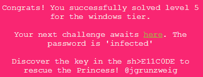

Throw the binary into IDA Pro and it looks very strange. There are only a few functions listed. The strings and imported function table is also empty.

Taking a closer look reveals that it is actually using shellcoding techniques to find and call functions without specifically importing them.

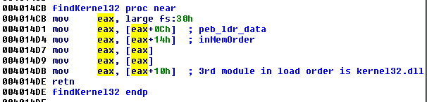

This function finds the base address of kernel32.dll from the PEB's load order list

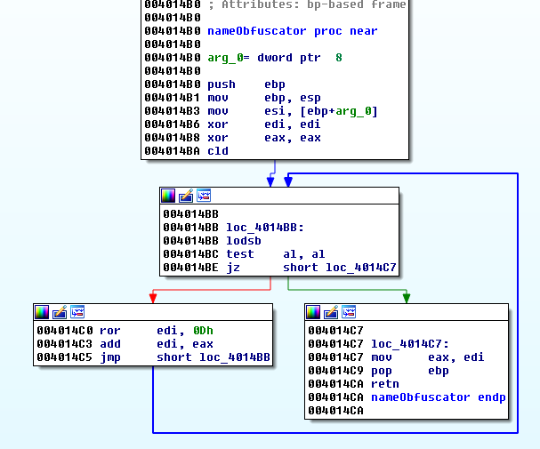

This function performs some kind of hashing on a String. This is a popular technique in actual malware where they used hashes of function names to represent them instead of their actual literal string. This is to prevent AV detection of obvious malicious strings in the binary.

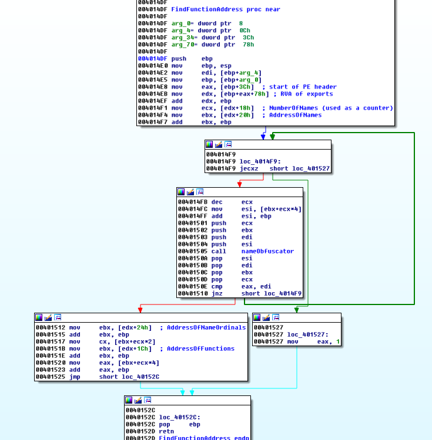

This function searches through the import table, looking for a specific function and then returns it's function address.

I then used a debugger to figure out what this binary is doing. I will not go through the process step by step. The following is a summary of my findings.

### Forming the Key

The program is trying to build some kind of key from various properties of the Operating System. This key is then used to decrypted an encryted blob of data.

The first 4 bytes of the key is defined in the binary itself.

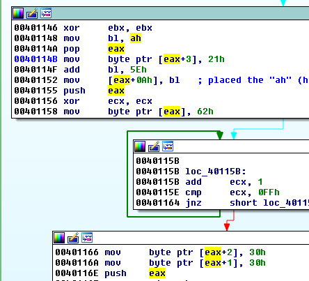

The key[0-3] are "b00!" (0x62, 0x30, 0x30, 0x21) (eax contains the pointer to the key at this moment)

The binary then calls "GetUserDefaultUiLanguage"

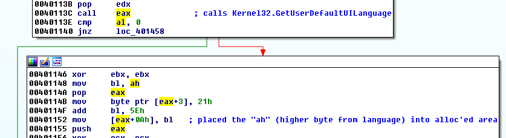

It checks that the "al" value to be 0 and then stores the "ah" value into key[10].

The binary then calls "GetVersion"

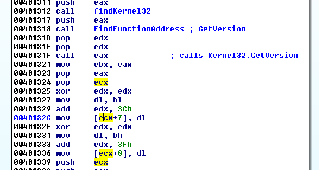

It stores the lowest order byte of the return value into bl and then next byte into bh. Afterwhich, it stores them into the key in this way
- key[7] = bl+0x3c
- key[8] = bh+0x3f

The binary then calls "GetLocalTime"

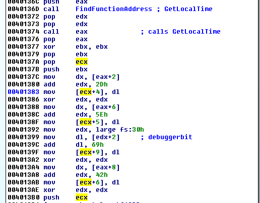

eax contains the pointer to the return value from GetLocaltime. ecx contains the pointer to the key.

It stores the following values into the key
- key[4] = [eax+2] + 0x2d
- key[5] = [eax+6] + 0x5e
- key[6] = [eax+8] + 0x42

The final thing the binary checks is the debugger bit in the PEB

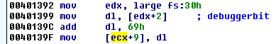

The debugger bit can only be 0 or 1 thus key[9] is either 0x69 or 0x6a

The binary then calls some kind of encoding/decoding function and checks that the results starts with the characters "PAN{". If it does, a MessageBox function is called to display the result.

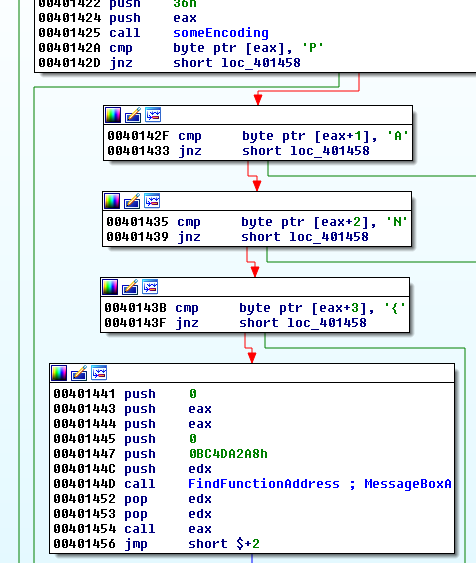

The following 2 images summarizes how the bytes of the key is formed (Ignore the actual byte values in the key, those are the bytes that was generated by my VM's operating system)

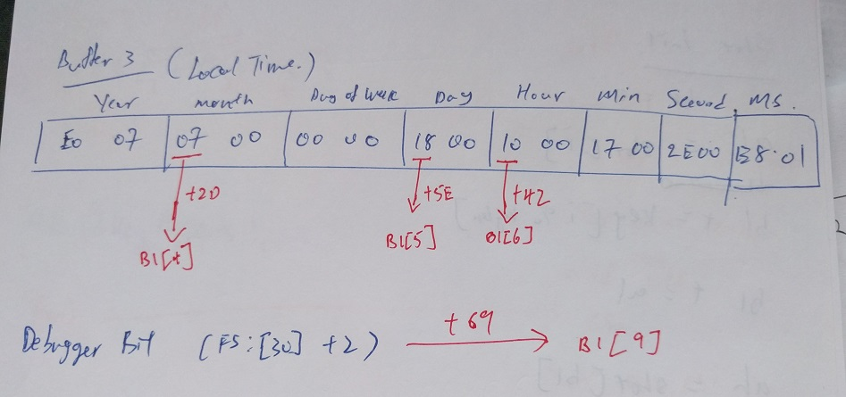

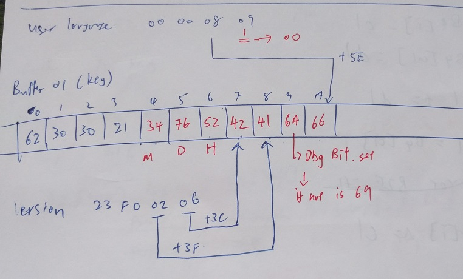

### Solution

First of all, I reversed and reimplemented the "someEnconding" function above into php. 

```php
function initSBox($key){
	$sbox = array();
	for ($i=0; $i<0x100; $i++){
		$sbox[] = $i;
	}
	
	$bl = 0;
	for ($i=0; $i<count($sbox); $i++){
		$keychar = $key[$i % count($key)];
		$al = $sbox[$i];
		$bl += $keychar;
		$bl += $al;
		$bl &= 0xff;
		$ah = $sbox[$bl];
		$sbox[$i] = $ah;
		$sbox[$bl] = $al;
	}
	
	return $sbox;
}

function decrypt($enc, $sbox, $outhex=false){
	$out = array();
	$al = 0;
	for ($i=1; $i<=count($enc); $i++){
		$dl = $sbox[$i];
		$al += $dl;
		$al &= 0xff;
		$cl = $sbox[$al];
		$sbox[$i] = $cl;
		$sbox[$al] = $dl;
		
		$cl += $dl;
		$cl &= 0xff;
		$cl = $sbox[$cl];
		$out[] = $enc[$i-1] ^ $cl;
	}
	
	$ret = "";
	for ($i=0; $i<count($out); $i++){
		if ($outhex)$ret .= dechex($out[$i]);
		else $ret .= chr($out[$i]);
	}
	return $ret;
}
```

Let's look at the possible values that could go into the key

#### [GetUserDefaultUILanguage](https://msdn.microsoft.com/en-us/library/windows/desktop/dd318693%28v=vs.85%29.aspx)

If the lower order byte has to be 0x00, the higher order byte can only be 0x0c, 0x14, 0x00, 0x08, 0x10 or 0x04

#### [GetVersion](https://msdn.microsoft.com/en-us/library/windows/desktop/ms724439%28v=vs.85%29.aspx)

The MSDN documentation does not specifically gives a range of possible values. But looking at the version number of Windows 8 (6.2), these version numbers should be failry small. I arbitrally restricted the majorVersion and minorVersion number to be between 0 and 10.

#### [GetLocalTime](https://msdn.microsoft.com/en-us/library/windows/desktop/ms724338%28v=vs.85%29.aspx)

This function returns a SYSTEMTIME sturcture which is defined as follows

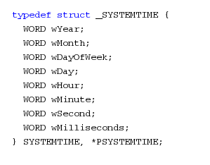

This reveals the bytes that are going into the key as follows
- [eax+2] = Month -> Possible values from (1-12)
- [eax+6] = Day -> Possible values from (1-31)
- [eax+8] = Hour -> Possible values from (0-23)

I then wrote a [php script](soln.php) to brute force all the possible values of the key.

```php
$encflag = array(
	0xBA, 0xAF, 0x4D, 0x55, 0x3C, 0xE3, 0x03, 0x22, 0xB0, 0xDF, 0xF3, 0xD3, 0x57, 0xD0, 0xE1, 0x40,
	0xF9, 0x13, 0x1F, 0xBA, 0x8D, 0x12, 0xF1, 0xFF, 0x48, 0xC2, 0x8E, 0x00, 0xFD, 0x54, 0x97, 0x9D,
	0x75, 0x71, 0x30, 0x8F, 0x43, 0x28, 0xFE, 0x69, 0x36, 0x47, 0x8F, 0xA2, 0xEF, 0x49, 0x74, 0x7C,
	0xE1, 0x4C, 0x6F, 0x4F, 0xD4, 0x82);

/*
Key format
0-3 : 62 30 30 21 (b00!)
4: Month - 12 values (1-12) +2d (2E - 39)
5: Day - 31 values (1-31) +5e (5F - 7D)
6: Hour - 24 values (0-23)  +42 (42 - 59)
7: Major Version  +3C
8: Minor Version +3f
9: Debugger Bit 2 values (0 or 1) (69 or 6A)
A: Language Locale 6 values (0x0c, 0x14, 0x00, 0x08, 0x10, 0x04) +5e
*/
$validLang = array(0x0c, 0x14, 0x00, 0x08, 0x10, 0x04);
for ($month = 1; $month <= 12; $month++){
	//$month = 7;
	for ($day=1; $day<=31; $day++){
		echo "Month $month Day $day\n";
		//$day = 24;
		for ($hour=0; $hour<=23; $hour++){
			//$hour = 17;
			for ($majorV=0; $majorV<=10; $majorV++){
				//$majorV = 6;
				for ($minorV=0; $minorV<=10; $minorV++){
					//$minorV = 2;
					for ($debugbit=0; $debugbit<=1; $debugbit++){
						//$debugbit = 1;
						for ($lang=0; $lang<=5; $lang++){
							//$lang = 0x08;
							
							$key = array(0x62, 0x30, 0x30, 0x21);
							$key[] = $month + 0x2D;
							$key[] = $day + 0x5E;
							$key[] = $hour + 0x42;
							$key[] = $majorV + 0x3C;
							$key[] = $minorV + 0x3F;
							$key[] = $debugbit + 0x69;
							$key[] = ($validLang[$lang]+0x5E) & 0xff;
							//var_dump($key);
							
							$sbox = initSBox($key);
							$result = decrypt($encflag, $sbox);
							if (strpos($result, "PAN") !== false){
								echo $result."\n";
								$log = "Month $month Day $day Hour $hour MajorV $majorV MinorV $minorV DbgBit $debugbit Lang $validLang[$lang] \n $result \n";
								file_put_contents("yay.txt",$log, FILE_APPEND);
							}
						}
					}
				}
			}
		}
	}
}
echo "Done";
```

Run the script (it will take awhile) and the flag will be revealed

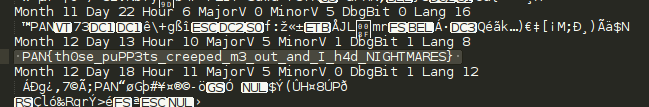

The flag is **PAN{th0se_puPP3ts_creeped_m3_out_and_I_h4d_NIGHTMARES}**