## LabyREnth CTF 2016
# Windows 8 : Revhunt

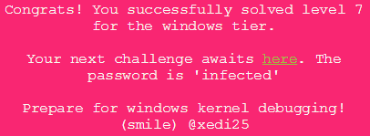

Although the description of this challenge mention kernel debugging, there is actually no need to do any kernel debugging to solve this challenge.

However, I will still add an appendix portion at the end of this writeup to describe how I setup my kernel debugging environment between a Windows Host and a Windows VM

### Revloader

Throw the binary into IDA Pro. There are lots of strings in this binary, but the interesting ones are actually unicode strings. Let's make IDA Pro display unicode strings

Press Shift+F12 to bring up the Strings window. Right click in it and click "Setup".

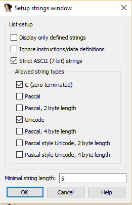

Make sure "Unicode" is checked and click "Ok".

Now, the following interesting strings shows up
- "dsefix.exe"
- "revhunt.sys"
- "revhunt.inf"

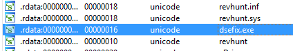

Some googling reveals that "dsefix.exe" is a tool that disables Window's Driver Signing Enforcement policy, allowing you to install unsigned drivers. Also ".sys" and ".inf" are basically Windows Driver files.

Let's do a x-ref and see what they do with these strings. Let's start with "revhunt.inf"

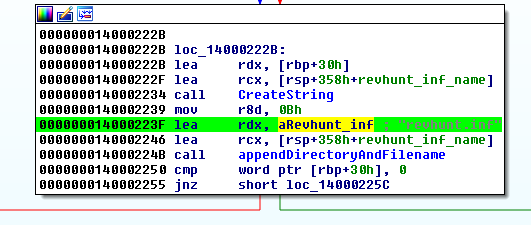

I've reversed some of the functions and renamed them to reflect what they do. This string is prepended with some kind of directory structure and then stored. It is the same with "revhunt.sys" and "dsefix.exe".

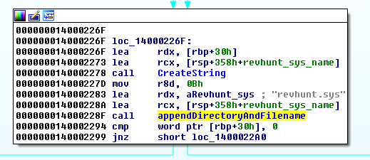

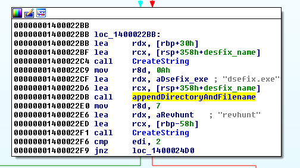

Some instructions later, these strings are used as arguments to a "LoadResourceAndWriteFile" function. This function loads a specific resource and writes it out to a file specified by the provided filepath.

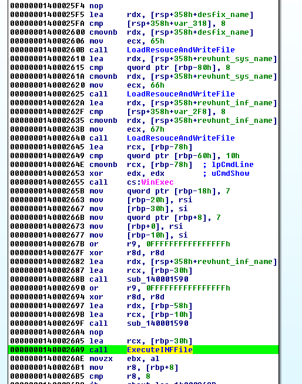

Once all 3 files are written, a WinExec function is called, presumably to execute an executable file. Take note of the offset of this instruction (0x2655)

A few instructions later, another function which I renamed to "ExecuteINFFile" is called. 

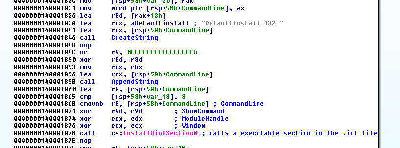

This function basically calls the "InstallHinfSection" which is normally used to install drivers. It will also trigger the driver's execution.

A little while later, another code blob basically deletes away the three files

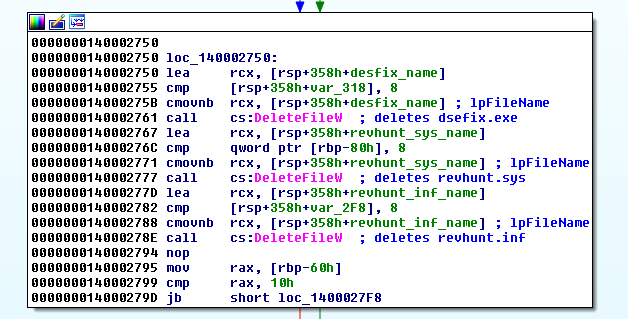

This explains why during a normal execution of this program, these 3 files are not left behind.

This suggests that this binary is actually a dropper that does the following
- Drop the 3 files
- WinExec "dsefix.exe" to disable Driver Signature Enforcement
- Install/Execute revhunt.sys driver
- Delete all 3 files

Let's put a breakpoint just before the "WinExec" function was called. This would allow us to copy out these 3 files for further analysis. 

This executable requires elevated privileges, run x64dbg as an admin in order to debug it.

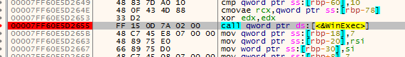

Let the program run till this breakpoint and check your folder.

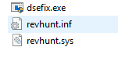

The 3 files should have been dropped in the folder. Copy it to another folder to prevent it from being deleted. Close the debugger.

Let's anaylze "revhunt.sys" now

### revhunt.sys

Throw it into IDA Pro and take a look around. Take note that there are quite a few red herrings in this binary. An example is the following.

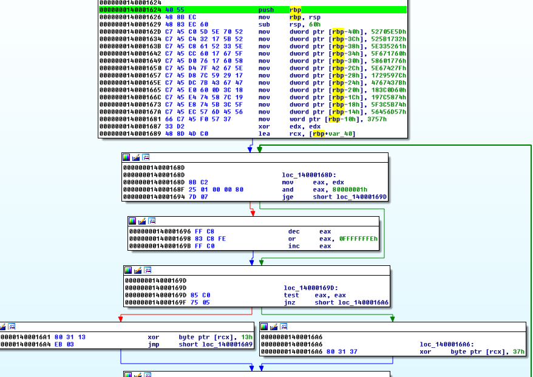

There are several sections in this code that has something similar where a bunch of String like values are passed through xor operations. They will decode to a Youtube URL leading to the "rickroll" video. Ignore all these code sections.

I've also included the [php script](rickroll_decode.php) that I used to decode these "rickroll" strings

Let's look at the Strings (Shift+F12). There is a very obvious choice here.

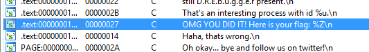

X-ref that string and it will bring us to a function.

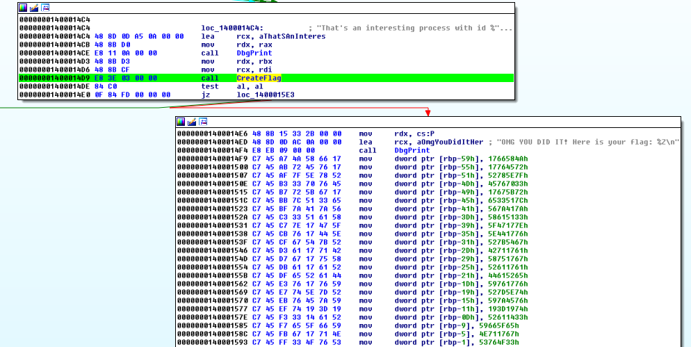

The xor decryption stuffs after the String is loaded is not the important part. The important part is the last function called before this String was loaded (which I renamed to "CreateFlag")

Look at the code of this "CreateFlag" function. A little bit into the code, you will see this blob. Does this look familiar?

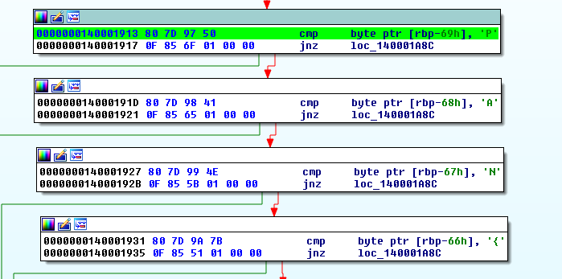

Seems like the flag is stored in [rbp-69]. Let's look at more code sections that deals with this "flag" string.

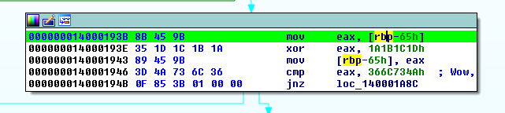

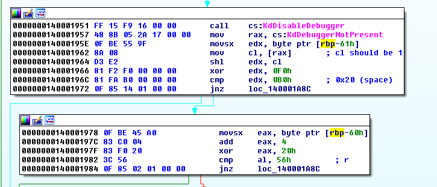

They all have a pattern. Parts of the flag string is passed through a series of arithmetic operations and compared to a final value. It is possible to use these final values and reverse the arithmetic operations to recover the actual flag string.

Do note that there are some repeated characters within the whole "rbp" string as shown below

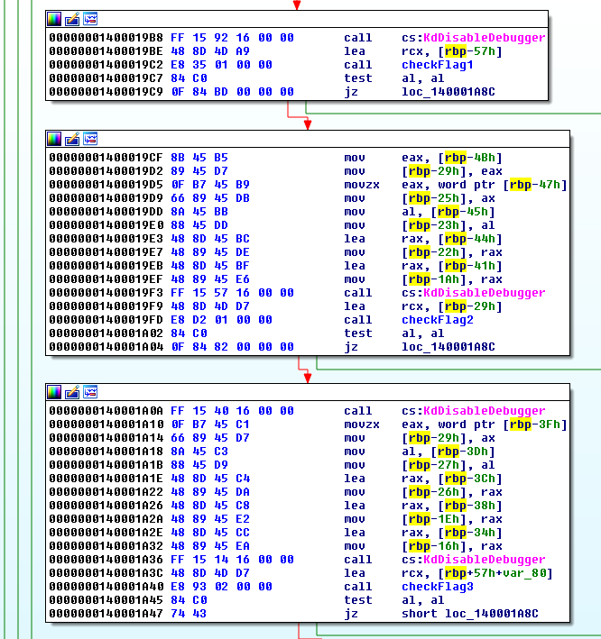

This normally happens before a call into another function takes place. There are 5 such functions that I renamed to checkFlagN. These functions basically does more of the arithmetic checking as before but starts from a different part of the String.

The following image shows the overlap of the same characters in each of these checkFlagN functions

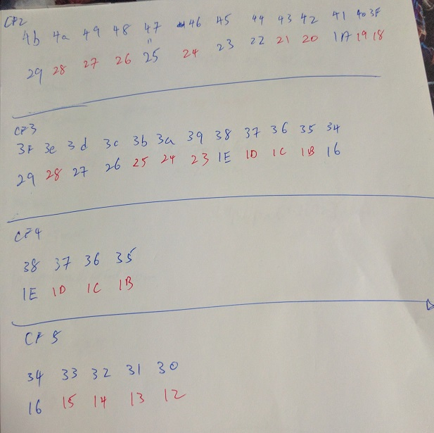

I reversed and re-implemented this entire portion into a [php script](soln.php)

```php
$flag = array();
$flag[0x69] = 0x50; // P
$flag[0x68] = 0x41; // A
$flag[0x67] = 0x4e; // N
$flag[0x66] = 0x7b; // {

$tmp = convertLittleEndian(dechex(0x366C734A ^ 0x1A1B1C1D));
$tmp = extendToEvenLength($tmp);
addToFlag($flag, $tmp, 0x65);

$flag[0x61] = (0xb0 ^ 0xf0) >> 1;
$flag[0x60] = (0x56 ^ 0x20) - 4;

// "8888999900001110"
// "a9fafcea72656770"
$tmp = convertLittleEndian(dechex(0x00001110 ^ 0x72656770));
// Guessing 0x5f to be 'e' char 0x5f = 0x60 but it was anded with 0xf0, therefore it could be 0x60-0x6f
// $flag[0x5f] = 0x3f; // put temporary ?
$flag[0x5f] = 0x65;
$tmp = substr($tmp,2);
addToFlag($flag, $tmp, 0x5e);
$tmp = convertLittleEndian(dechex(0x88889999 ^ 0xa9fafcea));
addToFlag($flag, $tmp, 0x5b);

// checkFlag1
$flag[0x57] = 0x20;
$flag[0x56] = 0x67 - 0x20;
$flag[0x55] = 0x72 & 0x3fffffff;
$flag[0x54] = 0xfc ^ 0x99;
$flag[0x53] = (0xc3 + 0x60) / 3;
$flag[0x52] = 0x3b ^ 0x4f;
$flag[0x51] = 0x20;
$flag[0x50] = (0x71 - 0xf) ^ 0xf;
$flag[0x4f] = (0x81 ^ 0x21) - 0x31; //rbx+8
$flag[0x4e] = 0x46 + 0x30;
$flag[0x4d] = (0x1 ^ 0x58) + 0xc;
$flag[0x4c] = 0x73;

// checkFlag2 (starts from 0x29 == 0x4b) (0x29 is a tmp buffer??)
$flag[0x4b] = 0x2c; // 0x29, rbx
// missing 0x4a, rbx+1
$flag[0x4a] = 0x20; // Guessing 0x4a
$flag[0x49] = 0x1ac0 >> 6; // 0x27, rbx+2
$flag[0x48] = (0x308 + 0x20) / 8; // 0x26, rbx+3
$flag[0x47] = ((0xe002 ^ 0xf2f2) >> 4) / 3; // 0x25, rbx+4
$flag[0x46] = (0x9542 ^ 0x8942) >> 6; // 0x24, rbx+5
// missing 0x45, rbx+6
$flag[0x45] = 0x20; // Guessing 0x45
$flag[0x44] = ((0x834 << 2) >> 4) / 5; // 0x22, rbx+7
$flag[0x43] = (0x94dd ^ 0x83c1) / 0x33; // 0x21, rbx+8
$flag[0x42] = 0x1f + 1; // 0x20, rbx+9
$flag[0x41] = (0x1dd36c ^ 0x46) / 0x4142;// 0x1a, rbx+f
$flag[0x40] = 0x328250 / 0x7373; // 0x19, rbx+10
$flag[0x3f] = 0x2d - 1; // 0x18, rbx+11

// checkFlag3 (starts from 0x29 == 0x3f)
$flag[0x3e] = 0x40 - 0x20; // 0x28, rbx+1
$flag[0x3d] = (0xd7 ^ 0x44) - 0x23; // 0x27, rbx+2
$flag[0x3c] = (0xb2 ^ 0x21) - 0x21; // 0x26, rbx+3
$flag[0x3b] = (0x238 - 0x7c) / 4; // first num can be 0x*38, 0x25, rbx+4
$flag[0x3a] = (0x8f25 ^ 0x8875) >> 4; // 0x24, rbx+5
$flag[0x39] = ((0xd6 ^ 0xe4) / 2) << 2; // 0x23, rbx+6
$flag[0x38] = (0x62 ^ 0x42); //0x22, 0x1e, rbx+7

// checkFlag4 (starts from 0x1e == 0x38)
$flag[0x37] = (0x70d49 ^ 0x48354) / 0x833; // 0x1d, rbx+1
$flag[0x36] = (0x14c3a1 ^ 0x232221) / 0x8c40; // 0x1c, rbx+2
$flag[0x35] = 0xa0 - 0x80; // 0x1b, rbx+3

// checkFlag5 (starts from 0x16 == 0x34)
$flag[0x34] = 0x5c ^ 0x25; // 0x16, rbx
$flag[0x33] = (0x20f63 ^ 0x23) / 0x4c0; // 0x15, rbx+1
$flag[0x32] = (0x242067 ^ 0x12567) / 0x5100; // 0x14, rbx+2
$flag[0x31] = ((0x61 ^ 0x21) >> 6) + 0x20; // 0x13, rbx+3
$flag[0x30] = (((0x13f ^ 0x903) / 0x44) << 2) + 1; // 0x12, rbx+4

printFlag($flag,0x40);

function addToFlag(&$flag, $newdata, $index){
	$newdata = extendToEvenLength($newdata);
	for ($i=0; $i<strlen($newdata); $i+=2){
		$cur = substr($newdata, $i, 2);
		$flag[$index--] = hexdec($cur);
	}
}

function convertLittleEndian($hexstr){
	if (strlen($hexstr) > 8) return false;
	$hexstr = extendToEvenLength($hexstr);
	
	$out = "";
	$b1 = substr($hexstr,6,2);
	$b2 = substr($hexstr,4,2);
	$b3 = substr($hexstr,2,2);
	$b4 = substr($hexstr,0,2);
	return $b1.$b2.$b3.$b4;
}

function extendToEvenLength($hex){
	while (strlen($hex) % 2 !== 0) $hex = '0'.$hex;
	return $hex;
}

function printFlag($flag, $len){
	$startindex = 0x69;
	$out = "";
	for ($i=0; $i<$len; $i++){
		if (empty($flag[$startindex-$i])) $out .= "*";
		else{
			$cur = $flag[$startindex-$i];
			$out .= chr($cur);
		}
	}
	echo $out."\n";
}
```

Running this script will reveal the flag 


The flag is **PAN{Wow, reverser! Great moves, keep it up, proud of you!}**


#### Appendix: Kernel Debugging

I found that the easiest way to setup kernel debugging is using [VirtualKD](http://virtualkd.sysprogs.org/) between a Windows Host and a Windows VM. 

I've tried setting it up between 2 Windows VM over a ethernet connection but the connection is unstable. If anyone has a setup which works between 2 Windows VM, please let me know :)