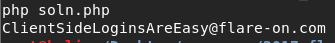

## Flare-On CTF 2017
# Challenge 01 : login.html

We are provided with a HTML file with some Javascript code

```js
document.getElementById("prompt").onclick = function () {
	var flag = document.getElementById("flag").value;
	var rotFlag = flag.replace(/[a-zA-Z]/g, function(c){return String.fromCharCode((c <= "Z" ? 90 : 122) >= (c = c.charCodeAt(0) + 13) ? c : c - 26);});
	if ("PyvragFvqrYbtvafNerRnfl@syner-ba.pbz" == rotFlag) {
		alert("Correct flag!");
	} else {
		alert("Incorrect flag, rot again");
	}
}
```

It basically performs a ROT13 on the input and compares it with the encrypted string.

This [php script](soln.php) will perform ROT13 on the encrypted string to retrieve the flag

```php
$enc = "PyvragFvqrYbtvafNerRnfl@syner-ba.pbz";

$out = "";
for ($i=0; $i<strlen($enc); $i++){
	$cur = ord($enc[$i]);
	if ($cur == ord('@') || $cur == ord('-') || $cur == ord('.')){
		$out .= chr($cur);
		continue;
	}
	
	if ($cur <= ord('Z')){
		// Upper Case
		$new = $cur - 13;
		if ($new < ord('A')) $new += 26;
		$out .= chr($new);
	}
	else{
		// Lower Case
		$new = $cur - 13;
		if ($new < ord('a')) $new += 26;
		$out .= chr($new);
	}
}

echo $out."\n";
```



The flag is **ClientSideLoginsAreEasy@flare-on.com**