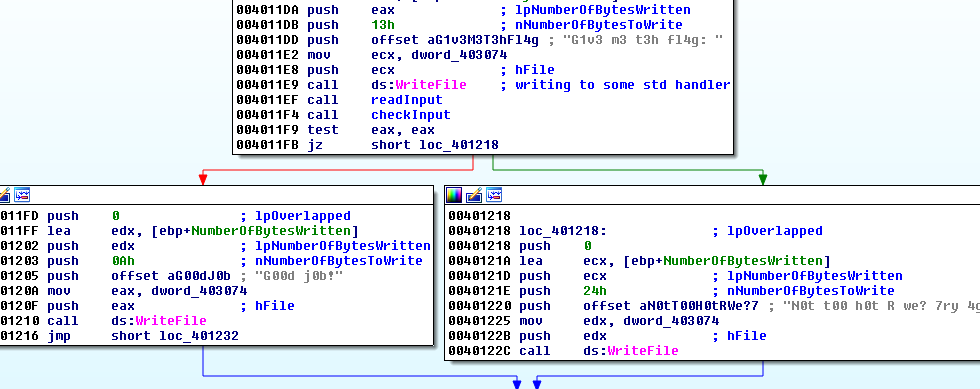
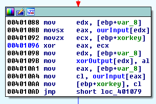
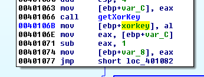
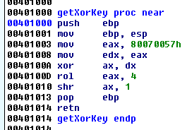
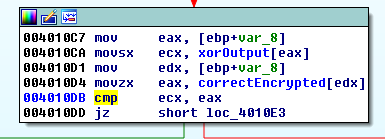
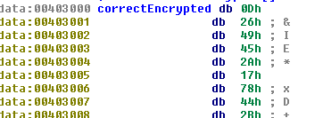
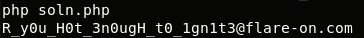

## Flare-On CTF 2017
# Challenge 02 : IgniteMe

We are provided with a x86 binary

Throw it into IDA Pro and it seems to be a rather straight forward binary.  
I've renamed some of the functions in the screenshots below to reflect what they do

It reads in the input and checks it.



Inside the CheckInput function, we see how the input is checked.



Our input is xored with a xorkey. 



This xorkey is set just a few instructions before



The xor key is a single byte determined by the above mathematical operations.  
Performing the operations reveals that the xorkey is 0x04



After the xor encryption, the result is compared with a static encrypted string stored in the binary



With these information, I wrote a [php script](soln.php) to perform the decryption of this encrypted string

```php
$enc = hex2bin("0D2649452A1778442B6C5D5E45122F172B446F6E56095F454773260A0D1317484201404D0C0269");
$xorkey = 0x04;

$out = "";
for ($i=0x26; $i>=0; $i--){
	$cur = ord($enc[$i]);
	$tmp = $cur ^ $xorkey;
	$xorkey = $tmp;
	$out .= chr($tmp);
}

$out = strrev($out);
echo $out."\n";
```



The flag is **R_y0u_H0t_3n0ugH_t0_1gn1t3@flare-on.com**