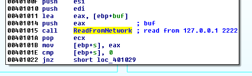
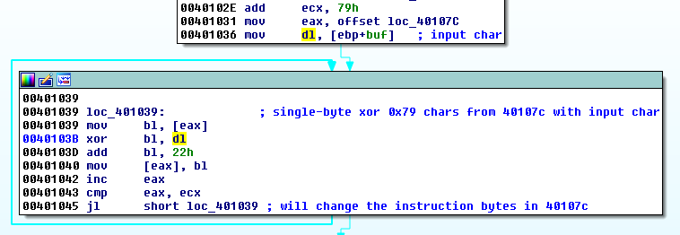
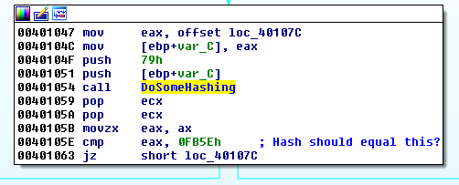
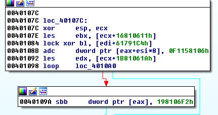
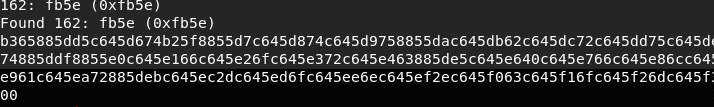
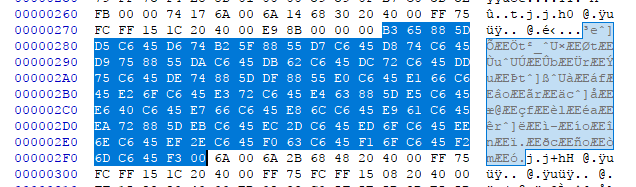
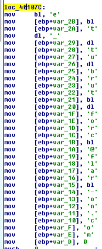

## Flare-On CTF 2017
# Challenge 03 : greek_to_me

We are provided with a x86 binary

Throw the binary into IDA Pro to start reversing.



It first opens a listener at 127.0.0.1:2222

The code continues once a input is received at the specified listening port



The first character of our input is used as a xor key to xor 0x79 bytes starting from the address 0x107c



The xor result is then passed to some hashing function and compared to a predefined hash.  
If the hash is correct, execution continues.

Let's see what is at address 0x107c



This address actually contains executable code.  
In fact, if the hash was correct, the execution will continue into this memory address.

At this moment, the above instructions does not make sense, suggesting that it may be encrypted.

As the xorkey is only 1 byte, it can be brute-forced.

I reimplemented the encryption and hashing code into PHP

```php
function doDecrypt($enc, $key){
	$out = "";
	
	for ($i=0; $i<strlen($enc); $i++){
		$cur = ord($enc[$i]);
		$tmp = $cur ^ $key;
		$tmp = ($tmp + 0x22) & 0xff;
		$out .= chr($tmp);
	}
	
	return $out;
}

function doHash($msg){
	// Hashes 20 byte chunks
	//  Maintans 2 sum 
	//   x = 0xff + cumulative sum of input chars
	//   y = 0xff + cumulative sum of x
	
	// At the end of every 20 byte chunks, reset x and y
	//  x = (1st byte of x) + (2nd byte of x)
	//  y = (1st byte of y) + (2nd byte of y)
	
	// At the end of the hashing algo, return result as a word (yx)
	//  y is the higher order byte, x is the lower order byte (this is the output hash)

	$x = 0xff; // sum1
	$y = 0xff; // sum2
	
	$msglen = strlen($msg);
	while($msglen > 0){
		$cur20 = substr($msg,0,20);
		for ($i=0; $i<strlen($cur20); $i++){
			$cur = ord($cur20[$i]);
			$x += $cur;
			$y += $x;
		}
		
		$x1 = $x & 0xff;
		$x2 = ($x >> 8) & 0xff;
		$x = $x1+$x2;
		
		$y1 = $y & 0xff;
		$y2 = ($y >> 8) & 0xff;
		$y = $y1+$y2;
		
		if (strlen($msg) <= 20) break;
		$msg = substr($msg,20);
		$msglen = strlen($msg);
	}	
	
	$result = ($y << 8) | $x;
	return $result;
}
```

I then wrote this [php script](soln.php) to perform the brute-force till the resulting hash is the same as the predefined hash.

```php
$bytes = hex2bin("33E1C49911068116F0329FC49117068114F0068115F1C4911A06811BE2068118F2068119F106811EF0C4991FC4911C06811DE6068162EF068163F2068160E3C49961068166BC068167E6068164E80681659D06816AF2C4996B068168A9068169EF06816EEE06816FAE06816CE306816DEF068172E90681737C");

for ($i=0; $i<= 255; $i++){
	$dec = doDecrypt($bytes, $i);
	$hash = doHash($dec);
	echo "$i: ".dechex($hash)." (0xfb5e)\n";
	if ($hash == 0xfb5e){
		echo "Found $i: ".dechex($hash)." (0xfb5e)\n";
		echo bin2hex($dec)."\n";
		break;
	}
}
```

Running the script will produce the correct decrypted bytes.  
Interestingly, the correct xor key is 0xA2 (162) which is not in the ASCII range.



```
b365885dd5c645d674b25f8855d7c645d874c645d9758855dac645db62c645dc72c645dd75c645de74885ddf8855e0c645e166c645e26fc645e372c645e463885de5c645e640c645e766c645e86cc645e961c645ea72885debc645ec2dc645ed6fc645ee6ec645ef2ec645f063c645f16fc645f26dc645f300
```

Use a Hex Editor to copy these bytes back into the binary at offset 0x27c.



Throw the modified binary back into IDA Pro

Look at the code again at address 0x107c



The code now makes sense and is actually forming the flag string

The flag is **et_tu_brute_force@flare-on.com**