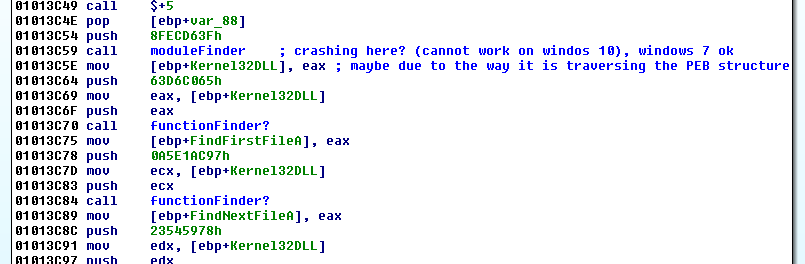
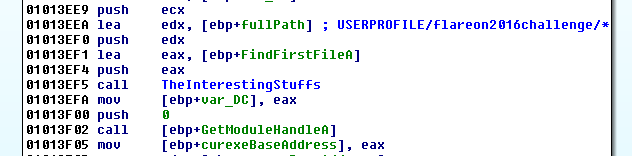
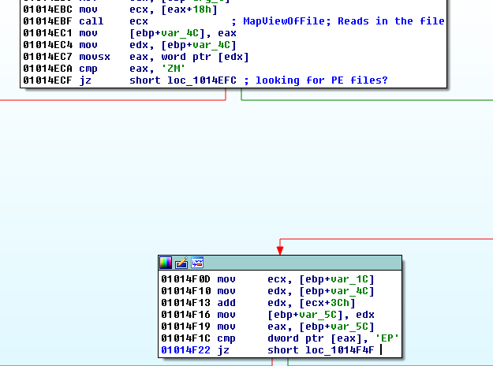
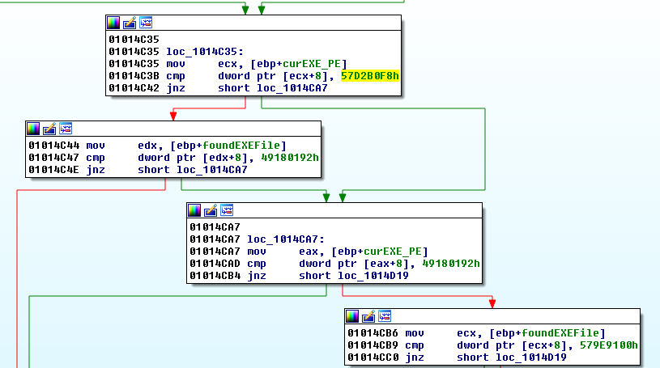
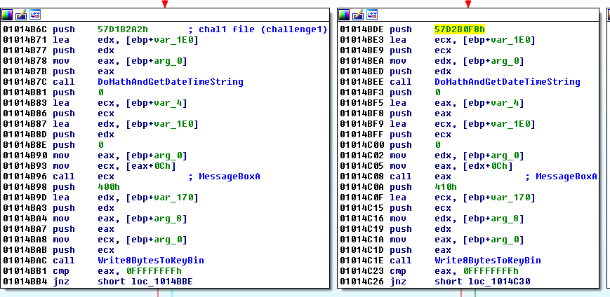
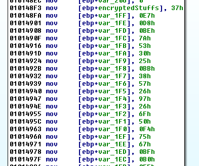
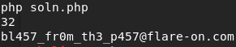

## Flare-On CTF 2017
# Challenge 04 : notepad

We are provided with a x86 binary

As this binary is fairly complicated, I will not go through step by step on how to reverse it.

The following is what it does.

It first calls a bunch of function finders to find the memory addresses of several API functions

At first, my Windows 10 machine was crashing at the 0x3c59 call. Changing the machine to a Windows 7 one solved the issue. I'm guessing the 2 versions returned the "kernel32.dll" string in different forms such that the challenge could not find where kernel32.dll is

Next, it look for files in the **%USERPROFILE/flareon2016challenge/*** folder.

For each file in the folder it does the following
- Checks that the file is a EXE
  - Checks for "MZ" header
  - Checks for PE Header

- Checks whether the Timestamp in the PE Header is equal to one of four values (in order)
  - 0x57D1B2A2
  - 0x57D2B0F8
  - 0x57D1B2A2
  - 0x579E9100

- If timestamp matches the correct value
  - Create a 8 byte key and writes it to key.bin file

The timestamp in the PE Header is like a signature of a EXE file. The code is basically looking for 4 files in the **%USERPROFILE/flareon2016challenge/*** folder

If the 4 correct files are processed, it will produce a 32 byte key.bin file
		
There is an encrypted string (32 bytes) declared in the "CheckPEFile" function (0x48f3)

After the 4 files are processed, the generated key.bin file is used to decrypt this encrypted string using string xor

The folder name "flareon2016challenge" is a hint.  
The 4 correct PE files are challenge files from last year's Flare-On CTF

The correct files in correct order is
- challenge1 (chal 01)
- DudeLocker (chal 02)
- khaki (chal 06)
- unknown (chal 03)

Create the "flareon2016challenge" folder and put these 4 files in it.  
The challenge binary will load them in the correct order if their original name is kept.

Also note that the original notepad.exe's Timestamp is used to keep track of the current state.  
I had to manually change it in the debugger to force it down the correct path

After the 4 correct files have been processed, copy the "key.bin" file.

I then wrote this [php script](soln.php) that will decrypt the encrypted string using the correct key file.

The flag is **bl457_fr0m_th3_p457@flare-on.com**

Another interesting thing to note is that the challenge binary also injects code into the ".reloc" section of the PEs that it finds.
The injected code seems to just display the Timestamp in UTC DateTime format in a MessageBox.
