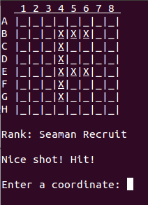
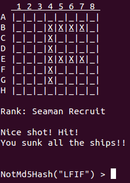
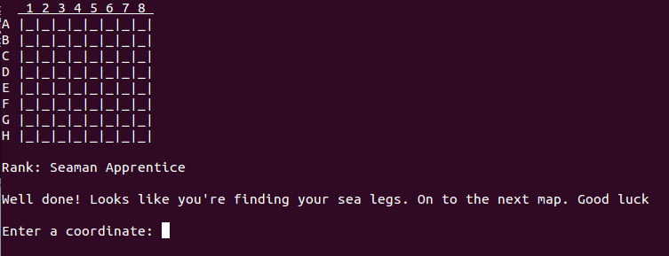
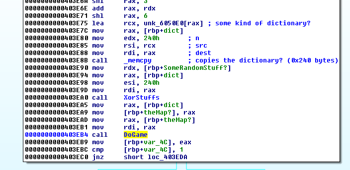
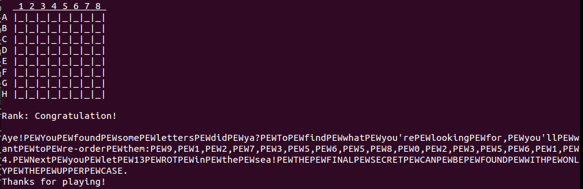
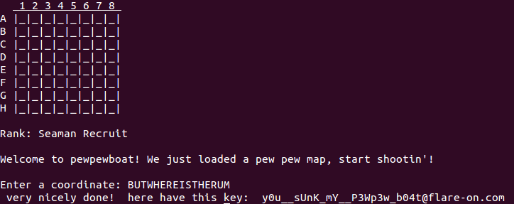

## Flare-On CTF 2017
# Challenge 05 : pewpewboat

This time round, we are provided with a 64-bit ELF

Running the ELF reveals that it is some kind of Battleship game.

Randomly firing at some coordinates reveal that it spells a letter.



Once you complete a letter, a "NotMD5" challenge is presented



Giving the correct response to the "NotMD5" challenge will get you to the next level



Let's begin reversing the binary.

I used IDA Pro and GDB to figure out what it is really doing.

The interesting code begins at offset 0x3eb4



Some kind of structure is decrypted using XOR and passed to the "DoGame" function

The "DoGame" function basically uses this structure to create the map, print the strings and execute the game.

After some trial and error and debugging, I realized that the first 8 bytes of this structure is the map.

The map is a 8x8 grid represented by 64 bits.

Placing at breakpoint at 0x3EA9, we can inspect the contents pointed by rax to extract the map

I then wrote a php function that would print this map out. Note that you will need 64-bit PHP to run this code properly

```php
function printMap($map){
	$mapstr = decbin($map);
	while (strlen($mapstr) < 64) $mapstr = '0'.$mapstr;
	$themap = str_split($mapstr,8);
	
	$out = "  1 2 3 4 5 6 7 8\n";
	$row = ord('A');
	for ($i=7; $i>= 0; $i--){
		$line = $themap[$i];
		$line = strrev($line);
		
		$out .= chr($row)." ";
		for ($k=0; $k<strlen($line); $k++){
			$cur = ord($line[$k]);
			if ($cur == ord('1')) $out .= "X ";
			else $out .= "  ";
		}
		$out .= "\n";
		$row++;
	}
	return $out;
}
```

Using this script, I can now "cheat" at the game as I can see the map now.  
Whenever I reached a new level, I would copy out the map bytes to print the map using the script.

The next thing to solve is the NotMD5 challenge.

The "NotMD5" function is done somewhere beginning at offset 0x3411

I managed to solve this by guessing.

The "NotMD5" challenge is always given with 4 characters. I realized that the correct response was the bitwise NOT of the MD5 hash of the 4 characters.

I wrote this [php script](notmd5.php) to perform the NotMD5 hash

```php
$in = $argv[1];
$notmd5 = ~md5($in, true);
$out = strtoupper(bin2hex($notmd5));
echo "NotMD5($in): $out\n";
```

Running the pewpewboat binary in GDB and using the 2 php scripts, I managed to cheat the game till the final level

These are the maps of the various levels 

```
Map 1
  1 2 3 4 5 6 7 8
A                 
B       X X X X   
C       X         
D       X         
E       X X X X   
F       X         
G       X         
H                 

Map 2
  1 2 3 4 5 6 7 8
A                 
B       X       X 
C       X       X 
D       X       X 
E       X X X X X 
F       X       X 
G       X       X 
H                 

Map 3
  1 2 3 4 5 6 7 8
A   X X X X X X   
B X             X 
C X               
D X               
E X       X X X X 
F X             X 
G X             X 
H   X X X X X X   

Map 4
  1 2 3 4 5 6 7 8
A                 
B                 
C                 
D         X     X 
E         X     X 
F         X     X 
G         X     X 
H         X X X X 

Map 5
  1 2 3 4 5 6 7 8
A                 
B       X X X X X 
C             X   
D           X     
E         X       
F       X X X X X 
G                 
H                 

Map 6
  1 2 3 4 5 6 7 8
A X X X           
B X     X         
C X X X           
D X   X           
E X     X         
F                 
G                 
H                 

Map 7
  1 2 3 4 5 6 7 8
A                 
B                 
C                 
D         X X X   
E         X       
F         X X X   
G         X       
H         X X X   

Map 8
  1 2 3 4 5 6 7 8
A                 
B   X X X X X     
C       X         
D       X         
E       X         
F X     X         
G   X X           
H                 

Map 9
  1 2 3 4 5 6 7 8
A                 
B                 
C                 
D     X       X   
E     X       X   
F     X       X   
G       X   X     
H         X       

Map 10
  1 2 3 4 5 6 7 8
A                 
B                 
C                 
D     X X         
E   X     X       
F   X     X       
G   X     X       
H     X X         

```

After Level 10, the game shows the following message



```
Aye!PEWYouPEWfoundPEWsomePEWlettersPEWdidPEWya?PEWToPEWfindPEWwhatPEWyou'rePEWlookingPEWfor,PEWyou'llPEWwantPEWtoPEWre-orderPEWthem:PEW9,PEW1,PEW2,PEW7,PEW3,PEW5,PEW6,PEW5,PEW8,PEW0,PEW2,PEW3,PEW5,PEW6,PEW1,PEW4.PEWNextPEWyouPEWletPEW13PEWROTPEWinPEWthePEWsea!PEWTHEPEWFINALPEWSECRETPEWCANPEWBEPEWFOUNDPEWWITHPEWONLYPEWTHEPEWUPPERPEWCASE.
Thanks for playing!
```

Replacing all the "PEW" with " " shows the following message

```
Aye! You found some letters did ya? To find what you're looking for, you'll want to re-order them: 9, 1, 2, 7, 3, 5, 6, 5, 8, 0, 2, 3, 5, 6, 1, 4. Next you let 13 ROT in the sea! THE FINAL SECRET CAN BE FOUND WITH ONLY THE UPPER CASE.
Thanks for playing!
```

I then wrote this php code to print the maps in the correct order

```php
$correctorder = array(9, 1, 2, 7, 3, 5, 6, 5, 8, 0, 2, 3, 5, 6, 1, 4);
for ($i=0; $i<count($correctorder); $i++){
	$index = $correctorder[$i];
	echo "Map ".($index+1)."\n";
	echo printMap($maps[$index])."\n";
}
```

The correct order of maps gives the string "OHGJURERVFGUREHZ".  
Now, we have to do a ROT13 on it

```php
$key = "OHGJURERVFGUREHZ";
$out = "";
for ($i=0; $i<strlen($key); $i++){
	$cur = ord($key[$i]) - 13;
	if ($cur < ord('A')) $cur += 26;
	$out .= chr($cur);
}

echo "Key is $out\n";
```

Performing ROT13 on the string gives the string "BUTWHEREISTHERUM"

Entering this string into the Coordinate prompt will give the flag



I've collected all the php code needed to solve this challenge into [this script](soln.php)

The flag is **y0u__sUnK_mY__P3Wp3w_b04t@flare-on.com**