## Flare-On CTF 2017
# Challenge 07 : zsud

We are provided with a x86 binary which is obfuscated by lots of nested calls

Running the binary reveals that it is some kind of old school MUD-like game

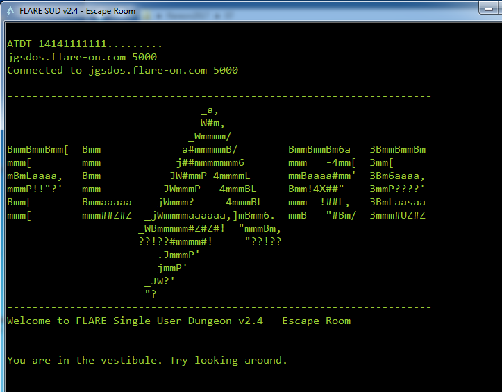

We can start reversing from the "start" function listed in the Exports tab

Do take note that alot of the jumps in this binary are obfuscated through multiple nested jumps.

The code eventually calls into the function @ offset 0x6170

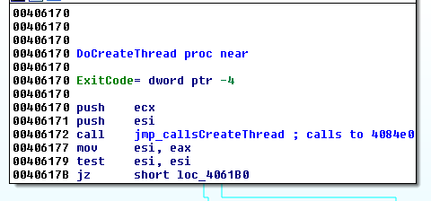

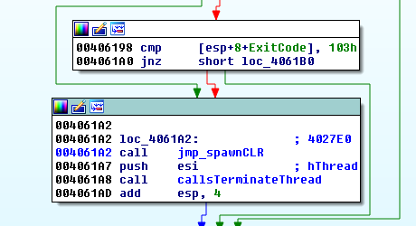

This function does 2 important stuff, creating a new thread and loading a CLR (Common Language Runtime)

### New Thread

Let's focus on the newly created thread first

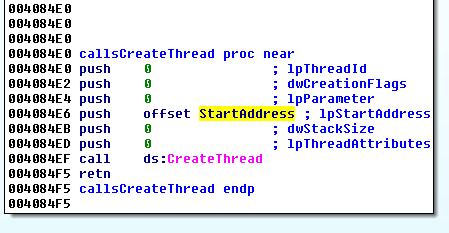

The new thread is created with the "StartAddress" function (0ffset 0x8420) as the entry point function

This function basically sets up a HTTP Web Server listening at "http://127.0.0.1:9999/some/thing.asp"

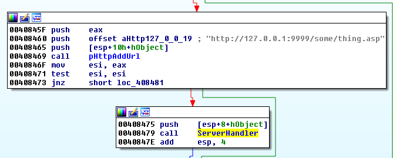

The code that actually processes the request at the address above is in the "ServerHandler" function (@ offset 0x7d30).  
We will come back to this later.

### Loading a CLR

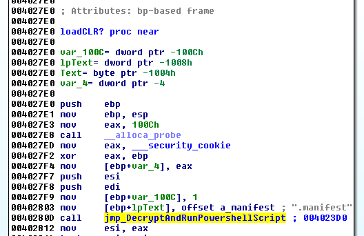

This function is jumped to after the new thread has been spawned.  
The important part is the last jump highlighted.  
It will jump to 0x23d0 after a series of nested jumps.  

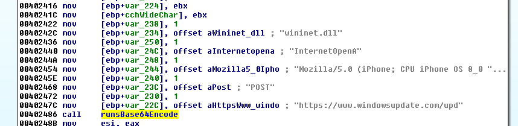

The important function is the "runsBase64Encode" function.  
After this function call, rax is pointing to a buffer containing a huge Base64-Encoded string.  
I've included this string [here](hugeb64.txt)

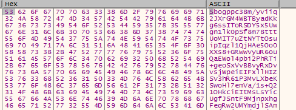

The code then proceeds to load a specific version of the CLR (Common Language Runtime)

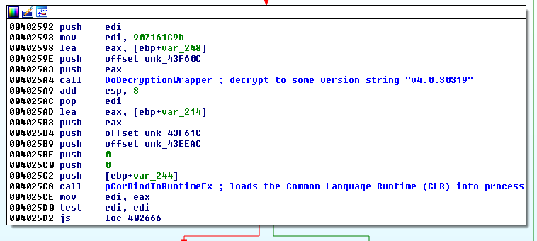

I was stuck here for some time as my debugger started to throw excetpions after the next few instructions.
Also base64-decoding the string only returned gibberish

### The Powershell

I then noticed that there was a 2nd executable in "zsud.exe"

Open "zsud.exe" in a hex editior and search for "MZ" string.

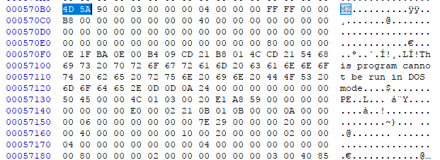

There is one instance near the end which looks like a valid PE file with proper headers.  
Copy the bytes from here till the end of the file into another file.

Throwing this new executable into IDA Pro reveals that it is a .Net binary.  
Throw it into dnSpy instead.

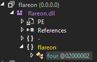

dnSpy identifies the executable as "flareon.dll" and it contains 2 interesting functions

```cs
public class four
	{
		// Token: 0x06000001 RID: 1 RVA: 0x00002050 File Offset: 0x00000250
		private static string Decrypt2(byte[] cipherText, string key)
		{
			byte[] bytes = Encoding.UTF8.GetBytes(key);
			byte[] array = new byte[16];
			byte[] iV = array;
			string result = null;
			using (RijndaelManaged rijndaelManaged = new RijndaelManaged())
			{
				rijndaelManaged.Key = bytes;
				rijndaelManaged.IV = iV;
				ICryptoTransform transform = rijndaelManaged.CreateDecryptor(rijndaelManaged.Key, rijndaelManaged.IV);
				using (MemoryStream memoryStream = new MemoryStream(cipherText))
				{
					using (CryptoStream cryptoStream = new CryptoStream(memoryStream, transform, CryptoStreamMode.Read))
					{
						using (StreamReader streamReader = new StreamReader(cryptoStream))
						{
							result = streamReader.ReadToEnd();
						}
					}
				}
			}
			return result;
		}

		// Token: 0x06000002 RID: 2 RVA: 0x00002164 File Offset: 0x00000364
		public static int Smth(string arg)
		{
			using (PowerShell powerShell = PowerShell.Create())
			{
				try
				{
					byte[] cipherText = Convert.FromBase64String(arg);
					string script = four.Decrypt2(cipherText, "soooooo_sorry_zis_is_not_ze_flag");
					powerShell.AddScript(script);
					Collection<PSObject> collection = powerShell.Invoke();
					foreach (PSObject current in collection)
					{
						Console.WriteLine(current);
					}
				}
				catch (Exception var_5_70)
				{
					Console.WriteLine("Exception received");
				}
			}
			return 0;
		}
	}
```

It basically takes in a input string, base64-decodes it, decrypts it using the Rijndael cipher with the key "soooooo_sorry_zis_is_not_ze_flag" and executes the result with Powershell

I created a Visual Studio project and copied the code over to decrypt the huge base64 string that we got before

I've uploaded the C# code [here](Program.cs)

Running this program decrypts the base64 string into the following

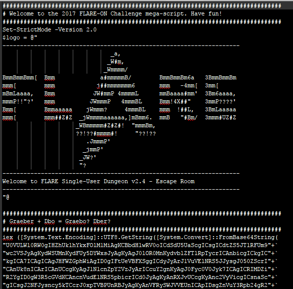

The output is an obfuscated powershell script which is also the UI of the game that we saw when we executed "zsud.exe" normally

I've included the [original obfuscated powershell script](game_orig.ps1) and the somewhat [deobfuscated verson](game.ps1)

The powershell script contains the entire logic of the game.

### The Game

The game revolves around you walking around the "Fireeye" office and there are a few objects that you can interact with.  
You move around be entering 'n','s','e','w','u','d' (North, South, East, West, Up, Down)

First of all, this is the map of the entire office.

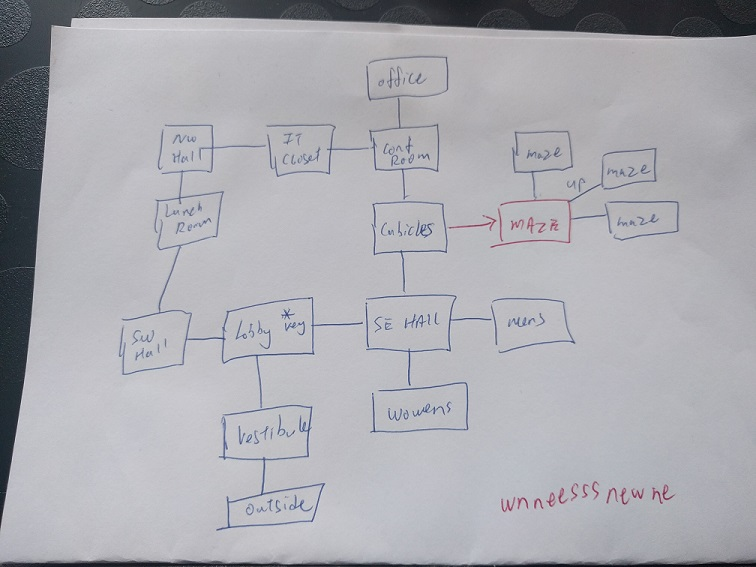

In the "Lobby" area, there is an reception desk with drawers.  
Inside the drawers are a set of keys.  
The following code is executed when the player picks up the key.  

```
function Invoke-TransferThing([PSObject][ref]$container_old, [PSObject][ref]$container_new, $thing) {
	$ret = $false

	if ($thing.Fixed -eq $false) {
		$al = [System.Collections.ArrayList]($container_old.Contents)
		$al.Remove($thing)
		$container_old.Contents = @($al)

		$container_new.Contents += $thing
		$ret = $true

		if (($thing.Keywords -Contains "key") -and ($container_new -eq $script:char)){
			${MsvcRT}::("srand").Invoke(42)
		}
	}

	return $ret
}
```

Take note of the last part, where srand is called with a static seed of "42"

When the player then tries to move, the following code is called

```ps
function Invoke-MoveDirection($char, $room, $direction, $trailing) {
	$nextroom = $null
	$movetext = "You can't go $direction."
	$statechange_tristate = $null

	$nextroom = Get-RoomAdjoining $room $direction
	if ($nextroom -ne $null) {
		$key = Get-ThingByKeyword $char 'key'
		if (($key -ne $null) -and ($script:okaystopnow -eq $false)) {
			$dir_short = ([String]$direction[0]).ToLower()

			$N = sCRiPt:MSVcRt::rand()%6

			if ($directions_enum[$dir_short] -eq ($n)) {
				$script:key_directions += $dir_short
				$newdesc = Invoke-XformKey $script:key_directions $key.Desc
				$key.Desc = $newdesc
				if ($newdesc.Contains("@")) {
					$nextroom = $script:map.StartingRoom
					$script:okaystopnow = $true
				}
				$statechange_tristate = $true
			} else {
				$statechange_tristate = $false
			}
		}

		$script:room = $nextroom
		$movetext = "You go $($directions_short[$direction.ToLower()])"

		if ($statechange_tristate -eq $true) {
			$movetext += "nThe key emanates some warmth..."
		} elseif ($statechange_tristate -eq $false) {
			$movetext += "nHmm..."
		}

		if ($script:autolook -eq $true) {
			$movetext += "n$(Get-LookText $char $script:room $trailing)"
		}
	} else {
		$movetext = "You can't go that way."
	}

	return "$movetext"
}

function Invoke-XformKey([String]$keytext, [String]$desc) {
	$newdesc = $desc 

	Try {
		$split = $desc.Split()
		$text = $split[0..($split.Length-2)]
		$encoded = $split[-1]
		$encoded_urlsafe = $encoded.Replace('+', '-').Replace('/', '_').Replace('=', '%3D')
		$uri = "${script:baseurl}?k=${keytext}&e=${encoded_urlsafe}"
		# baseurl was set to 'http://127.0.0.1:9999/some/thing.asp'

		$r = Invoke-WebRequest -UseBasicParsing "$uri"

		$decoded = $r.Content

		if ($decoded.ToLower() -NotContains "whale") {
			$newdesc = "$text $decoded"
		}
	} Catch {
		Add-ConsoleText "..."
	}

	return $newdesc
}
```

If the player is carrying the "Key", it does the following
- Appends the new movement direction into a movement history string
- Select a "random" direction by calling "rand() % 6"
  - Remember srand was called with a static seed (42) earlier, this means this random number can be predicted.
- Check if the new movement direction is equal to the "random" direction
  - If it is not, display the message "Hmm..." and nothing happens
  - If it matches
    - Makes a HTTP request to "http://127.0.0.1:9999/some/thing.asp?e=xx&k=yy"
      - "e" parameter contains the item Key's description text
      - "k" parameter contains the movement history of the player since acuiqring the "Key" item
    - Check if the HTTP response contains the string "whale"
      - If it does, decryption failed, nothing changes
      - If it does not, decryption was successfull
        - Set the item Key's description to the received response.
        - If the new description contains the character "@", teleport the user to the starting room (Vestibule)

The HTTP url is handled by the new thread that was spawned earlier.  
If we reverse the "ServerHandler" code before, it basically takes the e and k parameter and tries to do some decyrption.  
- If the decryption failed, it will return a "Fail whale" text.  
- If the decryption is successful, it returns the decrypted result.

The key can be picked up in the Reception Desk's Drawers.  
The initial description looks like [this](start.txt)

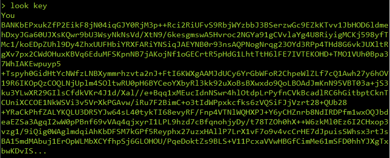

As we know the valid charset of the "k" parameter is only 'nsewup', I wrote a [bruteforce script](brutedir.php).

Note that zsud.exe has to be running in the background as we need the webserver to be up for the brute-force script to talk to.  
The script decrypted the following

```
Direction: w
Message: You can <REDACTED Base64 Text>
...
Direction: wn
Message: You can start <REDACTED Base64 Text>
...
Direction: wnn
Message: You can start to <REDACTED Base64 Text>
...
Direction: wnne
Message: You can start to make <REDACTED Base64 Text>
...
Direction: wnnee
Message: You can start to make out <REDACTED Base64 Text>
...
Direction: wnnees
Message: You can start to make out some <REDACTED Base64 Text>
...
Direction: wnneess
Message: You can start to make out some words <REDACTED Base64 Text>
...
Direction: wnneesss
Message: You can start to make out some words but <REDACTED Base64 Text>
...
Direction: wnneesssn
Message: You can start to make out some words but you <REDACTED Base64 Text>
...
Direction: wnneesssne
Message: You can start to make out some words but you need <REDACTED Base64 Text>
...
Direction: wnneesssnew
Message: You can start to make out some words but you need to <REDACTED Base64 Text>
...
Direction: wnneesssnewn
Message: You can start to make out some words but you need to follow cDisN4lX5WLKHGJ4iEhe87mu+smL8itgKHaEfOmmRSXBog2+yJhU4ykWmPUssytjgscnraly7QsrM5Lhgi9do4npyqDkWZjNo5uJ+IT+zZ4vcT4nhIRilKM3V8MiKeaDx4ob+/ri2G906g1PdpAbxQ==
...
Direction: wnneesssnewne
Message: You can start to make out some words but you need to follow the ZipRg2+UxcDPJ8TiemKk7Z9bUOfPf7VOOalFAepISztHQNEpU4kza+IMPAh84PlNxwYEQ1IODlkrwNXbGXcx/Q==
```

The brute-force script then failed to decrypt the rest of the message.

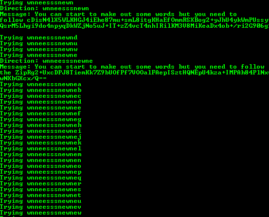

The correct key up to this point is "wnneesssnewne".  
If we look back at the map and moved according to this direction from the lobby, we will end up in the maze.  
While inside the maze, all 6 direction of movement is valid.

The correct key would be the string of "random" direction generated using the static seed.  
Theorectically, this means we could actually generate this "random" direction string to infinite length.  
However, for some reason, I failed to generate this string.  
Therefore, I fell back to the old school brute force method.

This game allows you to chain multiple commands together using commas

```
n,get key drawer,w,n,n,e,e,s,s,s,n,e,w,n,e,look key
```

If the direction is correct, the game will reply with "Key emanates some warmth"  
I used this to brute-force the correct direction string.  
Eventually, you will get the correct key (the correct key is 53 chars long)

```
n,get key drawer,w,n,n,e,e,s,s,s,n,e,w,n,e,look key
n,get key drawer,w,n,n,e,e,s,s,s,n,e,w,n,e,e,look key
n,get key drawer,w,n,n,e,e,s,s,s,n,e,w,n,e,e,w,look key
n,get key drawer,w,n,n,e,e,s,s,s,n,e,w,n,e,e,w,w,look key
...
n,get key drawer,w,n,n,e,e,s,s,s,n,e,w,n,e,e,w,w,w,d,u,n,d,u,n,d,u,n,s,u,n,e,u,n,s,e,w,d,u,n,s,e,w,s,e,w,s,e,w,s,e,w,d,u,n,look key
```

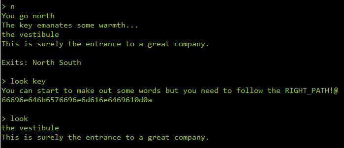

The presensce of the "@" character in the description also teleported you out of the maze.

"66696e646b6576696e6d616e6469610d0a" decoded as ascii hex gives "findkevinmandia"

Now, we just need to go talk to Kevin Mandia.  
He is in the northern most room "Office"

```
function Invoke-Say($char, $room, $trailing) {
	$resp = "It doesn't talk back"

	$ar = $trailing.Split()
	if ($ar.Length -lt 2) {
		return "Syntax: say <someone> <words...>"
	}

	$to_whom = $ar[0]
	$words = $ar[1..99999]

	$thing = Get-ThingByKeyword $room $to_whom
	if ($thing.Name -eq "Kevin Mandia") {
		$resp = "Kevin says a friendly 'hello' and then looks back down at his computer. He's busy turbo-hacking."

		$key = Get-ThingByKeyword $room 'key'

		$helmet = $null
		foreach ($thing in $char.Wearing) {
			if ($thing.Keywords -contains "helmet") {
				$helmet = $thing
			}
		}

		if (($key -ne $null) -and ($helmet -ne $null)) {
			$md5 = New-Object System.Security.Cryptography.MD5CryptoServiceProvider
			$utf8 = New-Object System.Text.UTF8Encoding
			$hash = [System.BitConverter]::ToString($md5.ComputeHash($utf8.GetBytes($key.Desc)))


			$Data = [System.Convert]::FromBase64String("EQ/Mv3f/1XzW4FO8N55+DIOkeWuM70Bzln7Knumospan")
			$Key = [System.Text.Encoding]::ASCII.GetBytes($hash)

			# Adapated from the gist by harmj0y et al
			$R={$D,$K=$Args;$H=$I=$J=0;$S=0..255;0..255|%{$J=($J+$S[$_]+$K[$_%$K.Length])%256;$S[$_],$S[$J]=$S[$J],$S[$_]};$D|%{$I=($I+1)%256;$H=($H+$S[$I])%256;$S[$I],$S[$H]=$S[$H],$S[$I];$_-bxor$S[($S[$I]+$S[$H])%256]}}
			$x = (& $r $data $key | ForEach-Object { "{0:X2}" -f $_ }) -join ' '
			$resp = "nKevin says, with a nod and a wink: '$x'."
			$resp += "nnBet you didn't know he could speak hexadecimal! :-)"
		}
	}

	return $resp
}
```

In order to talk to him, we need to be wearing the "helmet" and drop the "key" in his room  
The helmet is in Kevin Mandia's office, put it on before talking to him.

This is the correct sequence of commands

```
n,get key drawer,w,n,n,e,e,s,s,s,n,e,w,n,e,e,w,w,w,d,u,n,d,u,n,d,u,n,s,u,n,e,u,n,s,e,w,d,u,n,s,e,w,s,e,w,s,e,w,s,e,w,d,u,n,look key,n,w,n,n,e,e,n,drop key,get helmet,wear helmet,say kevin hello
```

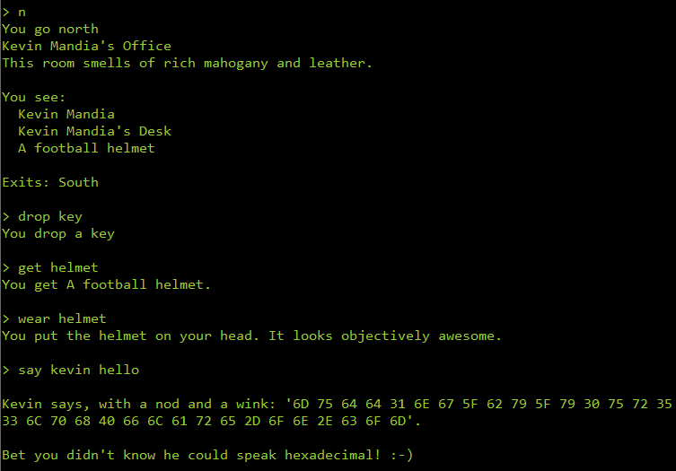

Decoding "6D756464316E675F62795F7930757235336C706840666C6172652D6F6E2E636F6D" as ascii hex gives you the flag

The flag is **mudd1ng_by_y0ur53lph@flare-on.com**