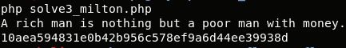
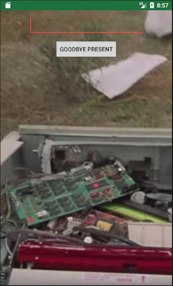
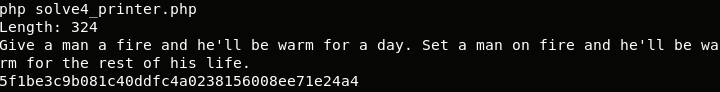

## Flare-On CTF 2017
# Challenge 08 : flair

We are provided with an APK file

This Android App consists of 4 levels named
- Michael
- Brian
- Milton
- Printer

Each level expects you to enter a correct password to get access to the next.

I prefer to read Smali hence I used apktool to decompile the app

> apktool d flair.apk

I also ran the APK in an Android emulator to verify if my passwords are correct.

Another advise is to use ADB to help copy and paste text into the Android Emulator.  
Put the text cursor on where you want the input to go and type the following command 
> adb shell input text "thetext"

### Michael


[Michael](smali/Michael.smali) is fairly straight-forward.

It basically uses a series of mathematical operations to check if certain characters in the input string is equal to certain values.

The only not so simple part is where it checks the String.HashCode() of 2 chars.  
I wrote this [java code](RunThis.java) to brute-force all the Hashcode of the possible chars.  

```java
public static void main(String[] args) {
	for (int i=0x41; i<0x7b; i++){
		String cur = Character.toString((char) i);
		cur += cur;
		System.out.println(cur + ": " + cur.hashCode());
	}
}
```
The correct chars are "__"

Therefore, the correct password for Michael is **MYPRSHE__FTW**

Entering this password will get you access to the next level

### Brian


[Brian](smali/Brian.smali) is slightly obfuscated but it is still straight-forward to reverse.

It is gathering various properties of UI elements and stringing them together to form the password.

Open a terminal and go to the "res" folder in the apktool output

1. ImageView (0x7f0b005f)'s tag

```
> grep -r "0x7f0b005f" ./
./values/public.xml:    <public type="id" name="pfdu" id="0x7f0b005f" />

> grep -r "pfdu" ./
<ImageView android:id="@id/pfdu" android:tag="hashtag" android:layout_width="wrap_content" android:layout_height="0.0dip" android:scaleType="centerCrop" app:srcCompat="@drawable/brian" />

"hashtag" found
```

2. TextView (0x7f0b005e)'s TextColor & 0xffff

```
> grep -r "0x7f0b005e" ./
./values/public.xml:    <public type="id" name="vcxv" id="0x7f0b005e" />

> grep -r "vcxv" ./
./layout/activity_brian.xml:    <TextView android:textColor="@color/colorSecondary" android:id="@id/vcxv" android:layout_width="wrap_content" android:layout_height="wrap_content" android:text="Shrimp Poppers or Extreme Fajitas" />

> grep -r "colorSecondary" ./
<color name="colorSecondary">#ffc0fefe</color>

"fefe" found
```

3. TextView (0x7f0b005e)'s fifth word (split by " ")

```
split("Shrimp Poppers or Extreme Fajitas")[4]

"Fajitas" found
```

4. Package's MetaData's "vdf"

```
In AndroidManifest.xml
<meta-data android:name="vdf" android:value="cov"/>

"cov" found
```

The password is then formed using a printf using the following format "%s_%s%x_%s!"

Therefore, the password is **hashtag_covfefe_Fajitas!**

### Milton


First of all, [Milton](smali/milton.smali) has is a rating bar on this screen.  
It has to be set to 4.0 (4 stars) for the submit button to be enabled.

This level encrypts several strings, concatenates them and pass them through SHA-1 hash.  
The final hash is then compared with the user input.

All the encryption functions are in the [Stapler](smali/stapler.smali) class

I reimplemented these encryption logic into this [php script](solve3_milton.php)

```php
$msg = "";
$msg .= doARC4("JP+98sTB4Zt6q8g=", 0x38, "State");
$msg .= doARC4("rh6HkuflHmw5Rw==", 0x60, "Chile");
$msg .= doARC4("+BNtTP/6", 0x76, "eagle");
$msg .= doARC4("oLLoI7X/jIp2+w==", 0x21, "wind");
$msg .= doARC4("w/MCnPD68xfjSCE=", 0x94, "river");
echo $msg."\n";
echo sha1($msg)."\n";

// ARC4 is the same as RC4
function doARC4($obmsg, $obkey, $arc4key){
	$enc = staple_drdfg($obmsg, $obkey);
	return rc4($arc4key, $enc);
}

function staple_drdfg($enc, $key){
	$tmp = base64_decode($enc);
	$out = "";
	for ($i=0; $i<strlen($tmp); $i++){
		$out .= chr(ord($tmp[$i]) ^ $key);
	}
	return $out;
}

function rc4($key, $str) {
	$s = array();
	for ($i = 0; $i < 256; $i++) {
		$s[$i] = $i;
	}
	$j = 0;
	for ($i = 0; $i < 256; $i++) {
		$j = ($j + $s[$i] + ord($key[$i % strlen($key)])) % 256;
		$x = $s[$i];
		$s[$i] = $s[$j];
		$s[$j] = $x;
	}
	$i = 0;
	$j = 0;
	$res = '';
	for ($y = 0; $y < strlen($str); $y++) {
		$i = ($i + 1) % 256;
		$j = ($j + $s[$i]) % 256;
		$x = $s[$i];
		$s[$i] = $s[$j];
		$s[$j] = $x;
		$res .= $str[$y] ^ chr($s[($s[$i] + $s[$j]) % 256]);
	}
	return $res;
}
```



The password is **10aea594831e0b42b956c578ef9a6d44ee39938d**

### Printer



This level uses JAVA Reflection to make most of its function calls

It basically reads in the asset named "tspe" and parses its contents to create a string.  
The string is then SHA-1 hashed and compared against our input

This is how "tspe" is parsed
- Read in 1 Integer (x) (Most likely the size)
- Divide x/3
- Loops over x/3 time (Process 3 bytes at a time)
  - reads in 1 short (s) (2 bytes)
  - reads in 1 byte (b) (1 byte)
  - Hashmap.put(s,b)

The final string is then built using the Hashmap in ascending key order (0,1,2...)

I reimplemented the algorithm into the following [php script](solve4_printer.php)

```php
$hashmap = readAsset("tspe");
$correct = "";
for ($i=0; $i<count($hashmap); $i++){
	$correct .= $hashmap[$i];
}
echo $correct."\n";
echo sha1($correct)."\n";

function readAsset($name){
	$data = file_get_contents($name);
	$data = substr($data,8);
	$len = substr($data,0,4);
	$len = unpack("N", $len)[1];
	$data = substr($data,4);

	echo "Length: ".$len." \n";
	$out = array();
	for ($i=0; $i<$len; $i+=3){
		$key = substr($data, $i, 2);
		$key = unpack("n",$key)[1];
		$val = substr($data, $i+2, 1);
		$out[$key] = $val;
	}

	return $out;
}
```



The password is **5f1be3c9b081c40ddfc4a0238156008ee71e24a4**

Entering the last password gives us the flag


The flag is **pc_lo4d_l3tt3r_gl1tch@flare-on.com**