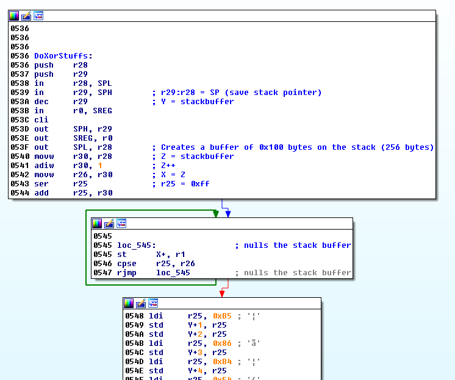
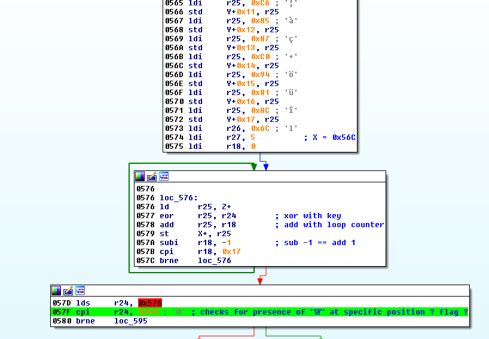
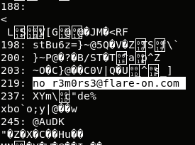

## Flare-On CTF 2017
# Challenge 09 : remorse.ino

We are provided with a INO Hex file which is an executable format for the Arduino

The challenge description tells us that this is from an Arduino board.

Researching into Arduino boards reveal that they use the Atmel AVR ATMega family of chipsets.

Fortunately, my copy of IDA Pro supports that.

Open the file in IDA Pro
- Change Processor to "Atmel AVR"
- Select "ATMega168p" (several of the "Mega" family should work)

The resulting number of functions is quite small.  
While clicking through the various functions, I came across function 0x536 that looked like it was doing xor decryption





It looks like a very simple decryption routine that only uses a 1-byte xor key

I re-implemented it into this [php script](soln.php) to perform a brute-force on the xor key

```php
$enc = "\xb5\xb5\x86\xb4\xf4\xb3\xf1\xb0\xb0\xf1\xed\x80\xbb\x8f\xbf\x8d\xc6\x85\x87\xc0\x94\x81\x8c";

for ($i=1; $i<256; $i++){
	$dec = decrypt($enc, $i);
	if (strpos($dec, "@") !== false){
		echo "$i: $dec \n";
	}
}


function decrypt($enc, $key){
	$out = "";
	for ($i=0; $i<strlen($enc); $i++){
		$tmp = ord($enc[$i]) ^ $key;
		$tmp = ($tmp + $i) & 0xff;
		$out .= chr($tmp);
	}
	return $out;
}
```



Key 219 (0xDB) decrypts the string to the flag

The flag is **no_r3m0rs3@flare-on.com**