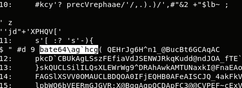
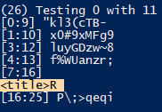
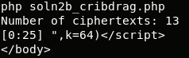
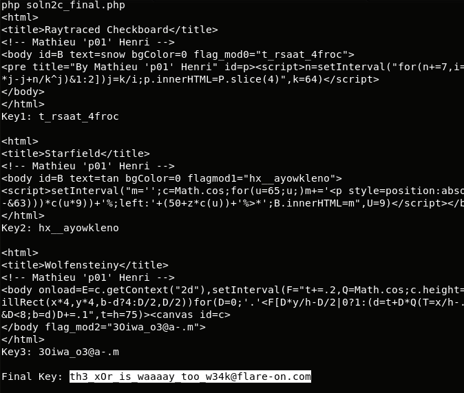

## Flare-On CTF 2017
# Challenge 10 : shell.php

This challenge is mainly a crypto (cryptanalysis) challenge.

We are provided with an [obfuscated php script](shell.php).

I deobfuscated it to make it easier to read [here](shell_deobfus.php)

```php
$code=base64_decode(<REDACTED HUGE BASE64 TEXT>);

if (isset($_POST['key'])){
	$key=$_POST['key'];
}
else $key="";

$key=md5($key).substr(MD5(strrev($key)),0,strlen($key)); 
// MD5 of INPUT CONCAT substr(MD5 of reversed INPUT, length of INPUT)
for($i=0;$i<2268;$i++){
	$code[$i]=chr((ord($code[$i])^ord($key[$i]))%256);
	$key.=$code[$i];
}
if(MD5($code)=='43a141570e0c926e0e3673216a4dd73d'){
	if(isset($_POST['key']))@setcookie('key', $_POST['key']);
	$i=create_function('',$code);
	unset($key,$code);
	$i();
} 
else {
	<REDACTED PRINTING HTML STUFF>
}
```

The input ('key') is transformed using the code below

```php
$key=md5($key).substr(MD5(strrev($key)),0,strlen($key));
// MD5 of INPUT CONCAT substr(MD5 of reversed INPUT, length of INPUT)
```

This means the transformed key will be between 32 and 64 characters in length

This key is then used as a repeating XOR key to decrypt a chunk of encrypted code.  
It then checks if the MD5 of the decrypted code is "43a141570e0c926e0e3673216a4dd73d".  
If it is, it will execute the code.

As this is decrypted with a repeating xor key, we can solve this like a Vigenere Cipher where we separate the huge encrypted block into multiple blocks for each of the bytes in the key.

To do that, the first thing we need to do is to figure out the key length

### Key Length

This is what we know so far
- Key is between 32 and 64 characters long
- Valid characters of the key is "0-9 a-f" (Made up of combinations of MD5 hashes)
- Output must be ASCII (it is executed as PHP code)

I wrote this [php script](soln1a_keylen.php) to "brute-force" the key length

```php
$code = base64_decode(<REDACTED HUGE BASE64 TEXT>);

echo strlen($code)."\n";
$hexa = array('0','1','2','3','4','5','6','7','8','9','a','b','c','d','e','f');

for ($keylen=32; $keylen<=64; $keylen++){
	for ($start=0; $start<$keylen; $start++){
		for ($a=0; $a<16; $a++){
			$key = ord($hexa[$a]);
			$fail = false;
			for ($pos=$start; $pos<strlen($code); $pos += $keylen){
				$key = ord($code[$pos]) ^ $key;
				if (!isAscii(chr($key))){
					// Fail
					$fail = true;
					break;
				}
			}
			
			if (!$fail) echo "$keylen $start $hexa[$a] : Yay\n"; // key exists
		}
	}
}

function isAscii($byte){
	if (ord($byte) > 0x7e) return false;
	if (ord($byte) < 0x20) {
		if (ord($byte) == 0xa) return true;
		if (ord($byte) == 0xd) return true;
		return false;
	}
	return true;
}
```

I split the huge encrypted block into multiple chunks according to the guessed key length.  
For each of these chunks, there must exists a key that would produce a result that is entirely in the ASCII range.  
If there is no such key, then the guessed key length is wrong and I move on to the next key length.

Fortunately, running this script only produced 1 viable result, 64.

Therefore, the key length is 64.  
Also, pipe the output of the results into a file "possiblekeys" for use in the next stage

### Generating the Possible Keys

Now that we know the key length, let's generate the possible key chars at each position that will produce a result that is entirely in the ASCII range.

I wrote this [php script](soln1b_genPossibleKeys.php) that will take in the previous output file and generate a list of possible key chars at each position.

```php
$a = genPossibleKeys("possiblekeys");

for ($i=0; $i<count($a); $i++){
	$pos = "";
	for ($k=0; $k<count($a[$i]); $k++){
		$pos .= $a[$i][$k];
	}
	echo "$i: $pos\n";
}

function genPossibleKeys($fname){
	$keys = array();

	$data = explode("\n",trim(file_get_contents($fname)));
	for ($i=0; $i<count($data); $i++){
		$line = $data[$i];
		$parts = explode(" ",$line);
		
		$charindex = intval($parts[1]);
		$poskey = $parts[2];
		
		if (array_key_exists($charindex, $keys)) $keys[$charindex][] = $poskey;
		else{
			$keys[$charindex] = array();
			$keys[$charindex][] = $poskey;
		}
	}
	
	return $keys;
}
```

Running the script returns the following result

```
php soln1b_genPossibleKeys.php 
0: cd
1: be
2: 0123456789
3: 9
4: 25
5: 01234678
6: b
7: 8
8: 4
9: af
10: 023456789
11: 0123456789
12: b
13: 9
14: 3
15: 0123456789
16: abcde
17: abcdef
18: b
19: 34
20: 3
21: 6
22: 012456789
23: 16
24: 8
25: abcdef
26: cd
27: 9
28: d
29: 9
30: 012345679
31: abcdef
32: 012356789
33: 012345679
34: 07
35: cd
36: def
37: 07
38: 25
39: 07
40: 123456789
41: 034789
42: a
43: af
44: c
45: 07
46: 9
47: 12356789
48: d
49: 07
50: 16
51: 012345679
52: abcf
53: abcdef
54: abcdf
55: abcdef
56: 012356789
57: 07
58: 9
59: af
60: 012367
61: abcef
62: af
63: cd
```

Let's choose 1 valid character at each position to form a baseline key for the next stage.

I chose "cb0920b84a00b930aab336018ac9d90a000cd02010aac091d010aaaa009a0aac"

### Guessing the key

Now, we have a baseline key.  
We will use this key to decrypt the encrypted code and look at the results.  
Analyze the results and tweak the key so that it produces a "better" result.

I wrote this [php script](soln1c_visualizeGuess.php) to help me visualize the key and the results.

```php
// baseline cb0920b84a00b930aab336018ac9d90a000cd02010aac091d010aaaa009a0aac
// Observe the output and keep changing the key by making intelligent guesses
// Keep in mind the valid chars at each index position to speed up the guessing
$key = "cb0920b84a00b930aab336018ac9d90a000cd02010aac091d010aaaa009a0aac";

$decode = decrypt($key);
printCode($decode, 64);

if(md5($decode)=='43a141570e0c926e0e3673216a4dd73d'){
	echo "Found!! Key: $key\n";
	file_put_contents("shell2.php", $decode);
}

function printCode($code, $perline){
	$lines = str_split($code, $perline);
	
	for ($i=0; $i<count($lines); $i++){
		echo "$i:\t".$lines[$i]."\n";
	}
}

function decrypt($input){
	$code = base64_decode(<REDACTED BASE64 TXT>);

	for($i=0;$i<2268;$i++){
		$code[$i]=chr((ord($code[$i])^ord($input[$i]))%256);
		$input.=$code[$i];
	}
	
	return $code;
}
```

Look at the below example



The highlighted characters on line 11 should be "base64_decode".  
Tweak the parts of the key that is responsible for those position to try and get the correct result

Keep making intelligent guesses and you should arrive at the correct key

> db6952b84a49b934acb436418ad9d93d237df05769afc796d067bccb379f2cac

### Decrypted Code

With the correct key, we will get the [decrypted code](shell2.php)

I deobfuscated the code [here](shell2_deobfus.php)

```php
$d='';
$key = "";
if (isset($_POST['o_o'])) $key = $_POST['o_o']; // same input from stage1 (must be at least 32 chars)
if (isset($_POST['hint'])) $d = "www.p01.org";
if (isset($_POST['t'])) {
  if ($_POST['t'] == 'c') {
    $d = base64_decode(<REDACTED BASE64>);
    $key = preg_replace('/(.)../', '$1', $key); // extract first of every 3 chars
  }
  if ($_POST['t'] == 's') {
    $d = base64_decode(<REDACTED BASE64>);
    $key = preg_replace('/.(.)./', '$1', $key); // extract second of every 3 chars
  }
  if ($_POST['t'] == 'w') {
    $d = base64_decode(<REDACTED BASE64>);
    $key = preg_replace('/..(.)/', '$1', $key); // extract third of every 3 chars
  }
  while(strlen($key) < strlen($d)) $key = $key.$key;
  $d = $d ^ $key;
}

if (strlen($d)) echo $d;
else
    echo '<form action="shell.php" method="post"><input type="hidden" name="o_o" value="'.$key.'"><input type="radio" name="t" value="c"> Raytraced Checkboard<br> <input type="radio" name="t" value="s"> p01 256b Starfield<br> <input type="radio" name="t" value="w"> Wolfensteiny<br><input type="submit" value="Show"/></form>';
```

This is a summary of what it is doing
- Uses the same key as before (The one before it was MD5 hashed)
  - Means the key must be at least 32 characters long
- 3 Separate Encrypted Blocks
  - Block 1 -> Decrypted with 1st of every 3 chars in the key + any remaining chars
  - Block 2 -> Decrypted with 2nd of every 3 chars in the key + any remaining chars
  - Block 3 -> Decrypted with 3rd of every 3 chars in the key + any remaining chars
- There is a hint pointing to "www.p01.org"
- The HTML code at the bottom has names of 3 projects that is hosted on "www.p01.org"
  - Raytraced Checkboard
  - p01 256b Starfield
  - Wolfensteiny

The website "www.p01.org" contains projects that would render nice graphical effects using just Javascript.  
I guessed that the decrypted chunks would contain the source code of this projects.

The key is "split" into 3 smaller keys and each is used for its respective block.  
Once again, each of the 3 keys are reused multiple times. This means it is susceptible to a Many-Time Pad attack.

I used the [Crib-Drag]() method to solve this puzzle.

This is a gist of how "Crib-Dragging" works
- Same key "k" is used to xor encrypt 2 message (m1,m2) into its ciphertext (c1,c2)
  - c1 = m1 ^ k
  - c2 = m2 ^ k
- What happens when we xor the 2 ciphertexts together?
  - c1 ^ c2 = m1 ^ k ^ m2 ^ k  (k ^ k cancels out)
  - c1 ^ c2 = m1 ^ m2
- If we can guess one of the plaintext message, we can recover the other plaintext message
  - If we know m1
    - m1 ^ c1 ^ c2 = m1 ^ m1 ^ m2 = m2

Instead of guessing the entire plaintext message m1, I guessed parts of the plaintext message m1.  
I then drag this "part" of the message across the entire encrypted chunk (crib) to see if any of the results make sense.

As I believe the output contains Javascript, I used "</script>" as my "plaintext" message to perform the cribdrag

I used this idea to write the next [php script](soln2a_cribdrag_checkboard.php) targetting the first encrypted block.  
The goal is to figure out the key length

```php
$d = base64_decode('<REDACTED BASE64 TEXT>);

for ($k=12; $k<64; $k++){
	$lines = str_split($d,$k);
	$numlines = count($lines);
	$c1 = $lines[0];
	for ($i=1; $i<$numlines; $i++){
		$c2 = $lines[$i];
		echo "\n($k) Testing 0 with $i\n";
		cribdrag($c1, $c2, '</script>');
	}
	echo "----------------------------------------------------\n";
	fgets(fopen("php://stdin","r")); // pause for me to examine input
}

function cribdrag($c1, $c2, $crib){
	$criblen = strlen($crib);
	$xored = $c1 ^ $c2;

	for ($i=0; $i<strlen($xored)-$criblen; $i++){
		$tmp = substr($xored,$i,$criblen) ^ $crib;
		if (isAsciiStr($tmp)){
			$end = $i + $criblen;
			echo "[$i:$end] $tmp\n";
		}
	}
}

function isAsciiStr($input){
	$allAscii = true;
	for ($i=0; $i<strlen($input); $i++){
		$cur = substr($input,$i,1);
		$cur = ord($cur);
		if ($cur > 0x7e){
			//echo "Not Ascii: $cur\n";
			$allAscii = false;
			break;
		}
		if ($cur < 0x20){
			if ($cur == 0xa) continue;
			if ($cur == 0xd) continue;
			//echo "Not Ascii: $cur\n";
			$allAscii  = false;
			break;
		}
	}
	return $allAscii;
}
```

While going through the output, I noticed the following at key length 26



That looks like valid HTML

```
[7:16]
<title>R
```

Now, let's try to recover 1 entire complete plaintext message.  
- The output string starts from the 7th character.  
- There seems to be some newline characters based on how the string was displayed.  
- Also, the HTML "title" element is normally housed inside a "html" or "head" element.  
- Also the "R" could spell "Raytraced Checkboard" from the hints given.

The next [php script](soln2b_cribdrag.php) helps with doing this testing.  
Change the following 4 values to test

```php
$splitlen = 26; // 22
$p1 = 0;		// 0
$p2 = 11;		// 13
$crib = "<html>\r\n<title>Raytraced C"; // guessed till 26 char length
```



The output made sense!!  
We have successfully recovered one entire plaintext message 

```
"<html>\r\n<title>Raytraced C"
```

With this 1 plaintext message, we would now be able to recover the rest of the plaintext messages.  
Also, by xoring 2 plaintext message together, we will be able to recover the key.

The recovered key is "t_rsaat_4froct_rsaat_4froc" which seems to be repeated.  
The actual key is actually t_rsaat_4froc", 13 characters long  
Therefore, the 1 plaintext message should actually be just

```
"<html>\r\n<titl"
```

I guessed this "header" would appear in all 3 encrypted chunks.  
I wrote the [final script](soln2c_final.php) to decrypt all 3 encrypted chunks and recover the 3 parts of the key.

Finally, I recombined the 3 parts of the key to form the flag.

```php
$base = "<html>\r\n<titl"; // $base1 = "<html>\r\n<title>Raytraced C";

$enc1 = base64_decode(<REDACTED BASE64 TXT>);
$key1len = 13;
$cipher1 = str_split($enc1, $key1len);
$msg1 = $base;

for ($i=1; $i<count($cipher1); $i++){
	$xored = $cipher1[0] ^ $cipher1[$i];
	$msg1 .= $xored ^ $base;
}
echo $msg1."\n";
$key1 = $cipher1[0] ^ $base;
echo "Key1: $key1 \n\n"; // Key: t_rsaat_4froct_rsaat_4froc (t_rsaat_4froc) keylength is actually 13

$enc2 = base64_decode(<REDACTED BASE64 TXT>);
$key2len = 13;
$cipher2 = str_split($enc2, $key2len);
$msg2 = $base;
for ($i=1; $i<count($cipher2); $i++){
	$xored = $cipher2[0] ^ $cipher2[$i];
	$msg2 .= $xored ^ $base;
}
echo $msg2."\n";
$key2 = $cipher2[0] ^ $base;
echo "Key2: $key2 \n\n";

$enc3 = base64_decode(<REDACTED BASE64 TXT>);
$key3len = 13;
$cipher3 = str_split($enc3, $key3len);
$msg3 = $base;
for ($i=1; $i<count($cipher3); $i++){
	$xored = $cipher3[0] ^ $cipher3[$i];
	$msg3 .= $xored ^ $base;
}
echo $msg3."\n";
$key3 = $cipher3[0] ^ $base;
echo "Key3: $key3 \n\n";

$finalkey = "";
for ($i=0; $i<strlen($key1); $i++){
	$finalkey .= $key1[$i].$key2[$i].$key3[$i];
}
echo "Final Key: $finalkey\n\n";
```



The flag is **th3_xOr_is_waaaay_too_w34k@flare-on.com**