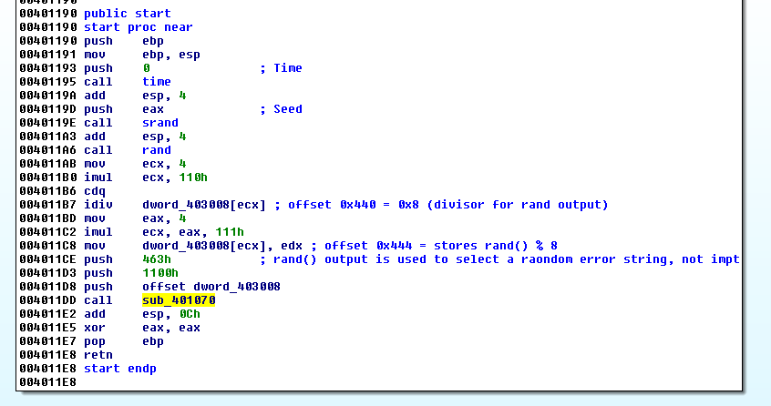
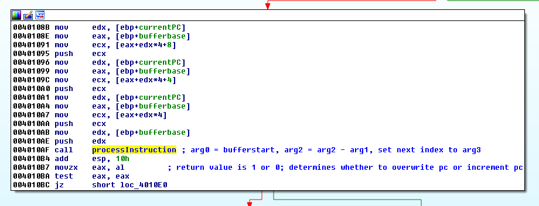
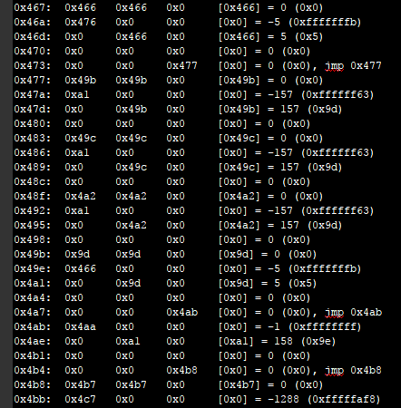
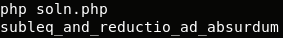
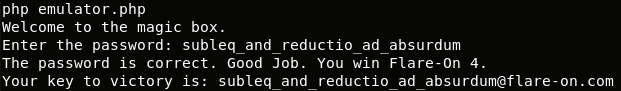

## Flare-On CTF 2017
# Challenge 11 : covfefe

We are provided with a x86 binary.

The IDA Pro output is fairly straight-forward



The first important function is "sub_401070" (offset 0x1070).  



The second important function is "processInstruction" (offset 0x1000).

The following is the pseudocode of the important parts.  
Square brackets means dereference the "pointer" counting from the bufferbase address.

```
sub_401070(bufferbase, endIndex, startIndex){
	curPC = startIndex // startIndex is 0x463
	while (curPC < endIndex){ // endIndex is 0x1100
		arg1 = [curPC]
		arg2 = [curPC+1]
		arg3 = [curPC+2]
		dojmp = processInstruction(bufferbase, arg1, arg2, arg3)
		if (dojmp > 0){
			curPC = arg3
		}
		else curPC += 3

		// Print output or get user input
		if ([bufferbase+4] == 1){
			printf("%c", [bufferbase+2]) // prints 1 char
			[bufferbase+4] = 0
			[bufferbase+2] = 0
		}
		if ([bufferbase+3] == 1){
			[bufferbase+1] = scanf("%c") // reads in 1 char
			[bufferbase+3] = 0
			[bufferbase+1] = 0
		}
	}
}

processInstruction(bufferbase, arg1, arg2, arg3){
	[arg2] = [arg2] - [arg1]
	if ([arg3] > 0){
		if ([arg2] <= 0) return 1 // Take the jump only when arg3 != zero and deref(arg2) is <= zero
		else return 0
	}
	else return 0
}
```

This is basically some kind of emulator processing instructions from memory address 0x403000.  
Each instruction consists of 3 32-bit dwords.  
Let's call them "arg1", "arg2" and "arg3"
- Performs a substraction [arg2] = [arg2] - [arg1]
- Updates the curPC (Program Counter) according to some conditions
	- If arg3 > 0 and [arg2] < 0, curPC = arg3
	- else curPC += 3

In summary, arg1 and arg2 is used for subtraction operation and arg3 is a conditional jump address if arg2 meets the condition to jump.

Also, [bufferbase+4] and [bufferbase+3] are flags to perform output printing or getting user input respectively

Execution will keep looping until it reaches the endIndex of 0x1100

### Emulating the emulator

First, I dumped the entire memory region from 0x403000 into a [file](covfefe_00403000.mem)

I then wrote a [PHP version of the emulator](emulator.php)

This script will emulate the algorithm describe above and produce an execution trace.

I used the testing input of "ABC\n" first.

Here is an example of how the [trace looks like](trace_testing.txt)



The first column is the curPC number.  
The next 3 columns are the 3 arguments (arg1, arg2, arg3)  
The last column shows the dereferenced value of arg2 and whether the jump was taken


### Analyzing the trace

Analyzing the trace was the most tedious part of this challenge.

This "emulator" is basically performing all kinds of operations using subtraction and bit shifting only.  
Alot of complex chain of instructions are actually just performing simple mathematical operations.  

One example is how it performs XOR of 2 numbers (num1 and num2)
- Loops 32 times (xoring 32-bit numbers)
  - Checks if num1 and num2 is negative (negative means MSB is 1)
    - If only one of them is negative, left shift a "1" bit into the result number (1 ^ 0)
    - Else left shift a "0" bit into the result number
  - Left shift num1 and num2 by 1 bit

Another example is how it checks if a number is negative
- Subtract the number from "0" and stores the result into [arg2]
  - If the result in [arg2] is <= 0, the conditional jump (arg3) will be taken, thus the number is positive and vice versa

I focused the analysis on the parts where our input is checked.  

The input is processed 2 chars at a time. (char1 and char2)  
Below is a psuedocode of what it is doing

```
result = 0
char1 = (char1 * 15) << 7  (Multiply by 15 and Left shifted 7 bits)
result |= char1
char2 = !(char2) & 0x7f 	(Bit-wise NOT of char2)
result |= char2
```

The result number is then checked against an array of numbers stored at offset 0x3A74

I extracted this array of numbers and wrote the reverse algorithm to decrypt them in this [php script](soln.php)

```php
$enc = array();
$enc[0] = 0x35e8a;
$enc[1] = 0x2df13;
$enc[2] = 0x2f58e;
$enc[3] = 0x2c89e;
$enc[4] = 0x3391b;
$enc[5] = 0x2c88d;
$enc[6] = 0x2f59b;
$enc[7] = 0x36d9c;
$enc[8] = 0x36616;
$enc[9] = 0x340a0;
$enc[10] = 0x2d79b;
$enc[11] = 0x2c89e;
$enc[12] = 0x2df0c;
$enc[13] = 0x36d8d;
$enc[14] = 0x2ee0a;
$enc[15] = 0x331ff;

$plain = "";
for ($i=0; $i<count($enc); $i++){
	$plain .= decrypt($enc[$i]);
}
echo $plain."\n";

function decrypt($num){
	$p1 = ($num >> 7)/15;
	$p2 = ~($num) & 0x7f;
	
	return chr($p1).chr($p2);
}
```



Running the script produces the resulting string

> subleq_and_reductio_ad_absurdum

Putting this string as the input back in our emulator script or the actual executable will give us the flag



The flag is **subleq_and_reductio_ad_absurdum@flare-on.com**