## Flare-On CTF 2017
# Challenge 12 : missing

This is the final challenge of this CTF.  

The storyline of this challenge is that an attacker broke into their machines and stole the last Flareon challenge (challenge10).  
We are tasked to recover this stolen challenge and solve it to win the CTF

We are provided with a binary "coolprogram" and a PCAP file.

The binary is the initial "malware" that is run.  
It then tries to connect to its CNC server to receive commands.  
The PCAP file contains these commands sent between the infected machine and the CNC server

The main challenge is to decipher the protocol used between these 2 machines so as to recover the missing challenge.

### Reversing coolprogram

Let's start with reversing the provided binary.

The important function starts at 0x4103DC

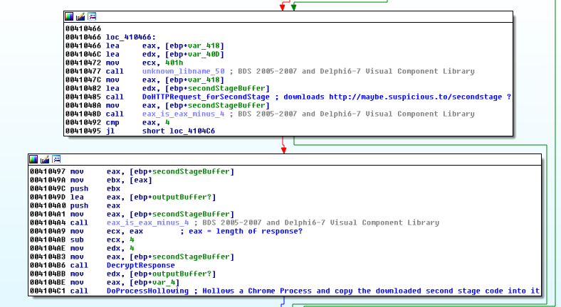

It does the following
- Downloads a file from "http://maybe.suspicious.to/secondstage"
- Decrypts the file
- Perform Process Hollowing to load and execute this file
  - Starts a Chrome process suspended
  - Unmaps the executable region of this process
  - Maps a new memory region containing the executable code of the malicious file
  - "Repair" the import tables and pointer links to point to this malicious region
  - Resume the process
    - At which point, it would execute the maliciuos code instead

### Obtaining secondstage

If we look into the PCAP file provided, we can see a HTTP Request to this secondstage file

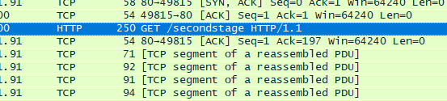

Use Wireshark's Export HTTP Object feature to dump this file out.  
This is the encrypted "secondstage" file


We will use "coolprogram" to help decrypt this file.  
First, start a HTTP Web server and host this file.  

One easy way to start a HTTP server is using python's SimpleHTTPServer module.  
Go to the folder where the secondstage file in a terminal and type

> python -m SimpleHTTPServer 80

Edit the "host" file to point maybe.suspicious.to to 127.0.0.1

Run "coolprogram" in a debugger and put a breakpoint at address 0x4104BB


Let the program run till the breakpoint.  
Inspect the memory at [ebp-0xc] and dump it into a file.

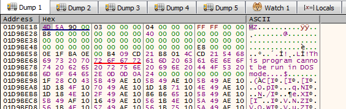

This is the decrypted secondstage binary

### Reversing secondstage

The "secondstage" binary connects to "probably.suspicious.to" at port 9443 to receive commands.

In wireshak, we can filter by this port and dump all the packets in this stream into a file
- Filter packets by "tcp.port == 9443"
- Right-Click one of the packets and select "Follow TCP Stream"
- Change diplay format to "Raw"
- Click "Save As" and save it into a file

I named this file [pkts_all_cnc_t1](pkts/pkts_all_cnc_t1)

I will not go through how I analyzed these traffic as it is extremely tedious.  
I will summarize my findings instead.

The main goal is to figure out the structure of the communication packets between the infected machine and the CNC and what they do.

### Communication Protocol

Each packet consists of 3 layers
- CRPT (Encryption Layer)
- COMP (Compression Layer)
- CMD  (Command Layer)

Each layer consists of a Header and a Body.  
Each layer will encapsulate the lower layer in its Body

```
|---CRPT HEADER---|---------------------------CRPT BODY---------------------------|  
|---CRPT HEADER---|---COMP HEADER---|------------------COMP BODY------------------|  
|---CRPT HEADER---|---COMP HEADER---|---CMD HEADER---|----------CMD BODY----------|
```

When the "secondstage" binary is first ran, there is only 1 CRPT and 1 COMP module available
- They are "No Encryption" and "No Compression" respectively

The binary will begin by downloading more Encryption and Compression Modules and loading them into its arsenal.  
Once loaded, these encryption and compression modules will be used in a round robin manner.  
Only when these modules are downloaded then the malware begins to do interesting stuff.

One of the main challenges is figuring out what all these encryption and compression modules are using.

### CRPT Modules

The following is the format of the CRPT HEADER

|Length (Bytes)|Field 				|
|--------------|--------------------|
|4|Magic Bytes "2017"				|
|4|Checksum							|
|4|Header Length (in bytes)			|
|4|Encrypted Body Length (in bytes)	|
|4|Decrypted Body Length (in bytes)	|
|16|Hash Signature of CRPT Module 	|
|*|Any additional parameters for a specific CRPT module|

The 16 bytes Hash Signature acts like a ID to determine which CRPT module will then process the CRPT Body.

These are the different encryption modules that are used. (in order of when they were loaded)

|Hash Signature|Algorithm|Additional Headers|
|--------------|---------|------------------|
|51298f741667d7ed2941950106f50545|No Encryption|--|
|c30b1a2dcb489ca8a724376469cf6782|RC4|16 bytes RC4 Key|
|38be0f624ce274fc61f75c90cb3f5915|Static Substitution|--|
|ba0504fcc08f9121d16fd3fed1710e60|Custom Base64|--|
|b2e5490d2654059bbbab7f2a67fe5ff4|XTEA + XOR|16 byes XTEA Key, 8 bytes XOR key|
|2965e4a19b6e9d9473f5f54dfef93533|Blowfish + XOR|16 bytes Blowfish key, 8 bytes XOR key|
|8746e7b7b0c1b9cf3f11ecae78a3a4bc|XOR|4 bytes XOR key|
|46c5525904f473ace7bb8cb58b29968a|3DES + XOR|24 bytes 3DES key, 8 bytes XOR key|
|9b1f6ec7d9b42bf7758a094a2186986b|Camelia Cipher|16 bytes Camelia key|

Once the CRPT Body has been decrypted, it is then processed as a COMP frame.

### COMP Modules
The following is the format of the COMP HEADER

|Length (Bytes)|Field 					|
|--------------|------------------------|
|4|Header Length (in bytes)				|
|4|Compressed Body Length (in bytes)	|
|4|Uncompressed Body Length (in bytes)	|
|16|Hash Signature of COMP Module 		|

Similarly, the 16 bytes Hash Signature acts like a ID to determine which COMP module will then process the COMP Body.

These are the different compression modules that are used. (in order of when they were loaded)

|Hash Signature|Algorithm|
|--------------|---------|
|f37126ad88a5617eaf06000d424c5a21|No Compression|
|5fd8ea0e9d0a92cbe425109690ce7da2|zLib Compression|
|503b6412c75a7c7558d1c92683225449|apLib Compression|
|0a7874d2478a7713705e13dd9b31a6b1|LZO1X Compression (part of the LZ family)|

Similarly, once the COMP Body has been uncompressed, it is then processed as a CMD frame

### CMD Modules

The following is the format of the CMD frame

|Length (Bytes)|Field|
|--------------|-----|
|4|Magic Bytes "0x20170417"|
|4|Command ID|
|4|Command Counter|
|4|Param1 (Not sure what it is used for)|
|4|Param2 (Not sure what it is used for)|
|16|Hash Signature of CMD Module|
|*|CMD BODY|

Once again, the Hash Signature acts as a ID to determine which CMD module to process the CMD Body.  
The "Command ID" is then used to specify which command within that module is to be executed.  
The "Command Counter" is just a running number to keep track of which commands does each request/response belongs to.

There were multiple command modules loaded.

**155bbf4a1efe1517734604b9d42b80e8** is the default CMD handler that comes in "secondstage".  
It has capabilities to perform some basic reconnaissance and to download and load more modules.

|Command ID|Command|
|---------|------------------|
|0x1|Start a shell|
|0x2|Unknown|
|0x3|Retrieve Computer and User Info|
|0x4|Get Loaded Modules (CRPT, COMP, CMD)|
|0x5|Alloc Module|
|0x6|Append to Alloc-ed Module|
|0x7|Load Module|
|0xe|Check Password "welcomepass1!1"|

**f47c51070fa8698064b65b3b6e7d30c6** is some kind of file transfer module.  
It has capabilities to download/upload files to and from the target machine.

|Command ID|Command|
|---------|------------------|
|0x1|Start Unicode Shell|
|0x2|Issue Unicode Shell command|
|0x3|Start exfiltrate file to CNC|
|0x4|Append to exfiltrating file|
|0x5|Exfiltrate file to CNC complete|
|0x6|Start uploading file to Target|
|0x7|Append to uploading file|

**f46d09704b40275fb33790a362762e56** is some kind of shell interface.
It allows the attacker to issue shell commands to the target machine

|Command ID|Command|
|---------|------------------|
|0x1|Start ANSI Shell|
|0x3|Issue ANSI Shell command|
|0x4|ANSI shell command reply|

**a3aecca1cb4faa7a9a594d138a1bfbd5** is a screenshot grabber.  
It allows the attacker to take and receive a screenshot of the target's screen.

|Command ID|Command|
|---------|------------------|
|0x1|Take a Screenshot|
|0x2|Prepare to receive screenshot|
|0x3|Receiving screenshot|

**77d6ce92347337aeb14510807ee9d7be** is a pivoting module.  
It connects to another compromised machine and acts as a relay between the CNC and the other compromised machine.

|Command ID|Command|
|---------|------------------|
|0x1|Connect To Target IP/Port|
|0x3|Forward Packet|
|0x4|Start Acting As Middle Man|

I wrote this [php script](pkts/soln_1_networkparser.php) to help me perform the analysis of all these packets.

It is able to decrypt and decompress all of the stated modules above.  
Do take note, there are quite a few dependencies for it to run properly.  
Also, it can only run on Windows as a few of these dependencies are EXE files.

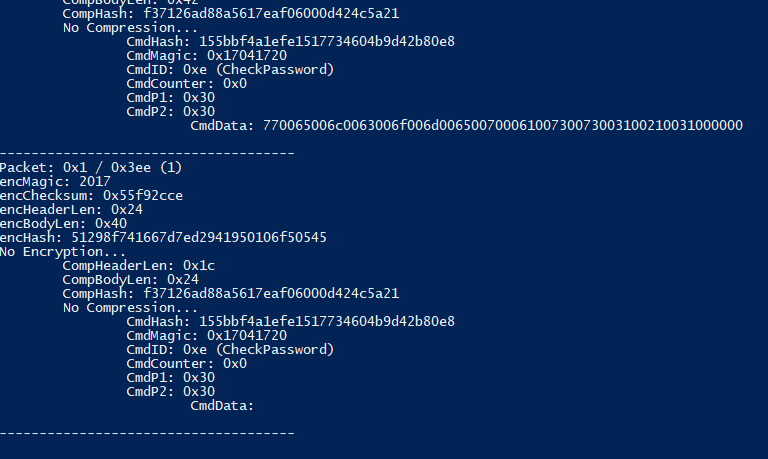

### CNC <=> Target 1 (John Jackson)

Using the script above, I am able to piece back the entire communication between the infected machine and the CNC.  
This is a [complete trace](cnc_t1_johnjackson.log) of the entire communication  
This is a summary of what happened.

It begins by downloading and loading several CRPT and COMP modules.

After which, it did some recon by getting some computer and user info.

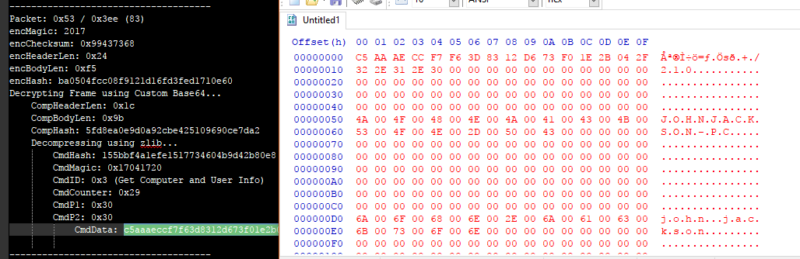

We now know the user on this system is called "John Jackson"

The attacker then starts an interactive shell and starts exploring the C drive

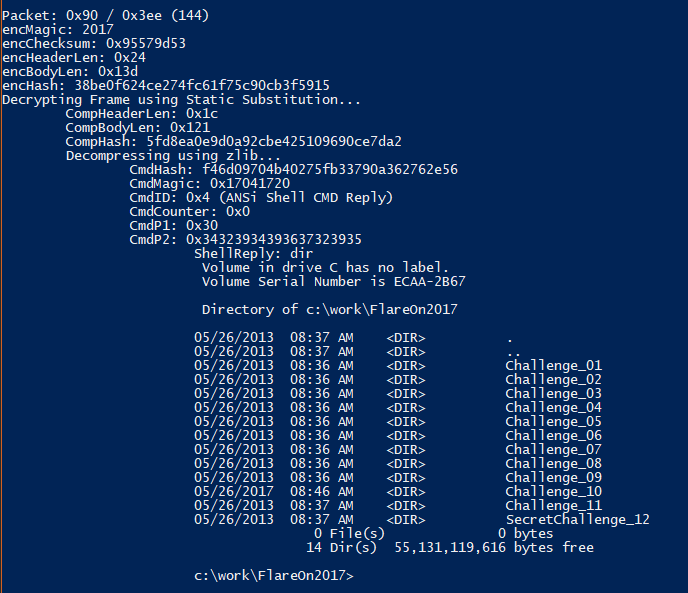

And eventually finds a "TODO.txt" file in the "C:\work\Flareon2017\Challenge10" folder  
Remember, challenge10 is our goal.


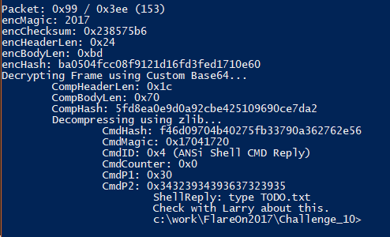

It says to check with "Larry" about this challenge.

Next, it downloaded the screenshot module and took a [screenshot](screenshot_johnjackson.bmp) of the user's screen.

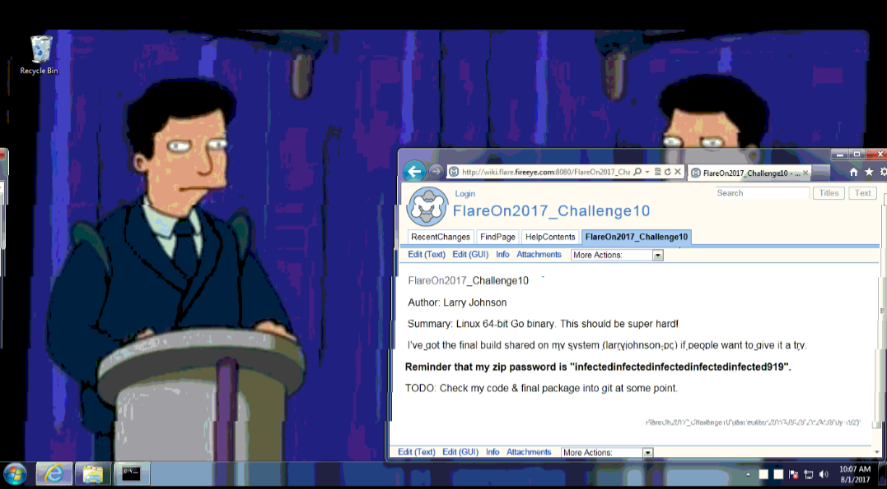

Do note, for some reasons, the original bitmap displays properly on my Windows system but not on my Ubuntu system.  
Also for some reason, it looks a bit distorted.

Refer to [Appendix](#appendix-recovering-screenshots) to find out how to recover this screenshot

The screenshot revealed a zip password of "infectedinfectedinfectedinfectedinfected919" and a system called "larryjohnson-pc"

The attacker pinged this new machine to confirm that it really exists

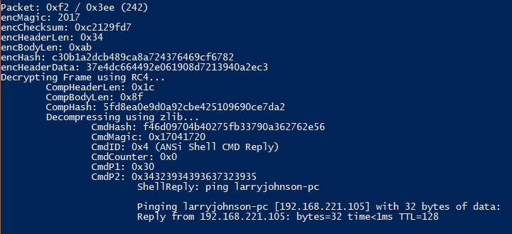

The attacker then creates a staging directory at "C:\staging" and uploads a file called "pse.exe"

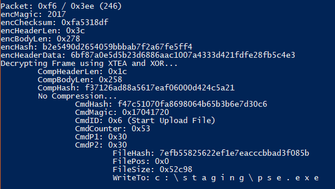

This pse.exe is actually psexec.exe

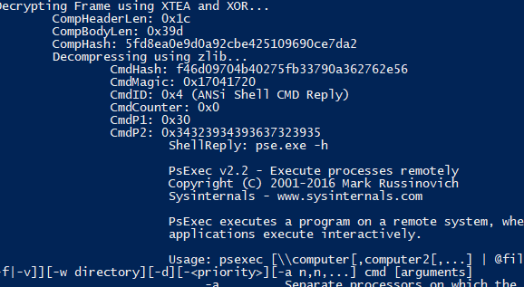

The attacker then uploads "srv2.exe"

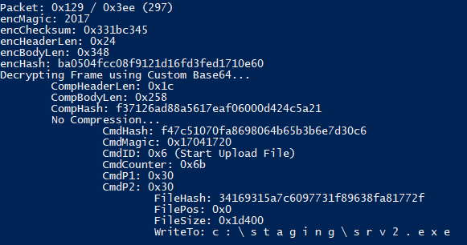

This "srv2.exe" is actually a similar malware with "secondstage" binary that we have before.

The attacker then uses "psexec" to execute "srv2.exe" on larryjohnson's machine. (No idea where he got his password though)

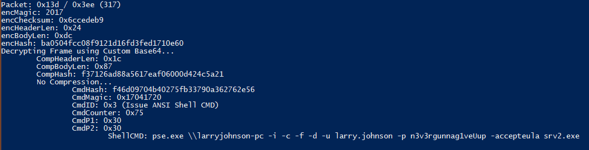

This essentially compromised larryjohnson's machine.

The attacker then sets up the current infected machine as a pivot to talk to the larryjohnson's machine.

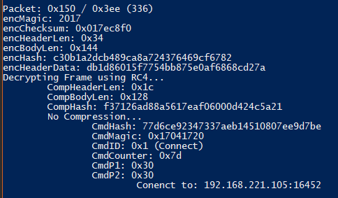

The subsequent packets are forwarded to larryjohnsons's machine.

I wrote another [php script](pkts/soln2_combine.php) to combine the dumped packets in the "out_forward" folder into a single dump file that is similar to the initial wireshark dump file.
This allowed me to use the same php script to anayze these forwarded packets.

### CNC <=> Target 2 (Larry Johnson)

The [complete trace](cnc_t2_larryjohnson.log) of this communication is also uploaded

Same thing, the malware begins by loading various CRPT and COMP modules to help obfuscate its commuincation.

The attacker then retrieves some computer info and confirms that he is on larryjohnson's machine now

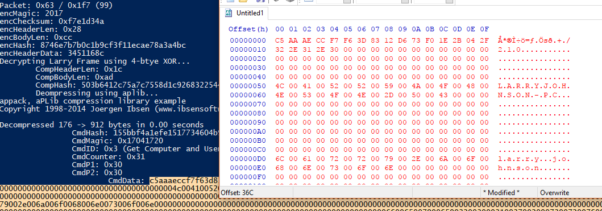

The attacker then takes another [screenshot](screenshot_larryjohnson.bmp)

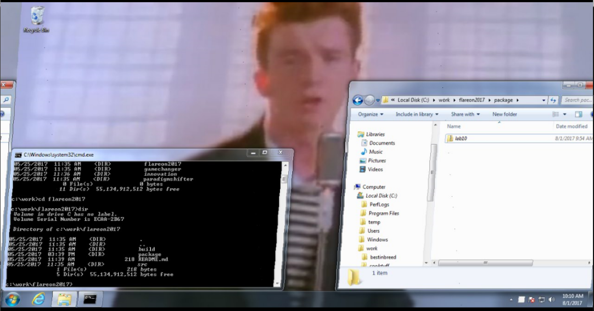

This screenshot does not contain any useful information, except for the full path to the challenge directory.

The attacker then starts an interactive shell and finds the challenge directory

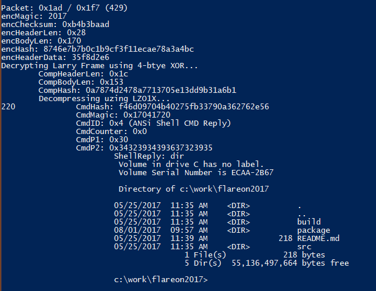

The attacker reads the enclosed readme file which reveals that the challenge is a Go binary and how to run it.

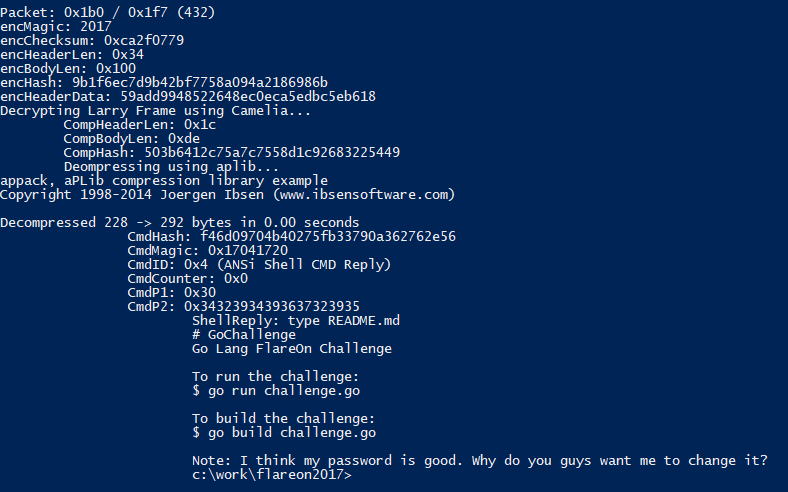

The attacker then finds the zipped challenge file at the "package" sub directory.

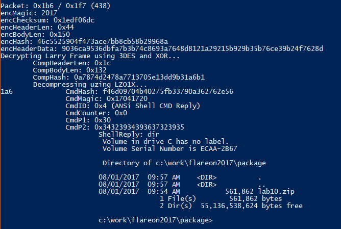

The attacker then creates a staging directory at "C:\staging" and uploads a "cf.exe"

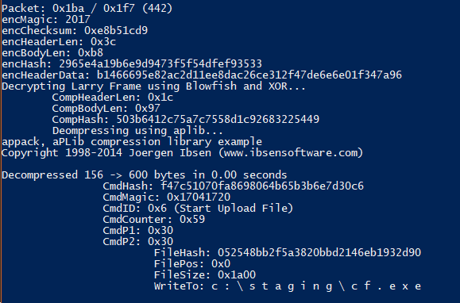

"cf.exe" is a .NET binary that performs file encryption.

```cs
public static bool Redacted_LongUnicodeName(string text, string s){
	string path = text + ".cry";
	SHA256 sHA = SHA256.Create();
	byte[] array = Convert.FromBase64String(s);
	try {
		if (array.Length != 32) {
			throw new ArgumentException("");
		}
		byte[] array2 = File.ReadAllBytes(text);
		using (Aes aes = Aes.Create()) {
			aes.KeySize = 256;
			aes.Key = array;
			aes.GenerateIV();
			aes.Padding = PaddingMode.PKCS7;
			aes.Mode = CipherMode.CBC;
			long value = (long)array2.Length;
			byte[] bytes = BitConverter.GetBytes(value);
			byte[] array3 = sHA.ComputeHash(array2);
			byte[] bytes2 = Encoding.ASCII.GetBytes("cryp");
			string fullPath = Path.GetFullPath(text);
			byte[] bytes3 = Encoding.UTF8.GetBytes(fullPath);
			byte[] bytes4 = BitConverter.GetBytes(bytes3.Length);
			ICryptoTransform transform = aes.CreateEncryptor();
			using (MemoryStream memoryStream = new MemoryStream()) {
				using (CryptoStream cryptoStream = new CryptoStream(memoryStream, transform, CryptoStreamMode.Write)){
					cryptoStream.Write(bytes4, 0, bytes4.Length);
					cryptoStream.Write(bytes3, 0, bytes3.Length);
					cryptoStream.Write(bytes, 0, bytes.Length);
					cryptoStream.Write(array2, 0, array2.Length);
				}
				byte[] array4 = memoryStream.ToArray();
				using (FileStream fileStream = File.Open(path, FileMode.Create)){
					fileStream.Write(bytes2, 0, bytes2.Length);
					fileStream.Write(aes.IV, 0, aes.IV.Length);
					fileStream.Write(array3, 0, array3.Length);
					fileStream.Write(array4, 0, array4.Length);
				}
			}
		}
	}
	catch (Exception){
		Console.WriteLine("Error");
	}
	return true;
}
```

The attacker used that to encrypt the lab10.zip file with the key "tCqlc2+fFiLcuq1ee1eAPOMjxcdijh8z0jrakMA/jxg="

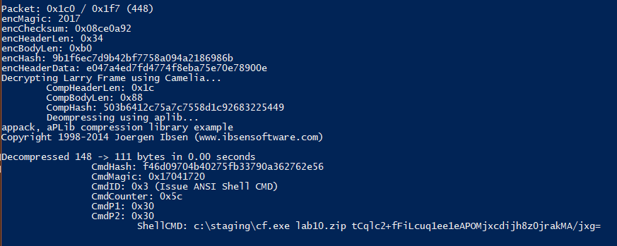

The attacker then downloads this [encrypted file](lab10.cryp) to the CNC

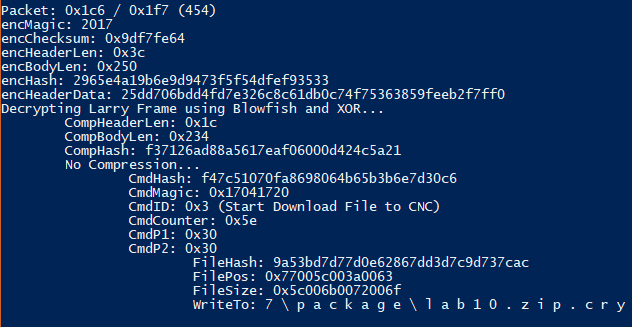

The attacker then deletes the lab10 files from the infected machine

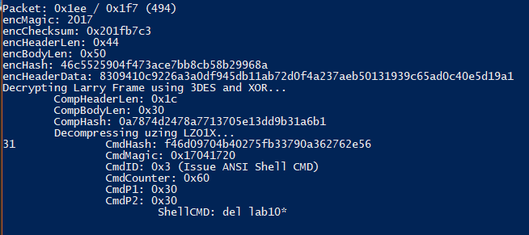

### Recovering the challenge file

I wrote another [php script](soln_3_decryptcryp.php) that reverses the algorithm in cf.exe to decrypt encrypted zip file back to its original form.

```php
$key = base64_decode("tCqlc2+fFiLcuq1ee1eAPOMjxcdijh8z0jrakMA/jxg=");
$cryp = file_get_contents("lab10.cryp");
$magic = substr($cryp,0,4);
$iv = substr($cryp,4,16);
	
$enc = substr($cryp,52,-0x14);
$plain = openssl_decrypt($enc, "AES-256-CBC", $key, OPENSSL_RAW_DATA, $iv);
if ($plain == false) echo openssl_error_string()."\n";
else{
	file_put_contents("lab10.zip",$plain);
}
```

Running this script will decrypt the zip file.  
Unzip it using the password that we have gotten before in a screenshot "infectedinfectedinfectedinfectedinfected919"

The resulting file is an ELF.  
Straight up running it will produce the flag

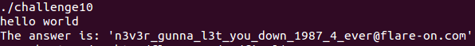

The flag is **n3v3r_gunna_l3t_you_down_1987_4_ever@flare-on.com**

### Appendix: Setting up replay server

I set up a replay server which will replay the packets sent by the CNC to the infected machine.

This allowed me to debug the malware binaries and examine it as if it is receiving commands from the CNC

I used this [python server script](server.py) to act as the replay server for target 1 (John Jackson)  
I used this [python client script](socketclient.py) to act as the replay pivot for target 2 (Larry Johnson)  
Remember to edit the "hosts" file of the testing machine to point "probably.suspicous.to" to this web server.

This technique also allowed me to compare the encrypted and decrypted versions of the same packet to reverse the Static Substitution CRPT module.

### Appendix: Reversing Modules

I've also uploaded the different modules in a [zip file](modules.zip)

This module can be analyzed using IDA Pro after making a few changes
- Change "LM" header to "MZ"
- Change "NOP" header to "PE"
- Change 0x3332 to 0x4c01

Finding the actual handler function is a bit more tricky.  
You can use the replay server and debug the actual binary to help find it.  
Or sort the functions by size and go through them 1 by 1.  
The handler function will have a function graph that looks similar to this

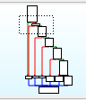

### Appendix: Recovering Screenshots

The screenshots are transmitted as Bitmaps in 2 parts.

The first part is transmitted in the "Prepare To Receive Screenshot" command.  
The data transmitted here includes the width/height of the image, bit depth and other meta information.

The second part includes the actual image data.

I manually reformed the Bitmap Header using the Meta information and appended it to the image data to recover the bitmap.

Do take note that, the first screenshot from "John Jackson" is a 8 bit palette Bitmap.  
Took me awhile to figure out that there is a palette array in the meta information.

The second screenshot from "Larry Johnson" is a typical 24-bit RGB Bitmap.