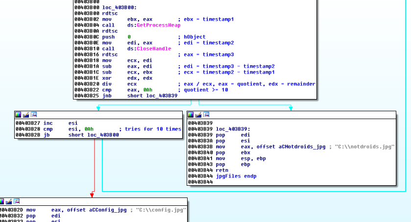
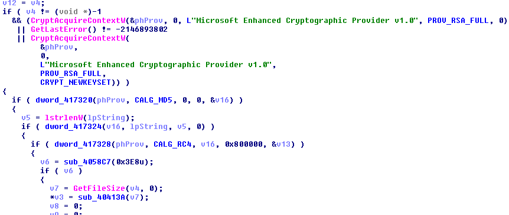
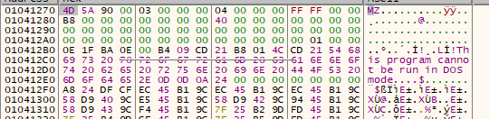
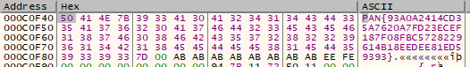

## LabyREnth CTF 2017
# Binary 1 : MyFirstMalware

We are provided with a Binary and 2 jpg files (notdroid.jpg and config.jpg).  
Both the jpg files are not normal jpg files, both seems to be gibberish.

Throw the binary into IDA Pro

The interesting part of the code is at 0x404050.


The **jpgFiles** firsts selects one of 2 strings (**C:\\\\config.jpg** or **C:\\\\notdroid.jpg**) based on the timestamp



It then calls some Microsoft Crypto functions to decrypt either one of these files.



All the info that we need to perform the decryption is in the binary.

This challenge is testing our ability to use a debugger to step through the code and extract the decrypted contents from memory

First of all, put **notdroid.jpg** and **config.jpg** in the root folder of C:\ drive.

### Debugging MyFirstMalware

Open the binary in a debugger and place breakpoints at the following locations

```
xxxx411A
00114115 | 68 90 5F 01 00    | push 15F90                             |
0011411A | FF 15 A8 73 12 00 | call dword ptr ds:[<&Sleep>]           |
```

Change the pushed value at the top of stack to a small amount (e.g. 0x10) to skip the Sleep

```
xxxx3B22
00113B22 | 83 F8 0A          | cmp eax,A                              |
00113B25 | 73 12             | jae myfirstmalware.113B39              |
```

Change eax to be more than 0xa. This will make the program use "C:\\notdroids.jpg"

```
xxxx4079
00114073 | FF 15 AC 73 12 00 | call dword ptr ds:[<&IsDebuggerPresent |
00114079 | 85 C0             | test eax,eax                           | 
```

Change eax to 0x0 to bypass the IsDebuggerPresent check.

```
xxxx3B86
00113B86 | FF 15 40 73 12 00 | call dword ptr ds:[<&CreateFileW>]     |
00113B8C | 8B D8             | mov ebx,eax                            |
```

Confirm that program is able to read "C:\\notdroids.jpg". Returned eax should not be 0xffffffff

```
xxxx3c55
00113C55 | FF 15 0C 00 12 00 | call dword ptr ds:[<&GetFileSize>]     |
00113C5B | 50                | push eax                               |
00113C5C | E8 D9 04 00 00    | call myfirstmalware.11413A             |
00113C61 | 89 07             | mov dword ptr ds:[edi],eax             |
```

At xxxx3c5B, take note of the returned filesize in eax (Filesize: 0x15800)  
At xxxx3c61, take note of the returned address in eax. This is where the decrypted file will be stored in memory.

```
xxxx3ce6
00113CE6 | FF 15 14 73 12 00 | call dword ptr ds:[<&CloseHandle>]     |
00113CEC | 8B 45 F8          | mov eax,dword ptr ss:[ebp-8]           |
```

Allow program to run to here, so that the decryption is completed.

Look at the address that we took down at xxxx3c61 in the memory dump



The content is another executable file ("MZ" header)  
Dump out the contents from that address with a size of 0x15800.

Opening this exe in IDA reveals that it is called MyFirstKey.  
It seems to be using similar code to the previous executable.  
Debug it again and set the following breakpoints  

### Debugging MyFirstKey

Put breakpoints at this location

```
xxxx3942
01133942 | 83 F8 0A          | cmp eax,A                              |
01133945 | 73 12             | jae extracted.1133959                  |
```

Change eax to be more than 0xa. This will make the program use "C:\\config.jpg"

```
xxxx3b68
01133B62 | FF 15 AC 63 14 01 | call dword ptr ds:[<&IsDebuggerPresent |
01133B68 | 85 C0             | test eax,eax                           |
```

Change eax to 0x0 to bypass the IsDebuggerPresent check

```
xxxx3a75
01133A75 | FF 15 0C F0 13 01 | call dword ptr ds:[<&GetFileSize>]     |
01133A7B | 50                | push eax                               |
01133A7C | E8 34 01 00 00    | call extracted.1133BB5                 |
01133A81 | 89 07             | mov dword ptr ds:[edi],eax             |
```

At xxxx3a7b, take note of the returned filesize in eax (Filesize: 0x46)  
At xxxx3a81, take note of the returned address in eax. This is where the decrypted file will be stored in memory.

```
xxxx3b06
01133B06 | FF 15 14 63 14 01 | call dword ptr ds:[<&CloseHandle>]     |
01133B0C | 8B 45 F8          | mov eax,dword ptr ss:[ebp-8]           |
```

Allow program to run to here so that the decryption process is complete

Inspect the address that we took down at xxxx3a81 and the flag should be there



The flag is **PAN{93A0A2414CD35A7620A7FD23ECEF187F08FBC5728229614B18EEDEE81ED59393}**