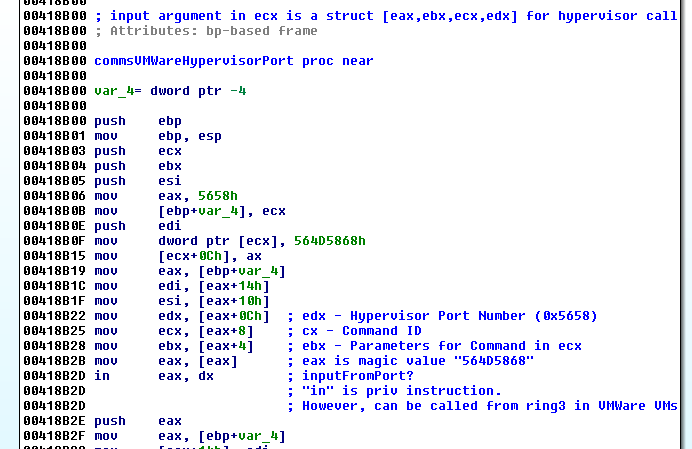
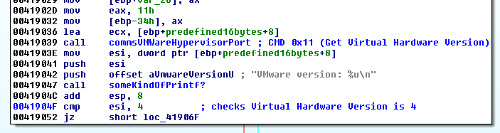
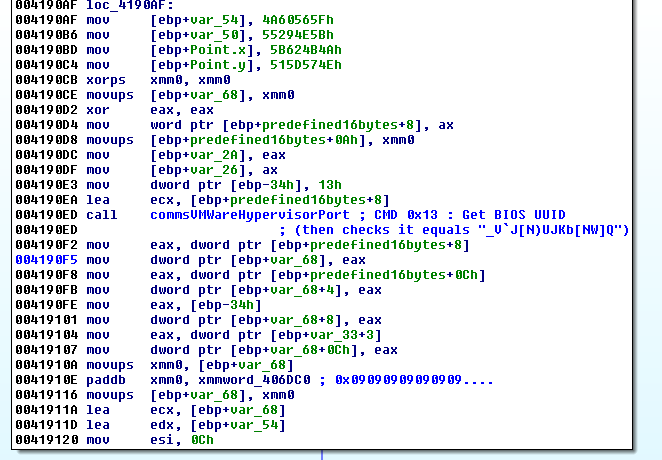
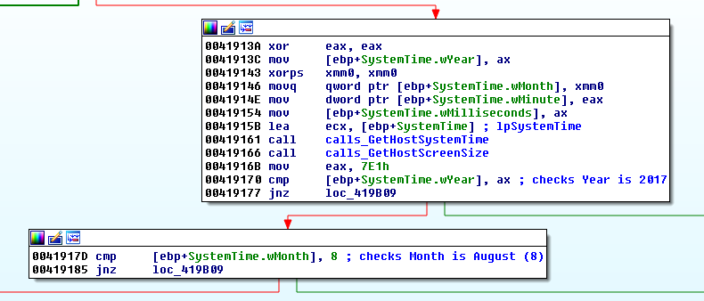
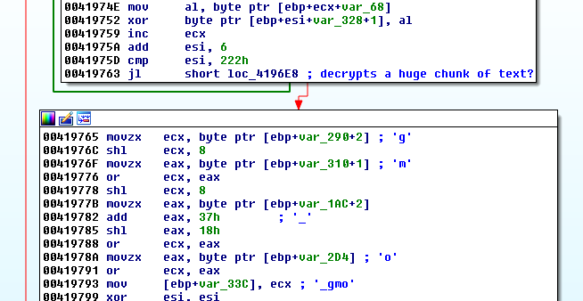
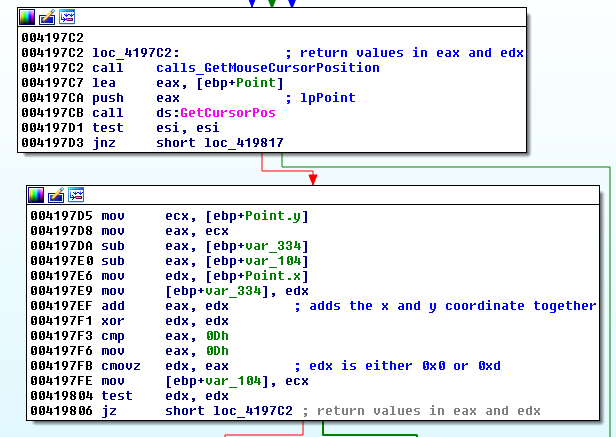
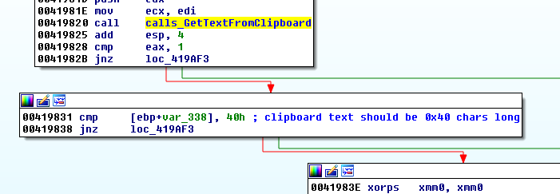
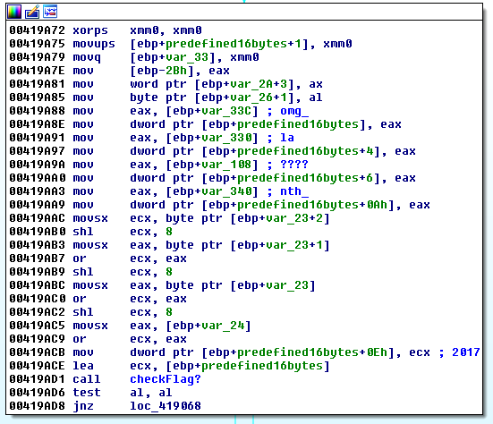

## LabyREnth CTF 2017
# Binary 3 : LabyrINth

An x86 binary is provided. This is a fairly straight-forward challenge.

The flag is encrypted within the binary.  
A key is formed by querying various system attributes.  
If the key is correct, the flag will be successfully decrypted and shown.

The interesting part of this challenge is how these system attributes are queried.

It is queried in the function at 0x418B00 using an **in** instruction



On normal systems, the "in" instruction is a ring-0 privileged instruction.  
Ring-3 applications calling it will crash.

However, VMWare makes use of this instruction to allow VMs to communicate with the VMWare Hypervisor.  
Calling "in" on port 0x5658 in a VMWare VM will issue commands to the Hypervisor  
More information can be gotten from here (https://sites.google.com/site/chitchatvmback/backdoor) or by searching for "Vmware Backdoor Commands"

This executable makes use of this, which means it needs to be run in a VMWare VM.

The interesting function starts at 0x418FC0 and this is what it does.

Issue VM CMD 0x11 (Get Virtual Hardware Version) == 4



Issue VM CMD 0x01 (Get Processor Speed) > 1000MHz


Issue VM CMD 0x13 (Get BIOS UUID)



It adds 0x09 to each byte in the UUID and compares it to "_V`J[N)UJKb[NW]Q".  
Subtracting 0x09 from the above string gives "VMWARE LABYRENTH".  

Change the bios uuid of the VM to that.
- Shut down the VM
- Open the vmx file in a text editor and find the "bios.uuid" field
- Change it as follows

> uuid.bios = "56 4d 57 41 52 45 20 4c-41 42 59 52 45 4e 54 48"  // VMWARE LABYRENTH

Issue VM CMD 0x17 (Get Host System Time (GMT))



It checks that the year is "2017" and the month is "08".  
Change your system time if it does not match this.

The above 9-shifted BIOS UUID is used as a key to decrypt a chunk of data

The decrypted data is 

> Labyrinth is a 1986 British-American adventure musical fantasy film directed by Jim Henson, executive-produced by George Lucas, and based upon conceptual designs by Brian Froud. The film revolves around 15-year-old Sarah's (Jennifer Connelly) quest to reach the center of an enormous otherworldly maze to rescue her infant brother Toby, who Sarah wished away to Jareth, the Goblin King (David Bowie). With the exception of Connelly and Bowie, most of the film's significant characters are played by puppets produced by Jim Henson's Creature Shop.

Four letters are extracted from the decrypted text to form "omg_"



Issue VM CMD 0x04 (Get Mouse Cursor Position)



It checks that the (YPOS + XPOS) of the cursor is equal to "0xd".  
I have to use a debugger to change this value.  
Once passed, it will create another string "la"

Issue VM CMD 0x06 (Get Clipboard Text Length) and VM CMD 0x07 (Get Clipboard Text)



The Clipboard text is then passed through a series of operations
- Length must be 0x40
- Passed through a "HexToBinary" function
	- Input must be a 0x40 long hex string
	- The resulting binary string would be 0x20 chars long
- 0x07 is added to each byte and compared to "Qhyl{o3'pu'opz'v~s'mvyt3'~h{jolz"

Subtracting 0x07 from the above string gives "Jareth, in his owl form, watches".  
Converting that to hex gives "4a61726574682c20696e20686973206f776c20666f726d2c2077617463686573"

Copy the above hex string so that it will be in the "Clipboard"

This clipboard string is then passed through some additional operations that would lead to a xor with 0x4A930B03.  
After the xor, the resulting 4 bytes will be saved for later use.  
I am not sure what these operations are, let's just call these 4 bytes "xxxx"

It then uses the Month value that we have gotten before to "decrypt" a 32-bit value
- Note that it has to be "0x8" to have reach this part of the code


It creates some kind of seed value 

> Seed = (Month*5)*2 = 0x50

This seed value is passed into some kind of recursive function which will generate a key to decrypt "0xB06B558B"

Having the correct month value at 0x8 will decrypt that into a string "nth_"

The year value "2017" is also stored for later use

### Combining the key



The key is now formed by combining the various strings that has been "saved"
- "omg_"+"la"+"xxxx"+"nth_"+"2017"

The only unknown is "xxxx" which I have failed to obtain.

But looking at the current string "omg_laxxxxnth_2017", I can guess the key to be "omg_labyrenth_2017"

I changed the string directly in the debugger and let it continue.

The key successfully decrypts the flag

```
00B7F758  50 41 4E 7B 56 4D 57 61 72 65 20 4C 61 62 79 72  PAN{VMWare Labyr  
00B7F768  65 6E 74 68 20 32 30 31 37 20 43 68 61 6C 6C 65  enth 2017 Challe  
00B7F778  6E 67 65 2E 20 56 4D 57 61 72 65 20 42 61 63 6B  nge. VMWare Back  
00B7F788  64 6F 6F 72 20 41 50 49 20 69 73 20 6E 69 63 65  door API is nice  
00B7F798  2E 7D 00 00 BF 82 AB DA FC FA B7 00 D6 9A CC 00  .}..¿.«Úüú·.Ö.Ì.  
```

The flag is **PAN{VMWare Labyrenth 2017 Challenge. VMWare Backdoor API is nice.}**

[biosuuid.php](biosuuid.php) and [testdecrypt.php](testdecyrpt.php) contains PHP scripts to help calculate some of the values above,