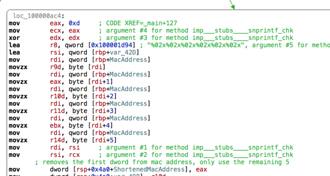
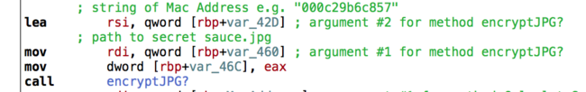
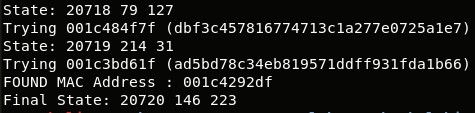
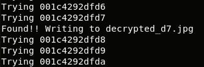

## LabyREnth CTF 2017
# Binary 4 : Labyrenth

A 64-bit Mach-O binary and an encrypted jpg is provided

This was my first time actually reversing a Mach-O binary.  
I used Hopper to disassemble and lldb as the debugger.  

The challenge also comes with the following hint

> Send me this identifier together with your $$$$ to decrypt your file: da91e949f4c2e814f811fbadb3c195b8

This led me to believe the binary is some kind of ransomware and we are trying to recover the encrypted jpg.

### Reversing the binary

Reversing the binary from the "_main" function at address offset 0x0a30 will reveal what it is doing


It first grabs the PrimaryEthernet's MAC Address which is 6 bytes long

It then finds the path to the file "PANW_Top_Secret_Sauce.jpg" recursively starting from the binary's working directory.

It then performs an Anti-VM check by issuing the following command

> ioreg -l | grep -e Manufacturer -e 'Vendor Name' | grep -e 'Parallels' -e VMware -e Fusion -e 'Virtual Box'

If anything is returned from the command, 0x3e7 is returned which will fail the jump condition.  
Else if nothing is returned from the command, 0 is returned.

Put a breakpoint here (offset 0xaad) and change eax's value to 0x0 to bypass this check

Next, it converts the Mac Address earlier to its Hex String form



This hex string is used as a key to encrypt the jpg file



The encryption algorithm used is straight up RC4

After the encryption, it generates a MD5 hash in the following way
- Perform a series of Mathematical operations of the first 5 bytes of the MAC Address
- The final results of the mathematical operations is then passed through MD5 hashing
- The resulting hash is printed to the screen together with the ransom note

Remember, we were given the encrypted jpg and also the hash in the ransom note.

The solution is to brute-force the hash "da91e949f4c2e814f811fbadb3c195b8" to retrieve the first 5 bytes of the mac address.  
Then brute-force the last byte of the mac address for image decryption using RC4

### Brute-forcing the Hash

The keyspace can be reduced significantly because this is a valid Mac Address.

First 3 bytes of MAC Address is Vendor-Specific. Not the entire range is used.  
At first, I tried using only Mac Address issued to "Apple Inc" but that did not work  
Probably Macs uses components from other vendors too.

I downloaded the entire Vendor-Specific Mac Address from the IEEE standards [here](https://standards.ieee.org/develop/regauth/oui/oui.csv)

I reveresed the hashing algorithm and re-implmented it into PHP

```php
function doHash($msg){
	$dictionary = array();
	$dictionary[0] = array(0x13,0x9a,0x1b,0xe4,0xf3);
	$dictionary[1] = array(0x8e,0xc7,0x8c,0x3f,0x7a);
	$dictionary[2] = array(0xdc,0x0b,0x42,0xa7,0xf8);
	$dictionary[3] = array(0x6e,0x9f,0x08,0x79,0x17);
	$dictionary[4] = array(0xd6,0xb1,0x33,0x7d,0x67);

	$modRes = array(0,0,0,0,0);
	for ($i=0; $i<5; $i++){
		for($k=0; $k<5; $k++){
			$msgByte = ord($msg[$k]);
			$dictByte = $dictionary[$k][$i];
			$modRes[$i] += ($msgByte * $dictByte);
		}
		$modRes[$i] = $modRes[$i] % 0xfb;
	}

	$dstr = "";
	for ($i=0; $i<count($modRes); $i++){
		$hex = dechex($modRes[$i]);
		while (strlen($hex) < 2) $hex = '0'.$hex;
		$dstr .= $hex."000000";	
	}

	return md5(hex2bin($dstr));
}
```
I wrote this [php script](1_brutehash.php) to perform this brute-force

Running it will recover the first 5 bytes of the mac address



The first 5 bytes of the mac address is **001c4292df**

### Brute-forcing the Image Decryption

I wrote [another php script](2_brutejpg.php) which will brute-force the last byte of the mac address using RC4.  
I determined the key was correct if I could find the string "JFIF" in the decrypted contents

```php
$enc = file_get_contents("PANW_Top_Secret_Sauce.jpg.encrypted");
$key = "001c4292df"; // Hash gotten from brutehash.php

// Bruteforce the last byte of the key
for ($i=0; $i<256; $i++){
	$cur = dechex($i);
	while (strlen($cur) < 2) $cur = '0'.$cur;
	$testkey = $key.$cur;
	echo "Trying $testkey \n";
	$plain = rc4($testkey, $enc);
	if (strpos($plain, "JFIF") !== false){
		$fname = "decrypted_".$cur.".jpg";
		echo "Found!! Writing to $fname \n";
		file_put_contents($fname, $plain);
	}
}
```

Running the script will reveal that the correct mac address is "001c4292dfd7" and decrypts the image



The flag is in the decrypted image


The flag is **PAN{1_d0n't_4lw@y5_c@tch_4_v1rus_but_wh3n_1_d0_1_cr@ck_1t}**