## LabyREnth CTF 2017
# Binary 5 : Multistage

This is the final challenge of the binary track.  
An x86 PE binary is provided.

There are a total of 5 levels embedded in this binary.  
Each level has its own password.  
Solving all the levels will reveal the flag

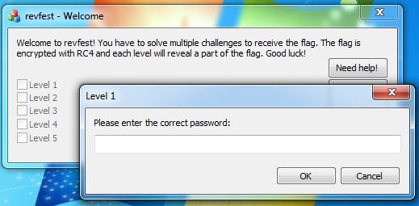

### Preparation

There are some anto-debugger checks (via isDebuggerPresent calls)

I patched the binary to remove them to make my life easier
- Replaced the instruction bytes with "33 c0 90 90 90 90..."
	- which is "xor eax, eax; nop ..."
- Patched out all calls to "IsDebuggerPresent"
- Patched out call to sub_44bd70 which performs isDebuggerPresent check

I used the String "Wrong Counter" to find all the checking code for all 5 levels

### Level 1

Checker @ 0x44CBF0  

It takes the input and does the following for each character (in eax)
- mov ecx, eax
- shr ecx, 1
- xor ecx, eax

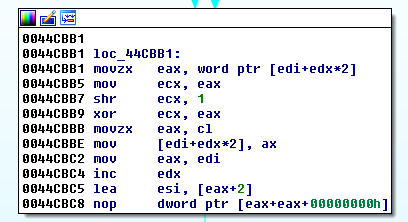

It then compares the result against the following string

> mY0dKWWn0[EN\XZhdE:0N\W0ZQSE{gYN\0LQJ0QY0WZaSXKa~W0JNKORNOKW0VWJ]Tigf0QYV0SO]Z~0SE0N\W0jgdgifa{u0QKN]U]RWK0fQWVQZOJ0UXK0n]id0k]ihz0XU0bKgNg0QN0nYXzzhJ9

As there is only 96 possible inputs (0x20-0x7f), we can create a forward dictionary to match them.

[soln1.php](soln1.php) will do this.

```php
$enc = 'mY0dKWWn0[EN\XZhdE:0N\W0ZQSE{gYN\0LQJ0QY0WZaSXKa~W0JNKORNOKW0VWJ]Tigf0QYV0SO]Z~0SE0N\W0jgdgifa{u0QKN]U]RWK0fQWVQZOJ0UXK0n]id0k]ihz0XU0bKgNg0QN0nYXzzhJ9';
$plain = "";
$hexstr = "";
$dictionary = createTranslationArray();

for($i=0; $i<strlen($enc); $i++){
	$cur = ord($enc[$i]);
	$res = $dictionary[$cur];
	$hex = dechex($res);
	$plain .= chr($res);
	$hexstr .= $hex." ";
}
echo $plain."\n";

function createTranslationArray(){
	$out = array();
	for ($i=0x20; $i<0x7f; $i++){
		$tmp = $i >> 1;
		$key = $i ^ $tmp;
		$out[$key] = $i;
	}
	return $out;
}
```

Running it will give us the password for level 1

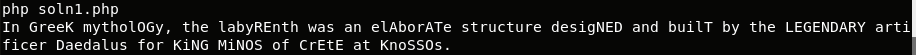

```
In GreeK mytholOGy, the labyREnth was an elAborATe structure desigNED and builT by the LEGENDARY artificer Daedalus for KiNG MiNOS of CrEtE at KnoSSOs.
```

### Level 2

Checker @ 0x44e3d0

An image is provided in Level 2

I used [Redwood Resource Extractor](http://www.the-sz.com/products/redwood/) to extract this png (level2.png)

I then used [StegSolve](http://www.caesum.com/handbook/stego.htm) (its a jar file) to check for any steganograpy

Manage to extract the hidden text using StegSolve (DataExtractor)
	- Bit 0 of RGB

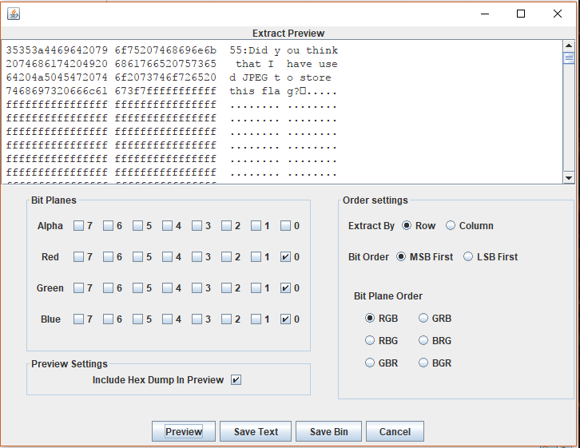

This means the hidden message was hidden in bit 0 of the RGB values of each pixel

I've also written [soln2.php](soln2.php) which will extract bit 0 for every RGB pixel values from the image to form the hidden text

> Did you think that I have used JPEG to store this flag?

The above string is the password for level 2

### Level 3

Checker @ 0x44f220

It creates a new suspended process using "notepad.exe".

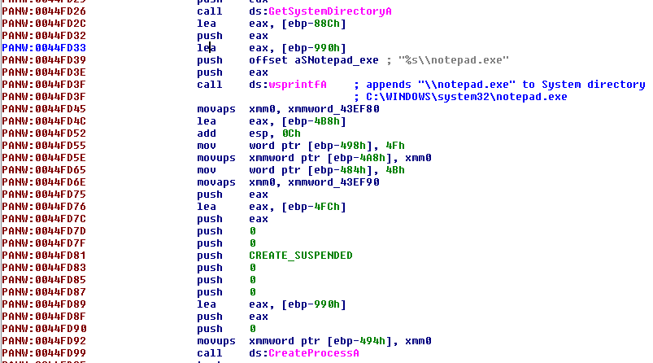

It then begins to write chunks of bytes into that process's memory

One of these chunks are encrypted instruction bytes
- They can be decrypted with a single byte xor of "0xcc"

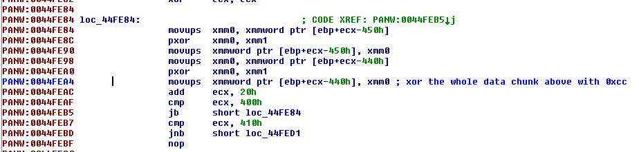

[soln3_decryptBinary.php](soln3_decryptBinary.php) will decrypt these bytes and write it to "level3.bin" which can then be passed to IDA Pro to disassemble

These instruction bytes are later called using a "RemoteThread" API Call

This is how I debugged the Remote Thread to figure out what it was doing
- Complete first 2 levels
- Attach a Debugger
- Put Breakpoints at
	- 0x44f220 (Level 3 Checker entry point)
	- 0x44fefb (Just before RemoteThread call)
		- All values have been set at this point
- Once hit breakpoint at 0x44fefb
	- Take note of the 4th value on the Stack.
	- That is the entry point of the function in the remote thread
- Attach a second debugger to the remote process ("notepad.exe")
	- Set a breakpoint at the entry point before and continue.
- Stepping over the RemoteThread call will cause the 2nd debugger to hit the breakpoint
- Continue debugging to find out what the remote thread is doing.

The code in "level3.bin" uses Fiboncaci numbers and does the following
- Input must be 0x11 length long, for each char, 
	- Subtract 0x40 (- 0x40)
		- tmp = char - 0x40
	- fibnum = getFibonacciNumber(tmp)
	- val = fibnum & 0xffffffff (lowest 4 bytes)
	- Check val against "Correct" solutions array below

```
028AFCD8  6D 1A 00 00 00 00 00 00 CB 7E 19 06 00 00 00 00  m.......Ë~......  
028AFCE8  6D 8D DE 09 00 00 00 00 82 68 D9 BD 00 00 00 00  m.Þ......hÙ½....  
028AFCF8  DD 8A 14 00 00 00 00 00 6D 8D DE 09 00 00 00 00  Ý.......m.Þ.....  
028AFD08  82 68 D9 BD 00 00 00 00 DD 8A 14 00 00 00 00 00  .hÙ½....Ý.......  
028AFD18  DD A5 CE 29 00 00 00 00 E2 C7 35 00 00 00 00 00  Ý¥Î)....âÇ5.....  
028AFD28  E7 04 57 00 00 00 00 00 A2 19 A4 15 00 00 00 00  ç.W.....¢.¤.....  
028AFD38  5F E5 73 6D 00 00 00 00 E2 C7 35 00 00 00 00 00  _åsm....âÇ5.....  
028AFD48  C9 CC 8C 00 00 00 00 00 C9 CC 8C 00 00 00 00 00  ÉÌ......ÉÌ......  
028AFD58  6D 8D DE 09 00 00 00 00 89 00 21 00 94 FD 8A 02  m.Þ.......!..ý..  
```

[soln3.php](soln3.php) will use the solutions array and reverse the algorithm to recover the expected input password

```php
$fibonacci = genFibonnaciNumbers(0x40); // Does not matter if it overflows, continue using the values
$targets = array();
$targets[] = "1a6d";
$targets[] = "6197ecb";
$targets[] = "9de8d6d";
$targets[] = "bdd96882";
$targets[] = "148add";
$targets[] = "9de8d6d";
$targets[] = "bdd96882";
$targets[] = "148add";
$targets[] = "29cea5dd";
$targets[] = "35c7e2";
$targets[] = "5704e7";
$targets[] = "15a419a2";
$targets[] = "6d73e55f";
$targets[] = "35c7e2";
$targets[] = "8cccc9";
$targets[] = "8cccc9";
$targets[] = "9de8d6d";

$out = "";
for ($i=0; $i<count($targets); $i++){
	$cur = $targets[$i];
	$fibnum = getFibonnaciSequenceID($fibonacci, $cur);
	if ($fibnum === false){
		echo "GOT ERROR!!! ".dechex($cur)." \n";
		die();
	}
	$out .= chr($fibnum + 0x40);
}
echo $out."\n";

function genFibonnaciNumbers($n){
	$nums = array();
	$nums[0] = 0;
	$nums[1] = 1;
	for ($i=2; $i<$n; $i++){
		$nums[$i] = ($nums[$i-1] + $nums[$i-2]) & 0xffffffff;
	}
	return $nums;
}

function getFibonnaciSequenceID($fib, $target){
	for ($i=0; $i<count($fib); $i++){
		//if ($target == ($fib[$i] & 0xffffffff)){ // ignore the overflow
		if (strcmp($target,dechex($fib[$i])) == 0){
			return $i;
		}
	}
	return false;
}
```

Running it will give us the password for level 3 "This_is_labynacci"

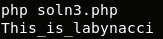

### Level 4

Checker @ 0x450570

This level uses the [FNV1a Fowler Hashing algorithm](http://www.isthe.com/chongo/tech/comp/fnv/index.html)

The input is passed through a Base64-Encode function  
Using a test value, I noticed that it is using a custom dictionary

```
Checking base64 output (DIFFERENT!!)
UEFOREEgUEFOREEgUEFOREEhIEJPU0UgUEFOREEgSU5WIFAATkRAIFhBUiAQQU5EQQ== (output in debugger)
UEFOREEgUEFOREEgUEFOREEhIEJAU0UgUEFOREEgSU5WIFBBTkRBIFhPUiBQQU5EQQ== (php output)
```

Stepping through the Base64-Encoding function in the debugger reveals the custom dictionary used

> "PANDEFGHIJKLMCOBQRSTUVWXYZabcdefghijklmnopqrstuvwxyz0123456789+/"

Each character of the base64 output is then passed through FNV1a 64-bit hashing algorithm one by one

I wrote a php function to perform the FNV1A hashing algorithm

```php
function fnv1a($bitsize, $msg){
	$offsetbasis = 0;
	$fnvprime = 0;
	if ($bitsize == 64){
		$offsetbasis = bchexdec("cbf29ce484222325"); // 14695981039346656037
		$fnvprime = bchexdec("100000001b3"); // 1099511628211
	}
	else{
		echo "Bitsize unsupported\n";
		return false;
	}
	
	$hash = $offsetbasis;
	for ($i=0; $i<strlen($msg); $i++){
		$cur = ord($msg[$i]).'';
		//echo bcdechex($hash)."\n";
		$hash = bcxor($hash,$cur);
		//echo bcdechex($hash)."\n";
		$hash = bcmul($hash,$fnvprime);
		//echo bcdechex($hash)."\n";
		$hash = bcand($hash, bchexdec("ffffffffffffffff"));
		//echo bcdechex($hash)."\n";
	}
	return bcdechex($hash);
}
```

The results are then checked against these solution array below (Each result is 8 bytes long)

```
0019E594  50 37 02 86 4C 08 64 AF 20 1C 02 86 4C F8 63 AF  P7..L.d¯ ...Løc¯  
0019E5A4  39 21 02 86 4C FB 63 AF 1E 2D 02 86 4C 02 64 AF  9!..Lûc¯.-..L.d¯  
0019E5B4  35 43 02 86 4C 0F 64 AF 20 1C 02 86 4C F8 63 AF  5C..L.d¯ ...Løc¯  
0019E5C4  20 1C 02 86 4C F8 63 AF 26 E9 01 86 4C DA 63 AF   ...Løc¯&é..LÚc¯  
0019E5D4  50 37 02 86 4C 08 64 AF 20 1C 02 86 4C F8 63 AF  P7..L.d¯ ...Løc¯  
0019E5E4  39 21 02 86 4C FB 63 AF 1E 2D 02 86 4C 02 64 AF  9!..Lûc¯.-..L.d¯  
0019E5F4  35 43 02 86 4C 0F 64 AF 20 1C 02 86 4C F8 63 AF  5C..L.d¯ ...Løc¯  
0019E604  20 1C 02 86 4C F8 63 AF 26 E9 01 86 4C DA 63 AF   ...Løc¯&é..LÚc¯  
0019E614  50 37 02 86 4C 08 64 AF 20 1C 02 86 4C F8 63 AF  P7..L.d¯ ...Løc¯  
0019E624  39 21 02 86 4C FB 63 AF 1E 2D 02 86 4C 02 64 AF  9!..Lûc¯.-..L.d¯  
0019E634  35 43 02 86 4C 0F 64 AF 20 1C 02 86 4C F8 63 AF  5C..L.d¯ ...Løc¯  
0019E644  20 1C 02 86 4C F8 63 AF D7 FB 01 86 4C E5 63 AF   ...Løc¯×û..Låc¯  
0019E654  84 30 02 86 4C 04 64 AF 20 1C 02 86 4C F8 63 AF  .0..L.d¯ ...Løc¯  
0019E664  9D 35 02 86 4C 07 64 AF EC 22 02 86 4C FC 63 AF  .5..L.d¯ì"..Lüc¯  
0019E674  50 37 02 86 4C 08 64 AF AF 9C 01 86 4C AD 63 AF  P7..L.d¯¯...L.c¯  
0019E684  50 37 02 86 4C 08 64 AF 15 A0 01 86 4C AF 63 AF  P7..L.d¯. ..L¯c¯  
0019E694  52 26 02 86 4C FE 63 AF D1 2E 02 86 4C 03 64 AF  R&..Lþc¯Ñ...L.d¯  
0019E6A4  EC 22 02 86 4C FC 63 AF 1C 3E 02 86 4C 0C 64 AF  ì"..Lüc¯.>..L.d¯  
0019E6B4  1C 3E 02 86 4C 0C 64 AF 50 37 02 86 4C 08 64 AF  .>..L.d¯P7..L.d¯  
0019E6C4  30 94 01 86 4C A8 63 AF 20 1C 02 86 4C F8 63 AF  0...L¨c¯ ...Løc¯  
0019E6D4  1C 3E 02 86 4C 0C 64 AF 82 41 02 86 4C 0E 64 AF  .>..L.d¯.A..L.d¯  
0019E6E4  EC 22 02 86 4C FC 63 AF 86 1F 02 86 4C FA 63 AF  ì"..Lüc¯....Lúc¯  
0019E6F4  03 39 02 86 4C 09 64 AF 0B F5 01 86 4C E1 63 AF  .9..L.d¯.õ..Lác¯  
0019E704  B4 4B 02 86 4C 14 64 AF 15 A0 01 86 4C AF 63 AF  ´K..L.d¯. ..L¯c¯  
0019E714  52 26 02 86 4C FE 63 AF D1 2E 02 86 4C 03 64 AF  R&..Lþc¯Ñ...L.d¯  
0019E724  EC 22 02 86 4C FC 63 AF 1C 3E 02 86 4C 0C 64 AF  ì"..Lüc¯.>..L.d¯  
0019E734  1C 3E 02 86 4C 0C 64 AF 50 37 02 86 4C 08 64 AF  .>..L.d¯P7..L.d¯  
0019E744  30 94 01 86 4C A8 63 AF 20 1C 02 86 4C F8 63 AF  0...L¨c¯ ...Løc¯  
0019E754  1C 3E 02 86 4C 0C 64 AF 82 41 02 86 4C 0E 64 AF  .>..L.d¯.A..L.d¯  
0019E764  EC 22 02 86 4C FC 63 AF B4 4B 02 86 4C 14 64 AF  ì"..Lüc¯´K..L.d¯  
0019E774  03 39 02 86 4C 09 64 AF FC 9A 01 86 4C AC 63 AF  .9..L.d¯ü...L¬c¯  
0019E784  84 30 02 86 4C 04 64 AF 26 E9 01 86 4C DA 63 AF  .0..L.d¯&é..LÚc¯  
0019E794  50 37 02 86 4C 08 64 AF 20 1C 02 86 4C F8 63 AF  P7..L.d¯ ...Løc¯  
0019E7A4  39 21 02 86 4C FB 63 AF 1E 2D 02 86 4C 02 64 AF  9!..Lûc¯.-..L.d¯  
0019E7B4  35 43 02 86 4C 0F 64 AF 20 1C 02 86 4C F8 63 AF  5C..L.d¯ ...Løc¯  
0019E7C4  20 1C 02 86 4C F8 63 AF C8 A1 01 86 4C B0 63 AF   ...Løc¯È¡..L°c¯  
```

Similarly as before, there is only 64+1 (65) possible characters in a base64-encoded string  
Therefore, it is possible to create a forward dictionary and get the reverse results.

I then wrote [soln4.php](soln4.php) which will create such a dictionary to retrieve the base64-encoded string.

> "UEFOREEgUEFOREEgUEFOREEhIEJAU0U2CNAQQU5EQSAGTlY2CNAQQU5EQSAYT1IgUEFOREE="

The php script will then use the custom base64 dictionary to decode and get the password

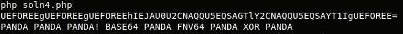

> "PANDA PANDA PANDA! BASE64 PANDA FNV64 PANDA XOR PANDA"

### Level 5

Checker @ 0x4513b0

The easiest way to get the decryption results in this level is to step through the code in a debugger and keep providing appropriate values. There is no need to reimplement any decryption.

It first decrypts a URL "https://raw.githubusercontent.com/edix/sedocllehs/master/1.bin"

It then downloads the file into memory, marks it as executable, decrypts it, calls into it.

Each of the following "bin" file has a "Sleep" call, change its argument to a small value (e.g. 0x10) to bypass it.

**[1.bin](level5_1.bin)**
- Checks input length is 0xf
- Checks input[0-3] is "Laby" using a sequence of simple xor and math operations

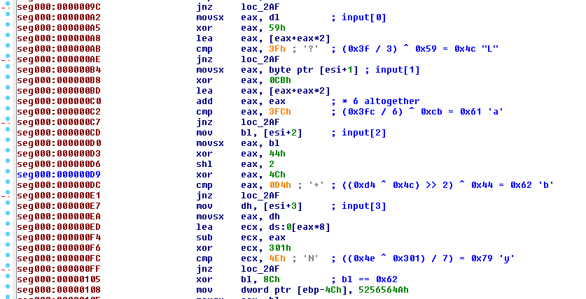

- Uses "Laby" as a key to decrypt another URL
	- https://raw.githubusercontent.com/edix/sedocllehs/master/2.bin
- Downloads the file into memory, marks it as executable, decrypts it, calls into it

**[2.bin](level5_2.bin)**
- Checks input length is 0xf
- Checks input[4-8] is "shell" using the RightShiftXor operations similar to Level 2

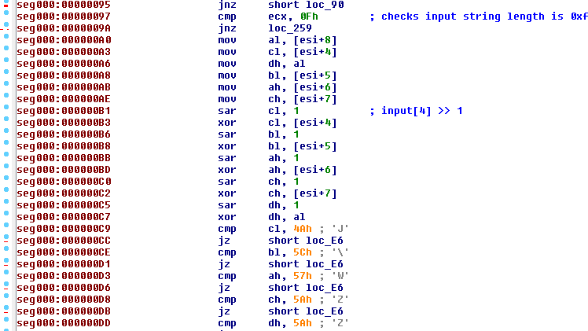

- Uses characters from "shell" as a key to decrypt another URL
	- https://raw.githubusercontent.com/edix/sedocllehs/master/3.bin
- Downloads the file into memory, marks it as executable, decrypts it, calls into it

**[3.bin](level5_3.bin)**
- Checks input length is 0xf
- Checks input[9-c] is "code" using Xor and Multiplication operations
	- A forward dictionary can be created to find the reverse results. (input keyspace is small)

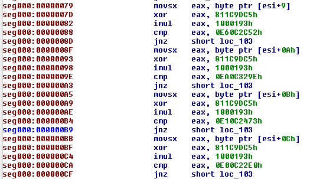

- Checks input[d] is "$" using some Right Shift and Odd Xor operations
	- A forward dictionary can be created to find the reverse results too

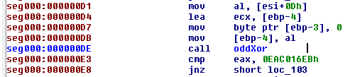

- Checks input[e] is "1" using RightShiftXor operations similar to Level 2
	- Forward dictionary can also be created to find the reverse results


I wrote [soln5.php](soln5.php) to create all the forward dictionary required to decode 2.bin and 3.bin

Running it will decode the password to be "Labyshellcode$1"

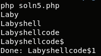

### Final Flag

In summary, these are the passwords to the 5 levels

```
1) In GreeK mytholOGy, the labyREnth was an elAborATe structure desigNED and builT by the LEGENDARY artificer Daedalus for KiNG MiNOS of CrEtE at KnoSSOs.

2) Did you think that I have used JPEG to store this flag?

3) This_is_labynacci

4) PANDA PANDA PANDA! BASE64 PANDA FNV64 PANDA XOR PANDA

5) Labyshellcode$1
```

Providing the 5 correct passwords will reveal the flag

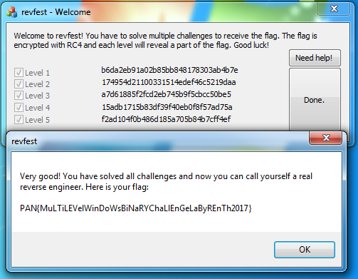

The flag is **PAN{MuLTiLEVelWinDoWsBiNaRYChaLlEnGeLaByREnTh2017}**