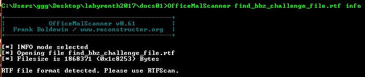
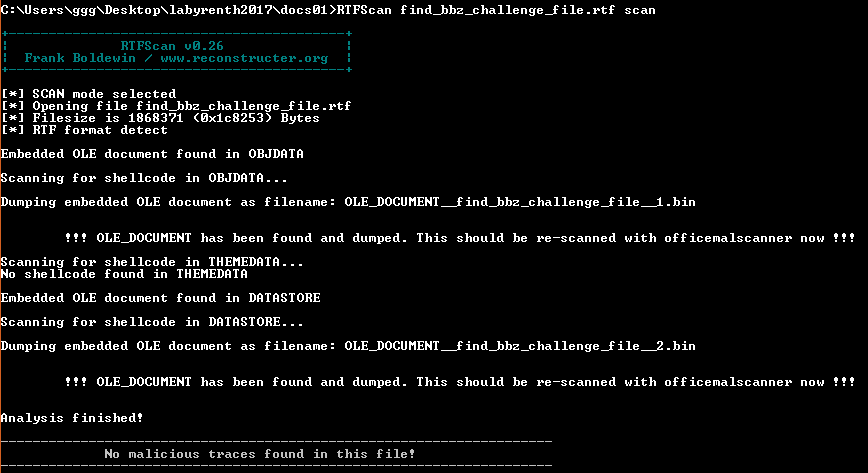
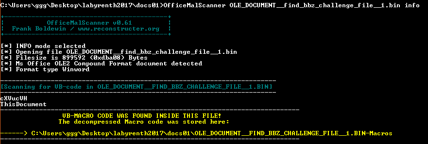
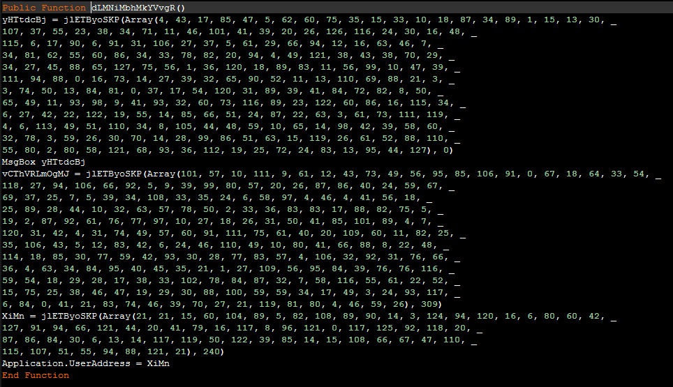
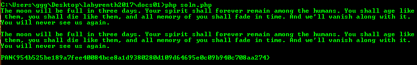

## LabyREnth CTF 2017
# Document 1 : Findbbz

We are provided with a rtf file. 

Use OfficeMalScanner to extract the macro code.



Use RTFScan instead to scan the document



2 files were dumped by RTFScan. The 2nd file is only 2 bytes long hence it can be ignored.

Use OfficeMalScanner on the first file.



2 macro files are dumped.

This is the main code of "ThisDocument"

```vba
Private Sub Document_Open()
    If ActiveDocument.Variables("wfozoV").Value <> "bbz" Then
        dLMNiMbhMkYVvgR
        ActiveDocument.Variables("wfozoV").Value = "bbz"
        If ActiveDocument.ReadOnly = False Then
            ActiveDocument.Save
        End If
    End If
End Sub
```

It calls the **dLMNiMbhMkYVvgR** function and then overwrites the "wfozoV" ActiveDocument variable with "bbz"

The other "cXVucVH" file contains 2 functions. Variable names are obfuscated but can be easily deobfuscated.

```vbs
Private Function jlETByoSKP(GdrcfxpgXc As Variant, FbuSrdOMYW As Integer)
    Dim RikXPlcMKM, UyhoTAiIgk As String, JObtuRmczB, awgCsKrqKP
    UyhoTAiIgk = ActiveDocument.Variables("wfozoV").Value()
    RikXPlcMKM = ""
    JObtuRmczB = 1
    While JObtuRmczB < UBound(GdrcfxpgXc) + 2
        awgCsKrqKP = JObtuRmczB Mod Len(UyhoTAiIgk): If awgCsKrqKP = 0 Then awgCsKrqKP = Len(UyhoTAiIgk)
        RikXPlcMKM = RikXPlcMKM + Chr(Asc(Mid(UyhoTAiIgk, awgCsKrqKP + FbuSrdOMYW, 1)) Xor CInt(GdrcfxpgXc(JObtuRmczB - 1)))
        JObtuRmczB = JObtuRmczB + 1
    Wend
    jlETByoSKP = RikXPlcMKM
End Function
```

This is some kind of XOR decryption function using the value in the ActiveDocument Variable "wfozoV" as a Dictionary.

I reimplmented it into PHP as follows

```php
function decrypt($crypted, $offset){
    global $wfozov;
    $msg = "";
    for ($i=0; $i<count($crypted); $i++){
        $tmp = $crypted[$i] ^ ord($wfozov[$i+$offset]);
        $msg .= chr($tmp);
    }
    return $msg;
}
```

The other function **dLMNiMbhMkYVvgR** bascially uses the above decryption function to decrypt 3 strings.



I wrote the [DocumentVariableExtractor.vbs](DocumentVariableExtractor.vbs) script to extract ActiveDocument variables from document files.  
Take note that it can only run on Windows and Microsoft Office needs to be installed for it to work.  
Also the full path to the document file must be provided

```vbs
Option Explicit

if WScript.Arguments.Count < 2 then
    WScript.Echo "Not enough arguments" & vbCRLF
    WScript.Echo "cscript <thisfile> targetfile variablename" & vbCRLF
end if

Dim objWord
Dim wordPath
Dim currentDocument
Dim dict

wordPath = WScript.Arguments(0)

Set objWord = CreateObject("Word.Application")
objWord.WordBasic.DisableAutoMacros 1

objWord.Documents.Open wordPath, false, true
Set currentDocument = objWord.Documents(1)

dict = currentDocument.Variables(WScript.Arguments(1)).Value
WScript.Echo dict & vbCRLF

currentDocument.Close
Set currentDocument = Nothing
objWord.Quit
Set objWord = Nothing
```

Run the script as follows

```bash
cscript DocumentVariableExtractor.vbs C:\Users\ggg\Desktop\labyrenth2017\docs01\OLE_DOCUMENT__find_bbz_challenge_file__1.bin wfozoV > dict.txt
```

I copied the value from "dict.txt" and wrote [soln.php](soln.php) that will decrypt the 3 strings

```php
$wfozov = "PCtuBjQRkTfMf25GygzarKLY7RJ5nKEMFmiPTAqeBSua3t2kJhMdQqb8cbZXbPqLRQ7KOn3y1jVYRCCfuWvL62QkanQXa12gTCkHBO21kuizsBMmzMdxN60toojVd1qlLzSXk1BDxh3fVaPg1BdL0ON0T6qZE9eSQnzFzZuVj0bZvwbVnXgO6jbQFVINdIZQUc2fBKKURGntRnvfghMvjPzWmTX4NY5t5HY78APfjhy4l6BQETAGQl10YkolfMfAq16YOKknzMNwLwqDlYJ8EOdFpffmz098LBWJDe7mUvsLYCSRVloMh1QoOdRcEiFQ39J9ect5MZVr0J64wlBC4XmiyvqwN1eVinwNVLRKyjVAbAvLNwkynIgAVWnSoNJ4se07kmfo62Nbm8en2iwSE9E8cbXsCozjEQY6CkDGaMOc3uOJOlisFosKNEb5DnxixTRs9rmVO0qn4sVbJY3jl1LeSNt9IIF5huML69Bbl5UR2jy6JMF859ItRTVQyZhknOZG3tjvDbTW1Fjt1Uh1vLgs9KBfnfW07eGU42HoZai7dO6eenbKlhduYPGXMYP2arujorwiuzhJIQxcw4az3vKbCef5i6imSeP9zPxaSbyguh14mCeUyL4jKutD7iQZa9e0C2zCa2jdIHhaLAj2GEvCNauWIrw1eZC9PgTi9HI3Lxmx0ep3SexZIsb4JcIUoUwWrVN72hVTS4EX0rqQwEK9QJYVaUMWL65IQjkWKfgj9HVoRDGKhUY2mvXZYzsBR7lgrnrK5yrjN9JHOjOvu9rUQhCTLAHylWavad15V3rhWJ7qcsMaV9r9BNuxocc7QXYjCJNLS6RIdBYxSgK173Wus5jXFc9kr8B1EKGtBG7STlnIQ9l6FuITe9gxyWP1DpE7M3Yo1eEpq0h1EThue1trrpmlCDwK6icEuwSdG4Y3xjZdgv2TzIj3YiVBPcIwIK8ap3KAEgzIcq9mD9XGquaC9JYdFeEffE7oDwEpWHC49PnWo2h4renyeOVnl5w";

function decrypt($crypted, $offset){
    global $wfozov;
    $msg = "";
    for ($i=0; $i<count($crypted); $i++){
        $tmp = $crypted[$i] ^ ord($wfozov[$i+$offset]);
        $msg .= chr($tmp);
    }
    return $msg;
}

echo decrypt(array(4, 43, 17, 85, 47, 5, 62, 60, 75, 35, 15, 33, 10, 18, 87, 34, 89, 1, 15, 13, 30, 107, 37, 55, 23, 38, 34, 71, 11, 46, 101, 41, 39, 20, 26, 126, 116, 24, 30, 16, 48, 115, 6, 17, 90, 6, 91, 31, 106, 27, 37, 5, 61, 29, 66, 94, 12, 16, 63, 46, 7, 34, 81, 62, 55, 60, 86, 34, 33, 78, 82, 20, 94, 4, 49, 121, 38, 43, 38, 70, 29, 34, 27, 45, 88, 65, 127, 75, 56, 1, 36, 120, 18, 89, 83, 11, 56, 99, 10, 47, 39, 111, 94, 88, 0, 16, 73, 14, 27, 39, 32, 65, 90, 52, 11, 13, 110, 69, 88, 21, 3, 3, 74, 50, 13, 84, 81, 0, 37, 17, 54, 120, 31, 89, 39, 41, 84, 72, 82, 8, 50, 65, 49, 11, 93, 98, 9, 41, 93, 32, 60, 73, 116, 89, 23, 122, 60, 86, 16, 115, 34, 6, 27, 42, 22, 122, 19, 55, 14, 85, 66, 51, 24, 87, 22, 63, 3, 61, 73, 111, 119, 4, 6, 113, 49, 51, 110, 34, 8, 105, 44, 48, 59, 10, 65, 14, 98, 42, 39, 58, 60, 32, 78, 3, 59, 26, 30, 70, 14, 28, 99, 86, 51, 63, 15, 119, 26, 61, 52, 88, 110, 55, 80, 2, 80, 58, 121, 68, 93, 36, 112, 19, 25, 72, 24, 83, 13, 95, 44, 127), 0)."\n\n";

echo decrypt(array(101, 57, 10, 111, 9, 61, 12, 43, 73, 49, 56, 95, 85, 106, 91, 0, 67, 18, 64, 33, 54, 118, 27, 94, 106, 66, 92, 5, 9, 39, 99, 80, 57, 20, 26, 87, 86, 40, 24, 59, 67, 69, 37, 25, 7, 5, 39, 34, 108, 33, 35, 24, 6, 58, 97, 4, 46, 4, 41, 56, 18, 25, 89, 28, 44, 10, 32, 63, 57, 78, 50, 2, 33, 36, 83, 83, 17, 88, 82, 75, 5, 19, 2, 87, 92, 61, 76, 77, 97, 10, 27, 18, 26, 31, 50, 41, 85, 101, 89, 4, 7, 120, 31, 42, 4, 31, 74, 49, 57, 60, 91, 111, 75, 61, 40, 20, 109, 60, 11, 82, 25, 35, 106, 43, 5, 12, 83, 42, 6, 24, 46, 110, 49, 10, 80, 41, 66, 88, 8, 22, 48, 114, 18, 85, 30, 77, 59, 42, 93, 30, 28, 77, 83, 57, 4, 106, 32, 92, 31, 76, 66, 36, 4, 63, 34, 84, 95, 40, 45, 35, 21, 1, 27, 109, 56, 95, 84, 39, 76, 76, 116, 59, 54, 18, 29, 28, 17, 38, 33, 102, 78, 84, 87, 32, 7, 58, 116, 55, 61, 22, 52, 15, 75, 25, 38, 46, 47, 19, 29, 30, 88, 100, 59, 59, 34, 17, 49, 3, 24, 93, 117, 6, 84, 0, 41, 21, 83, 74, 46, 39, 70, 27, 21, 119, 81, 80, 4, 46, 59, 26), 309),"\n\n";

echo decrypt(array(21, 21, 15, 60, 104, 89, 5, 82, 108, 89, 90, 14, 3, 124, 94, 120, 16, 6, 80, 60, 42, 127, 91, 94, 66, 121, 44, 20, 41, 79, 16, 117, 8, 96, 121, 0, 117, 125, 92, 118, 20, 87, 86, 84, 30, 6, 13, 14, 117, 119, 50, 122, 39, 85, 14, 15, 108, 66, 67, 47, 110, 115, 107, 51, 55, 94, 88, 121, 21), 240)."\n";
```

Run the script and you will see the flag in the 3rd string.



The flag is **PAN{954b525be189a7fee40084bce8a1d9380280d109d64695e0c09b940c708aa274}**