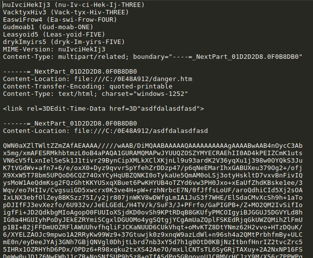
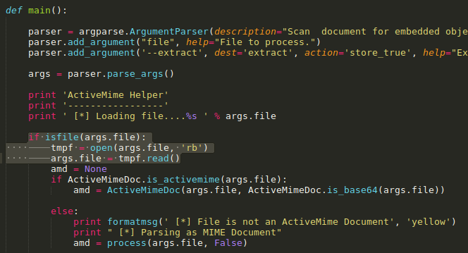
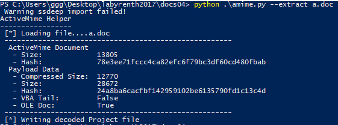
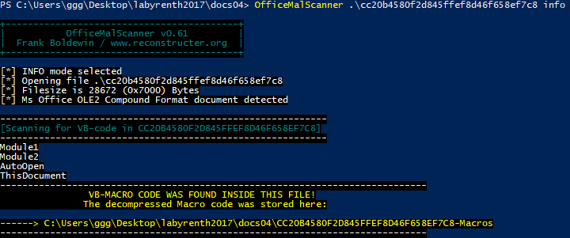
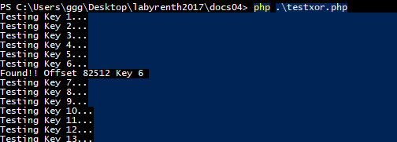
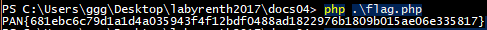

## LabyREnth CTF 2017
# Document 4 : macroses

We are provided with a doc file. 

Examining the doc file reveals that it is saved in the "MSHTML" format.



There are 2 base64-encoded chunk in the file.

I copied the first chunk and wrote [extractb64.php](1_extractb64.php) which will base64 decode it and write the results to **a.doc**

Ignore the second chunk for now. It will be used later

Examining "a.doc" reveals it has a "ActiveMime" header. This means this is an old office 95 document.

Found a script at https://github.com/phishme/python-amime that will extract OLE files from ActiveMime files.  
Have to add the following code at main() to make it work.
```py
    if isfile(args.file):
        tmpf = open(args.file, 'rb')
        args.file = tmpf.read()
```



Running the script will extract the OLE file to **cc20b4580f2d845ffef8d46f658ef7c8**

```bash
python amime.py --extract a.doc
```



Next run OfficeMalScanner to extract the macro codes from **cc20b4580f2d845ffef8d46f658ef7c8**

```bash
OfficeMalScanner cc20b4580f2d845ffef8d46f658ef7c8 info
```



The interesting macro code is in "AutoOpen"  
The front part is doing some anti-debugger/anti-vm checks  
The important part starts from here

```vb
offy = iffyoffy
    
payload_size = 78508
b64 = Replace(supersuper(offy), vbLf, "")
b64 = Left(b64, payload_size)
    
Dim rawlobster() As Byte
rawlobster = bbbbb(b64)
rawf = ActiveDocument.Path & "\\as8ja8sj3d.doc"
FF = FreeFile
Open rawf For Binary Access Write As #FF
    
Put #FF, 1, rawlobster
Close #FF
Application.Documents.Open rawf

Function iffyoffy() As Long
    iffyoffy = ((CInt(Left(WordBasic.[GetSystemInfo$](25), 2)) \ 50) * 500) + ((WordBasic.[GetSystemInfo$](31) \ 768) * 1337) + ((WordBasic.[GetSystemInfo$](32) \ 1366) * 81175)
End Function

Function supersuper(iffy) As String
    On Error Resume Next
    fp = ActiveDocument.Path & "\\" & ActiveDocument.Name
    Dim data As String
    Dim FF As Integer
    FF = FreeFile
    Open fp For Input As #FF
        
    Seek FF, iffy + 1
    supersuper = Input$(LOF(FF) - iffy, FF)
    Close 1
End Function

Private Function bbbbb(ByVal snakes As String) As Variant
    On Error Resume Next
    Set oo = CreateObject("MSXML2.DOMDocument")
    Set xx = oo.createElement("b64")
    xx.dataType = "bin.base64"
    xx.Text = snakes


    bbbb = xx.nodeTypedValue
        
    k = Asc(Mid(WordBasic.[GetSystemInfo$](30), 10, 1)) Xor Asc(Mid(WordBasic.[GetSystemInfo$](30), 17, 1))
        
    Dim pppp(58880) As Byte
    For iter = 0 To 58880
        pppp(iter) = bbbb(iter) Xor k
    Next
    bbbbb = pppp

     
End Function
```

This is what the above code does

- iffyoffy returns a number depending on some system configuration (e.g. screen resolution)
  - Based on how the arithmetic is performed, it can only return the addition of 3 possible numbers
    - (0 or 500) +
    - (0 or 1337) +
    - (0 or 81175)

- The supersuper function then opens the current document "macroses.doc" and uses the returned iffyoffy number as an offset and read the data from that offset till end of file

```vb
Open fp For Input As #FF
    Seek FF, iffy + 1
    supersuper = Input$(LOF(FF) - iffy, FF)
```

- Next, it removes all "\n" from the read data and substring it to size of 78508 bytes

```vb
payload_size = 78508
b64 = Replace(supersuper(offy), vbLf, "")
b64 = Left(b64, payload_size)
```

- The data is then passed to the bbbbb function which base64-decodes the data and do a xor-decryption with a 1 byte key

I wrote [testxor.php](2_testxor.php) to try the different combinations of iffy number, base64-decode and brute-force the xor key, looking for a resultant file with the 0xdocf header as the vba code names the output file as a ".doc"

- Due to the layout of "macroses.doc", we know that the iffy number must be at least 81175
  - Most likely, the correct offset should be in the second base64 encoded chunk
  - Anything smaller will be in the first base64 encoded chunk.

```php
$raw = file_get_contents('macroses.doc');

// Change the combinations of these offsets
$offset = 0;
//$offset += 500;
$offset += 1337;
$offset += 81175;

$data = substr($raw,$offset); // May have off by 1 here!
$data = str_replace("\n","",$data);
$data = substr($data,0,78508);

$dec = base64_decode($data);

// Brute XOR key!
for ($k=1; $k<256; $k++){
    echo "Testing Key $k...\n";
    $tmp = "";
    for ($i=0; $i<strlen($dec); $i++){
        $cur = ord($dec[$i]);
        $tmp .= chr($cur ^ $k);
    }
    
    if (ord($tmp[0]) == 0xd0 && ord($tmp[1]) == 0xcf) {
        echo "Found!! Offset $offset Key $k \n"; // Checking for .doc file header (0xd0cf)
    }
    $fn = "xor_".$offset."_0/$k";
    file_put_contents($fn, $tmp);
}
```

After running the script with multiple iffy numbers, we found one that produced the correct file
- iffy 82512 (81175 + 1337), Xor Key 6



The correct output file is named **82512_0_6**

Run OfficeMalScanner on **82512_0_6** to extract more vba code


Although **ThisDocument**'s code has a reference to http://reversing.sg/fl4g.txt, it does not exists.  
This appears to be a red herring.

The important code is in **UserForm1**

```vb
Private Sub CommandButton1_Click()
    Dim oXMLHTTP As Object
    Dim sPageHTML  As String
    Dim sURL As String
     
    sURL = "http://enablemacroses.com"
     
    Set oXMLHTTP = CreateObject("MSXML2.ServerXMLHTTP")
    oXMLHTTP.Open "GET", sURL, False
    oXMLHTTP.send
        
    sKey = oXMLHTTP.responseText
    sMessage = tbox.text
        
    x = ourseahorse(sMessage, sKey)
    y = "111,84,77,89,203,150,116,89,197,72,226,100,165,245,146,10,32,226,162,246,203,54,22,38,170,176,140,251,246,148,213,97,164,250,125,242,13,162,250,33,239,104,38,74,167,183,133,3,72,255,131,105,228,81,164,202,212,207,231,172,100,156,197,237,45,87,182,196,77,"
    If x = y Then
        MsgBox "Gratz"
    Else
        MsgBox "Try harder"
    End If
End Sub
```

It connects to "http://enablemacroses.com" and use it's response as a key to encrypt a message.  
It then compares the encrypted string with a pre-defined string and display a Msgbox of the result.
- The pre-defined string is basically the correct encrypted form of the message.

The **ourseahorse** function is in the **AutoOpen** file.
- It is basically a modified RC4 algorithm.

```vb
Function ourseahorse(sMessage, strKey)
    Dim kLen, x, y, i, j, temp
    Dim s(256), k(256)
    kLen = Len(strKey)
    For i = 0 To 255
        s(i) = i
        k(i) = Asc(Mid(strKey, (i Mod kLen) + 1, 1))
    Next
    j = 0
    For i = 0 To 255
        j = (j + k(i) + s(i)) Mod 256
        temp = s(i)
        s(i) = s(j)
        s(j) = temp
    Next
    x = 0
    y = 0
    For i = 1 To 3072
        x = (x + 1) Mod 256
        y = (y + s(x)) Mod 256
        temp = s(x)
        s(x) = s(y)
        s(y) = temp
    Next
    For i = 1 To Len(sMessage)
        x = (x + 1) Mod 256
        y = (y + s(x)) Mod 256
        temp = s(x)
        s(x) = s(y)
        s(y) = temp
 
        ourseahorse = ourseahorse & (s((s(x) + s(y)) Mod 256) Xor Asc(Mid(sMessage, i, 1))) & ","
    Next
End Function
```

Connecting to "http://enablemacroses.com" gives us the following reply
- "TheFileIsCorrupted \n" (including the space and nextline characters)

I've reimplemented the **ourseahorse** function in [flag.php](3_flag.php)  

```php
$enc = array(111,84,77,89,203,150,116,89,197,72,226,100,165,245,146,10,32,226,162,246,203,54,22,38,170,176,140,251,246,148,213,97,164,250,125,242,13,162,250,33,239,104,38,74,167,183,133,3,72,255,131,105,228,81,164,202,212,207,231,172,100,156,197,237,45,87,182,196,77);
$key = "TheFileIsCorrupted \n";
$dec = "";
$encstr = "";
for ($i=0; $i<count($enc); $i++){
    $encstr .= chr($enc[$i]);
}

$res = ourseahorse($encstr, $key);
echo $res."\n";


function ourseahorse($msg, $key){
    $s = array();
    $k = array();
    $klen = strlen($key);
    
    for ($i=0; $i<256; $i++){
        $s[$i] = $i;
        $k[$i] = ord(substr($key,($i % $klen),1));
    }
    
    $j = 0;
    for ($i=0; $i<256; $i++){
        $j = ($j + $k[$i] + $s[$i]) % 256;
        $tmp = $s[$i];
        $s[$i] = $s[$j];
        $s[$j] = $tmp;
    }
    
    $x = 0;
    $y = 0;
    for ($i=1; $i<=3072; $i++){
        $x = ($x + 1) % 256;
        $y = ($y + $s[$x]) % 256;
        $tmp = $s[$x];
        $s[$x] = $s[$y];
        $s[$y] = $tmp;
    }
    
    $out = array();
    $out = "";
    for ($i=0; $i<strlen($msg); $i++){
        $x = ($x + 1) % 256;
        $y = ($y + $s[$x]) % 256;
        $tmp = $s[$x];
        $s[$x] = $s[$y];
        $s[$y] = $tmp;
        
        $out .= chr($s[($s[$x] + $s[$y]) % 256] ^ ord($msg[$i]));
    }
    
    return $out;
}
```

Running the function against the provided encrypted message reveals the flag



The flag is **PAN{681ebc6c79d1a1d4a035943f4f12bdf0488ad1822976b1809b015ae06e335817}**