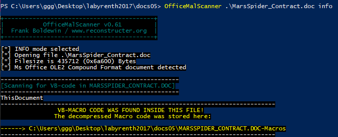
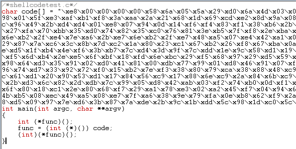
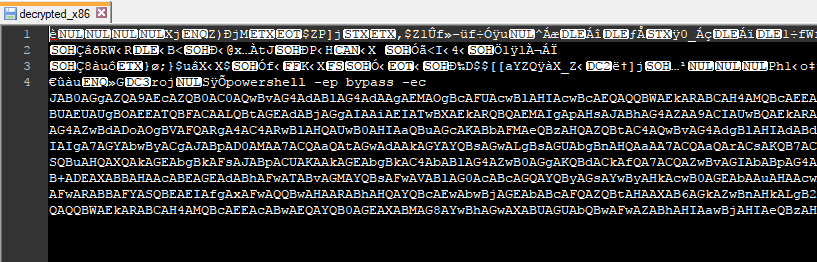
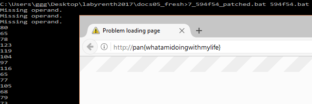
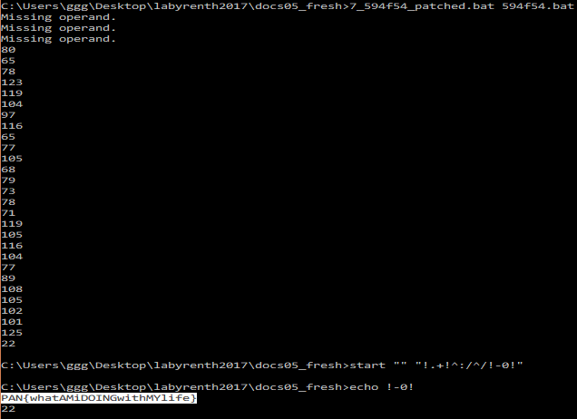

## LabyREnth CTF 2017
# Document 5 : MarsSpider

We are provided with a doc file. 

The VBA macros inside MarsSpider_Contract.doc is password protected.
- Password protected vba macros are not encrypted, just denied access.
- There are ways to bypass it

It can be bypass by using OfficeMalScanner or manually using the following steps
- Open the file with a hex editor. (e.g. hexedit.exe from http://www.physics.ohio-state.edu/~prewett/hexedit/)
- Search for "DPB"
- Replace "DPB" to "DPx" (or any other String)
- Save file.
- Open file in Office.
- Click "Yes" if you get any message box.
- Set new password from VBA Project Properties.
- Close and open again file, then type your new password to unprotect.

I used OfficeMalScanner as it is more straight forward.



The "ThisDocument" vb code contains 2 important parts
- Huge chunk of base64-encoded text. (**cGlsbHM**)
    - Base64-decode it and save it as the file **rise**
- Chunk of Ascii Hex (**YW5k**)

```vb
For ZW5naW5lcw = 0 To cHV0 - 1 ' This loop decodes the ascii hex into its binary form
    If ZW5naW5lcw = 0 Then
        Q2hlY2s = ZW5naW5lcw + 1
    Else
        Q2hlY2s = ZW5naW5lcw * 2 + 1
    End If
    aWduaXRpb24 = Mid(YW5k, Q2hlY2s, 2)
    aGVsbWV0(ZW5naW5lcw) = Val("&H" & aWduaXRpb24)
Next

b24 = R3JvdW5k(Y291bnRkb3duLA, &H5000, &H1000, &H40)    ' VirtualAlloc
Q29udHJvbA ByVal b24, aGVsbWV0(0), UBound(aGVsbWV0) + 1 ' RtlMoveMemory
bWF5 = dG8(Q29tbWVuY2luZw, b24, Y291bnRkb3duLA)         ' Enumerate Loaded Modules, using the loaded binary as a callback function
```

The above code converts the Ascii Hex String into its binary form and assign it as a callback function
- This means they are instruction bytes
- Convert the AsciiHex into binary and save as file **rawx86**

[1_extract_ThisDocumentMacroFiles.php](1_extract_ThisDocumentMacroFiles.php) will decode both these chunks into their respective files

### Breaking Apart rawx86

Let's try to debug **rawx86** to find out what these instruction bytes do
- Download shellcodetest.c from www.vividmachines.com/shellcode/shellcodetest.c
- Use [2_convert2cbytecode.php](2_convert2cbytecode.php) to convert **rawx86** into a string
- Put the string into shellcodetest.c
- Compile and build shellcodetest.c (I used lccwin to compile it on Windows)
- This will produce an executable that can be run and debugged from.



Debug it using your favorite debugger (I used x64dbg)

Debugging the executable reveals that this code is a self-modifying code. It decrypts itself and executes the decrypted code.

I reimplemented the decryption code in [3_self_decrypt.php](3_self_decrypt.php)
- It will produce a binary file "decrypted_x86" which you can throw into IDA Pro to disassemble.

```php
$raw = file_get_contents('rawx86');
$enc = substr($raw,0x4d);

$out = substr($raw,0,0x4d);

for ($i=0; $i<strlen($enc); $i+=2){
    $w1 = substr($enc,$i,2);
    $w2 = substr($enc,$i+2,2);
    $xored = $w1 ^ $w2;
    $out .= $xored;
}

file_put_contents('decrypted_x86',$out);
```

Reversing the assembly code reveals what it does
- Decrypts itself
- Finds the WinExec function and calls it with a String
  - String is revealed in **decrypted_x86** (Just open it in a text editor)



> powershell -ep bypass -ec JAB0AGgAZQA9AEcAZQB0AC0AQwBvAG4AdABlAG4AdAAgAEMAOgBcAFUAcwBlAHIAcwBcAEQAQQBWAEkARABCAH4AMQBcAEEAcABwAEQAYQB0AGEAXABMAG8AYwBhAGwAXABUAGUAbQBwAFwAcgBpAHMAZQAuAHQAeAB0ADsAaQBmACgAJABFAG4AdgA6AEMATwBNAFAAVQBUAEUAUgBOAEEATQBFACAALQBtAGEAdABjAGgAIAAiAEIATwBXAEkARQBQAEMAIgApAHsAJABhAG4AZAA9ACIAUwBQAEkARABFAFIAUwBGAFIATwBNAE0AQQBSAFMAIgB9ADsAJABmAGEAbABsAD0AKABbAFMAeQBzAHQAZQBtAC4AVABlAHgAdAAuAEUAbgBjAG8AZABpAG4AZwBdADoAOgBVAFQARgA4AC4ARwBlAHQAUwB0AHIAaQBuAGcAKABbAFMAeQBzAHQAZQBtAC4AQwBvAG4AdgBlAHIAdABdADoAOgBGAHIAbwBtAEIAYQBzAGUANgA0AFMAdAByAGkAbgBnACgAJAB0AGgAZQApACkAKQA7ACQAZwBvAGIAbABpAG4AawBpAG4AZwA9ACIAIgA7AGYAbwByACgAJABpAD0AMAA7ACQAaQAtAGwAdAAkAGYAYQBsAGwALgBsAGUAbgBnAHQAaAA7ACQAaQArACsAKQB7ACQAZwBvAGIAbABpAG4AawBpAG4AZwArAD0AWwBjAGgAYQByAF0AKABbAEkAbgB0AF0AJABmAGEAbABsAFsAJABpAF0ALQBiAHgAbwByAFsASQBuAHQAXQAkAGEAbgBkAFsAJABpACUAKAAkAGEAbgBkAC4AbABlAG4AZwB0AGgAKQBdACkAfQA7ACQAZwBvAGIAbABpAG4AawBpAG4AZwAuAFMAdQBiAHMAdAByAGkAbgBnACgAMAAsADUAMAAyADMAMwApAD4APgBDADoAXABVAHMAZQByAHMAXABEAEEAVgBJAEQAQgB+ADEAXABBAHAAcABEAGEAdABhAFwATABvAGMAYQBsAFwAVABlAG0AcABcAGQAYQByAGsAYwByAHkAcwB0AGEAbAAuAHAAcwAxADsAJABnAG8AYgBsAGkAbgBrAGkAbgBnAC4AUwB1AGIAcwB0AHIAaQBuAGcAKAA1ADAAMgAzADMAKQA+AD4AQwA6AFwAVQBzAGUAcgBzAFwARABBAFYASQBEAEIAfgAxAFwAQQBwAHAARABhAHQAYQBcAEwAbwBjAGEAbABcAFQAZQBtAHAAXAB6AGkAZwBnAHkALgB2AGIAcwA7ACYAIABwAG8AdwBlAHIAcwBoAGUAbABsACAALQBlAHAAIABiAHkAcABhAHMAcwAgAC0AYwAgAEMAOgBcAFUAcwBlAHIAcwBcAEQAQQBWAEkARABCAH4AMQBcAEEAcABwAEQAYQB0AGEAXABMAG8AYwBhAGwAXABUAGUAbQBwAFwAZABhAHIAawBjAHIAeQBzAHQAYQBsAC4AcABzADEA

Base64-Decoding the powershell command reveals the following

```bash
$the=Get-ContentC:\Users\DAVIDB~1\AppData\Local\Temp\rise.txt;
if($Env:COMPUTERNAME-match"BOWIEPC"){$and="SPIDERSFROMMARS"};
$fall=([System.Text.Encoding]::UTF8.GetString([System.Convert]::FromBase64String($the)));
$goblinking="";
for($i=0;$i-lt$fall.length;$i++){$goblinking+=[char]([Int]$fall[$i]-bxor[Int]$and[$i%($and.length)])};
$goblinking.Substring(0,50233)>>C:\Users\DAVIDB~1\AppData\Local\Temp\darkcrystal.ps1;
$goblinking.Substring(50233)>>C:\Users\DAVIDB~1\AppData\Local\Temp\ziggy.vbs;
&powershell-epbypass-cC:\Users\DAVIDB~1\AppData\Local\Temp\darkcrystal.ps1
```

It shows us how to decrypt the base64-encoded chunk **rise** at the beginning

I reimplemented the decryption code in [4_extract_powershell.php](4_extract_powershell.php).  
It will decrypt the data and writes out its 2 output (**darkcrystal.ps1** and **ziggy.vbs**)

```php
// Base64-decode rise.txt then xor-decrypt it with the key "SPIDERSFROMMARS";
$rise = file_get_contents('rise'); // already base64-decoded
$key = "SPIDERSFROMMARS";
$out = "";
for($i=0; $i<strlen($rise); $i++){
    $cur = ord($rise[$i]);
    $k = ord($key[($i % strlen($key))]);
    $out .= chr($cur ^ $k);
}

// Split the result into 2 files
$darkcrystal = substr($out,0,50233);
$ziggy = substr($out,50233);

file_put_contents("darkcrystal.ps1",$darkcrystal);
file_put_contents("ziggy.vbs", $ziggy);
```

### Breaking Apart darkcrystal

darkcrystal.ps1 is a Powershell script. It does the following
- Gets the User Domain of the system through "(Get_WmiObject Win32_ComputerSystem).Domain"
- The Domain is used as a key to perform decryption.
- The decrypted bytes **bowiealbum** is passed to the following command

> ("{0}{2}{1}"-f$bowiealbum[4],"x",$bowiealbum[-4]) ($bowiealbum)

- The above runs an unknown command against the whole $bowiealbum string
- The unknown command is 3 letter long and ends with an "x"
- Looking through https://ss64.com/ps/, the only command that fit is "iex"
  - "iex" is similar to eval where it just executes the string that it is passed.

I looked through all the various files to try and find the User Domain to no avail.

However, if we look at how the Domain String ($bowielyric) is used as a key

```bash
$z=([Int](((2016-[Int]$bowielyric[1])*2)/70-47));   
$i=([Int](([Int]$bowielyric[3]+1983)/420-1));           
$g=([Int](((1970/[Int]$bowielyric[5])*9)-207));         
$y=([Int](([Int]$bowielyric[5]*1969)/(278/2)/(200)-5));
```
Only 3 bytes is used. Also we know that the returned DOMAIN string is always in upper-case alphabets.  
This means it can be brute-forced.

I modified **darkcrystal.ps1** to prepare for brute-force ([darkcrystal_patched.ps1](darkcrystal_patched.ps1))
- Takes a passed in argument as key instead of getting it from UserDomain

```bash
param([string]$lyrics='xxxxxx')
$bowielyric=$lyrics;
Write-Output $bowielyric;
```
- Prints out the 3-character cmd into "pscmd.txt" (for PHP to check that it is "iex")

```bash
$newcmd=("{0}{2}{1}"-f$bowiealbum[4],"x",$bowiealbum[-4]);
Write-Output $newcmd;
$newcmd|Out-File "pscmd.txt";
```
- Prints out the decrypted command into "bowie.txt"

```bash
$bowiealbum|Out-File "bowie.txt";
```

I wrote [5_brutedomain.php](5_brutedomain.php) to brute force the domain.

```php
for ($a=ord('A'); $a<=ord('Z'); $a++){
    for ($b=ord('A'); $b<=ord('Z'); $b++){
        for ($c=ord('A'); $c<=ord('Z'); $c++){
            $domain = 'x'.chr($a).'x'.chr($b).'x'.chr($c);
            passthru("powershell -ep bypass -file darkcrystal_patched.ps1 $domain");
            
            $res = file_get_contents('pscmd.txt');
            $res = trim(substr($res,2));
            $res = str_replace("\x00","",$res);
            if (strcmp($res, "iex") === 0){
                echo "FOUND!! Domain is $domain\n";
                die();
            }
        }
    }
}
```

The domain string "xJxAxU" worked. Decrypted command is

```bash
[Environment]::SetEnvironmentVariable("HWID","093-75115-37124-50142-30110-87150-78116-83115-81124-51121-50114-67145-51139-47130","User");
Clear-EventLog "Windows PowerShell"
```

Take note of the **HWID** value. It will be used in the next part.

Let's go on the **ziggy.vbs**

### Breaking Apart ziggy

**ziggy.vbs** is obfuscated. After deobfuscation, this is what the code does
- Determines which set of xor keys to use due to available modules. (Only 2 possible sets)
- Create a dictionary which will be used in a dictionary xor decryption. (4 possible ways to create)
  - Reads in a string from registry "...MOVDATA".
    - This registry was populated in the beginning by **ThisDocument**'s macro code.
      - In consists of a DateTime string followed by 1 of 2 possible strings
      - The DateTime string is in the format "MM/DD/YY HH:MM:SS *M"
      - The correct DateTime string can be retrieved from the word document's content
        - The DateTime when the document was written ("3/24/2017 10:17:12 AM")
  - The string is passed to the decryption function straight or reversed (hence 4 possible ways)
- 2156 bytes is extracted from the original "MarsSpider_Contract.doc" file and decrypted using the xorkey and dictionary
- The decrypted bytes are stored in 594f54.bat and run using the follwing command
  - %COMSPEC% /c y: && Y:\594f54.bat 594f54.bat
    - %COMSPEC% /c y: 
      - change current drive to Y:
    - && Y:\594f54.bat 594f54.bat
      - Execute 594f54.bat with the argument "594f54.bat" (**This is important!!**)

I re-implemented the decryption algorithm in [6_extract_ziggy.php](6_extract_ziggy.php)  
I used it to test which combination of xorkeys and dictionary is the correct one.  
The following configuration will correctly decrypt **594f54.bat**

```php
$binary = array("000000","000001","000010","000011","000100","000101","000110","000111","001000","001001","001010","001011","001100","001101","001110","001111","010000","010001","010010","010011","010100","010101","010110","010111","011000","011001","011010","011011","011100","011101","011110","011111","100000","100001","100010","100011","100100","100101","100110","100111","101000","101001","101010","101011","101100","101101","101110","101111","110000","110001","110010","110011","110100","110101","110110","110111","111000","111001","111010","111011","111100","111101","111110","111111");

// Create xorkeys (2 possible sets, choose to use 1)
$xorkeys1 = array(82,77,65);
$xorkeys2 = array(77,65,82);
$xorkeys = $xorkeys2;

// Create Dictionary (2 possible set, can be used straight or reversed hence 4 possible ways)
$enc1 = "111,49,83,6,61,53,73,91,1,128,57,8,110,111,101,114,101,40,99,90,60,113,112,70,11,116,71,77,123,32,110,5,52,106,28,20,106,111,47,93,82,31,27,109,38,56,118,6,96,37,32,94,42,118,118,9,56,94,103,43,12,3,123,128";
$enc2 = "31,1,109,69,0,116,109,97,4,5,116,87,91,85,96,91,3,123,12,118,3,124,111,23,81,101,22,80,2,12,15,7,124,10,66,111,101,70,85,118,66,25,106,18,16,72,11,71,30,22,120,7,70,2,119,19,2,106,9,79,25,72,3,11";
//$dict = xorDict(strrev($enc2))."\n";
//$dict = xorDict_orig("5/4/2017 12:57:53 AM".$enc1);
$dict = xorDict_orig("3/24/2017 10:17:12 AM".$enc2);
echo "Dict: $dict\n";

$enc = file_get_contents("MarsSpider_Contract.doc");
$enc = substr($enc,(0x41c6c-29-0xae)-1,2156);
//echo $enc."\n";

$plain = "";
for ($i=0 ;$i<strlen($enc); $i+=4){
    $cur = substr($enc,$i,4);
    
    $tmp1 = "";
    for ($k=0; $k<4; $k++){
        if (ord($cur[$k]) == 61){ // "="s
            $tmp1 .= "00000000";
        }
        else{
            $pos = strpos($dict,$cur[$k]);
            $tmp1 .= $binary[$pos];
        }
    }
    
    $val = array(128,64,32,16,8,4,2,1);
    
    $part1 = substr($tmp1,18,6) . substr($tmp1,6,2);
    $tmp = 0;
    for ($p=0; $p<strlen($part1); $p++){
        if (ord($part1[$p]) == 0x31) $tmp += $val[$p];
    }
    $plain .= chr($tmp ^ $xorkeys[0]);
    
    $part2 = substr($tmp1,8,8);
    $tmp = 0;
    for ($p=0; $p<strlen($part2); $p++){
        if (ord($part2[$p]) == 0x31) $tmp += $val[$p];
    }
    $plain .= chr($tmp ^ $xorkeys[1]);
    
    $part3 = substr($tmp1,16,2).substr($tmp1,0,6);
    $tmp = 0;
    for ($p=0; $p<strlen($part3); $p++){
        if (ord($part3[$p]) == 0x31) $tmp += $val[$p];
    }
    $plain .= chr($tmp ^ $xorkeys[2]);
}

//echo $plain."\n";
file_put_contents("594f54.bat",$plain);

function xorDict($timestamp, $input){
    //$msg = substr($input,21,195);
    $msg = $input; 
    echo $msg."\n";
    $key = substr($timestamp,0,9);
    echo $key."\n";
    $msgparts = explode(',',$msg);
    $out = "";
    
    for ($i=0; $i<count($msgparts); $i++){
        $cur = (int) $msgparts[$i];
        //echo $cur."\n";
        $xored = $cur ^ ord($key[($i % strlen($key))]);
        $out .= chr($xored);
    }
    
    return $out;
}

function xorDict_orig($input){
    $msg = substr($input,21,195);
    echo $msg."\n";
    $key = substr($input,0,9);
    echo $key."\n";
    $msgparts = explode(',',$msg);
    $out = "";
    
    for ($i=0; $i<count($msgparts); $i++){
        $cur = (int) $msgparts[$i];
        //echo $cur."\n";
        $xored = $cur ^ ord($key[($i % strlen($key))]);
        $out .= chr($xored);
    }
    
    return $out;
}
```

### Breaking Apart 594f54

This is **594f54.bat**

```bat
@ECHO OFF
SETLOCAL EnableDelayedExpansion
SeT chr(*@)=%~fs1
fOr %%a In ("%chr(*@)%") Do (
sEt ?=%%~da
seT @OFF=%%~na
sEt ?=!?:~0,1!
Set {}=%%~za
set float{10.4}=dBo
)
SEt PATHEXTS=PATHEXT
iF "%?%" == "Y" CAll :EXIT 
iF %__Office__.return% == 10 (
s%NULL:~9,1%T HWI%NULL:~0,1%_COOKIE=1617
) ElsE (
S%NULL:~9,1%t HWI%NULL:~0,1%_COOKIE=1546
)
FoR /f "tokens=*" %%a in ('f^in^dstr^^^ "HWID"^^ %__Office__.load%') DO (
seT __XML.RTF=%%a
If !HWID_COOKIE! neq !{}! (
set /a "__XML.RTF=!__XML.RTF:~15,2!-(!{}!/115)"
) eLse (
sET /a "__XML.RTF=!__XML.RTF:~15,2!+(!{}!/115)"
)
)
SET /a __Office__.return-=10
For /L %%a iN (0,1,%__XML.RTF%) dO (
if %%a == 0 (
sEt "PATHEXTS[%%a]=!HWID:~1,2!"
) ElSe (
FoR %%# iN (!__Office__.return!) Do (
set "PATHEXTS[%%a]=!HWID:~%%#,3!"
SeT .+=%PATHEXTS:~3,1%%PATHEXTS:~2,1%%PATHEXTS:~6,1%%PATHEXTS:~0,1%
)
)
SET /a "__Office__.return+=3"
)
:: note self! 0x13 for HWID_COOKIE
fOr /L %%a in (0, 1, %__XML.RTF%) do (
sEt /a ARG[$1] = %%a %% 2
iF !ARG[$1]! == 0 (
CAll :' %%a -0 4
)
If !ARG[$1]! == 1 (
CAll :' %%a +0 2
)
cmd /c eXiT /b !errorlevel!
sEt "-0=!-0!!=ExitCodeAscii!"
)
@eCHo ON
s^t^a^r^t "" "!.+!^:/^/!-0!"
!-0!
@echO OFF
:'
For %%# iN (%3) dO (
Set /a "?=(!PATHEXTS[%1]!%2x!@OFF:~0,2!)^^0x!@OFF:~%%#,2!"
)
EXiT /b %?%
:EXIT
set NULL=%USERNAME%
iF %float{10.4}% == %NULL:~4,3% (
sET float{10.4}=dBo.fn_EscapeDosCharacters
sEt __Office__.return=0
Set "[\]=!NULL!@"
:*
SET [\]=![\]:~1!
seT /a "__Office__.return+=1"
if nOt "%[\]%" == "@" GOtO *
set __Office__.load=%chr(*@)%
)
exIT /b %__Office__.load%
:END
eXit
```

Windows Batch (bat) scripting is very free form.  
All characters except ":" and "=" can be used as a variable name.  
Hence, **594f54.bat** is incredibly confusing to read.
- Alot of what we think are special functions or constructs are actually just variable names

**594f54.bat** does the following
- Stores the Drive letter, Shortened-FullPath, Filename and Filesize of the first argument file
  - which in this case is the bat script itself
- Checks that the USERNAME env variable is 10 chars long and its 4-6 chars is "dBo"
  - Guessed it was "DavidBowie" from the contents of the word documents
- Decrypts a URL based on the 2 following information
  - HWID env variable as encrypted data (This was set by **darkcrystal.ps1**)
  - Filename as xor keys
- Url is launched using a "start http://<URL>.com"

I patched **594f54.bat** to perform the decryption (to [7_594f54_patched.bat](7_594f54_patched.bat))
- Hardcoded detected filesize to 1617
- Hardcoded detected drive letter to Y
- Hardcoded detected Username to DavidBowie
- Added in HWID gotten from darkcrystal.ps1

Run the batch script with the following command (In Windows obviously)
- The argument needs to be the unaltered batch file and in that exact name

> 7_594f54_patched.bat 594f54.bat

The batch script will run and launch a browser going to a familiar looking URL



The actual flag (in correct case order) should be in your command prompt



The flag is **PAN{whatAMiDOINGwithMYlife}**