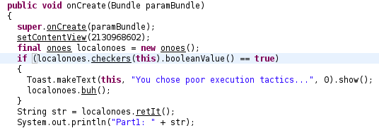
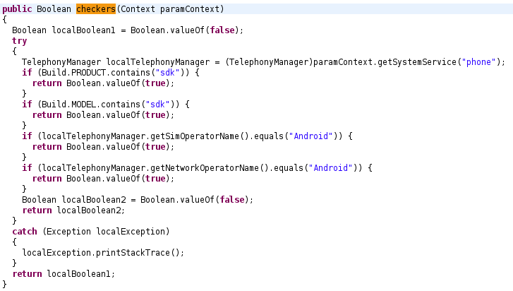
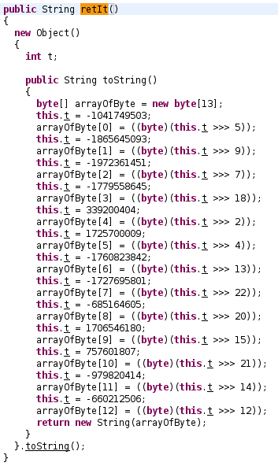
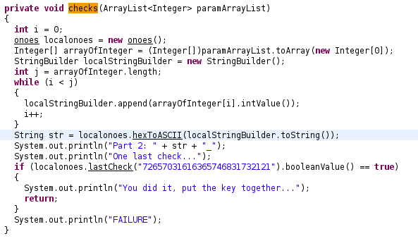
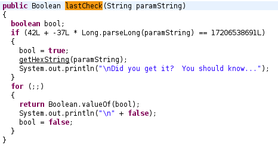

## LabyREnth CTF 2017
# Mobile 1 : EzDroid

We are provided with an APK. 

I solved this challenge mainly through static analysis. So there is no need to run this in a emulator.

Let's decompile it for JD-GUI first.

> unzip the apk

> d2j-dex2jar.sh classes.dex

> jd-gui classes-dex2jar.jar

Looking through the classes, EzMain seems to be the main Acitivity class. (This can be confirmed by decompiling using apktool to retrieve the AndroidManifest file.)

Following the code starting from the onCreate function will reveal what it is doing.



It first calls the checkers function and exits if it returns true



This function contains Anti-Emulator checks. Returns true if it detects it is running inside an emulator

Once the checks are passed, it calls the "retIt" function



This function basically performs some arithmetic shifting and transforms the resulting bytes into a String

I reimplmented this into PHP

```php
$part1 = array(); // length 13
$t = -0x3e17d5ff;
$part1[0] = logical_right_shift($t, 5) & 0xff;
$t = -0x6f337c25;
$part1[1] = logical_right_shift($t, 9) & 0xff;
$t = -0x758fd8eb;
$part1[2] = logical_right_shift($t, 7) & 0xff;
$t = -0x6a11e8f5;
$part1[3] = logical_right_shift($t, 0x12) & 0xff;
$t = 0x1437c994;
$part1[4] = logical_right_shift($t, 2) & 0xff;
$t = 0x66dc17a9;
$part1[5] = logical_right_shift($t, 4) & 0xff;
$t = -0x68f40a22;
$part1[6] = logical_right_shift($t, 0xd) & 0xff;
$t = -0x66fa8bb9;
$part1[7] = logical_right_shift($t, 0x16) & 0xff;
$t = -0x28d6c83d;
$part1[8] = logical_right_shift($t, 0x14) & 0xff;
$t = 0x65b7d404;
$part1[9] = logical_right_shift($t, 0xf) & 0xff;
$t = 0x2d28160f;
$part1[10] = logical_right_shift($t, 0x15) & 0xff;
$t = -0x3a66df7e;
$part1[11] = logical_right_shift($t, 0xe) & 0xff;
$t = -0x275a0b1a;
$part1[12] = logical_right_shift($t, 0xc) & 0xff;

$p1 = "";
for ($i=0; $i<count($part1); $i++){
	$p1 .= chr($part1[$i]);
}
echo "Part 1: $p1 \n";
```

Running the above code gives the following

> Part 1: PAN{ez_droid_

The code then asks the user for a series of inputs (12 of them)  
Accompanying each input is a hint. The user just have to follow these hints and type in the correspoding digit.  
The 12 inputs are concatenated and treated as a Hex String and converted to a normal String.  
This is done in the first part of the "checks" function



I reimplemented the second part into PHP as follows

```php
part2 = "";
$part2 .= '3'; // "two plus one"
$part2 .= '2'; // "one plus one"
$part2 .= '7'; // "five plus two"
$part2 .= '3'; // "three plus zero"
$part2 .= '7'; // "nine minus two"
$part2 .= '4'; // "two plus two"
$part2 .= '6'; // "three plus three"
$part2 .= '1'; // "eleven minus ten"
$part2 .= '7'; // "negative two plus nine"
$part2 .= '2'; // "one plus one"
$part2 .= '7'; // "five plus two"
$part2 .= '4'; // "three plus one"

$p2 = "";
for ($i=0; $i<strlen($part2); $i+=2){
	$p2 .= chr(hexdec(substr($part2,$i,2)));
}
$p2 .= "_";
echo "Part 2: $p2 \n";
```

Running it gives

> Part 2: 2start_

Now comes the most difficult part of this challenge.

In the last part of the "checks" function, it calls the lastCheck function with the argument "72657031616365746831732121"  
Actually running it with that input will crash as it is too large to fit in a Long Variable.  
Also converting that input as a Hex string gives the string "rep1aceth1s!!"

Let's look at the lastcheck function



It checks if an arithmetic comparison is satisfied and returns true if so.

Let x be our input and this is the arithmetic comparison

> 42 - 37x = 17206538691

Solving for x normally does not work as our input is then passed into the "GetHexString" function

```java
public void getHexString(String paramString)
  {
    String str = hexToASCII("" + 
    paramString.charAt(14) + 
    paramString.charAt(3) + 
    paramString.charAt(14) + 
    paramString.charAt(11) + 
    paramString.charAt(5) + 
    paramString.charAt(4) + 
    paramString.charAt(14) + 
    paramString.charAt(13) + 
    paramString.charAt(19) + 
    paramString.charAt(6) + 
    paramString.charAt(14) + 
    paramString.charAt(13) + 
    paramString.charAt(14) + 
    paramString.charAt(1) + 
    paramString.charAt(14) + 
    paramString.charAt(14) + 
    paramString.charAt(14) + 
    paramString.charAt(1) + 
    paramString.charAt(14) + 
    paramString.charAt(11) + 
    paramString.charAt(5) + 
    paramString.charAt(13));
    System.out.println("Final Part: " + str + "}");
  }
```

Looking at this code, our input (x) needs to be at least 20 digits long. (There is one line accessing index 19)  
Also take note index 0 is not used to create the String. This led me to believe that index 0 contains the negative sign '-'

If x is at least 20 digits long and it is multiplied by 37, it will most likely not fit in a Java Long variable.  
This is actually about Integer Overflows. There are multiple possibilities for x.  
Lets re-write the equation from before

> -37x = (17206538691 - 42)

I assumed that x is negative, therefore the resulting multiplication will result in a overflow rather than an underflow.  
Also, with that assumption, we can remove the negative sign from "-37" to further simplify the calculation

> 37x = 17206538649

Java Long variables are represented as signed 64-bit numbers. Therefore the equation we are actually trying to solve is

> 37x mod 2^64 = 17206538649

I believe you could then calculative the multiplicative inverse and solve using mathematical way.  
However, I used a more brute-force way.

Let's talk about what happens when a Java Long overflows.  
When you add 1 to MAX_LONG, it wraps around to MIN_LONG  
Therefore, for it to overflow once to the target number, the minimum amount is

> MAX_LONG + (0 - MIN_LONG + 1) + Target

The "+1" is to include the "0" value too.  
Target is our target number of 17206538649

> 9223372036854775807 + (0 - -9223372036854775808 + 1) + 17206538649

> 9223372036854775807 + 9223372036854775809 + 17206538649

> 2^64 + 17206538649

You can simply add 2^64 to this number to calculate for any subsequent overflows.

My approach is to find out how many overflows is needed to produce a number that is divisable by 37.  
This is because our input "x" must be a whole number to be able to be parsed into a Long.

I wrote [find.php](find.php) to perform this bruteforce.

```
Overflow: 18446744090916090265 
	11: hard2defeat (-5982727808154625893 : 20) 
	48: DA�FFBDBA� (-24429471881864177509 : 21) 
	85: 85g7"74345g (-42876215955573729125 : 21) 
```

Running it shows that with 11, 48 or 85 overflows, the number produced is divisable by 37.  
However, with 11 overflows, it will also produce a readable output when passed through the "HexString" function too.

Therefore, the third part of the key is "hard2defeat"

[soln.php](soln.php) combines all 3 parts and produces the final flag

The flag is **PAN{ez_droid_2start_hard2defeat}**