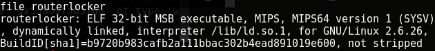
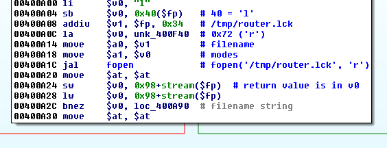
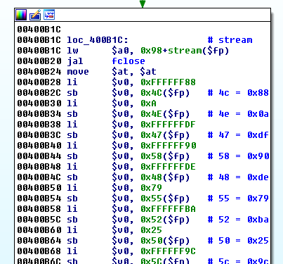
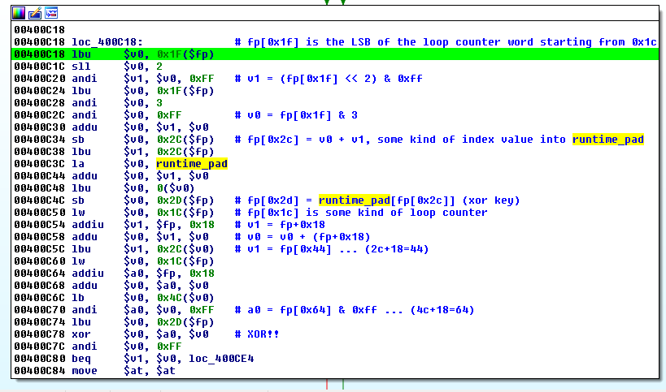
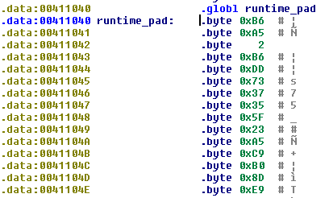
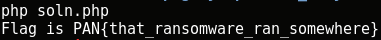

## LabyREnth CTF 2017
# Mobile 2 : RouterLocker

We are given a MIPS ELF binary



You could try to run it in a emulator like Qemu or something similar.  
But this program is actually quite straightforward to just use static analysis

This is what the program does



Tries to find the file "/tmp/router.lck".  
Exits the program if the file is not present


It then opens and reads the file and checks that it is 0x1d characters long.  
Exits the program if the length is not correct



It then initializes an encrypted string which is the encrypted flag.  
Afterwhich, it begins the decryption routine.



It is some kind of Dictionary Xor algorithm.  
It uses the loop counter to generate an index.  
The index is then used to grab a byte from a dictionary.  
The byte is xored with the encrypted character.  
It can be summarized into the following php code

```php
$msg = "";
for ($i=0; $i<count($enc); $i++){
    $tmp1 = ($i << 2) & 0xff;
    $tmp2 = ($i & 3) & 0xff;
    $index = $tmp1 + $tmp2; // calculate a index from the counter value
    $key = $dict[$index];   // get the key byte from runtime_pad
    $msg .= chr($key ^ $enc[$i]); // perform xor against the encrypted char
}
```

The dictionary is named "runtime_pad" in the IDA Pro output.  



I extracted this "runtimepad" array and reimplemented all the logic into this [php script](soln.php)

```php
<?php
/*
fp[0x34 - 0x42] = "/tmp/router.lck"
fp[0x64 - 0x81] = licenseKey - plain flag
fp[0x44 - 0x60] = encrypted flag
runtimepad = key dictionary
*/

$runtimepad = "B6A502B6DD7337355F23A5C9B08DE9AB81A3DF0C80AFB47D6379F45C4F1613C3FBBE5E30222E82661BDE67C1994CBE2344B47BF5E72C4169D178DFDB455BCF497407138F4018E7E6CEFA5637FC743381E3DCA40C448057BA3EF9D9A7B45ECDA5EB445BEF46F35B6DCFE038A7C7B86A1816E1C5031E1852DE84F627F0602D274B";
$dict = array();
for ($i=0; $i<strlen($runtimepad); $i+=2){
    $cur = substr($runtimepad,$i,2);
    $dict[] = hexdec($cur);
}

$enchex = "c21bc4dfdedd95ad88410a54255eba16067938de90efb4c09c9b5d6a73";
$enc = array();
for ($i=0; $i<strlen($enchex); $i+=2){
    $cur = substr($enchex,$i,2);
    $enc[] = hexdec($cur);
}

$msg = "";
for ($i=0; $i<count($enc); $i++){
    $tmp1 = ($i << 2) & 0xff;
    $tmp2 = ($i & 3) & 0xff;
    $index = $tmp1 + $tmp2; // calculate a index from the counter value
    $key = $dict[$index];   // get the key byte from runtime_pad
    $msg .= chr($key ^ $enc[$i]); // perform xor against the encrypted char
}

echo "Flag is PAN{".$msg."}\n";
?>
```

Running it will decrypt the encrypted flag.



The flag is **PAN{that_ransomware_ran_somewhere}**