## LabyREnth CTF 2017
# Mobile 4 : AndroidPAN

We are provided a PNG image.

Look at the picture in a Hex Editor and scroll to the end.  
The end has strings that look like filepaths. This looks very similar to a ZIP format.


Go back to the start and start searching for "PK" header.  
The third hit at offset 0x21a70 seems like a valid ZIP Header.

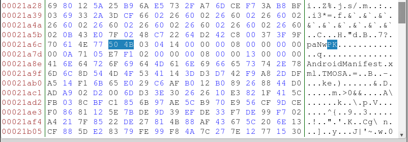

As I can see the filename "AndroidManifest.xml", I believe this is actually an APK.  
Delete everything before the "PK" header and save it as "panw.apk"

### PANW.apk

Decompile it using jd-gui or apktool

```bash
apktool d panw.apk
```

```bash
unzip -d panw_jd panw.apk
cd panw_jd
d2j-dex2jar classes.dex
jd-gui classes-dex2jar.jar
```

jd-gui failed to decompile some parts of the code.  
This means we have to read smali code from apktool instead.

The app starts in the MyApplication.smali class. Just follow the function calls from there.

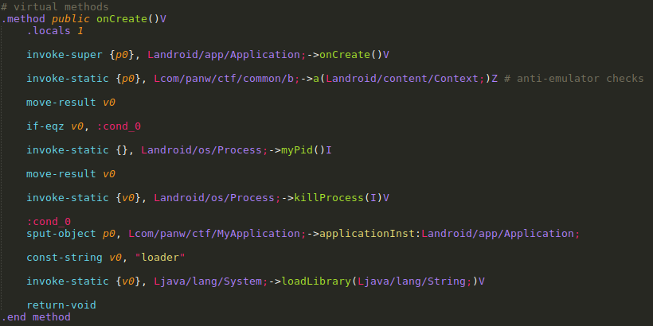

This is what the App does.
- It first performs several anti-emulator checks. Kiils the app if any of the check fails.
  - Reads in an asset "emu_files" and checks if any of the filepath in there exists
  - Checks if the Build.Device or Build.Board property is "generic"
  - Checks if the Phone number is the default one used in Android Emulator
- If all checks passed, it then loads a library name "loader"
  - which would be stored as "libloader.so" on disk
  - This library is located in the "libs/\<arch\>/" folder
    - There are 2 versions of the library, an x86 and an ARM version
    - For ease, we will use the x86 version

Copy "libs/x86/libloader.so" out and put it in IDA Pro

### libloader.so

The entry point is in the "JNI_OnLoad" function

Looking at the code, it seems to be creating several strings.  
Looking at these strings, it looks to be mainly filepaths and Smali method signatures.  
I did not debug this library as these strings are sufficient to guess what it is trying to do  
Below are some examples

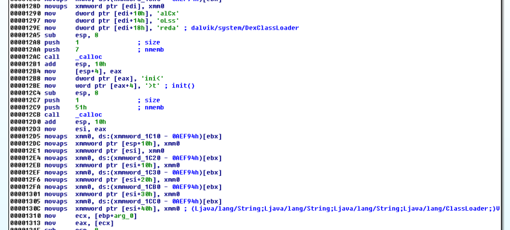

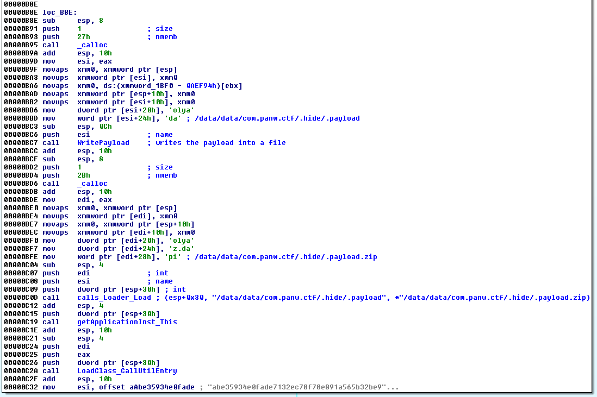

This is what it does
- Creates a "/data/data/com.panw.ctf/.hide" directory
- Writes a file at "/data/data/com.panw.ctf/.hide/.payload"
  - File content is stored at offset 0x23b5 of the binary.
- Calls Android Function "com/panw/ctf/common/Loader-\>load(Ljava/lang/String;Ljava/lang/String;Ljava/lang/String;)V"
  - With 3 parameters
    - "G0PAl0aLtOPaNw&%"
    - "/data/data/com.panw.ctf/.hide/.payload"
    - "/data/data/com.panw.ctf/.hide/.payload.zip"

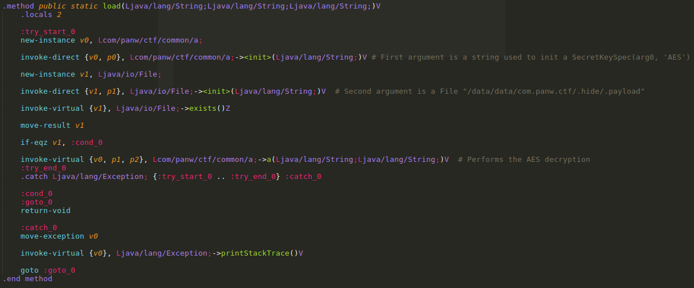

  - This function is declared back in the Android App and does the following
    - Initialize an AES Cipher using the first argument "G0PAl0aLtOPaNw&%" as a key.
      - It does not specify exactly which AES cipher mode is used.
      - Looking at the size of the key, it would be a 128-bit cipher
    - Decrypts the file specified by the 2nd argument "/data/data/com.panw.ctf/.hide/.payload"
    - Write the decrypted contents into the file specified by the 3rd argument "/data/data/com.panw.ctf/.hide/.payload.zip"
- Once the file as been loaded, it calls the following method
  - com.panw.ctf.Util-\>entry(Landroid/app/Application;Ldalvik/system/DexClassLoader;)V

Let's extract the encrypted ".payload" file first  
Open libloader.so in a Hex Editor and copy out all the bytes starting from 0x23b5 into a tmp file "payload.bin"

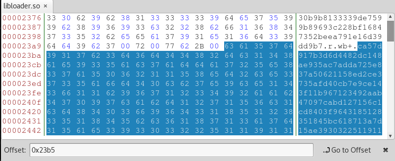

As I do not know which AES cipher mode is used. I wrote a script [1_decrypt_payload.php](1_decrypt_payload.php) to try the possible modes.  
At last, "aes-128-ecb" worked.  

```php
$key = strrev("%&wNaPOtLa0lAP0G");
$data = file_get_contents('payload.bin');
$plain = openssl_decrypt($data, "aes-128-ecb", $key, OPENSSL_RAW_DATA);
file_put_contents('payload.zip',$plain);
```

The script will decrypt the contents in "payload.bin" and writes the result out to "payload.zip"

This zip file contains a "classes.dex" file and an asset folder with 3 files
- .checker
- .checkerx
- .flag

The "classes.dex" file contains more Android code.  
Decompile it using apktool

```bash
apktool d payload.zip
```

### payload.zip

Start analyzing the code from Util->entry method
- All strings in this apk is base64-encoded.
- Overwrites the base ClassLoader with com/panw/ctf/c

Continue analysis from EntryActivity
- Reads in the assets ".checker" and ".checkerx" into a Hashmap
- Read in the input from an EditText element and checks it
  - 12 characters long (0xc length)
  - Starts with "PAN"
  - Looks like a flag :)
- Writes a ".flag.png" file to disk
  - Should be the ".flag" file inside the asset folder


  - This picture is a QRCode.
  - Decoded results seems to be some kind of encrypted text.
    - "3;:j>99j2??38=9n3o:i?:;9>><<9<28i>>j>;hoi<>;om>=2njiiojm9hi:;23="
- Based on the CPU architecture, decrypts the appropriate "checker" file
  - if x86, decrypts ".checkerx"
  - else, decrypts ".checker" (this is ARM version)
- Decryption is done with the same type of AES cipher with the key "Pal0aLtoN3TwOrks"
  - Decrypted content is written to a file "libchecker" and is loaded through a System.Load() call
  - Calls the Util->isFlagCorrect method which is declared to be a native method in "Util" class.
    - This method should exists inside the decrypted checker file

[2_decrypt_checker.php](2_decrypt_checker.php) will decrypt the 2 checkfile files and write it to "libchecker_arm.so" and "libchecker_x86.so" respectively

```php
$key = "Pal0aLtoN3TwOrks";

$data = file_get_contents('payload/assets/checkerx'); // x86 version
$plain = openssl_decrypt($data, "aes-128-ecb", $key, OPENSSL_RAW_DATA);
file_put_contents('libchecker_x86.so',$plain);

$data = file_get_contents('payload/assets/checker'); // arm version
$plain = openssl_decrypt($data, "aes-128-ecb", $key, OPENSSL_RAW_DATA);
file_put_contents('libchecker_arm.so',$plain);
```

Let's use the x86 version. Throw it into IDA Pro

### libchecker.so

To better understand how this code worked, I wrote a skeleton Android App which will load this library through JNI and call the exported function "isFlagCorrect".
Steps to how to set this up is [at the end of this article](#setting-up-for-jni-debugging).

Here are a few interesting points before I get into what the code actually does

- Alot of the functions have complicated areas with lots of floating points arithmetic with the xmm registers.
  - These seems to be optimized code
  - There is often an unoptimized version of the same code somewhere near
    - These "unoptimized" version of the code is much easier to read.

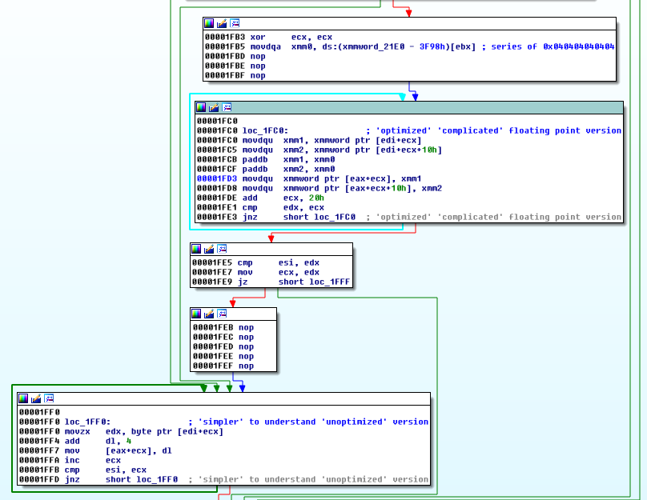

- All strings are obfuscated in this binary.
  - The deobfuscation function (@ 0x1f60) just performs a "add 4" to all chars
    - Shown in above screenshot also

The entry point is the "Java_com_panw_ctf_Util_isFlagCorrect" function.  
All function addresses mentioned later are in offsets from base address.

The "isFlagCorrect" function accepts 1 String input argument and this is what the code does
- Checks input argument is 12 characters long and for the following conditions on the characters
  - input[4]  <= 'Z'
  - input[5]  <= '9'
  - input[6]  <= '9'
  - input[7]  <= 'z'
  - input[8]  <= 'Z'
  - input[9]  <= 'z'
  - input[10] < '0'
  - CTF flag format would assume input[0-3] = "PAN{" and input[11] = "}"
  - Hmm, semms like it is reducing the keyspace for a brute force.
- Encrypts each character the following way (@ 0x2010)
  - ((char - 4) & 0xff) ^ 0x17

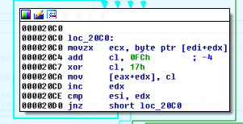

- The encrypted input string is then passed through a Hashing function (@ 0x11d0)
- Calls the Android function "com/panw/ctf/Util->getFlagHash(Ljava/lang/String;)Ljava/lang/String;" (@ 0x12a0)
  - This function is declared in the APK
  - Reads in ".flag.png" and pass it through a QR Decoder
  - The resulting string is returned
    - "3;:j>99j2??38=9n3o:i?:;9>><<9<28i>>j>;hoi<>;om>=2njiiojm9hi:;23="

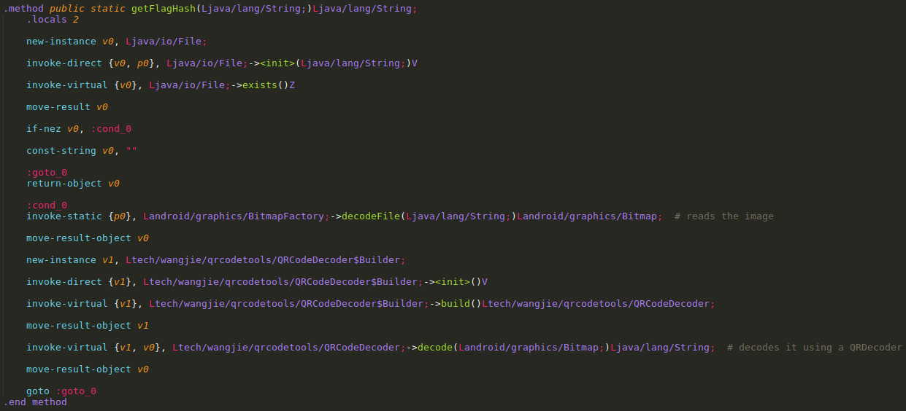

- Checks for the existence of "de.robv.android.xposed.XposedBridge" in the current StackTrace (@ 0x13d0)
  - If present, writes a file ".key" with the content "23"

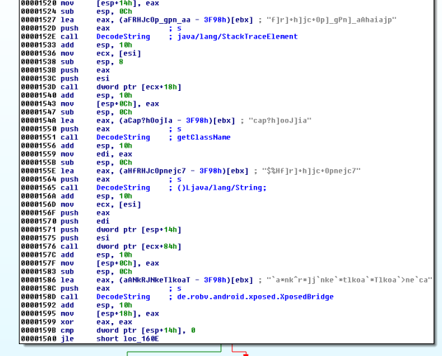

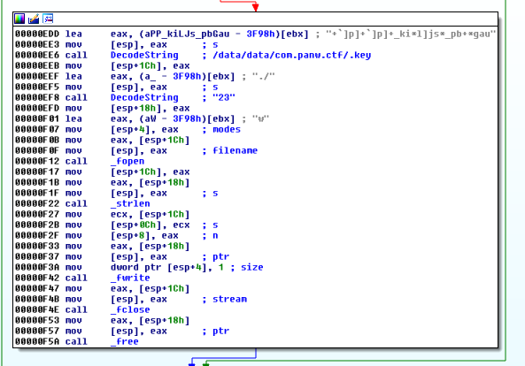

- The contents of the ".key" file is read in as an Integer. (23 or 0x17)
  - This key is used in a single byte xor with the string returned from the QR decoder
    - "3;:j>99j2??38=9n3o:i?:;9>><<9<28i>>j>;hoi<>;om>=2njiiojm9hi:;23=" XOR 0x17

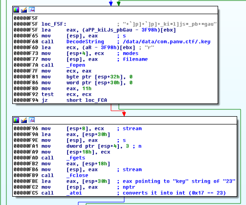

- The decrypted flag string is then compared to the hashed encrypted input string.
  - Returns true if they are the same, false otherwise

Xoring the flag string "3;:j>99j2??38=9n3o:i?:;9>><<9<28i>>j>;hoi<>;om>=2njiiojm9hi:;23=" with 0x17 gives giberish

Was stuck here for awhile, until I noticed there were several functions in libchecker that were not called at all.

**Another String Deobfuscation Function (@ 0x20e0)**

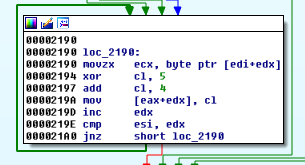

- This xors each char with 0x5 before adding 0x4 to it
  - ((char ^ 0x5) + 0x4) & 0xff
  - Wrote [3_checker_deobfus.php](3_checker_deobfus.php) based on these functions to deobfuscate the strings used in the uncalled functions

**Key Selector function (@ 0x890)**

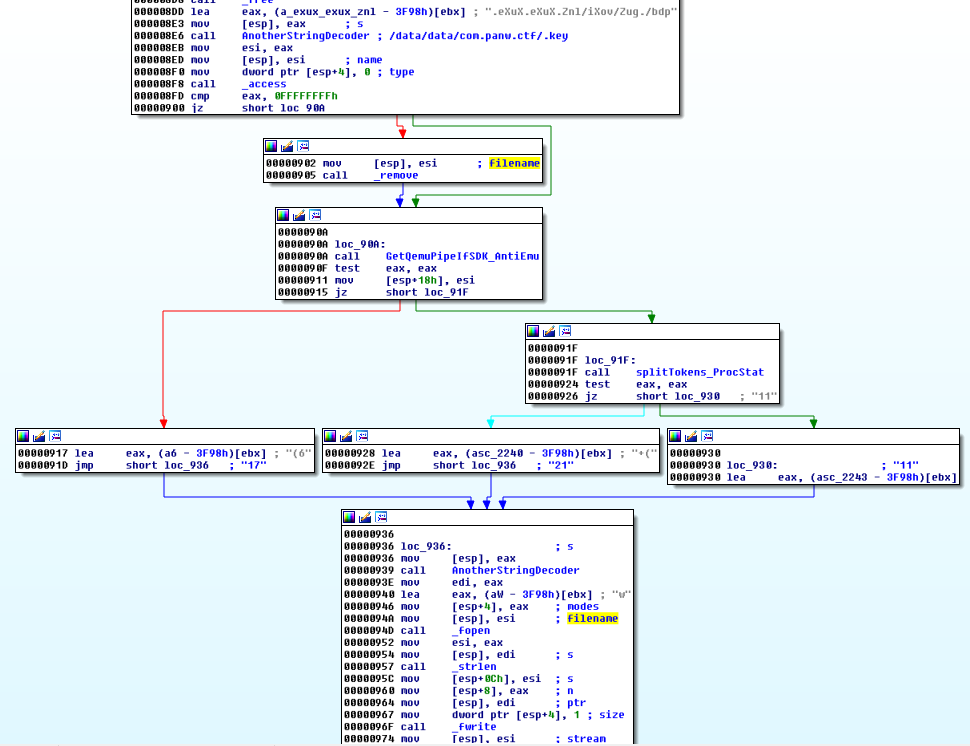

- Writes 1 of 3 different values into ".key" file based on certain conditions
  - The 3 possible key values are 17, 21 and 11

I tried decrypting the flag string with these 3 keys.

These code is included in the [3_checker_deobfus.php](3_checker_deobfus.php) script. 

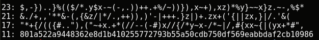

Key 11 worked.

The flag string decrypted to "801a522a9448362e8d1b410255772793b55a50cdb750df569eabbdaf2cb10986"

### Brute The Hash

Now is to determine what hasing algorithm is used.  
The result hash is 64 characters long which implies it may be sha256.  
Testing the code with a test input confirms it.

Wrote [4_brute.php](4_brute.php) to brute force the input string that would produce our flah hash.

Remember to take into account the AddAndXor before the hashing and also the constraints of each char in the input string that is checked.

```php
$target = "801a522a9448362e8d1b410255772793b55a50cdb750df569eabbdaf2cb10986";
$found = false;
$count = 0;
for ($c1=ord('A'); $c1<=ord('Z'); $c1++){
    for ($c2=ord('0'); $c2<=ord('9'); $c2++){
        for ($c3=ord('0'); $c3<=ord('9'); $c3++){
            for ($c4=ord('a'); $c4<=ord('z'); $c4++){
                for ($c5=ord('A'); $c5<=ord('Z'); $c5++){
                    for ($c6=ord('a'); $c6<=ord('z'); $c6++){
                        for ($c7=ord('!'); $c7<ord('0'); $c7++){
                            $count++;
                            if ($count % 100000 == 0){
                                echo "Testing $flag ($hash) ...\n";
                                $count = 0;
                            }
                            $flag = "PAN{".chr($c1).chr($c2).chr($c3).chr($c4).chr($c5).chr($c6).chr($c7)."}";
                            $enc = AddAndXor($flag);
                            $hash = hash('sha256',$enc);
                            //echo "Testing $flag ($hash) \n";
                            if (strcmp($hash,$target) == 0){
                                $found = true;
                                echo "Flag Found!! $flag ($hash)\n";
                                die();
                            }
                        }
                    }
                }
            }
        }
    }
}

function AddAndXor($input){
    $out = "";
    for ($i=0; $i<strlen($input); $i++){
        $cur = ord($input[$i]);
        $tmp = ($cur - 4) & 0xff;
        $tmp = $tmp ^ 0x17; 
        $out .= chr($tmp);
    }
    return $out;
}
```

Running the script for some time will reveal the flag **PAN{M03iLe&}**

### Setting up for JNI Debugging

This is my setup of debugging Android JNI libraries. I set this up on a MAC.

- Install Android Studio
- Create a new Application
  - Set the package name as "com.panw.ctf" for ease of importing the lib later
  - Add a class called "Util" with the following native method. It is important that the data types match.
    - public static native boolean isFlagCorrect(String flag)
  - Add a button with an onClick event that will trigger the function by calling
    - Util.isFlagCorrect("PAN{A00aAa!")
  - Import the jni library
    - Copy the libchecker.so to <project folder>/app/src/main/jniLibs/x86/libchecker.so (Take note of the name, have to be so)
    - In the MainActivity's onCreate, Add the following code
      - System.loadLibrary('checker')

- Create an Android Emulator (AVD) and start it
  - I used Android 7.0 without Google APIs
  - Recommend using without Google APIs so that logcat output is cleaner.
- Copy gdbserver into the Android Emulator (my Android SDK path is "~/Library/Android/sdk") if it is not already there

```bash
# check if gdbserver is already present
> adb shell
> gdbserver
```

If not, carry on the following steps
  - Find the gdbserver 
    - \<AndroidSDKPath\>/ndk-bundle/prebuilt/\<arch\>/gdbserver
      - \<arch\> depends on the arch of the Android Emulator (Mine was android-x86)
  - Remount /system to rw

```bash
> adb shell
> mount | grep -e "system"
# Checks if it is ro or rw
> su
> mount -o rw,remount /system
> mount | grep -e "system"
# Confirm that it is rw now
```

  - Copy gdbserver into the emulator

```bash
> adb push gdbserver /sdcard
> adb shell mv /sdcard/gdbserver /system/bin
```

Now we can start debugging

On Terminal 1

```bash
> adb forward tcp:1337 tcp:1337
```

Start the application in Android Emulator

On Terminal 2

```bash
> adb shell
> ps | grep panw
# take note of the pid
> gdbserver :1337 --attach <pid>
```

On Terminal 1
- go to gdb client folder
  - \<AndroidSDKPath\>/ndk-bundle/prebuilt/<arch>/bin (arch in my case was darwin_x86)

```bash
> gdb
(gdb) target remote :1337
(gdb) info sharedlibrary
# Confirm that libchecker.so have been loaded
```

You can now start debugging as normal.  
For this case, symbols are available, so you can set breakpoint at the isFlagCorrect function and start debugging from there.  

```bash
(gdb) b *Java_com_panw_ctf_Util_isFlagCorrect
```

Some interesting breakpoints

```bash
(gdb) b *Java_com_panw_ctf_Util_isFlagCorrect+194 (After checking valid chars)
(gdb) b *Java_com_panw_ctf_Util_isFlagCorrect+400 (Before checking for Xposed, change return value to 1 to write key)
(gdb) b *Java_com_panw_ctf_Util_isFlagCorrect+621 (Reading of key from key file)
(gdb) b *Java_com_panw_ctf_Util_isFlagCorrect+753 (Prepping of key for decryption)
(gdb) b *Java_com_panw_ctf_Util_isFlagCorrect+794 (Start of Decrypting flag with key?)
```

I learnt this from [http://blog.dornea.nu/2015/07/01/debugging-android-native-shared-libraries/](http://blog.dornea.nu/2015/07/01/debugging-android-native-shared-libraries/)