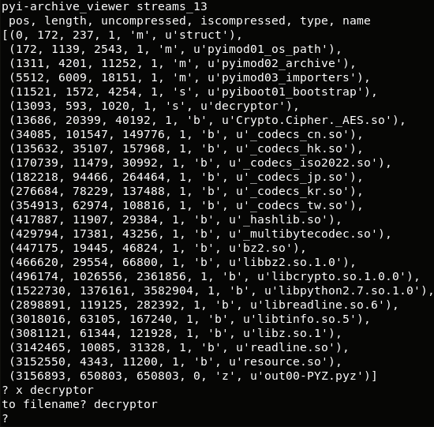
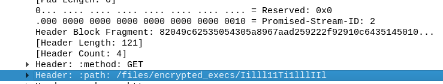
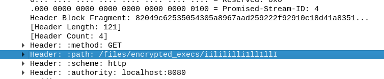
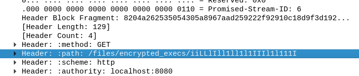
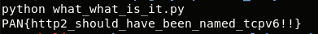

## LabyREnth CTF 2017
# Random : Cake (HTTP2)

We are provided with a pcap file with HTTP2 traffic.  
[HTTP2](https://http2.github.io/) is a new protocol designed to replace HTTP.  

Wireshark is able to parse the format and display it in a readable form.  
However, at the time of the CTF, I could not find any librairies to analyze HTTP2 programatically.

One big difference between these protocols is that HTTP2 no longer uses Text-based headers that is used in HTTP1  
Each HTTP2 frame has a fixed length 9 byte headers that contains meta information about the frame
- The important one we are interested in is the "StreamID"

Another difference is that one HTTP2 "stream" can contain multiple "object streams", differentiated using the StreamID

As we are only interested in the stuff sent by the server to the client, let's extract these data only
- Use wireshark "Follow TCP Stream" and select only server->client direction.
- View it in "RAW" and export it into "http2.stream"

I wrote [extracthttp2.php](01_extracthttp2.php) to extract all the http2 streams objects

Running the script will extract 4 streams (ID 2,4,6,13)

Streams 2,4,6 looks like gibberish, they are most likely encrypted.

Stream 13 is an ELF file with Strings "MEIPASS" suggesting that it is a PyInstaller file

I used pyi-archive-viewer to view streams_13 and extract the "decryptor" library
- Install PyInstaller to get pyi-archive-viewer (pip install pyinstaller)

```
pyi-archive-viewer streams_13
? x decryptor
```



The extracted file is a compiled Python file (pyc) but it is missing the normal PYC headers

I wrote [fixpyc.php](02_fixpyc.php) which will add back the normal PYC headers to the beginning of the file

> php fixpyc.php decryptor

I then used uncompyle2 to uncompile the pyc files into python source code

> uncompyle2 decryptor.py decryptor.pyc

```py
#Embedded file name: decryptor.py
from Crypto.Cipher import AES
import sys, os, random, struct

def decrypt_file(key, in_fn, chunksize = 12288):
    out_fn = in_fn + '.dec'
    with open(in_fn, 'rb') as in_f:
        origsize = struct.unpack('<Q', in_f.read(struct.calcsize('Q')))[0] # First 8 bytes = Original size
        IV = in_f.read(16) # next 16 bytes = IV
        decryptor = AES.new(key, AES.MODE_CBC, IV)
        with open(out_fn, 'wb') as out_f:
            while True:
                chunk = in_f.read(chunksize)
                if len(chunk) == 0:
                    break
                out_f.write(decryptor.decrypt(chunk))

            out_f.truncate(origsize)


if len(sys.argv) < 3:
    sys.exit()
key = sys.argv[1]
fn = sys.argv[2]
decrypt_file(key, fn)
```

It basically performs AES CBC decryption when provided with a "key" and a "file"

If my guess is right, Streams 2,4,6 are encrypted files.  
Maybe, we have to use this decryptor to decrypt them.  
But what is the key?

After some reading up on AES CBC, I found out that it supports 3 key sizes
- 16 bytes (128 bits)
- 24 bytes (192 bits)
- 32 bytes (256 bits)

Upon closer inspection of Streams 2,4,6, I found that the filenames of these files are 16/16/24 bytes long respectively.







The filename is actually the key
- $key2 = "Iilll11Ti1lllIIl";
- $key4 = "iilililli1ll1llI";
- $key6 = "iiLLlIll1ll1l1IIIl1l111I";

I wrote [rundecrypt.php](03_rundecrypt.php) to directly use Stream 13 to decrypt Streams 2,4,6

```php
// Key are the filenames!!
$key2 = "Iilll11Ti1lllIIl";
echo passthru("./streams_13 \"$key2\" streams_2");
$key4 = "iilililli1ll1llI";
echo passthru("./streams_13 \"$key4\" streams_4");
$key6 = "iiLLlIll1ll1l1IIIl1l111I";
echo passthru("./streams_13 \"$key6\" streams_6");
```

Each of the decrypted executables are also PyInstaller exectuables. 

Use the same steps to extract their python code

**Stream 2**
- pyi-archive-viewer streams_2.dec
	- x what_time_is_it
- php fixpyc.php what_time_is_it
- uncompyle2 -o what_time_is_it.py what_time_is_it.pyc

**Stream 4**
- pyi-archive-viewer streams_4.dec
	- x what_what_is_it
- php fixpyc.php what_what_is_it
- uncompyle2 -o what_what_is_it.py what_what_is_it.pyc

**Stream 6**
- pyi-archive-viewer streams_6.dec
	- x what_troll_is_it
- php fixpyc.php what_troll_is_it
- uncompyle2 -o what_troll_is_it.py what_troll_is_it.pyc

The python file extracted from stream 4 will produce the flag



The flag is **PAN{http2_should_have_been_named_tcpv6!!}**