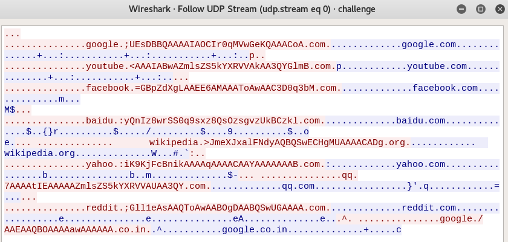
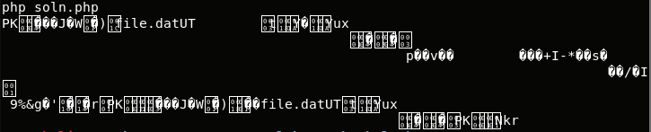

## LabyREnth CTF 2017
# Threat 1 : PCAP

We are provided with a pcap file

The pcap file only contains several DNS requests.

Follow the UDP stream and something weird appears



Seems like there is Base64 encoded data embedded in the DNS requests.

I extracted this strings and wrote [soln.php](soln.php)

```php
$data = array();
$data[] = "google.;UEsDBBQAAAAIAOCIr0qMVwGeKQAAACoA.com";
$data[] = "youtube.<AAAIABwAZmlsZS5kYXRVVAkAA3QYGlmB.com";
$data[] = "facebook.=GBpZdXgLAAEE6AMAAAToAwAAC3D0q3bM.com";
$data[] = "baidu.:yQnIz8wrSS0q9sxz8QsOzsgvzUkBCzkl.com";
$data[] = "wikipedia.>JmeXJxalFNdyAQBQSwECHgMUAAAACADg.org";
$data[] = "yahoo.:iK9KjFcBnikAAAAqAAAACAAYAAAAAAAB.com";
$data[] = "qq.7AAAAtIEAAAAAZmlsZS5kYXRVVAUAA3QY.com";
$data[] = "reddit.;Gll1eAsAAQToAwAABOgDAABQSwUGAAAA.com";
$data[] = "google./AAEAAQBOAAAAawAAAAAA.co.in";

$d = getstuff($data);
echo base64_decode($d)."\n";

function getstuff($data){
    $out = "";
    for ($i=0; $i<count($data); $i++){
        $cur = $data[$i];
        $start = strpos($cur, '.') + 2;
        $end = strrpos($cur, '.');
        $len = $end-$start;
        $tmp = substr($cur,$start,$len);
        
        $out .= $tmp;
    }
    return $out;
}
```

This script will extract and combine these base64 encoded strings and decode it.



The results looks like a ZIP file.

Pipe the output into a file and extract it to get the flag

The flag is **PAN{AllPointersInDNSShouldPointBackwards}**