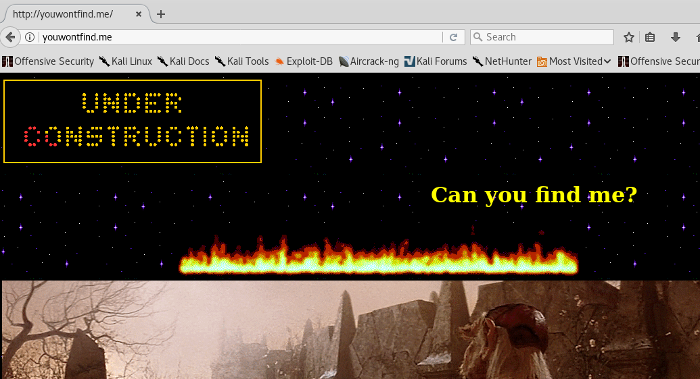
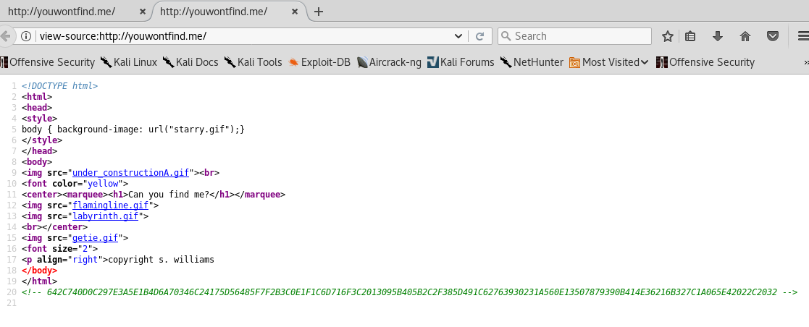
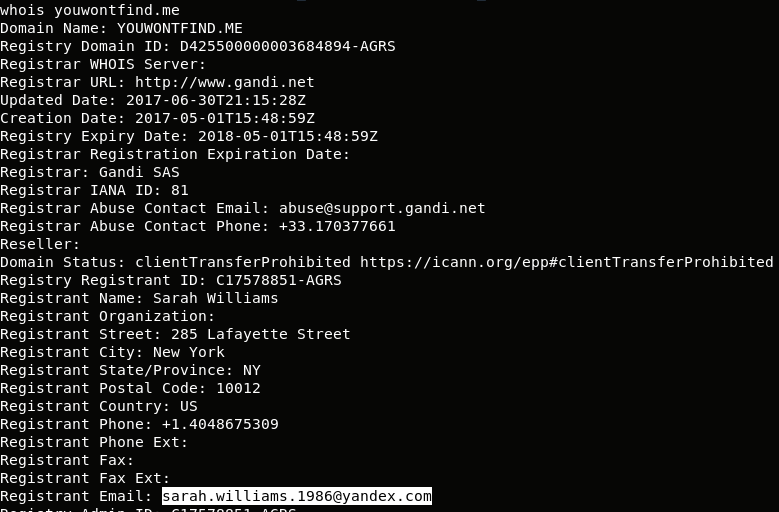
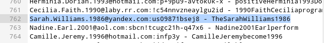
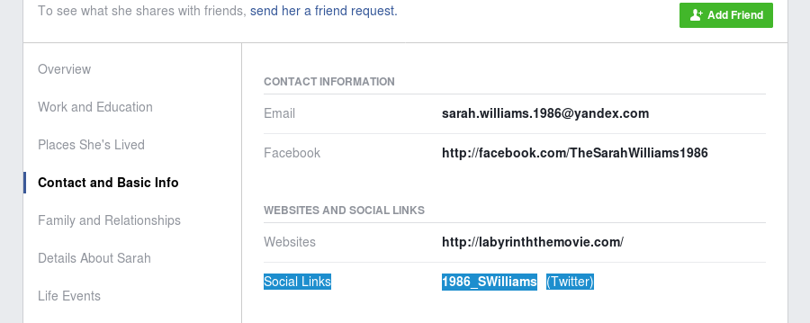
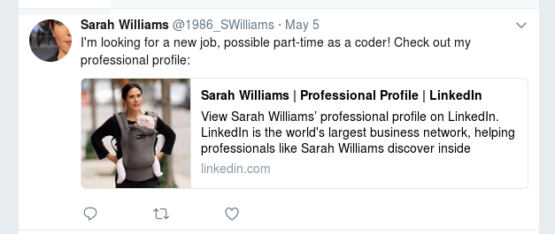
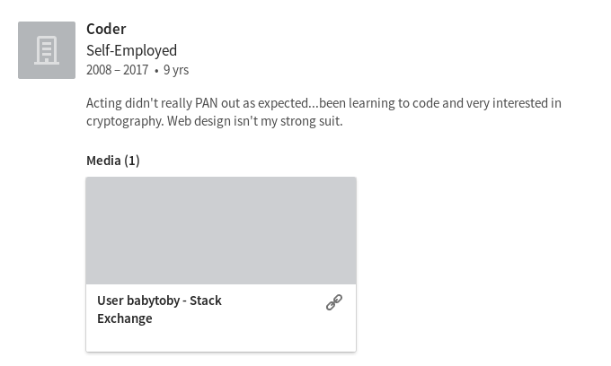
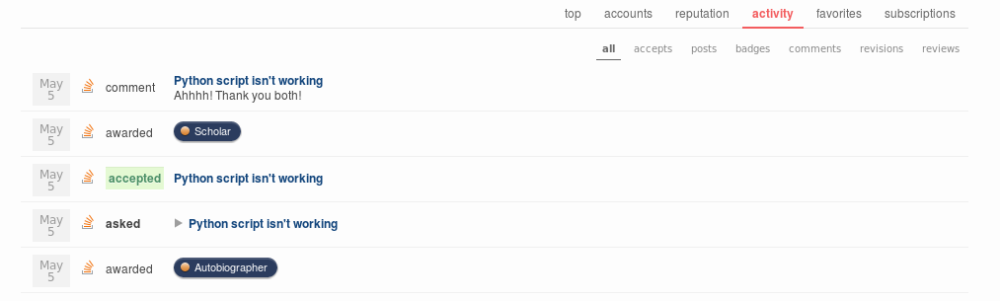
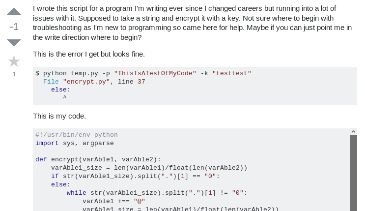

## LabyREnth CTF 2017
# Threat 3 : YouWontFindMe

We are provided with a link to the domain http://youwontfind.me



First of all, view the page source and you will notice a strange string.



Note down this string for now

> 642C740D0C297E3A5E1B4D6A70346C24175D56485F7F2B3C0E1F1C6D716F3C2013095B405B2C2F385D491C62763930231A560E13507879390B414E36216B327C1A065E42022C2032

Performing a whoise on the domain "youwontfind.me" reveals that it is registered by 1 "Sarah Williams" using the email "sarah.williams.1986@yandex.com"



Googling "sarah.williams.1986@yandex.com" leads to a [password dump](https://www.snip2code.com/Snippet/1807127/FB-Dump-15MAY2017)



I tried to login with that password but it failed.  
However, this suggests that this email has a Facebook Account with the name "TheSarahWilliams1986"

Access her [Facebook page](https://www.facebook.com/TheSarahWilliams1986/)  
Do note, you need to be logged in to an actual Facebook account to view the information on this page.

On her "About" section, there is a link to her [Twitter account](https://twitter.com/1986_SWilliams)



One of her tweets shows her looking for a job as a coder and includes a link to her [LinkedIn page](https://www.linkedin.com/in/sarahw1986/)



Do note, you need an actual LinkedIn account to view her full profile

Under her "Coder" experience, there is a link to her [StackExchange account](https://stackexchange.com/users/10581007/babytoby)



Viewing the activity of this account reveals that she started a [thread](https://stackoverflow.com/questions/43807871/python-script-isnt-working/) asking for help in some python code



In this thread, she posted python code that is doing some kind of encryption and is asking for some help



Essentially, the code is riddled with syntax errors.

I fixed all the syntax errors in this [python file](crypter.py)

Remember the strang string we saw at the beginning of this challenge?  
That is actually the flag encrypted with this python encryption.  
The goal now is to reverse this algorithm and decrypt the flag.

This is what the encryption algorithm do
- Takes in a message string and a key of length 8
- Pads the message string with '@' till its length is a multiple of 8
- Splits the message into 8 bytes chunk
- Starting with the first chunk, does the following
	- Perform XOR Encryption of the chunk with the 8 bytes key
	- Save the encrypted bytes into the output
	- Reverse the encrypted bytes and assign it as the key for the next chunk
- After all chunks are processed
	- Reverse the output and print it as a hex string

Analyzing this algorithm, we know we can recover Chunks 1 till the end.
- The key for a chunk is the reverse previous chunk

Chunk0 would still need the key to be recovered.

After recovering Chunks1 till the end, we see this.

```
array(8) {
  [8]=>
  string(8) "dedf}@@@"
  [7]=>
  string(8) "31b8520b"
  [6]=>
  string(8) "24c299a7"
  [5]=>
  string(8) "35416006"
  [4]=>
  string(8) "ef096b90"
  [3]=>
  string(8) "9f7e2d0d"
  [2]=>
  string(8) "286f2edf"
  [1]=>
  string(8) "f45c4ba9"
}
```

Looks like a flag string, which means the first 4 char should be "PAN{"

Xoring "PAN{" with first 4 bytes of chunk0 will recover the first 4 bytes of the key
- The result is "baby"

Looking through her social media accounts and keeping in mind the key should be 8 chars long
- Her StackExchange username is "babytoby"
	- Decrypting Chunk 0 with that gives "PAN{61dc"
		- This is the correct key

Combining all the chunks will produce the flag

The flag is **PAN{61dcf45c4ba9286f2edf9f7e2d0def096b903541600624c299a731b8520bdedf}**

I also wrote [soln.php](soln.php) which will perform the decryption as well.