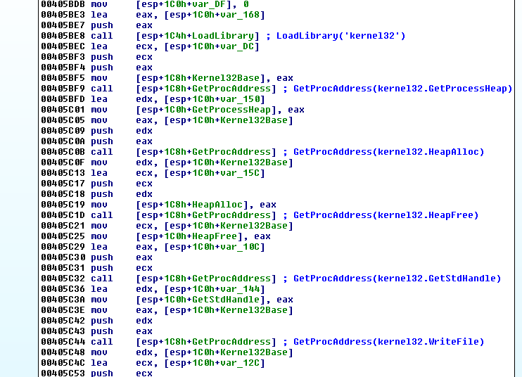
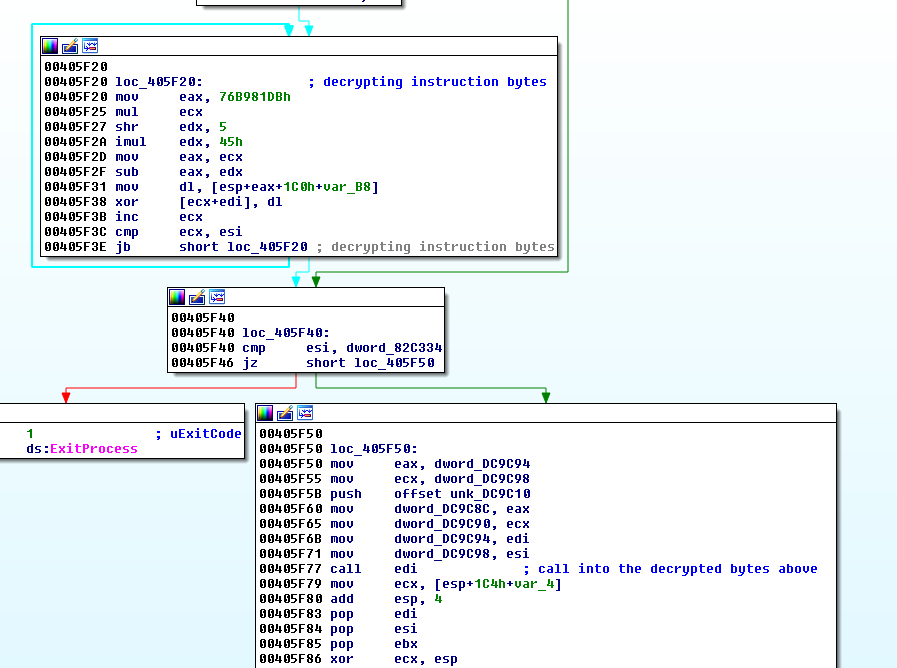
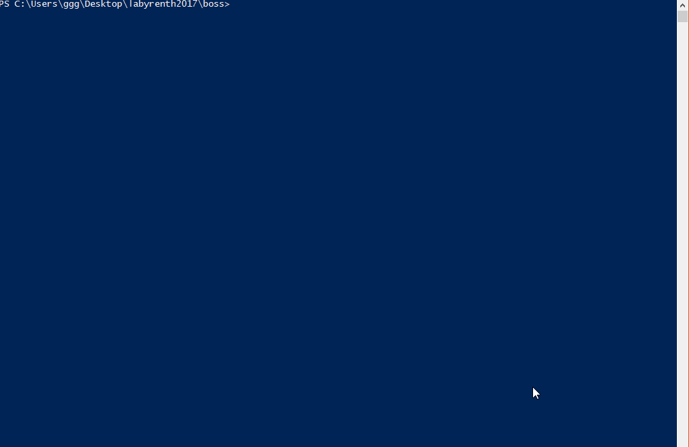

## LabyREnth CTF 2017
# Final Boss Challenge

This is the final boss challenge for Labyrenth CTF 2017.  

We are provided with a x86 binary.

We can't really see much from IDA Pro.  
It first finds and saves a bunch of function addresses.



It then decrypts some instruction bytes and calls into them.



After this point, we have to use a debugger to figure out what is happening.

This process is extremely tedious, I will not go through this but just share my final findings.

## What is it doing

It is checking for certain Environment variables and their values.  
One example is as follow

> tos_d00c2ad0812f4d008230934441d5d331 == "They got a message from the Action Man"

If the environment variable exists and the value matches what it is looking for, it will load another bunch of encrypted instructions, decrypt them and calls into it.

Each Environment Variable and Value pair will load a different set of instructions

The new set of instruction does basically the same thing, looking for a different set of environment variables and values.

This keeps repeating and forms a tree structure

If you noticed, the values of these variables are actually lyrics from David Bowie's songs  
At first, I thought I had to choose the lyrics and form a song or something but that is not the case.

After some advice from some friends that the final solution has no obvious links in the lyrics,  
I started to realize I had to brute-force and walk the whole tree structure to find the solution.

The challenging part was that I had no idea what environment variables/values that each set of instruction is looking for.  
I could only know that when the instructions are decrypted and loaded into the debugger.

### Debugger Scripting

I used x64dbg as my main debugger on Windows.  
I started to explore x64dbg scripting.

I could actually write a script that will automatically step through the debugger and follow certain paths and outputs log messages to the Log.  
However, as of the time of the CTF, there wasn't a way for me to write the log contents out to a file programmatically.  
I could only do it through the UI with a "Log->Right-Click->Save"

In the end, I came up with a semi-automatic approach using a PHP script and a Debugger Script.

### Semi-Automatic Brute-Forcing

I first wrote a [x64dbg script](debugscript1.txt) to walk through the execution and find all the pairs of Environment Variables and Values that this part of the code is looking for and writes them to the Log

I then wrote a [php script](map1.php) that will do the following
- Loop the following
    - Launch x32dbg on the challenge binary
    - Wait till x32dbg exits
    - Reads in the Log file and add the Environment Variable/Value pairs into a tree-traversal queue
    - Take the first pair from the queue and sets the Environment Variable
    - Return to the start of the loop

The entire solution process will look something like this
- Run the PHP script
- Loop starts here
    - The PHP script will launch the debugger
- Manually Run the Debugger Script through the debugger UI
    - Results from the script will be written to the Log
- Manually save the Log contents into a file (With a Right-Click->Save As)
- Quit the debugger
- PHP script will then read in the log file
    - Add EnvVar/Value pairs to the tree-traversal queue
    - Take the first pair on top of the queue and sets it into the environment
- Repeat the Loop



By slowly traversing the tree in this way, It will eventually reach a branch where it displayed a url

This is the output displayed on the console

```
 * * *******     * * **  * ****  *  ** * **  *  * * **  ****
* **  ** *  ****    ***     **  ********** ** *       * ** ** **
 *  ** *  *   * * * * * * **   * * * * ** **   ** ***** * *   **
**** **** *******    * ** *  ***   **** *  ** ** * * *    ***
** *   ***   *    *   *******   **   **  *** **  **  *   * *
 * ***     * * ** *** *    *   * *  * *     ** *    ***  *
    **  *** **** * * ** **** **** *  ***    *  ****    ****  **
****    ** * **  * *****  **   * * * *      *     * ***   *  ***
http://dl.labyrenth.com/tos.inf/d2476ee0823448f4e6628676b252d65a6a5d6169d73a31fa5df3e16bee4b95f2.7z
```

Downloading and extracting the 7zip file reveals another binary that does almost exactly the same thing with some differences in the tree structure.

Repeat the brute-force to traverse the new tree.  
This repeats for 4 binaries.  
The flag is revealed at the end of the 4th binary.

Below lists some of the key differences of each binary and their tree structure

**Binary 1**
- Maximum Depth of 7
- Each Node has 2-4 branches
- [PHP Scirpt](map1.php) and [Debugger Script](debugscript1.txt)

```
Solution Route

 * * *******     * * **  * ****  *  ** * **  *  * * **  ****
* **  ** *  ****    ***     **  ********** ** *       * ** ** **
 *  ** *  *   * * * * * * **   * * * * ** **   ** ***** * *   **
**** **** *******    * ** *  ***   **** *  ** ** * * *    ***
** *   ***   *    *   *******   **   **  *** **  **  *   * *
 * ***     * * ** *** *    *   * *  * *     ** *    ***  *
    **  *** **** * * ** **** **** *  ***    *  ****    ****  **
****    ** * **  * *****  **   * * * *      *     * ***   *  ***
http://dl.labyrenth.com/tos.inf/d2476ee0823448f4e6628676b252d65a6a5d6169d73a31fa5df3e16bee4b95f2.7z

tos_4e801728d1054995bb3d99ddfefa8ab3: Ashes to ashes, fun to funky
tos_68f4f342be354e06bc4cc846b10573e0: Your circuits dead, theres something wrong
tos_e47886d1a9f6422b8b1627da6b060792: Now its time to leave the capsule if you dare
tos_f60ad38f40d442f696c1c4bf4dde4840: And theres nothing I can do
tos_56b4cd654be24143b50bb8dc9cb42581: Im feeling very still
tos_1e46cef8455c4c8f81e7366d64f58984: Do you remember a guy thats been in such an early song
tos_68652ae0be884b4683e4fd8968f24877: To get things done
```

**Binary 2**
- Maximum Depth of 8
- Each node has 2-3 branches
- [PHP Scirpt](map2.php) and [Debugger Script](debugscript2.txt)

```
Solution Route

** * ** ***    *  **       ***   *  ** ** * ** * *  ***  *  *
*   *** **** *  **    **   **  *  ***  ****** *   *** * * * * **
  *****  ****      * ******** *    *  **  *   *****  ****    * *
*   *    ****  ***    * **       * *     * *  ******** * * * **
 ** * *  * *** *  ****  * * * *     *  ** *  ** *     ** * ** **
****   ***  *****  * **  ** *  *         ** * *** *** **** *  *
    **** * ****  * ***    * ***  *** * * ** *** *  **   ***  *
* ** *** *  *  *     *    **  **    ** **  **  ***  * *** ***
 ****** ***  * ***** ***** ***  * *  ** * **** ***   *** **  *
http://dl.labyrenth.com/tos.inf/aabde9674c602172beccbdc0616292ec533474d30807c7b099febdb45d5aa405.7z

tos_26d1b1b3ade243ec9e54c75f2d2104fb: Then we could be heroes, just for one day
tos_f1e8c8aff51f4a81bfe26f93f508e1d2: Of warm impermanence and
tos_c184a7ee23d6489791667168324114d2: Oh we can beat them, forever and ever
tos_860afef9bfd4478d8959d92c150a2e27: And these children that you spit on
tos_7f9411315d7642c2bd88bb4c9a5e6f58: A million deadend streets
tos_963b7e4e2f3a4da59e73bdf4849cda3d: Dropped my cell phone down below
tos_66d40d4cb17e4b28b4079eaf653f7730: We can be heroes, just for one day
tos_723ad3b7e2d344ae82d2222fe67ba0ff: Chchchchchanges
```

**Binary 3**
- Maximum Depth of 5
- Each node has 3-5 branches
- Introduces "Fake Branches"
    - Some branch will lead to errors where no corresponding instruction bytes are available leading to a application crash
    - Manually create a log file with just the String "Mission Complete"
    - Modified PHP Script to skip the entire branch if the log file only contains the above string
- [PHP Scirpt](map3.php) and [Debugger Script](debugscript3.txt)

```
Solution Route

   *** ** *****   ** *  * ****      **  *  ****      ** * * ***
 * ***** * **  *    ****    * * ***    **    * * **  *   **  * *
*  **  **    ***** ** * * *  **   ****** *  *    *  ****  ******
* *    *  * ** *** ** *** * *  **** ******  * * *      ** ** *
*     ** * * *** *** *    *  ** *  *** ** * **  **     ****** *
** *  ** * *  ****   *     *** * **   ****   * *  ** ***** *  **
http://dl.labyrenth.com/tos.inf/52b820b4471767e1be68c61d5fd0cd67cd380a2ba84280e6901d0166dd522fc8.7z

tos_a43b832e46b34d6990066f2bef5c43d6: And my time was running wild
tos_8c0b75d408df48b9a0444b5c3b7be3ac: Oh we can be heroes, just for one day
tos_0ec81c65eb904dfcaf125ea5f2f355b2: I said that time may change me
tos_3b1d5947b6b743dc8c1b0a9f37d01427: Oh we can beat them, forever and ever
tos_f482e72b184a421d86f02f742e25af30: Yes were lovers, and that is that
```

**Binary 4**
- Maximum Depth of 5
- Each node has 3-5 branches
- [PHP Scirpt](map4.php) and [Debugger Script](debugscript4.txt)

```
Solution Route

  ** **   ***** *** *    * *    ***  * * *  * * ***** *  * ** *
 *       *  **   * ** ***   * ** *****    * **  ****  ***   * *
*** *    **** ** * ** * *   * * * ** ***** **  *   *   ***  * **
 *   ****  *** **   ** * ** *  ** * *  *  ** ***  **** **** * *
    ** * * *    * *** ** ***   ** *  *  **  ***  ** ** * *******
 *  *    ** *** **   *** *** **  *****  * **   *  * *  *  **  **
PAN{dd864aebeeba3e125dce2e111e6ea04fb759333409a87da8e7bd413b3e36105b}

tos_f383daf0a74b41f8990393c17b650daa: Ziggy played guitar
tos_9558027f72f24a3a82dc3754069d073a: Showing nothing, he swoops like a song
tos_4a3836298c4b443385632486897bb13e: Oh, look out you rock n rollers
tos_b82921bc59f5465d8e9a676d569c0baf: He kissed her then and there
tos_1044c6fa7bf84c2bbd3a408fe7b12aeb: Heaven knows, shed have taken anything, but
```

The flag is **PAN{dd864aebeeba3e125dce2e111e6ea04fb759333409a87da8e7bd413b3e36105b}**

I've also included the tree structure that I recovered till the solution branch for each binary  
You can also run these PHP files to traverse the tree to find the solution branch
- [Tree 1](tree1.php)
- [Tree 2](tree2.php)
- [Tree 3](tree3.php)
- [Tree 4](tree4.php)

