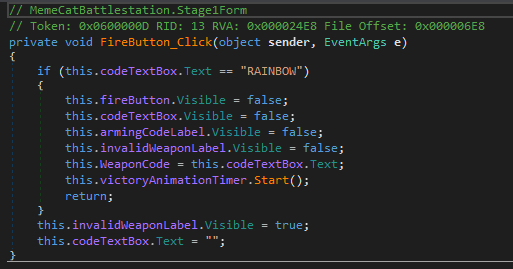
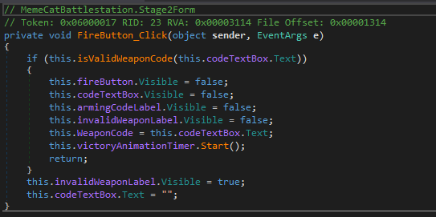
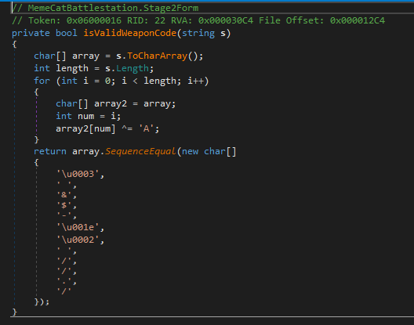

## Flare-On CTF 2019
# Challenge 01 : Memecat Battlestation

We are provided with a x86 PE .NET Executable

As this is a .NET Executable, I used dnSpy to decompile it.

There are 2 interesting classes **Stage1Form** and **Stage2Form**.  
Let's look at **Stage1Form** first.  
The interesting part of the code is the Button handler for the "Fire" button.



This is very straight forward, it just checks if the input is "RAINBOW".  
Enter that and it will go onto stage 2.

Same thing, let's look at the button handler for stage 2.



It checks the user input by calling the "isValidWeaponCode" function.  
Let's see what that function does.



It basically xors the user input with 'A' (0x41) and checks it against the byte array.

I wrote a php script that would reverse that encryption in [soln.php](soln.php)

```php
$enc = hex2bin('03').' '.'&'.'$'.'-'.hex2bin('1e02').' '.'/'.'/'.'.'.'/';
$out = "";
for ($i=0; $i<strlen($enc); $i++){
	$tmp = ord($enc[$i]) ^ ord("A");
	$out .= chr($tmp);
}
echo $out;
```

Running the script will give the valid weapon code "Bagel_Cannon"  
Entering this code in the form will give us the flag


The flag is **Kitteh_save_galixy@flare-on.com**
