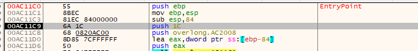
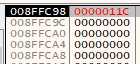
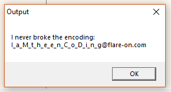

## Flare-On CTF 2019
# Challenge 02 : Overlong

We are provided with a x86 PE Executable

Looking through IDA, the code is very straight-forward.

It starts decoding from 0x402008. It does not take in any input.  
Running it without any modification will decode the string "I never broke the encoding:"

The only variable "input" to the decoding function is the length.
Looking at the data at 0x402008, there were much more data after the initial size of 0x1c.

I used a debugger and change the length of the decoding function to 0x11c instead and got the flag

The flag is **I_a_M_t_h_e_e_n_C_o_D_i_n_g@flare-on.com**
