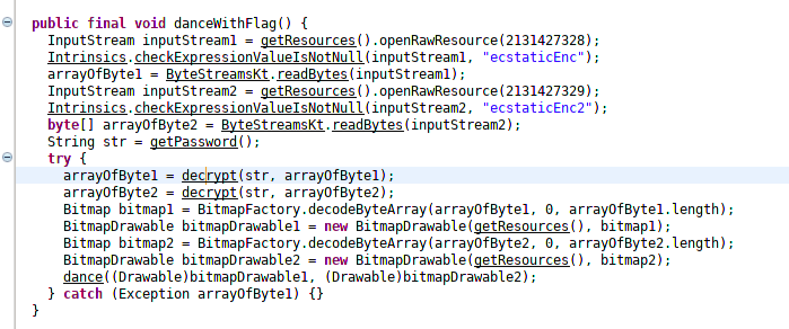
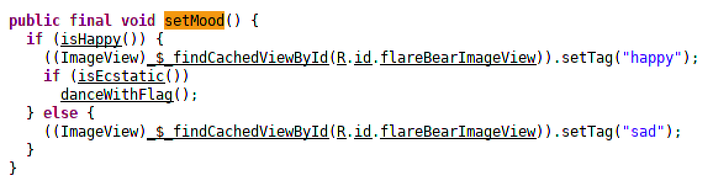
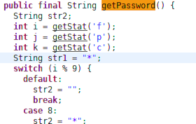
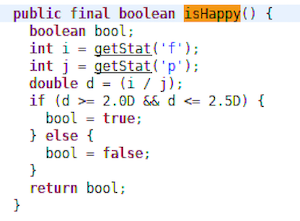
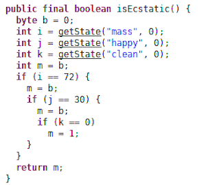
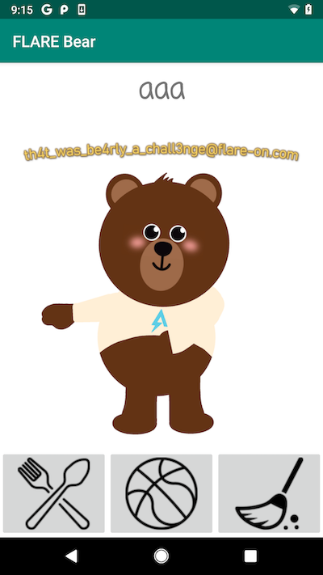

## Flare-On CTF 2019
# Challenge 03 : Flarebear APK

We are provided with a Android APK

Running the APK in an emulator or actual device shows that it is a "tamagotchi" game.  
You can clean, feed and play with a virtual bear pet.

I used d2j-dex2jar and jd-gui to decompile the APK
  - Unzip the APK
  - d2j-dex2jar.sh classes.dex
  - Open JD-GUI and open the classes-dex2jar.jar

The interesting code is in the FlareBearActivity class

Looking through the code, **danceWithFlag** seems to be the goal.  
It reads in 2 raw resource, get some password and decrypts them using AES.

Tracing back, this function is called by the **setMood** function.

If both **isHappy** and **isEcstatic** returns true, **danceWithFlag** will be called.  
Initially, I tried editing these 2 functions using smali editing and recompliation to force them to always return true  
However, it didn't work because of the password used in **danceWithFlag**.

It uses some "Stat" to determine the password.  
Upon further reading, these "Stat" is set by the **saveActivity** function which is called by the **feed**, **play**, and **clean** functions  
These functions are called when you press the respective buttons in the UI

These 3 functions changes the game state in various ways
  - changes the values of some variables, these 3 are the important ones
    - mass
    - happiness
    - cleaniness
  - Appends a action character to a "action history" string
    - 'f' for feed
    - 'p' for play
    - 'c' for clean
    - This "action history" string is used by the **getPassword** function to generate the password

Let's look further into the **isHappy** and **isEcstatic** functions

These 2 functions check that the game state is equal to certain values  
This looks like a math puzzle  
Here's a table of all the actions, consequences and the goal to reach

|Action     |mass |happiness  |cleaniness |
|:----------|:---:|:---------:|:---------:|
|feed (f)   |+10  |+2         |-1         |
|play (p)   |-2   |+4         |-1         |
|clean (c)  |0    |-1         |+6         |
|GOAL       |72   |30         |0          |

Also, number of feed / number of play must be between 2.0 and 2.5

Doing a bit of Math, I figured out that
  - 4f, 2p, 1c will give 36 mass, 15 happy and 0 clean
  - Do this twice and we will get to our goal state

The flag is displayed once the goal state is reached

The flag is **th4t_was_be4rly_a_chall3nge@flare-on.com**
