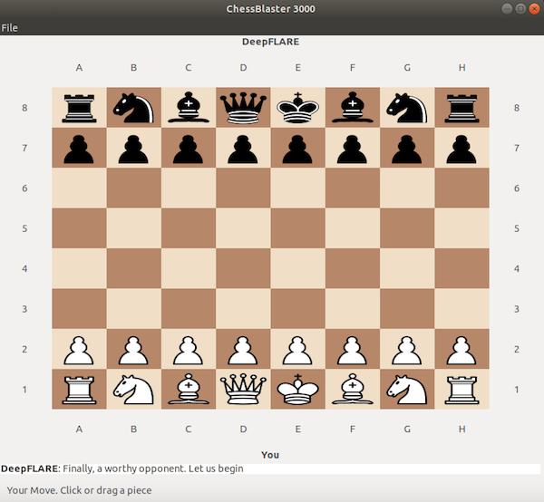
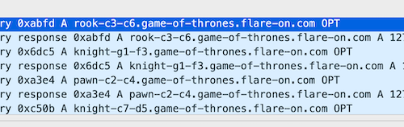
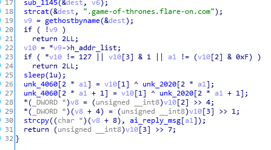
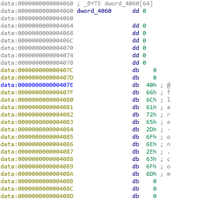

## Flare-On CTF 2019
# Challenge 04 : DNS Chess

We are provided with a x64 ELF file and a PCAP file full of DNS resolutions

Running the ELF file shows that it is a Chess program



Looking at the DNS reslution requests, the URLs looks like chess moves



Each requests has a response of a different IP  
I was guessing that the IP would determine what the AI player would do  
So, I started to look for where in the code is the DNS response parsed.

It is parsed in the **getNextMove** exported function of **ChessAI.so**



It checks for a few conditions and if all of them are met, it does a xor with a buffer at address 0x2020 and store the result in a buffer at 0x4060



Hmm, there is space for a few characters followed by "@flare-on.com"  
Looks like a flag to me

I re-implemented this code in a little [python script](soln.py)

```py
from scapy.all import *

# Use scapy to extract IPs from all the DNS responses
ips = []
pkts = rdpcap("capture.pcap")
for pkt in pkts:
	if pkt.haslayer(DNSRR):
		ips.append(pkt[DNSRR].rdata)

# from 0x2020
enc = bytearray.fromhex("795AB8BCECD3DFDD99A5B6AC1536858D090877524D71547DA7A70816FDD7")
out = ""

# The code only decrypts the flag if the returned IP matches the following conditions
# Each pair of characters in the flag is decrypted by 1 IP that matches the conditions
flag_index = 0		
while flag_index < 15:
	for ip in ips:
		tmp = ip.split(".")
		if int(tmp[0]) != 127:	# first octet must be 127
			continue
		if int(tmp[3]) & 1:		# last octet must be odd
			continue
		if (int(tmp[2]) & 0xf) != flag_index:	# 3rd octet's lower bytes == cur flag index
			continue

		print "%d %s" % (flag_index, tmp)

		# Condition met, perform the decryption
		out += chr(enc[(flag_index * 2)] ^ int(tmp[1]))
		out += chr(enc[(flag_index * 2) + 1] ^ int(tmp[1]))

		# Increment flag_index and repeat the loop to find the IP for the next 2 characters
		flag_index += 1

print out + "flare-on.com"
```

The flag is **LooksLikeYouLockedUpTheLookupZ@flare-on.com**
