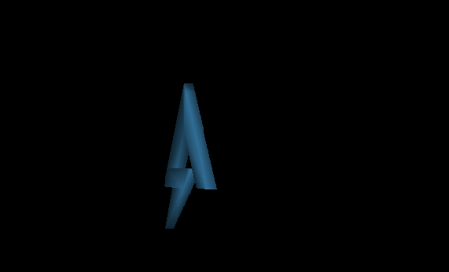
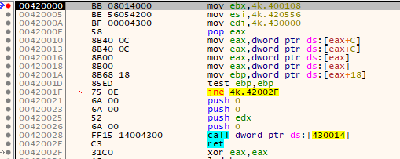
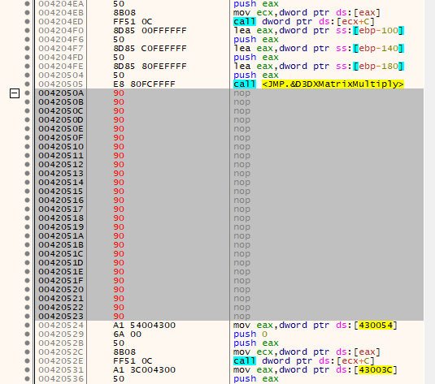
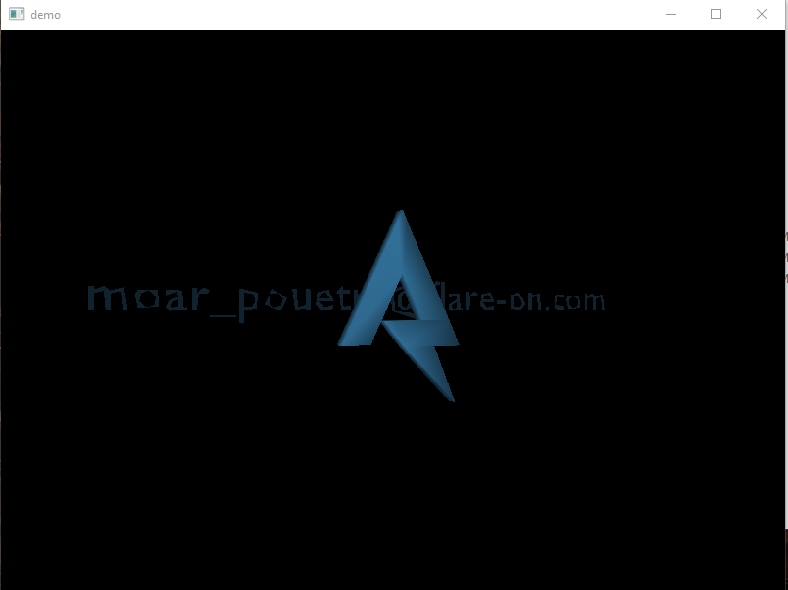

## Flare-On CTF 2019
# Challenge 05 : Demo

We are provided with a x86 PE and was instructed to install DirectX9

I installed the DirectX 9.0c End User Runtime from Microsoft's [website](https://www.microsoft.com/en-sg/download/details.aspx?id=34429)  
If your installation is correct, running the binary will show a spinning Flare logo  
If the window lose focus, the application will crash (this is not part of the challenge)



### Unpacking

The binary is packed, IDA is not able to disassemble it properly  
There are hints in the question text itself  
Searching the string "demoscene" given in the question led me to the packer  
It uses the Crinkler packer but I could not find a unpacker for it  
I unpacked it using the manual way

I ran the binary in x32dbg and used its "Graph" view (shortcut 'g') to find the "tail jump"  
In this case, it is the "ret" shown below


Breakpoint there and step over it to get to the unpacked code



At this point, I used Scylla plugin to dump the executable with the current EIP as the OEP  
Loading this dumped executable in IDA allowed me to at least view the flow of the code

### 3D Drawing

The first part of the code does the usual malware function finding technique
  - Traverse the IAT to find the Kernel32 Base
	- Finds the Kernel32.LoadLibraryA function
	- Loads 3 DLLs (user32.dll, d3d9.dll, d3dx9_43.dll)

I am no 3D graphcis expert but this is what I figured out

The actual drawing code starts at 0x420155 with a call into the drawing function (0x42038A)  
This is the gist of what the drawing function does

```
	- DX.Clear
	- DX.BeginScene

	Setting up the camera for the scene
	- mat = D3DXMatrixLookAtLH
	- SetTransform(mat)
	- mat = D3DXMatrixPerspectiveFovLH
	- SetTransform(mat)

	Defining some transformation matrix
	- M1 = D3DXMatrixTranslateZ
	- M2 = D3DXMatrixRotationY_cccd
	- M3 = D3DXMatrixRotationY_3333

	Begin drawing the objects (Tri3Mesh function basically draws the object)
	- SetTransform(M2)
	- Tri3Mesh(LogoObject)
	- M4 = D3DXMatrixMultiply(M1, M3)
	- SetTransform(M4)
	- Tri3Mesh(FlagObject)
```

The D3DX* functions only creates the transformation matrix.  
The SetTransform function then applies the matrix into the scene.

I guessed that the Tri3Mesh is responsible for actually loading in a 3d mesh/model  
Since there are 2 calls to it, I figured that there were actually 2 3d objects in the scene but we could only see one.  
That means that the "other" 3d object could be the flag and it was moved off-screen, away from the camera

The "SetTransform(M4)" is the part of the code that moves the flag object off-screen.  
Therefore, I put a breakpoint there and nop-ed out the entire chunk of code performing SetTransform(M4).



Let the program continue and the flag will be shown on screen



The flag is **moar_pouetry@flare-on.com**
