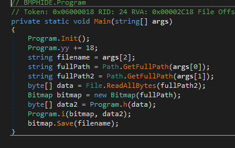
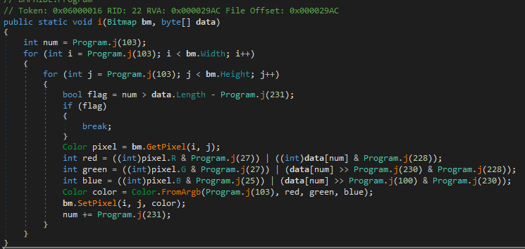
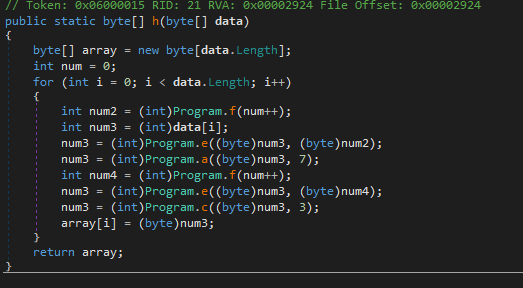
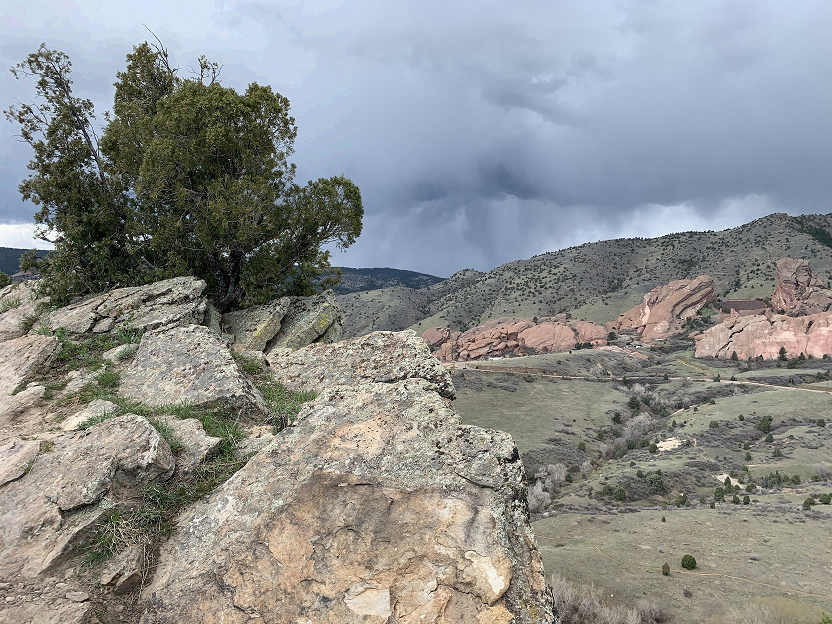

## Flare-On CTF 2019
# Challenge 06 : Bmphide

We are provided a .NET executable and a Bitmap image

### Anti-Debugging maybe?

Initially, I used dnSpy (v6.0.5) to decompile the binary and try to debug it.  
However, it crashed in the **Program.Init()** function.  
When I used an older version of dnSpy (v5.0.7) on the same machine, it was able to debug it without crashing.

My friends had lots of difficulty trying to debug this    
I'm not sure what the exact reason was but some friends said that it is some Confuser packing that needs to be bypassed  
I did not investigate much as I got it to work on a older dnSpy and I continued reversing  
Although, if it is really Confuser, I'm interested to find out why my older dnSpy was able to debug it.

### Steganography

This is basically a steganography program. It hides a secret file inside a bitmap image.  
I had to figure out how it hid the information and write a program that will do the reverse.

The program's Main function is quite concise in what it does



The app first perform some initialization.  
The most important part of the initialization was that it overwrote the function pointers of 2 functions (done by **VerifySignature** method).
  - Program.a -> Program.b
  - Program.c -> Program.d

Calling Program.a or Program.c will call Program.b and Program.d respectively.  
Although I could not find where it was overwritten, Program.f function pointer was also overwritten to point to Program.g during debugging  
This made pure static analysis not possible.

There is 2 main parts to this program.  
It first encrypts the secret file then hides it in the image.  
I had to write code to reverse this process

#### Un-hiding

Hiding is done by **Program.i**  



**Program.j** is basically an integer obfuscater.  
I debugged the program and de-obfuscated what all these numbers are.

```csharp
public static void i(Bitmap bm, byte[] data) {
  int num = 0;
  for (int i = 0; i < bm.Width; i++) {
    for (int j = 0; j < bm.Height; j++) {
      bool flag = num > data.Length - 1;
      if (flag) {break;}

      Color pixel = bm.GetPixel(i, j);
      int red = ((int)pixel.R & 0xf8) | ((int)data[num] & 0x07); // Hide 3 bits in R
      int green = ((int)pixel.G & 0xf8) | (data[num] >> 0x03 & 0x07); // Hide 3 bits in G
      int blue = ((int)pixel.B & 0xfc) | (data[num] >> 0x06 & 0x03); // Hide 2 bits in B
      Color color = Color.FromArgb(0, red, green, blue);
      bm.SetPixel(i, j, color);
      num += 1;
    }
  }
}
```

It breaks each data byte into the following bits ("bbgggrrr") and places them in the lowest 3 or 2 bits of the RGB bytes of each pixel.  

The easiest way to reimplemented this code is to create a C# Visual Studio project and copy most of the code from the **Program** class and modify it to do the reverse procedure  
I wrote the **reverse_i** function to reverse this process

```csharp
public static byte[] reverse_i(Bitmap bm) {
  int msglen = bm.Width * bm.Height;
  byte[] ret = new byte[msglen];

  for (int i=0; i < bm.Width; i++) {
    for (int j=0; j < bm.Height; j++) {
      Color pixel = bm.GetPixel(i, j);
      byte tmp = (byte)((pixel.R & 0x7) | ((pixel.G & 0x7) << 3) | ((pixel.B & 0x3) << 6));
      ret[(i * bm.Height) + j] = tmp;
    }
  }
  return ret;
}
```

#### Decryption

Encryption is done by **Program.h**



**Program.e** basically does a xor between the 2 bytes  
Also, remember that **Program.a**, **Program.c** and **Program.f** function pointers have been overwritten  
This is what **Program.h** is actually doing

```csharp
public static byte[] h(byte[] data) { // modded by the init
  byte[] array = new byte[data.Length];
  int num = 0;
  for (int i = 0; i < data.Length; i++) {
    int num2 = (int)Program.g(num++);
    int num3 = (int)data[i];
    num3 = (int)Program.e((byte)num3, (byte)num2);
    num3 = (int)Program.b((byte)num3, 7);
    int num4 = (int)Program.g(num++);
    num3 = (int)Program.e((byte)num3, (byte)num4);
    num3 = (int)Program.d((byte)num3, 3);
    array[i] = (byte)num3;
  }
  return array;
}
```

It basically does a series of mathematical operations (xor, mul, div) to encrypt each byte of the secret file.  
Program.b and Program.d are actually opposites of each other so I could use them to reverse each other's operation. (I later realized they seem like ror and rol operations)  
For some reason, the constants in Program.g was different on my Visual Studio than on debugging using dnSpy. (maybe modified by whatever overwrote Program.f function pointer)  
I found a workaround by just using the last byte used in dnSpy instead of the large long number since the end result was cast-ed to a byte anyway.

```csharp
public static byte g(int idx) {
  //byte b = unchecked((byte)((long)(idx + 1) * (long)((ulong)-306674912)));
  byte b = (byte)((idx + 1) * 0xc5);
  //byte k = (byte)((idx + 2) * 1669101435);
  byte k = (byte)((idx + 2) * 0x7d);
  return Program.e(b, k);
}
```

I wrote the reverse_h function to reverse this process

```csharp
public static byte[] reverse_h(byte[] data) {
  byte[] array = new byte[data.Length];
  int num = 0;
  for (int i=0; i < data.Length; i++) {
    byte key1 = Program.g(num++);
    byte key2 = Program.g(num++);

    byte tmp = data[i];
    tmp = Program.b(tmp, 3);
    tmp = Program.e(tmp, key2);
    tmp = Program.d(tmp, 7);
    tmp = Program.e(tmp, key1);
    array[i] = tmp;
  }
  return array;
}
```

This is my complete [C# code](Program.cs)

Running it on image.bmp gives another image (I name it image2.bmp).  
It still does not have the flag



Running it again on image2.bmp gives us another image with the flag


The flag is **d0nT_tRu$t_vEr1fy@flare-on.com**
