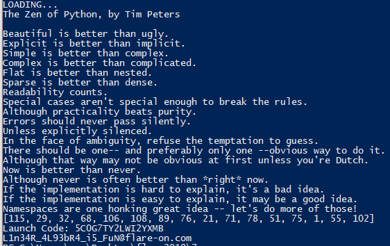

## Flare-On CTF 2019
# Challenge 07 : wopr

We are provided a x86 PE executable  
Throwing it into IDA Pro reveals strings like "MEIPASS" which indicates this is packaged by Pyinstaller

### Decompiling

I used [python_exe_unpacker](https://github.com/countercept/python-exe-unpacker) to unpack the pyinstaller exe.  
The main code is in pyiboot02_cleanup but it is missing the pyc headers.  
I wrote [fixpyc.php](fixpyc.php) to add in the headers for Python 3.7 pyc  
Then, I wrote [uncompile.py](uncompile.py) which will use uncompyle6 to decompile the pyc into python source code.  
I used Python 3.7 to run uncompile.py for it to decompile properly  

### Stage 1

The recovered python code is [here](pyiboot02_cleanup.py)  
Ignore the large docstring at the beginning for now  
I will be using python3 to run all python files in this solution.  

The first part of the code basically swaps the function pointer of print and exec.  
Its not that important and can be commented out during analysis

It then "unpacks" the next stage hidden inside the docstring.  

```py
for chuck in face:
	taxi = {9:0, 32:1}.get(chuck)
	if taxi is None:
		continue
	x, y = x | taxi << y, y + 1
	if y > 7:
		bell.write(bytes([x]))
		x, y = (0, 0)
```

Each Tab (0x9) represents bit 0 and each Space (0x32) represents bit 1  
The decompilation process actually destroys the Tabs in the docstring, so I extracted the docstring from the compiled pyc file into a [file](face_docstring) for easier processing.  
I changed the unpacking code to read in this file instead and unpack the next stage.  
There is a copy of this in [stage2.py](stage2.py)

### Stage 2

Analyzing the next stage, I figured out that the key to decrypt the flag is dependent on the output of the **wrong** function

The **wrong** function parses the PE structure to basically do the following
- Get the base address of the executable into the **trust** variable
- Extracts the .text section into the **spare** variable
- Extracts the .reloc section into the **truth** variable
- Parses the .reloc data and "relocate" pointers inside the .text section
  - relocates them by subtracting base address of the executable from the pointers
  - essentially they are "relocated" to direct offsets from the base of the exe
- Returns the MD5 hash of the **spare** variable (which is the .text section)

Since we are not running this in a EXE environment, there is an easier way to do this

I extracted the .text section from wopr.exe (starts from 0x400 for 0x1f224 bytes) into [wopr_text.bin](wopr_text.bin)  
I extracted the .reloc section from wopr.exe (starts from 0x5c000 for 0x17b8 bytes) into [wopr_reloc.bin](wopr_reloc.bin)
- Add two more null bytes at the end as that is what the python code use to detect the end of the .reloc section

I modified the **wrong** function to use these 2 files and set **trust** (exe base address) to 0x400000 which is the preferred load address  
You can see the modified code in [01_maincode.py](01_maincode.py)

At this point, this will produce the correct "key" (**h**) at the code portion shown below

```py
xor = [212, 162, 242, 218, 101, 109, 50, 31, 125, 112, 249, 83, 55, 187, 131, 206]
h = list(wrong())
h = [h[i] ^ xor[i] for i in range(16)]
```

### SMT to the rescue

This key is then used to compare against the large chunk of xor operations

```py
launch_code = input().encode()

x = list(launch_code.ljust(16, b'\0'))
b = 16 * [None]

b[0] = x[2] ^ x[3] ^ x[4] ^ x[8] ^ x[11] ^ x[14]
b[1] = x[0] ^ x[1] ^ x[8] ^ x[11] ^ x[13] ^ x[14]
b[2] = x[0] ^ x[1] ^ x[2] ^ x[4] ^ x[5] ^ x[8] ^ x[9] ^ x[10] ^ x[13] ^ x[14] ^ x[15]
b[3] = x[5] ^ x[6] ^ x[8] ^ x[9] ^ x[10] ^ x[12] ^ x[15]
b[4] = x[1] ^ x[6] ^ x[7] ^ x[8] ^ x[12] ^ x[13] ^ x[14] ^ x[15]
b[5] = x[0] ^ x[4] ^ x[7] ^ x[8] ^ x[9] ^ x[10] ^ x[12] ^ x[13] ^ x[14] ^ x[15]
b[6] = x[1] ^ x[3] ^ x[7] ^ x[9] ^ x[10] ^ x[11] ^ x[12] ^ x[13] ^ x[15]
b[7] = x[0] ^ x[1] ^ x[2] ^ x[3] ^ x[4] ^ x[8] ^ x[10] ^ x[11] ^ x[14]
b[8] = x[1] ^ x[2] ^ x[3] ^ x[5] ^ x[9] ^ x[10] ^ x[11] ^ x[12]
b[9] = x[6] ^ x[7] ^ x[8] ^ x[10] ^ x[11] ^ x[12] ^ x[15]
b[10] = x[0] ^ x[3] ^ x[4] ^ x[7] ^ x[8] ^ x[10] ^ x[11] ^ x[12] ^ x[13] ^ x[14] ^ x[15]
b[11] = x[0] ^ x[2] ^ x[4] ^ x[6] ^ x[13]
b[12] = x[0] ^ x[3] ^ x[6] ^ x[7] ^ x[10] ^ x[12] ^ x[15]
b[13] = x[2] ^ x[3] ^ x[4] ^ x[5] ^ x[6] ^ x[7] ^ x[11] ^ x[12] ^ x[13] ^ x[14]
b[14] = x[1] ^ x[2] ^ x[3] ^ x[5] ^ x[7] ^ x[11] ^ x[13] ^ x[14] ^ x[15]
b[15] = x[1] ^ x[3] ^ x[5] ^ x[9] ^ x[10] ^ x[11] ^ x[13] ^ x[15]

if b == h:
		# ..bla bla WIN STATE HERE
```

To figure out the "launch_code", I used Z3Py to solve the xor comparisons  
I wrote the solver script in [02_solve_smt.py](02_solve_smt.py)  
Running it will give me the correct launch_code.

> Launch Code: 5C0G7TY2LWI2YXMB

Putting the launch_code back into the maincode python script, I am able to decrypt the flag



The flag is **L1n34R_4L93bR4_i5_FuN@flare-on.com**

PS: For those wondering what the huge poem is, that's the [Zen of Python](https://en.wikipedia.org/wiki/Zen_of_Python)  
Not sure why it keeps getting printed though
