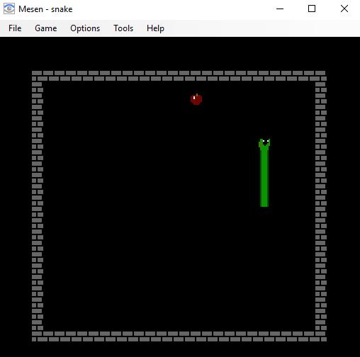
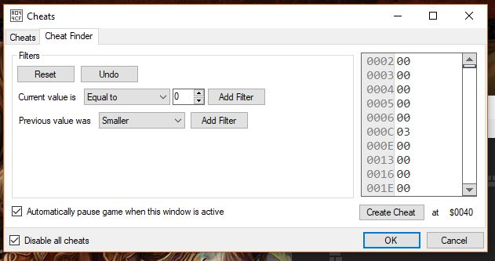
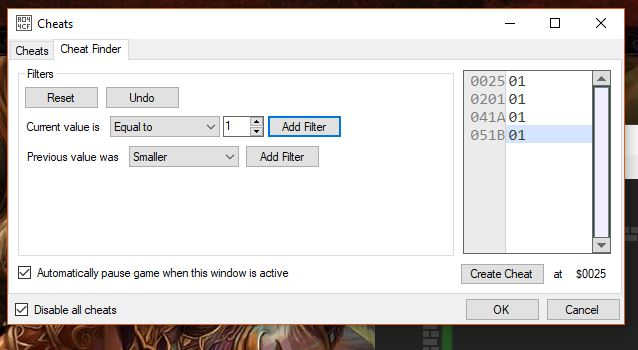
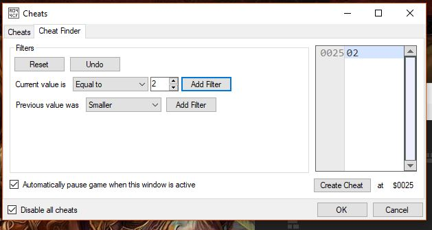
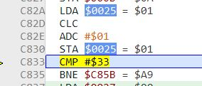
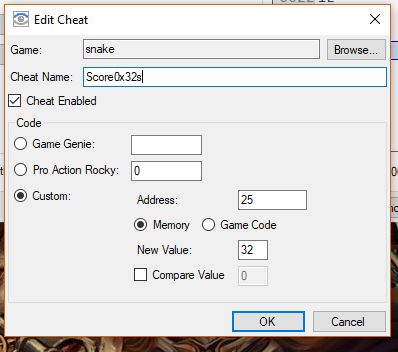
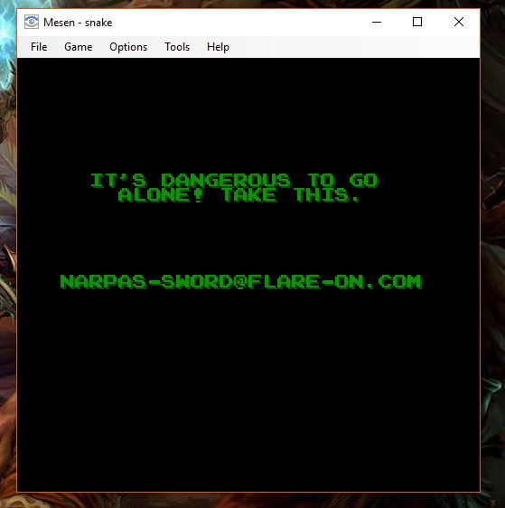

## Flare-On CTF 2019
# Challenge 08 : snake

We are provided with a NES Rom

I used the [Mesen Emulator](https://www.mesen.ca/) to solve this challenge

Running the ROM shows that its a typical snake game  
I figured that the challenge was about cheating the game to win

### Cheat Finder

I used a typical game cheating technique.  
There must be a variable that stores the "score"  
I used Mesen's Cheat Finder tool to do the following

I start the game and find all memory with value equal to 0x0

I then eat 1 food then find all memory with value equal to 0x1

I then eat 1 more food then find all memory with value equal to 0x2

By now, only 1 memory address fits all 3 conditions (0x25)  
I have found the score variable.  
There must be somewhere in the game where this score is checked against some kind of winning condition

### Debugger

I used Mesen's debugger tool and search for assembly code that references memory location 0x25
  - Find "$0025"

I found the code at 0xC82A
  - Loads value at memory address 0x25 into Register A
  - Adds 1 to Register A
  - Store the value in Register A back into memory address 0x25
  - Compare value in Register A against immediate value 0x33

You can also place a breakpoint here and eat a food.  
The breakpoint will trigger, confirming that this is the correct code area.  
Seems like its checking if the score is 0x33

### Let's Cheat!!

I opened the Cheat Finder Tool again, select memory address 0x25 and clicked on "Create Cheat"  
I entered 32 into the "New Value" field and save the cheat.  

Now the value in 0x25 will be set to 0x32  
Thus, when I eat a food, this will be incremented to 0x33 and hopefully pass the winning check.

Eating a food indeed brings the game to the next level where the speed of the snake is increased.  
Luckily, I can slow down Mesen's emulation (Options -> Speed -> Quarter) (You can make it even slower if you want)  
With the speed slowed down, it is easy to eat the food.

Win 4 levels and the flag will be shown

The flag is **narpas-sword@flare-on.com**
