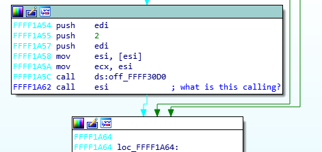
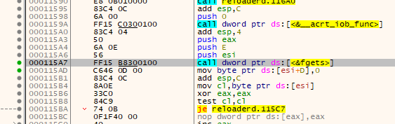
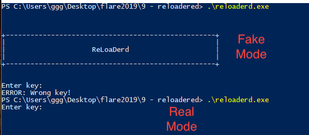

## Flare-On CTF 2019
# Challenge 09 : reloadered

We are provided with a x86 PE Executable

The initial disassembly shows a flag decryption process that is fake

### Fake Flag


I managed to find the key (RoT3rHeRinG) that would match all the conditions and it gave me a fake flag

> N3v3r_g0nnA_g!ve_You_uP@FAKEFLAG.com

### Finding the Real Flag

There was a very suspicious "call esi" instruction a few lines before the program asks you for the fake key. (0x1a62)



I put a breakpoint there and it led me to some code that never showed up in IDA Pro at 0x112d0

At this point I dumped the executable using scylla so I can analyze this code in IDA Pro, albeit not very nicely.  
It calls rdtsc and cpuid multiple times and do lots of arithmetic operations on them.  
I suspect its doing some form of anti-debugger check, calculating time differences between rdtsc calls  
If the check fails, it goes to the 0x11000 function which basically memsets the whole region to Nops

#### Bypassing Anti-Debugger

A quick browse of this new code shows that somewhere along the line, if it passes the anti-debuger checks, it will ask for user input again through fgets  



This means I could run the program first, let it pass the anti-debugger checks and wait at the fgets then attach my debugger to it.

Strangely enough, I could never make CMD run "fast enough" to get to the "real" mode.  
Using Powershell, I am able to get into the real mode sometimes.  
You know you are in the real mode when the "reloaderd" banner does not show



I can then attach a debugger and see what it does with my input.

#### Decrypting the Flag

It takes my input and substring it to only keep 0xd bytes.  
It then uses it as a xor key to decrypt another bunch of 0x34 encrypted bytes

```
Encrypted bytes
001EFDE0  7A 17 08 34 17 31 3B 25 5B 18 2E 3A 15 56 0E 11  z..4.1;%[..:.V..  
001EFDF0  3E 0D 11 3B 24 21 31 06 3C 26 7C 3C 0D 24 16 3A  >..;$!1.<&|<.$.:  
001EFE00  14 79 01 3A 18 5A 58 73 2E 09 00 16 00 49 22 01  .y.:.ZXs.....I".  
001EFE10  40 08 0A 14 00 00 01 00 04 00 00 00 E0 35 63 00  @...........�5c.
```

However, this time round, it does not check the key, it uses it to decrypt straight away.  
I was thinking of brute-forcing when a friend mentioned that the flag have to end with "@flare-on.com" (this was hinted to in the challenge question too)

"Coincidentally", "@flare-on.com" is 0xd bytes long and 0x34 is exactly divisible by 0x0d  
I xor-ed the last 13 encrypted bytes with "@flare-on.com" and it gave me the key **3HeadedMonkey**

I then used this key to decrypt the entire flag in my [solution script](soln.php).

The flag is **I_mUsT_h4vE_leFt_it_iN_mY_OthEr_p4nTs?!@flare-on.com**
