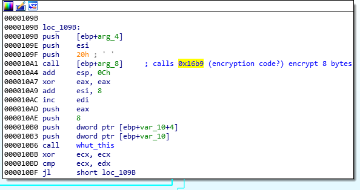
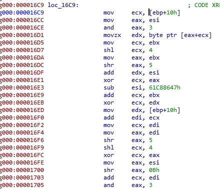
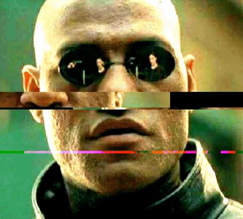

## Flare-On CTF 2019
# Challenge 10 : Mugatu Ware

Somebody was infected by a ransomware "Mugatu".  
His most prized GIF was encrypted, the goal is to recover this GIF.  
We are provided with the ransonware binary, a goal encrypted gif and a hint encrypted gif

It was quite a pain to reverse this as it messes with the IAT table and spawns many threads  
The function names shown by IDA Pro are wrong.  
I had to debug every line of code to figure out what function it was actually calling  
There's no special tips to reverse this, just step through the debugger and take notes

There is 2 main parts to this program, the Network part and the Filesystem part

### Network

The main job of the Network part is to get system information from the infected machine, send it to the CNC Server and receive an Encryption Key that will be used by the Filesystem part to encrypt files

#### Connecting to CNC Server

This is how it does it
- It gets a bunch of system info and save it as a long string
	- includes computer name, username, ip, windows version, etc...
- It then gets the first tweet from http://twitrss.me/twitter_user_to_rss/?user=ACenterForAnts
	- This website went down for awhile during the challenge.
	- I saved a copy of this [RSS feed](twitrss.me.txt) so that I could emulate it locally by changing my hosts file
- It then xors the sysinfo with the tweet, base64-encode it and send it to "mugatu.flare-on.com"
	- Same thing, this url does not exists so I had to emulate it locally using my hosts file
- It then waits for a response from the server and continually sleep if it does not receive any response

#### Faking a CNC Server

At this point, I had to setup a fake webserver, change my hosts file to point "mugatu.flare-on.com" to my local server and see what it does with my response

- It checks that the response is at least 0x34 bytes
- It then Base64 decodes it and xor each byte with 0x4d
- It then checks if it starts with "orange mocha frappuccino"
- If all the checks passed, it starts a new thread and passes it the rest of the bytes after the "orange mocha frappuccino"

I modified my server so that it would respond with a string that would pass all these checks  
Here is my [server php script](index.php)

#### Mailslot

The newly created thread basically creates 2 events "F0aMy" and "L4tt3"  
- I believe they are used to signal the other threads

It then writes the received bytes into a Mailslot file "\\\\.\\mailslot\\Let_me_show_you_Derelicte"

Mailslots is a Windows feature that allows "Dropbox" style inter-process/thread communication where 1 process/thread can drop data into a virtual "letterbox" which another process/thread can read from

### Filesystem Part

The filesystem part basically searches the filesystem for a specific directory and encrypts all the gif inside it

It searches for a directory called "really, really, really, ridiculously good looking gifs"  
Once found, it will find all the files with the search string "\*.gif" and encrypts it

Before encrypting, it opens the Mailslot file "\\\\.\\mailslot\\Let_me_show_you_Derelicte" and reads out 4 bytes.  
These 4 bytes are used as a key to the encryption algorithm

#### Encryption

Following that, I found the encryption function  
Below is a snippet



The encryption algorithm operates on 8 byte blocks



I searched the web using the magic numbers used in the algorithm and compared the algorithms with the assembly code  
I figured out that it is using the XTEA encryption algorithm

I tested my hypothesis
- I placed a sample gif in a folder called "really, really, really, ridiculously good looking gifs"
- I setup the webserver to reply with "abcd" as the key
- I ran the binary and it successfully encrypted my sample gif file
- I downloaded a [PHP XTEA script](https://github.com/divinity76/php-xtea) and tried to decrypt my encrypted gif with the key "abcd"
- The gif successfully decrypted, confirming my guess

At this point, I can start to brute force as I know the key is 4 bytes long  
But what about that hint gif?

The answer is in its filename **the_key_to_success_0000.gif.Mugatu**  
The key to this gif is actually 4 null bytes  
Running the script with a key of 4 null bytes decrypted this gif



It tells us that the first key byte is 0x31  
This significantly reduced the bruteforce keyspace

I wrote this [brute force script](soln.php)

```php
<?php
require_once "XTEA.class.php"; // https://github.com/divinity76/php-xtea
$xtea = new XTEA();

$best = file_get_contents("best.gif.Mugatu");
$best_8 = substr($best,0,8);

for($k2 = 0; $k2<256; $k2++){
    for($k3 = 0; $k3<256; $k3++){
        for($k4 = 0; $k4<256; $k4++){
            $keys = array(0x31, $k2, $k3, $k4);
            $res = $xtea->decrypt($best_8, $keys);

            $gifheader = substr($res, 0, 3);
            $k_print = $keys[0]."_".$keys[1]."_".$keys[2]."_".$keys[3];

            if ($gifheader == "GIF"){
                echo "Possible valid key: $k_print \n";

                $gif = $xtea->decrypt($best, $keys);
                $fname = "best_".$k_print.".gif";
                file_put_contents($fname, $gif);
                echo "$fname written\n";

            }
        }
    }
}
?>
```

As the XTEA decryption script is quite slow, I only tried to decrypt the first 8 bytes using each key  
Only if the decrypted 8 bytes starts with the "GIF" header, then I would decrypt the entire file  
Leaving this to run for awhile will decrypt **best.gif** and reveal the flag


The flag is **FL4rE-oN_5o_Ho7_R1gHt_NoW@flare-on.com**
