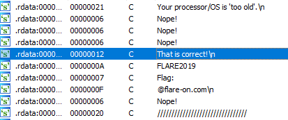
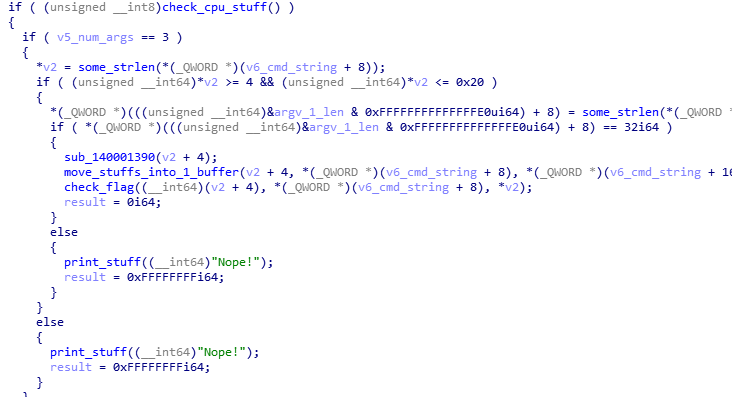
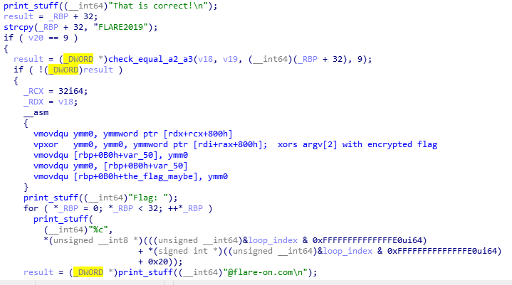
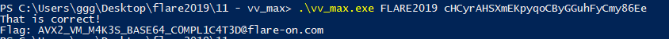

## Flare-On CTF 2019
# Challenge 11 : vv_max

We are provided with a x64 PE

There are a few strings that are interesting



Following these string will lead to the interesting function at 0x1220



### Checks, Checks and more Checks

It does a bunch of checks.  
If all the checks passed, then the flag is revealed

Debugging it in a debugger, I figured out what they are checking for

- It first checks if the CPU is not too old
  - I'm not sure what features they were actually looking for but I used a Windows 10 VM and this check passed by default
  - Most likely its to make sure that it can run the extended instructions shown below
- It then checks if "argc" is 3, meaning there are a total of 2 cmd-line arguments
  - Let's call these arguments **ARG1** and **ARG2**
    - vv_max.exe ARG1 ARG2
- It then checks if the length of **ARG1** is between 0x04 and 0x20
- It then checks if the length of **ARG2** is exactly 0x20

**check_flag** (0x1610) function is called once all these checks are passed


This function does more checks by comparing 2 buffers in memory
- vpcmpeqb basically compares each bit in the 2 ymm buffer
  - If both bits are the same, it will set the bit in the destination to be 1, 0 otherwise
  - If then AND this ymm buffer with 0xFFFFFFFFFFFFFFFF and checks that the result is -1 (meaning all the bits are set)
- Therefore, it is actually checking if the content of these 2 buffers are the same

More debugging revealed that the content of these 2 buffer changes according to **ARG1** and **ARG2**  
My first instinct was it was some kind of hash of **ARG1** and **ARG2**

There are even more checks after confirming these 2 buffers contain the same content



It then checks if **ARG1** is equals to "FLARE2019"  
If it is, it will use **ARG2** to xor with the encrypted flag and display the result

### The Goal

In conclusion, this is what I have to provide
- **ARG1** must be "FLARE2019"
  - This will produce a hash, let's call it **HASH1**
- **ARG2** must be 0x20 characters long
  - The produced **HASH2** must be equal to **HASH1**

Initially, I was thinking it was some kind of hash collision challenge but it was actually much simpler

I tried to look for the hashing function but this program is a pain to reverse  
It uses lots of function pointer tables to call functions which made tracing the calls much more difficult

### Hash? Maybe not...

After some head banging against the wall, I tried a different approach  
I was thinking it may not be a real hash as trying to break a 32 byte hash would take a long time  

So, I wanted to see how my input would affect the hash and I tried supplying different inputs and see what the output was

First, I took note of my target "hash", this is what was produced by making **ARG1** equal to "FLARE2019"

```
70 70 B2 AC 01 D2 5E 61 0A A7 2A A8 08 1C 86 1A E8 45 C8 29 B2 F3 A1 1E 00
```

One thing to note is that the hash is much shorter than 0x20 bytes, its about 0x18 bytes long

I started to see something interesting when I used the test input of 32 As

```
AAAAAAAAAAAAAAAAAAAAAAAAAAAAAAAA
00 00 00 00 00 00 00 00 00 00 00 00 00 00 00 00 00 00 00 00 00 00 00 00 00
```

The buffer was all nulls  
I started to make small changes and this is what I saw

```
BAAAAAAAAAAAAAAAAAAAAAAAAAAAAAAA
04 00 00 00 00 00 00 00 00 00 00 00 00 00 00 00 00 00 00 00 00 00 00 00 00

CAAAAAAAAAAAAAAAAAAAAAAAAAAAAAAA
08 00 00 00 00 00 00 00 00 00 00 00 00 00 00 00 00 00 00 00 00 00 00 00 00

DAAAAAAAAAAAAAAAAAAAAAAAAAAAAAAA
0C 00 00 00 00 00 00 00 00 00 00 00 00 00 00 00 00 00 00 00 00 00 00 00 00

ZAAAAAAAAAAAAAAAAAAAAAAAAAAAAAAA
64 00 00 00 00 00 00 00 00 00 00 00 00 00 00 00 00 00 00 00 00 00 00 00 00

aAAAAAAAAAAAAAAAAAAAAAAAAAAAAAAA
68 00 00 00 00 00 00 00 00 00 00 00 00 00 00 00 00 00 00 00 00 00 00 00 00

cAAAAAAAAAAAAAAAAAAAAAAAAAAAAAAA
70 00 00 00 00 00 00 00 00 00 00 00 00 00 00 00 00 00 00 00 00 00 00 00 00
```

These made me realize 2 things
- This is not a hash, changing 1 byte of input only changed 1 byte of output
  - Its more like an encoding
- There is some kind of predictable pattern

Having the first character be 'c' will make the output match our target's first byte

I then tried to change the 2nd character

```
ccAAAAAAAAAAAAAAAAAAAAAAAAAAAAAA
71 C0 00 00 00 00 00 00 00 00 00 00 00 00 00 00 00 00 00 00 00 00 00 00 00
```

The output did not match?! I tried changing more characters

```
cccAAAAAAAAAAAAAAAAAAAAAAAAAAAAA
71 C7 00 00 00 00 00 00 00 00 00 00 00 00 00 00 00 00 00 00 00 00 00 00 00

ccccAAAAAAAAAAAAAAAAAAAAAAAAAAAA
71 C7 1C 00 00 00 00 00 00 00 00 00 00 00 00 00 00 00 00 00 00 00 00 00 00
```

When I converted these to binary, a pattern emerges

```
cAAAAAAAAAAAAAAAAAAAAAAAAAAAAAAA
70 00 00 00 00 00 00 00 00 00 00 00 00 00 00 00 00 00 00 00 00 00 00 00 00
011100 00 ...

ccAAAAAAAAAAAAAAAAAAAAAAAAAAAAAA
71 C0 00 00 00 00 00 00 00 00 00 00 00 00 00 00 00 00 00 00 00 00 00 00 00
011100 011100 0000 ...

cccAAAAAAAAAAAAAAAAAAAAAAAAAAAAA
71 C7 00 00 00 00 00 00 00 00 00 00 00 00 00 00 00 00 00 00 00 00 00 00 00
011100 011100 011100 ...

ccccAAAAAAAAAAAAAAAAAAAAAAAAAAAA
71 C7 1C 00 00 00 00 00 00 00 00 00 00 00 00 00 00 00 00 00 00 00 00 00 00
011100 011100 011100 011100 ...
```

Each input byte is encoded into 6 bits  
Hmm, encoding each byte into 6 bits...  
I started to have a suspicion and I confirmed it

```
zAAAAAAAAAAAAAAAAAAAAAAAAAAAAAAA
CC 00 00 00 00 00 00 00 00 00 00 00 00 00 00 00 00 00 00 00 00 00 00 00 00

0AAAAAAAAAAAAAAAAAAAAAAAAAAAAAAA
D0 00 00 00 00 00 00 00 00 00 00 00 00 00 00 00 00 00 00 00 00 00 00 00 00

9AAAAAAAAAAAAAAAAAAAAAAAAAAAAAAA
F4 00 00 00 00 00 00 00 00 00 00 00 00 00 00 00 00 00 00 00 00 00 00 00 00

+AAAAAAAAAAAAAAAAAAAAAAAAAAAAAAA
F8 00 00 00 00 00 00 00 00 00 00 00 00 00 00 00 00 00 00 00 00 00 00 00 00

/AAAAAAAAAAAAAAAAAAAAAAAAAAAAAAA
FC 00 00 00 00 00 00 00 00 00 00 00 00 00 00 00 00 00 00 00 00 00 00 00 00
```

This is basically the Base64 alphabet  
It was basically doing Base64 encoding

Knowing this, I wrote a [php script](soln.php) to decode the target bytes into the base64 alphabet

> cHCyrAHSXmEKpyqoCByGGuhFyCmy86Ee

Making **ARG2** equal to the above will produce the flag

> vv_max.exe FLARE2019 cHCyrAHSXmEKpyqoCByGGuhFyCmy86Ee



The flag is **AVX2_VM_M4K3S_BASE64_C0MPL1C4T3D@flare-on.com**
