## Flare-On CTF 2019
# Challenge 12 : Help

A memory crash dump and network capture is provided

I did not upload the challenge zip as it is about 500MB in size.  
Please download it from the [official site](http://flare-on.com/files/Flare-On6_Challenges.zip)

The challenge text describes that a compromised machine had a BSOD and they provided the crash dump and the network capture of that machine.

As it was a Windows Kernel crash dump, I loaded it into WinDbg and ran "!analyze -v"  
It provided some useful information
  - The machine is running Windows 7 SP 1 (64-bit)
  - It crashed inside the "man" module

I ran "lmvm man" to look at the module details of "man"

```
kd> lmvm man
Browse full module list
start             end                 module name
fffff880`033bc000 fffff880`033cb000   man      T (no symbols)           
    Loaded symbol image file: man.sys
    Image path: \??\C:\Users\FLARE ON 2019\Desktop\man.sys
    Image name: man.sys
    Browse all global symbols  functions  data
    Timestamp:        unavailable (FFFFFFFE)
    CheckSum:         missing
    ImageSize:        0000F000
    Translations:     0000.04b0 0000.04e4 0409.04b0 0409.04e4
```

It's a ".sys" driver file. I can dump it using writemem

```
kd> .writemem C:\\tmp\\man.sys fffff880`033bc000 Lf000
Writing f000 bytes..............................
```

### Reversing man.sys and m.dll

man.sys seems to have been nulled out. But there are still partial code left in it.  
In between the "CC" chunks are actually executable code. I manually defined those regions as code regions in IDA.

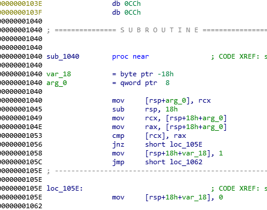

Also, within this memory dump is another PE executable. Search for a "MZ" header and extract it.

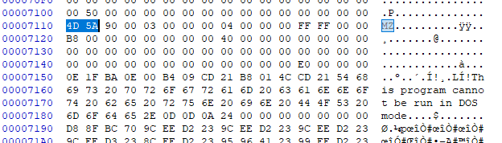

Loading it in IDA shows that this is a DLL and it's pdb path reveals that it is called "m".  
Let's call this **m.dll**

First of all, the strings in both binary is obfuscated.

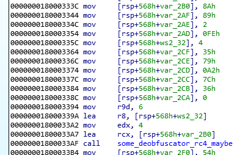

Reversing the de-obfuscation function reveals that it uses a simple RC4 to decrypt the string.  
The first argument (rcx) contains the key and the 3rd argument (r8) contains the message.  
I wrote a simple deobfuscation function in [deobfus.php](deobfus.php) to help me deobfuscate all these strings.  
These strings are function names.

I started reversing **m.dll** from its only exported function "c" and this is what I managed to find.
  - It starts listening on port 4444
  - Once it receives something on this port, it checks the first 4 bytes against a list of magic numbers to determine which function to call

  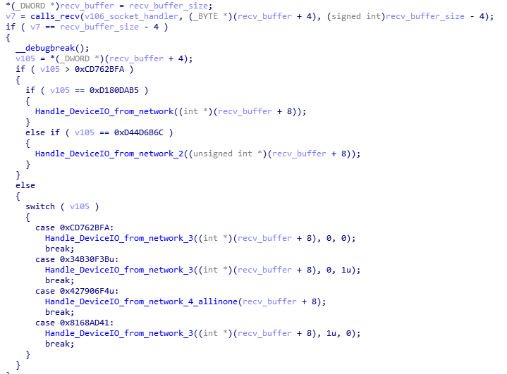

  - All those functions eventually "sends" the remaining received bytes to a device "\\\\.\\FLID" using the DeviceIOControl function with various ioctl codes.

Reversing the various code pockets in **man.sys** reveals the following
  - It creates and registers the device called "\\\\.\\FLID"
  - It handles various ioctl codes
  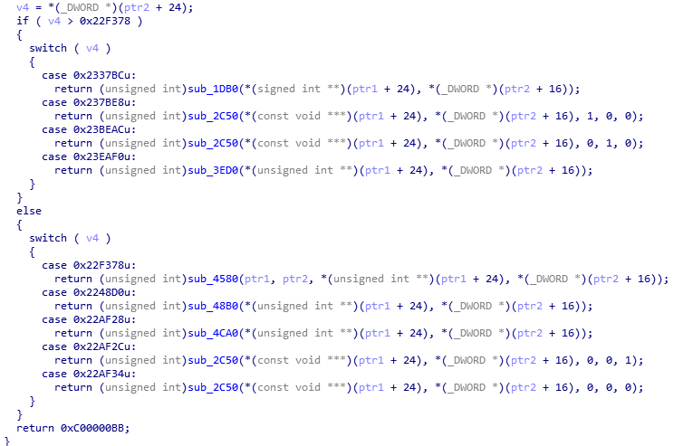

### Port 4444

At this point, I couldn't decipher what all these functions are doing exactly.  
So, I went to the network capture and tried to find what was sent over port 4444.

[4444.txt](network/4444.txt) is a list of the data that was sent over port 4444 in hex string format.  
I was expecting to find the magic numbers I found in **m.dll** but they are not there.  
I was stumped for awhile until I realized that I could search for these magic numbers in the crash dump.

### Dumping the DLLs

I used volatility to search the crash dump.  
First of all, the "imageinfo" command did not detect the correct profile to use.  
The correct profile to use is based on the WinDbg output "Win7SP1x64".  
Remember to switch the endianness of the magic numbers when searcing.

After searching for a few of these magic numbers, I noticed that some of them have a PE executable right after it and are all in PID 876  

```
> volatility -f help.dmp --profile=Win7SP1x64 yarascan -Y "{fa 2b 76 cd}"
..........
Owner: Process svchost.exe Pid 876
0x00da0004  fa 2b 76 cd 47 47 da be 64 04 00 00 61 1e 00 00   .+v.GG..d...a...
0x00da0014  00 36 00 00 b0 2a 00 00 4d 5a 90 00 03 00 00 00   .6...*..MZ......
0x00da0024  04 00 00 00 ff ff 00 00 b8 00 00 00 00 00 00 00   ................
0x00da0034  40 00 00 00 00 00 00 00 00 00 00 00 00 00 00 00   @...............
0x00da0044  00 00 00 00 00 00 00 00 00 00 00 00 00 00 00 00   ................
0x00da0054  00 00 00 00 e0 00 00 00 0e 1f ba 0e 00 b4 09 cd   ................
0x00da0064  21 b8 01 4c cd 21 54 68 69 73 20 70 72 6f 67 72   !..L.!This.progr
0x00da0074  61 6d 20 63 61 6e 6e 6f 74 20 62 65 20 72 75 6e   am.cannot.be.run
0x00da0084  20 69 6e 20 44 4f 53 20 6d 6f 64 65 2e 0d 0d 0a   .in.DOS.mode....
0x00da0094  24 00 00 00 00 00 00 00 d8 8f bc 70 9c ee d2 23   $..........p...#
0x00da00a4  9c ee d2 23 9c ee d2 23 9c ee d3 23 8c ee d2 23   ...#...#...#...#
..........
```

To extract these executables correctly, first dump the memory of PID 876 into a file

```
> volatility -f help.dmp --profile=Win7SP1x64 memdump -p 876 --dump-dir out"
```

This will create a memory dump file called "876.dmp"  
I searched that dump file using a hex editor (HxD) for the magic numbers and extracted the MZ file that followed  
I extracted a total of 7 executables (mainly DLLs)  
I've uploaded them in **binaries.zip** file (pw is infected)

The pdb path left in these executables gave a clue on what they do.
  - stmedit.sys (Did not investigate this)
  - shellcodedriver.sys (32-bit driver that runs shellcode?, did not investigate)
  - c.dll (cryptodll)
  - f.dll (filedll)
  - k.dll (keylogdll)
  - n.dll (networkdll)
  - s.dll (screenshotdll)

All these DLLs only have 1 exported function which made it fairly straightforward to reverse.  
They also use the same string obfuscation technique.

### Getting the Screenshots

The first DLL that caught my attention was **screenshot.dll**

It does what it's name suggests. It takes a screenshot and stores it in a Bitmap format  
The main takeaway from reversing this code is that the length field in the Bitmap header will always end with 0x36.
  - 0x36 is actually the length of the BMP header and is added to the length of the pixel data

This means these BMPs can be found by searching for the "BM6" signature

I extracted all the data send over port 7777 into [7777.bin](network/7777.bin)  
Searching for "BM6" in it reveals several BMPs  
I extracted them but something did not look right

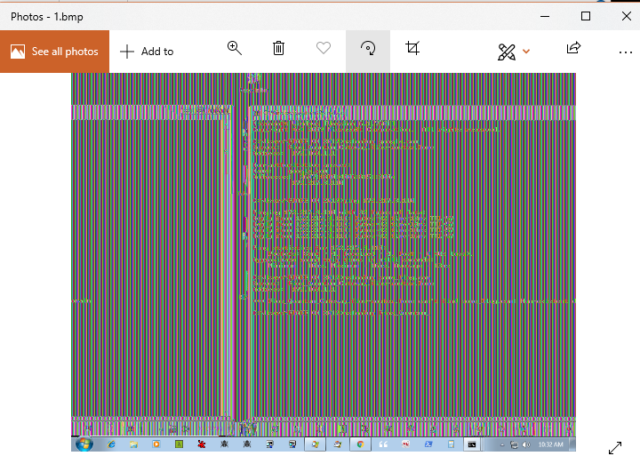

If these BMPs was sent through the network, they may still exist in the memory dump  
Therefore, I searched the memory dump for "BM6" header

```
> volatility -f help.dmp --profile=Win7SP1x64 yarascan -Y "BM6"
..........
Owner: Process svchost.exe Pid 876
0x06b60000  42 4d 36 00 24 00 00 00 00 00 36 00 00 00 28 00   BM6.$.....6...(.
0x06b60010  00 00 00 04 00 00 00 03 00 00 01 00 18 00 00 00   ................
0x06b60020  00 00 00 00 24 00 00 00 00 00 00 00 00 00 00 00   ....$...........
0x06b60030  00 00 00 00 00 00 b6 a0 8a b6 a0 8a b6 a0 8a b6   ................
0x06b60040  a0 8a b6 a0 8a b6 a0 8a b6 a0 8a b6 a0 8a b6 a0   ................
0x06b60050  8a b6 a0 8a b6 a0 8a b6 a0 8a b6 a0 8a b6 a0 8a   ................
..........
```

Once again, there are several BMPs in pid 876  
I wrote a Python script [extract_bmp.py](extract_bmp.py) to extract these BMPs from the 876.dmp I created earlier

This time round, they look correct  
It extracted a total of 38 BMPs, some of which looks like repeat copies  
I won't be uploading the original BMPs as they are quite huge, I'll be showing snapshots of them highlighting the important information  
The most interesting picture is these 2 pictures

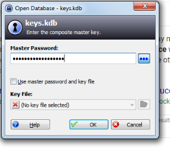

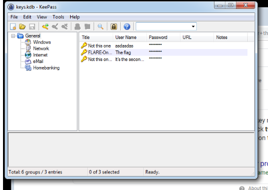

It shows the user opening a KeePass database with a password and one of the password entry is "The Flag"  
This seems like the goal

### Network Packet Decryption

At this point, there are still packets on Port 6666 and 8888 which does not look readable  
Let's reverse **network.dll** and **crypto.dll**

**network.dll** does the following
  - It takes in the data and calculate its size
  - It appends this size at the front of the data as a 4-byte dword
  - It then sends the entire data chunk

Looking at the packets using ports 6666 and 8888, they seem to follow this format

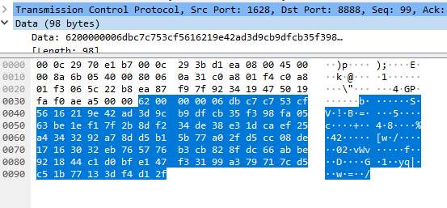

**crypto.dll** does the following
  - It tries to compress the data using RTLCompressBuffer with LZNT1 algorithm
  - It then grabs the current Username using GetUsernameA
  - It then uses the username as a key to RC4 encrypt the compressed data

One of the retrieved screenshot actually show the username

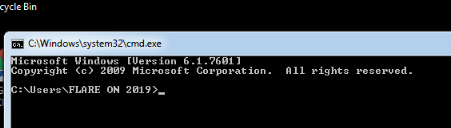

I used the username "FLARE ON 2019" to decrypt the packet data and the uncompress it using LZNT1 decompression  
However, I still could not get anything readable

I was actually stuck here for a few days until a friend told me to read the GetUsernameA MSDN documentation again.

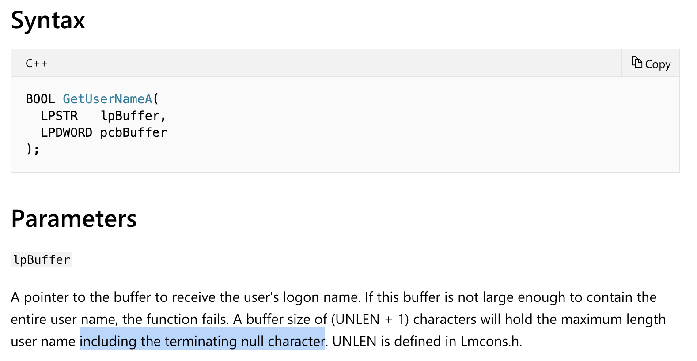

This is here to remind me to RTFM next time.....
The correct key actually includes the terminating null character

With that, I dumped the packet streams into various ".bin" files and wrote this [python script](network/decrypt_packet.py) to decrypt their contents

For the LZNT1 decompression part, I used the script from [rekall](https://github.com/google/rekall/blob/master/rekall-core/rekall/plugins/filesystems/lznt1.py) project

The KeePass DB was sent over port 6666 and what seems like keylogs are sent over port 8888

```py
from arc4 import ARC4
import lznt1

def decrypt_packet(fname, decompression_rounds=1):
    with open(fname, "rb") as binfile:
        data = binfile.read()

    rc4 = ARC4("FLARE ON 2019\x00")
    msg = rc4.decrypt(data[4:])
    for i in xrange(decompression_rounds):
        msg = lznt1.decompress_data(msg)

    return msg

print("Decrypting kdb file (Port 6666)\n")
kdb_bytes = decrypt_packet("6666.bin")
with open("flag.kdb", "wb") as flagfile:
    flagfile.write(kdb_bytes)
    print("flag.kdb written...\n")

print("Decrypting Keylogs (Port 8888):\n")
print(decrypt_packet("8888_a.bin"))
print("----------------------")
print(decrypt_packet("8888_b.bin"))
print("----------------------")
print(decrypt_packet("8888_c.bin"))
print("----------------------")
print(decrypt_packet("8888_d.bin"))
print("----------------------")
print(decrypt_packet("8888_e.bin"))
```

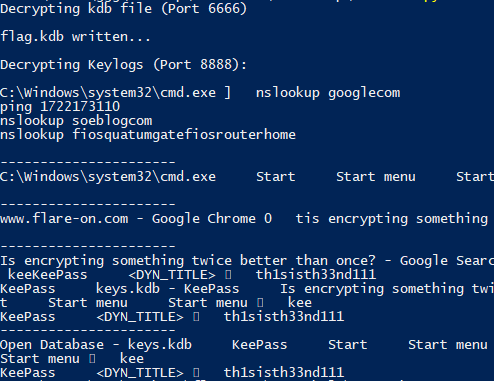

**th1sisth33nd111** seems like the password captured by the keylog  
However, it still failed to open the KeePass DB

### Opening the KeePass DB

The last piece of the puzzle is how the keylogs are captured

Reversing **keylog.dll** reveals the following
  - It stores the Window Title and the captured keys
  - It only logs Alphanumeric characters, spaces and newlines
  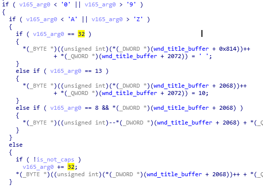
    - It does not log any other symbols
    - It also converts all uppercase characters to lowercase

The recovered keylog password above could mean lots of different strings

I initially tried to brute force the password using the recovered keylog to reduce the keyspace  
John The Ripper has a module "keepass2john" that will convert a KeePass DB into a hash that it can attempt to crack  
Also, from another screenshot, I know that the password is at least 18 characters long


I tried something like the following to use some intelligent guessing to reduce the possible keyspace

```
./john -1='tThH1sSiI3nNdD?s' -mask=?1?1?1?1?1?1?1?1?1?1?1?1?1?1?1?1?1?1 kdb.hash

./john -mask=[tT][hH][1!][sS]?s[iI][sS]?s[tT][hH][3#]?s[3#][nN][dD][1!][1!][1!] kdb.hash
```

However, it would take me almost a year to complete the brute force.

Like a recurring theme in this puzzle, I realized that the actual keys could still be in memory  
I used the recovered keylog to formulate substrings that I could search for  
Eventually "3nd" led to something interesting

```
> volatility -f help.dmp --profile=Win7SP1x64 yarascan -C -Y "3nd"
..........
Owner: Process vmtoolsd.exe Pid 1352
0x033f75cc  33 4e 64 21 21 21 00 00 0a 00 0a 00 9c 06 b5 50   3Nd!!!.........P
0x033f75dc  f3 00 00 88 68 cf 66 f8 fe 07 00 00 01 00 00 00   ....h.f.........
0x033f75ec  01 00 00 00 80 d3 97 03 00 00 00 00 9e 06 b5 50   ...............P
0x033f75fc  f3 00 00 88 68 cf 66 f8 fe 07 00 00 01 00 00 00   ....h.f.........
..........
```

This looks very similar to the recovered keylog and it has different cases.  
Let's see what else is at this memory address using volshell

```
> volatility -f help.dmp --profile=Win7SP1x64 volshell -p 1352
Volatility Foundation Volatility Framework 2.6
Current context: vmtoolsd.exe @ 0xfffffa8003686620, pid=1352, ppid=1124 DTB=0x14d1f000
Welcome to volshell! Current memory image is:
file:///Users/gee/Desktop/flare_2019/chal12/help.dmp
To get help, type 'hh()'
>>> db(0x33f75cc-0x20)
0x033f75ac  00 00 00 00 20 62 79 74 65 73 0a 00 9a 06 b5 50   .....bytes.....P
0x033f75bc  f3 00 00 80 9c 01 21 73 5f 69 53 5f 74 68 33 5f   ......!s_iS_th3_
0x033f75cc  33 4e 64 21 21 21 00 00 0a 00 0a 00 9c 06 b5 50   3Nd!!!.........P
0x033f75dc  f3 00 00 88 68 cf 66 f8 fe 07 00 00 01 00 00 00   ....h.f.........
```

That matches almost exactly with the recovered keylog.  
It is only missing the front 2 letters, there is at most 4 combinations to try
  - th!s_iS_th3_3Nd!!!
  - Th!s_iS_th3_3Nd!!!
  - tH!s_iS_th3_3Nd!!!
  - TH!s_iS_th3_3Nd!!!

At the end, **Th!s_iS_th3_3Nd!!!** successfully opened the KeePass DB to read the flag

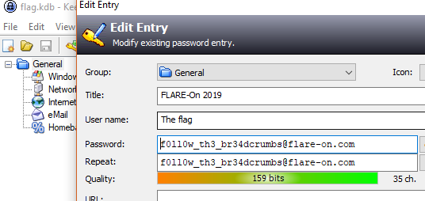

The flag is **f0ll0w_th3_br34dcrumbs@flare-on.com**
