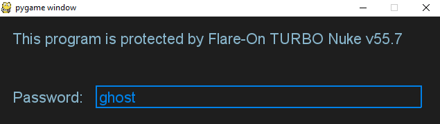
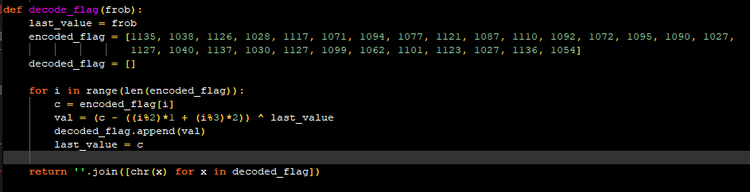
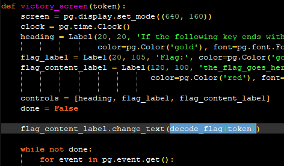
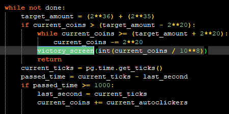
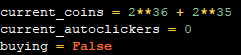
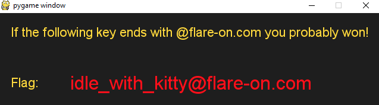

## Flare-On CTF 2020
# Challenge 01 : Fidler

```
Welcome to the Seventh Flare-On Challenge!

This is a simple game.
Win it by any means necessary and the victory screen will reveal the flag.
Enter the flag here on this site to score and move on to the next level.

This challenge is written in Python and is distributed as a runnable EXE and matching source code for your convenience.
You can run the source code directly on any Python platform with PyGame if you would prefer.
```

We are provided a 7zip file with a Python game

There is 2 ways to run this game
1. Run the fidler.exe
2. Run the fidlet.py (requires pygame)
	- python -m pip install pygame

The python file has the entire source code so it is easier to work with that.

First, it checks for a password which is just a rot1 cipher with the key "hiptu" which gives "ghost"

```py
license = "hiptu"
lic = "".join([chr(ord(x)-1) for x in license])
print("License Key: %s" % lic)
```



After providing the password, you get into the game proper  
It is just a clicker game where u need to get more than 100 billion coins  
As we have the source code, we can actually just modify the code

This is where the flag is decoded


This function is called by the **victory_screen** function



This function is then called by the **game_screen** function under certain conditions



The **current_coins** variable have to be more than a certain amount

This variable is actually a global variable declared right at the top of the script  
Changing it to equal the target_amount will reveal the flag





The flag is **idle_with_kitty@flare-on.com**
