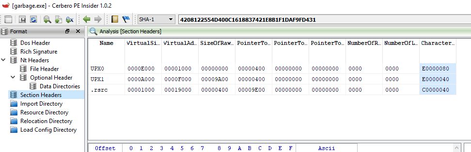
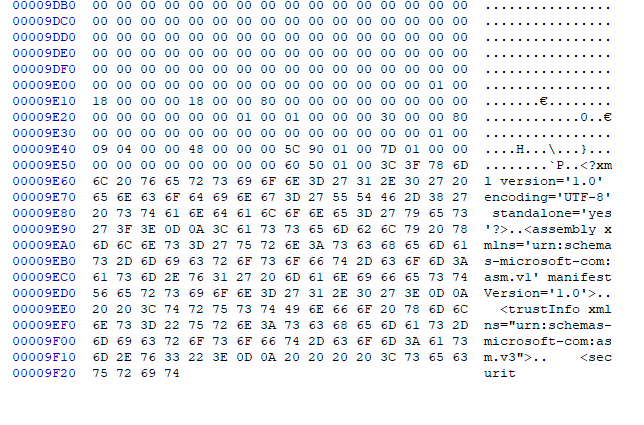
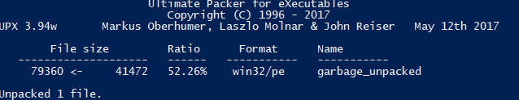
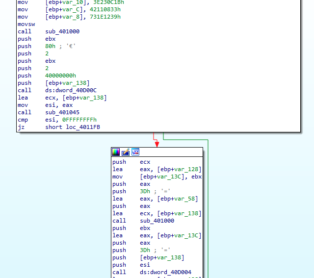
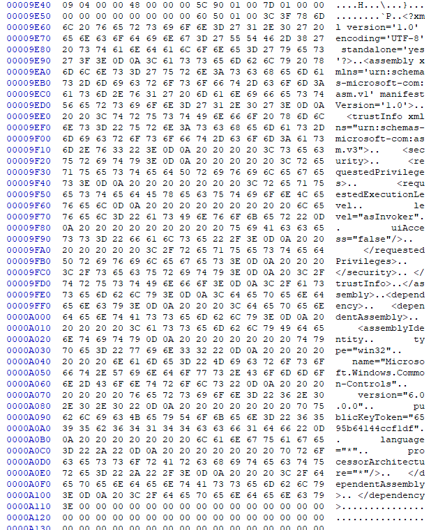
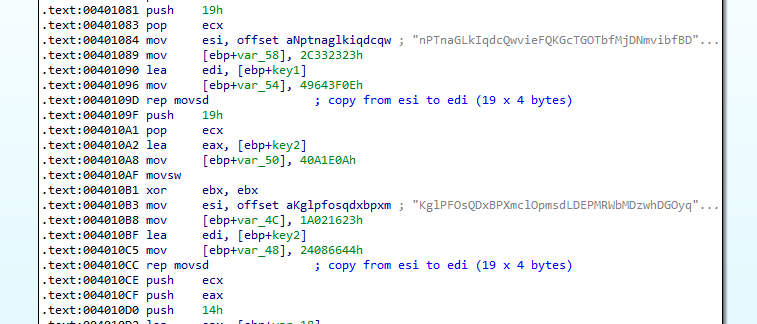
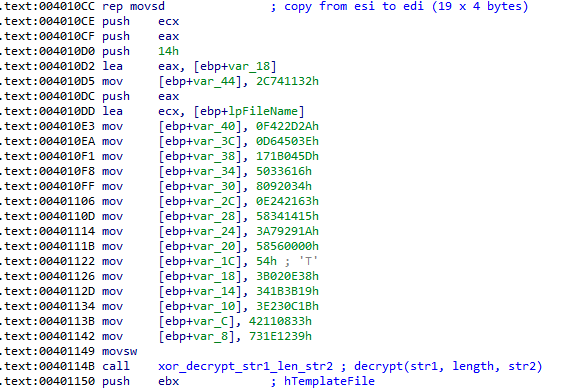
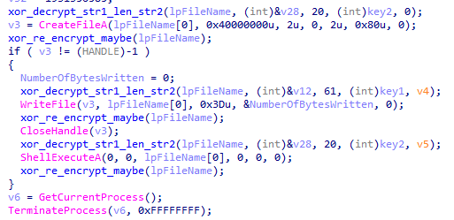
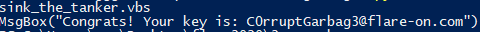

## Flare-On CTF 2020
# Challenge 02 : garbage

```
One of our team members developed a Flare-On challenge but accidentally deleted it.
We recovered it using extreme digital forensic techniques but it seems to be corrupted.
We would fix it but we are too busy solving today's most important information security threats affecting our global economy.
You should be able to get it working again, reverse engineer it, and acquire the flag.
```

We are provided a corrupted executable file

Opening the file in a hex editor reveals the string "UPX", hence it is likely to be upx packed

However, the binary cannot be run as it is corrupted  
Trying to unpack with "upx -d" also failed, probably for the same reasons

I tried various methods to fix this till I found the following method

### "Repairing" the binary

I used peinsider to analyze the file headers, in particular, the section headers



Looking at the end of the file, it looks like the **.rsrc** section is truncated



According to the section headers, the total file size should be 0xA200 (0x9E00 + 0x400)

Padding the file till 0xA200 bytes allowed upx to unpack the file  
For sanity sake, I also downloaded the version of upx that was used to pack the file
- This can be seen near the "UPX!" header



Throwing this binary into IDA now shows some interesting code



I also noticed another thing  
If you look at the end of the file again, it looks like a truncated xml file

If you have done Windows programming before, it would look familiar  
It looks like the Windows Application Manifest file

I found a copy of the [default manifest file](http://docwiki.appmethod.com/appmethod/1.17/topics/en/Customizing_the_Windows_Application_Manifest_File) and appended it to the incomplete version at the end of the file

```xml
<?xml version="1.0" encoding="UTF-8" standalone="yes"?>
<assembly xmlns="urn:schemas-microsoft-com:asm.v1" manifestVersion="1.0">
 <dependency>
   <dependentAssembly>
     <assemblyIdentity
       type="win32"
       name="Microsoft.Windows.Common-Controls"
       version="6.0.0.0"
       publicKeyToken="6595b64144ccf1df"
       language="*"
       processorArchitecture="*"/>
   </dependentAssembly>
 </dependency>
 <trustInfo xmlns="urn:schemas-microsoft-com:asm.v3">
   <security>
     <requestedPrivileges>
       <requestedExecutionLevel
         level="asInvoker"
         uiAccess="false"/>
       </requestedPrivileges>
   </security>
 </trustInfo>
</assembly>
```



Unpacking this version of the binary then throwing it into IDA actually resolved some of the function calls


### Reversing the code

Although upx managed to unpack the binary, I was still unable to run the binary.  
Therefore, I had to use static analysis only.  
Luckily, the code is fairly straight-forward.

If first copied 2 strings into local variables, lets call them **key1** and **key2**



It then loads some encrypted values on the stack and calls a function.  
This function basically xor 2 strings together for a specified length.



3 sets of strings were decrypted this way and passed into API calls
- String1 is passed into a CreateFile
- String2 is passed into WriteFile (presumably written into the created file)
- String3 is passed into a ShellExecute (this string is the same as String1)
	- Executing the file that was created



I extracted the encrypted bytes and wrote a [python script](soln.py) to decrypt it

```py

def xorstr(s1, msglen, s2):
    out = ""
    for i in range(msglen):
        tmp = s1[i] ^ s2[i]
        out += chr(tmp)
    return out

def main():
    key1 = b"nPTnaGLkIqdcQwvieFQKGcTGOTbfMjDNmvibfBDdFBhoPaBbtfQuuGWYomtqTFqvBSKdUMmciqKSGZaosWCSoZlcIlyQpOwkcAgw "
    key2 = b"KglPFOsQDxBPXmclOpmsdLDEPMRWbMDzwhDGOyqAkVMRvnBeIkpZIhFznwVylfjrkqprBPAdPuaiVoVugQAlyOQQtxBNsTdPZgDH "

    enc1 = bytes.fromhex("380E023B193B1B341B0C233E3308114239121E73")
    print(xorstr(key2, 0x14, enc1))

    enc2 = bytes.fromhex("2323332C0E3F64490A1E0A042316021A446608243211742C2A2D420F3E50640D5D041B1716360305342009086321240E151434581A29793A0000565854")
    print(xorstr(key1, 0x3d, enc2))

if __name__ == "__main__":
    main()

```

Running it will reveal the flag



The flag is **C0rruptGarbag3@flare-on.com**
