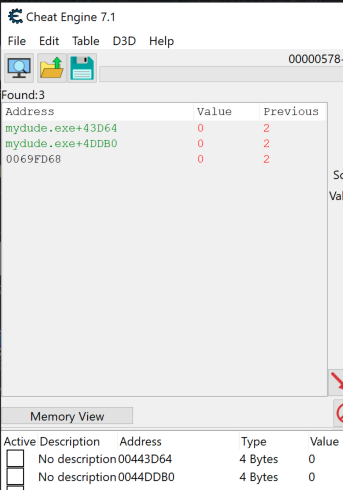
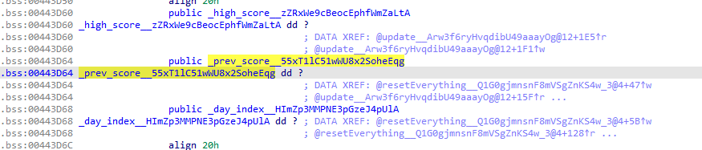
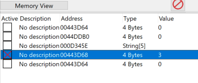
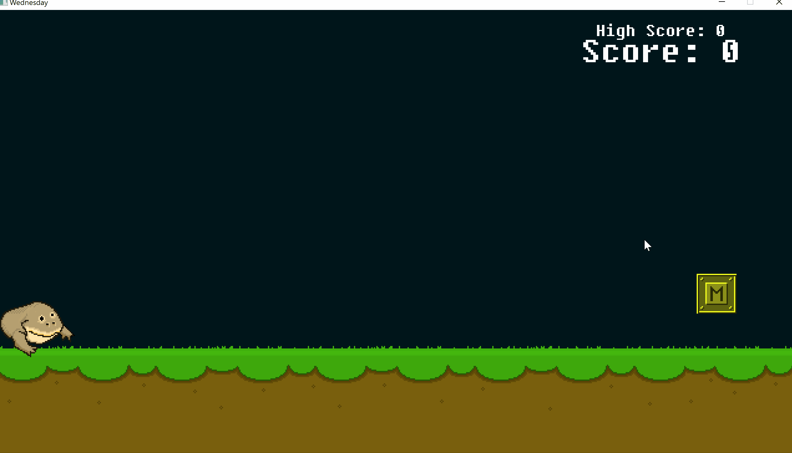
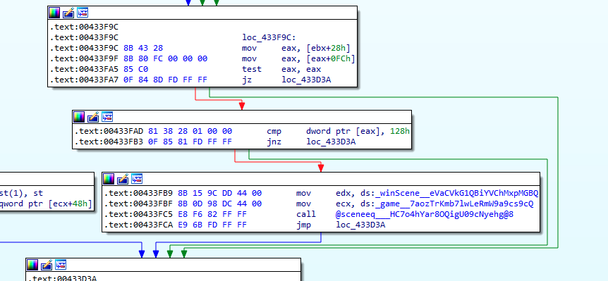
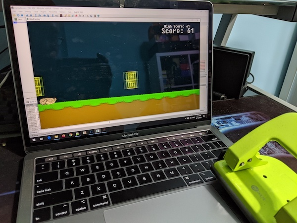
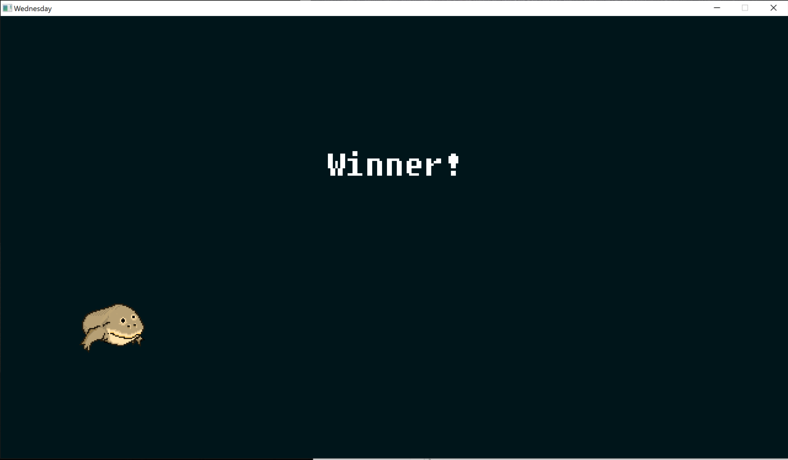
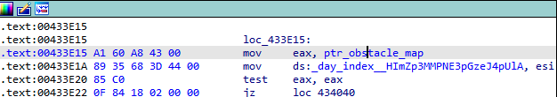
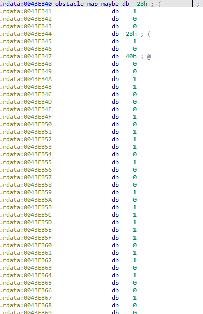
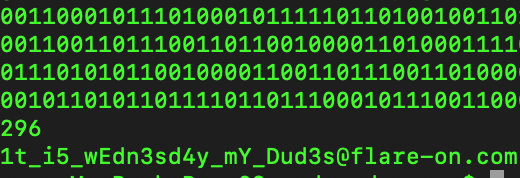

## Flare-On CTF 2020
# Challenge 03 : Wednesday

```
Be the wednesday.
Unlike challenge 1, you probably won't be able to beat this game the old fashioned way.
Read the README.txt file, it is very important.

Inside the README file:
██╗    ██╗███████╗██████╗ ███╗   ██╗███████╗███████╗██████╗  █████╗ ██╗   ██╗
██║    ██║██╔════╝██╔══██╗████╗  ██║██╔════╝██╔════╝██╔══██╗██╔══██╗╚██╗ ██╔╝
██║ █╗ ██║█████╗  ██║  ██║██╔██╗ ██║█████╗  ███████╗██║  ██║███████║ ╚████╔╝
██║███╗██║██╔══╝  ██║  ██║██║╚██╗██║██╔══╝  ╚════██║██║  ██║██╔══██║  ╚██╔╝
╚███╔███╔╝███████╗██████╔╝██║ ╚████║███████╗███████║██████╔╝██║  ██║   ██║
 ╚══╝╚══╝ ╚══════╝╚═════╝ ╚═╝  ╚═══╝╚══════╝╚══════╝╚═════╝ ╚═╝  ╚═╝   ╚═╝

                        --- BE THE WEDNESDAY ---

                                   S
                                   M
                                   T
                                  DUDE
                                   T
                                   F
                                   S

                --- Enable accelerated graphics in VM ---
                  --- Attach sound card device to VM ---
                    --- Only reverse mydude.exe ---
                       --- Enjoy it my dudes ---
```

We are provided a 7zip file with many files

However, the README file told us to focus on the **mydude.exe** only  
That is the main binary that will run the game, the other files are libraries and resources that the game uses

It is a simple game about jumping over or ducking under obstacles as your "frog" character runs

### Cheating the game

As this is a game, let's try to win the game.

I used Cheat Engine to try and determine where the score variable is
- Start the "First Scan" scanning for the value 0
- Score a point 
- Run the "Next Scan" scanning for the value 1
- Score a point
- Run the "Next Scan" scanning for the value 2

If the game is running too fast for you to scan, you can use Cheat Engine's "Speedhack" feature to slow the game down

At this point, you should only have a few candidate addresses left



If you look at these 2 addresses in IDA, one is the **score** variable and the other is the **prev_score** variable  
I spotted something interesting next to the **prev_score** variable



The **day_index** looks intersting because of the README file  
The README told us to become "Wednesday"

Putting a watch on this in Cheat Engine shows that it is usually set to 1
What if we set it to 3?





The obstacles generated can then be easily passed by just ducking all the way

Next step is to find the target score to win the game  
Looking at the functions that uses the score variables, there is an **update** function



At the end of this function there is a check if something equals 0x128  
If so, it changes to game to the **WinScene**  
I guessed that this **WinScene** is the winning screen

I used Cheat Engine to cheat my score to 0x128 but it did not trigger this branch of the code  
Reversing further revealed that its checking some "local" version of the score (de-referenced by "this")

I did not want to waste too much brain cells on this so I took the lazy way out




PS: I could have just patched the binary to change the check to equal something like 0x02.. oh well...

When the score hit 0x128 (296), I got the winning screen!! Yay!!



But there was no flag :(

### Getting the actual flag

I was stuck here for a longest time and I went to twitter to see if anyone is talking about this challenge  
Some people were saying to focus on the obstacles and how they are generated

As the **day_index** previously affected the generation of the obstacles, I look through it's x-refs to see if there is anything interesting  
This is when I came across another variable that is used together with **day_index** in several locations



It points to a region of memory in the .rdata section that looked interesting



It is used as [eax+8]  
At that location, there is a sequence of 00 and 01 bytes

This is actually the "map" of the game  
If I did not cheat the **day_index** value, it will use this sequence to generate the obstacles
- 00 will generate an obstacle that I have to duck under
- 01 will generate an obstacle that I have to jump over

If we collected all this 0 and 1 into a string and convert it into ASCII, we get the flag

I wrote a [python script](soln.py) to do this

```py
data = "00 00 01 01 00 00 00 01 00 01 01 01 00 01 00 00 00 01 00 01 01 01 01 01 00 01 01 00 01 00 00 01 00 00 01 01 00 01 00 01 00 01 00 01 01 01 01 01 00 01 01 01 00 01 01 01 00 01 00 00 00 01 00 01 00 01 01 00 00 01 00 00 00 01 01 00 01 01 01 00 00 00 01 01 00 00 01 01 00 01 01 01 00 00 01 01 00 01 01 00 00 01 00 00 00 00 01 01 00 01 00 00 00 01 01 01 01 00 00 01 00 01 00 01 01 01 01 01 00 01 01 00 01 01 00 01 00 01 00 01 01 00 00 01 00 01 00 01 01 01 01 01 00 01 00 00 00 01 00 00 00 01 01 01 00 01 00 01 00 01 01 00 00 01 00 00 00 00 01 01 00 00 01 01 00 01 01 01 00 00 01 01 00 01 00 00 00 00 00 00 00 01 01 00 00 01 01 00 00 01 01 00 01 01 00 00 00 01 01 00 00 00 00 01 00 01 01 01 00 00 01 00 00 01 01 00 00 01 00 01 00 00 01 00 01 01 00 01 00 01 01 00 01 01 01 01 00 01 01 00 01 01 01 00 00 00 01 00 01 01 01 00 00 01 01 00 00 00 01 01 00 01 01 00 01 01 01 01 00 01 01 00 01 01 00 01"
data = data.split(" ")
binstr = "".join(["0" if x == "00" else "1" if x == "01" else "unknown" for x in data])
print(binstr)
print(len(binstr))

out = ""
i = 0
while i < len(binstr):
    tmp = int(binstr[i:i+8],2)
    out += chr(tmp)
    i += 8
print(out)
```



The flag is **1t_i5_wEdn3sd4y_mY_Dud3s@flare-on.com**
