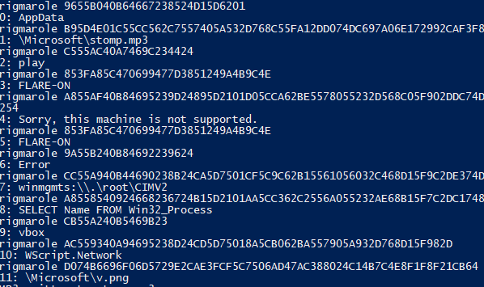
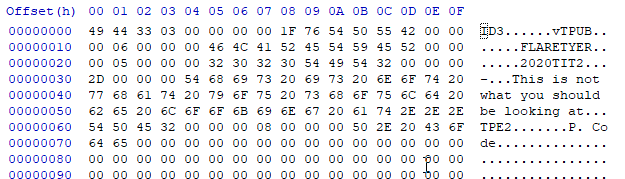

## Flare-On CTF 2020
# Challenge 04 : report

```
Nobody likes analysing infected documents, but it pays the bills. 
Reverse this macro thrill-ride to discover how to get it to show you the key.
```

We are provided a 7zip file with a Excel document

I ran [olevba](http://www.decalage.info/python/oletools) on the excel document  

If you are getting some Unicode error, try changing to Python 2.7 to run olevba  
Remember to change back to Python 3 if you want to run my solution scripts

The AutoOpen function only calls 1 other function

```vbs
Sub Workbook_Open()
Sheet1.folderol
End Sub

Sub Auto_Open()
Sheet1.folderol
End Sub
```

I've copied Sheet1's code [here](sheet1.vbs)

First of all, there is some obfuscated strings (decoded by rigmarole and onzo functions)

I wrote some python code that can deobfuscated these strings

```py
def rigmarole(instr):
    print("rigmarole %s" % instr)
    i = 0
    out = ""
    while i < len(instr):
        c1 = instr[i:i+2]
        c2 = instr[i+2:i+4]
        cc = int(c1,16) - int(c2, 16)
        out += chr(cc)
        # print("%s %s" % (c1, c2))
        i += 4
        
    return out
		
data = "9655B040B64667238524D15D6201.B95D4E01C55CC562C7557405A532D768C55FA12DD074DC697A06E172992CAF3F8A5C7306B7476B38.C555AC40A7469C234424.853FA85C470699477D3851249A4B9C4E.A855AF40B84695239D24895D2101D05CCA62BE5578055232D568C05F902DDC74D2697406D7724C2CA83FCF5C2606B547A73898246B4BC14E941F9121D464D263B947EB77D36E7F1B8254.853FA85C470699477D3851249A4B9C4E.9A55B240B84692239624.CC55A940B44690238B24CA5D7501CF5C9C62B15561056032C468D15F9C2DE374DD696206B572752C8C3FB25C3806.A8558540924668236724B15D2101AA5CC362C2556A055232AE68B15F7C2DC17489695D06DB729A2C723F8E5C65069747AA389324AE4BB34E921F9421.CB55A240B5469B23.AC559340A94695238D24CD5D75018A5CB062BA557905A932D768D15F982D.D074B6696F06D5729E2CAE3FCF5C7506AD47AC388024C14B7C4E8F1F8F21CB64".split(".")

for i in range(len(data)):
		print("%d: %s" % (i, rigmarole(data[i])))
```

Here are the deobfuscated strings 



After deobfuscation, the 2 main functions looks like this

```vbs
Function folderol()
    Dim wabbit() As Byte
    Dim fn As Integer: fn = FreeFile
    Dim onzo() As String
    Dim mf As String
    Dim xertz As Variant
    
    onzo = Split(F.L, ".")
    
    If GetInternetConnectedState = False Then
        MsgBox "Cannot establish Internet connection.", vbCritical, "Error"
        End
    End If

    Set fudgel = GetObject("winmgmts:\\.\root\CIMV2")
    Set twattling = fudgel.ExecQuery("SELECT Name FROM Win32_Process", , 48)
    For Each p In twattling
        Dim pos As Integer
        pos = InStr(LCase(p.Name), "vmw") + InStr(LCase(p.Name), "vmt") + InStr(LCase(p.Name), rigmarole(onzo(9)))
        If pos > 0 Then
            MsgBox "Sorry, this machine is not supported.", vbCritical, "Error")
            End
        End If
    Next 
        
    xertz = Array(&H11, &H22, &H33, &H44, &H55, &H66, &H77, &H88, &H99, &HAA, &HBB, &HCC, &HDD, &HEE)

    wabbit = canoodle(F.T.Text, 0, 168667, xertz)
    mf = Environ("AppData") & "\Microsoft\stomp.mp3"
    Open mf For Binary Lock Read Write As #fn
      Put #fn, , wabbit
    Close #fn
    
    mucolerd = mciSendString("play" & mf, 0&, 0, 0)
End Function

Function canoodle(panjandrum As String, ardylo As Integer, s As Long, bibble As Variant) As Byte()
    Dim quean As Long
    Dim cattywampus As Long
    Dim kerfuffle() As Byte
    ReDim kerfuffle(s)
    quean = 0
    For cattywampus = 1 To Len(panjandrum) Step 4
        kerfuffle(quean) = CByte("&H" & Mid(panjandrum, cattywampus + ardylo, 2)) Xor bibble(quean Mod (UBound(bibble) + 1))
        quean = quean + 1
        If quean = UBound(kerfuffle) Then
            Exit For
        End If
    Next cattywampus
    canoodle = kerfuffle
End Function
```

It first checks if it is running inside a VM  
If it is not, it decodes a bunch of bytes from **F.T.Text** and write it out to an mp3 file

The **F.T.Text** is the large bunch of hex values shown by olevba  
I've extracted them and saved it in this [hugestream.bin](hugestream.bin) file

I then wrote a python script that will decrypt this mp3 file

```py
def canoodle(haystack, start_offset, num_bytes, key):
    i = start_offset
    counter = 0
    out = b""
    while i < len(haystack):
        if counter >= num_bytes:
            break
        
        tmp = int(haystack[i:i+2], 16) ^ key[counter % len(key)]
        out += bytes([tmp])
        
        counter += 1
        i += 4
        
    return out

mp3filename = "stomp.mp3"
xorkey = b"\x11\x22\x33\x44\x55\x66\x77\x88\x99\xaa\xbb\xcc\xdd\xee"
mp3 = canoodle(huge, 0, 168667, xorkey)
with open(mp3filename, "wb") as f:
		f.write(mp3)
		print("MP3 written to %s" % mp3filename)
```

However, when I opened the mp3 file, the track title is "This is not what you should be looking for"



### Getting to the actual flag

The filename of the mp3 "stomp.mp3" seems like a clue about [VBA Stomping](https://vbastomp.com/)

Looking back at the olevba output, there is actually another bunch of pcode  
I've extracted them [here](ThisWorkbook.pcode)

I used [pcode2code](https://pypi.org/project/pcode2code/) to turn this pcode back into something similar to VBA  
Here is the [converted version](ThisWorkbook.vbs)

It uses the same obfuscation techniques, here is the interesting functions when deobfuscated 

```vba
Set groke = CreateObject("WScript.Network")
firkin = groke.UserDomain

If firkin <> "FLARE-ON" Then
	MsgBox "Sorry, this machine is not supported.", vbCritical, "Error"
	End
End If

n = Len(firkin)

For i = 1 To n
	buff(n - i) = Asc(Mid$(firkin, i, 1))
Next

wabbit = canoodle(F.T.Text, 2, 285729, buff)
mf = Environ("AppData") & "\Microsoft\v.png"
```

It checks if your Network's user domain is "FLARE-ON"  
If so, it will use the reverse of "FLARE-ON" as a xor key to decrypt and write out a PNG file

The **canoodle** function is the same as before, so I could used the same code to decrypt this file

```py
key2 = b"FLARE-ON"[::-1]
try2 = canoodle(huge, 2, 285729, key2)
file2 = "v.png"
with open(file2, "wb") as f:
    f.write(try2)
print("PNG written to %s" % file2)
```

Here is the complete [python solution script](soln.py)

The PNG file contains the flag


The flag is **thi5_cou1d_h4v3_b33n_b4d@flare-on.com**
