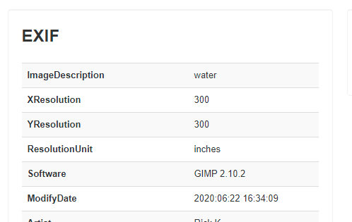
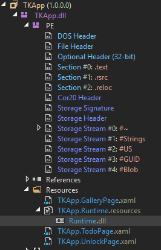

## Flare-On CTF 2020
# Challenge 05 : TKApp

```
Now you can play Flare-On on your watch! 
As long as you still have an arm left to put a watch on, or emulate the watch's operating system with sophisticated developer tools.
```

We are provided a TPK file  
Some googling reveals that TPK files are applications designed for the Samsung Gear smartwatch/fitness watch series

First of all, the TPK file is basically a zip archive  
Unzip it and there is a TKApp.dll in the "bin" directory

Throwing that into IDA shows that it is a .NET compiled DLL  
I loaded it into [dnSpy](https://github.com/0xd4d/dnSpy) instead

### Overview

Looking through the code, I noticed 2 very outstanding functions

#### MainPage.PedDataUpdate

```csharp
private void PedDataUpdate(object sender, PedometerDataUpdatedEventArgs e)
{
	if (e.StepCount > 50u && string.IsNullOrEmpty(App.Step)) {
		App.Step = Application.Current.ApplicationInfo.Metadata["its"];
	}
	if (!string.IsNullOrEmpty(App.Password) && !string.IsNullOrEmpty(App.Note) && !string.IsNullOrEmpty(App.Step) && !string.IsNullOrEmpty(App.Desc))
	{
		HashAlgorithm hashAlgorithm = SHA256.Create();
		byte[] bytes = Encoding.ASCII.GetBytes(App.Password + App.Note + App.Step + App.Desc);
		byte[] first = hashAlgorithm.ComputeHash(bytes);
		byte[] second = new byte[]
		{
			50,148,76,233,110,199,228,72,114,227,78,138,93,189,189,147,159,70,66,223,123,137,44,73,101,235,129,16,181,139,104,56
		};
		if (first.SequenceEqual(second))
		{
			this.btn.Source = "img/tiger2.png";
			this.btn.Clicked += this.Clicked;
			return;
		}
		this.btn.Source = "img/tiger1.png";
		this.btn.Clicked -= this.Clicked;
	}
}
```

This function combines the **Password**, **Note**, **Step** and **Desc** variables and does a SHA256 on it  
It then checks if the hash matches the target hash above

#### MainPage.GetImage and Util.GetString

```csharp
private bool GetImage(object sender, EventArgs e)
{
	if (string.IsNullOrEmpty(App.Password) || string.IsNullOrEmpty(App.Note) || string.IsNullOrEmpty(App.Step) || string.IsNullOrEmpty(App.Desc))
	{
		this.btn.Source = "img/tiger1.png";
		this.btn.Clicked -= this.Clicked;
		return false;
	}
	string text = new string(new char[]
	{
		App.Desc[2], App.Password[6], App.Password[4], App.Note[4], App.Note[0], App.Note[17], App.Note[18], App.Note[16], App.Note[11], App.Note[13], App.Note[12], App.Note[15], App.Step[4], App.Password[6], App.Desc[1], App.Password[2], App.Password[2], App.Password[4], App.Note[18], App.Step[2], App.Password[4], App.Note[5], App.Note[4], App.Desc[0], App.Desc[3], App.Note[15], App.Note[8], App.Desc[4], App.Desc[3], App.Note[4], App.Step[2], App.Note[13], App.Note[18], App.Note[18], App.Note[8], App.Note[4], App.Password[0], App.Password[7], App.Note[0], App.Password[4], App.Note[11], App.Password[6], App.Password[4], App.Desc[4], App.Desc[3]
	});
	byte[] key = SHA256.Create().ComputeHash(Encoding.ASCII.GetBytes(text));
	byte[] bytes = Encoding.ASCII.GetBytes("NoSaltOfTheEarth");
	try
	{
		App.ImgData = Convert.FromBase64String(Util.GetString(Runtime.Runtime_dll, key, bytes));
		return true;
	}
	catch (Exception ex)
	{
		Toast.DisplayText("Failed: " + ex.Message, 1000);
	}
	return false;
}

public static string GetString(byte[] cipherText, byte[] Key, byte[] IV)
{
	string result = null;
	using (RijndaelManaged rijndaelManaged = new RijndaelManaged())
	{
		rijndaelManaged.Key = Key;
		rijndaelManaged.IV = IV;
		ICryptoTransform cryptoTransform = rijndaelManaged.CreateDecryptor(rijndaelManaged.Key, rijndaelManaged.IV);
		using (MemoryStream memoryStream = new MemoryStream(cipherText))
		{
			using (CryptoStream cryptoStream = new CryptoStream(memoryStream, cryptoTransform, 0))
			{
				using (StreamReader streamReader = new StreamReader(cryptoStream))
				{
					result = streamReader.ReadToEnd();
				}
			}
		}
	}
	return result;
}

```

This function then extracts a "key" out of the above 4 variables and perform a Rijndael decrytion on a resource file called **Runtime.dll**

Therefore, the objective of this challenge is to find where are these 4 variables set, so that we can decrypt this file

### Treasure Hunting

These 4 variables are set in different places in the program

#### Password (UnlockPage.OnLoginButtonClicked)

```csharp
private async void OnLoginButtonClicked(object sender, EventArgs e)
{
	if (this.IsPasswordCorrect(this.passwordEntry.Text))
	{
		App.IsLoggedIn = true;
		App.Password = this.passwordEntry.Text;
		base.Navigation.InsertPageBefore(new MainPage(), this);
		await base.Navigation.PopAsync();
	}
	else
	{
		Toast.DisplayText("Unlock failed!", 2000);
		this.passwordEntry.Text = string.Empty;
	}
}

private bool IsPasswordCorrect(string password)
{
	return password == Util.Decode(TKData.Password);
}
```

```csharp
// Util.Decode
public static string Decode(byte[] e)
{
	string text = "";
	foreach (byte b in e)
	{
		text += Convert.ToChar((int)(b ^ 83)).ToString();
	}
	return text;
}
```

```csharp
// TKData.Password
public static byte[] Password = new byte[]
{
	62,38,63,63,54,39,59,50,39
};
```

I wrote a little python code to recover this value

```py
def decode(pw):
    out = b""
    for c in pw:
        tmp = c ^ 83
        out += bytes([tmp])
    return out


pw = bytes([62,38,63,63,54,39,59,50,39])
pw = decode(pw)
print("Password: %s" % pw)
```

Password is **mullethat**

-----

#### Step (MainPage.PedDataUpdate)

```csharp
private void PedDataUpdate(object sender, PedometerDataUpdatedEventArgs e)
{
	if (e.StepCount > 50u && string.IsNullOrEmpty(App.Step)) {
		App.Step = Application.Current.ApplicationInfo.Metadata["its"];
	}
	.....
}
```

```xml
// tizen-manifest.xml
<?xml version="1.0" encoding="utf-8"?>
<manifest package="com.flare-on.TKApp" version="1.0.0" api-version="5.5" xmlns="http://tizen.org/ns/packages">
    <author href="http://www.flare-on.com" />
    <profile name="wearable" />
    <ui-application appid="com.flare-on.TKApp" exec="TKApp.dll" multiple="false" nodisplay="false" taskmanage="true" api-version="6" type="dotnet" launch_mode="single">
        <label>TKApp</label>
        <icon>TKApp.png</icon>
        <metadata key="http://tizen.org/metadata/prefer_dotnet_aot" value="true" />
        <metadata key="its" value="magic" />
        <splash-screens />
    </ui-application>
    <shortcut-list />
    <privileges>
        <privilege>http://tizen.org/privilege/location</privilege>
        <privilege>http://tizen.org/privilege/healthinfo</privilege>
    </privileges>
    <dependencies />
    <provides-appdefined-privileges />
</manifest>
```

Step is **magic**

-----

#### Desc (GalleryPage.IndexPage_CurrentPageChanged)

```csharp
private void IndexPage_CurrentPageChanged(object sender, EventArgs e)
{
	if (base.Children.IndexOf(base.CurrentPage) == 4)
	{
		using (ExifReader exifReader = new ExifReader(Path.Combine(Application.Current.DirectoryInfo.Resource, "gallery", "05.jpg")))
		{
			string desc;
			if (exifReader.GetTagValue<string>(ExifTags.ImageDescription, out desc))
			{
				App.Desc = desc;
			}
			return;
		}
	}
	App.Desc = "";
}
```

It is set as the EXIF tag "ImageDescription" of the image "05.jpg"  
Extract the exif data for that image



Desc is **water**

-----

#### Note (TodoPage.SetupList)

```csharp
private void SetupList()
{
	List<TodoPage.Todo> list = new List<TodoPage.Todo>();
	if (!this.isHome)
	{
		list.Add(new TodoPage.Todo("go home", "and enable GPS", false));
	}
	else
	{
		TodoPage.Todo[] collection = new TodoPage.Todo[]
		{
			new TodoPage.Todo("hang out in tiger cage", "and survive", true),
			new TodoPage.Todo("unload Walmart truck", "keep steaks for dinner", false),
			new TodoPage.Todo("yell at staff", "maybe fire someone", false),
			new TodoPage.Todo("say no to drugs", "unless it's a drinking day", false),
			new TodoPage.Todo("listen to some tunes", "https://youtu.be/kTmZnQOfAF8", true)
		};
		list.AddRange(collection);
	}
	List<TodoPage.Todo> list2 = new List<TodoPage.Todo>();
	foreach (TodoPage.Todo todo in list)
	{
		if (!todo.Done)
		{
			list2.Add(todo);
		}
	}
	this.mylist.ItemsSource = list2;
	App.Note = list2[0].Note;
}
```

It is set as the first item that is not done

Note is **keep steaks for dinner**

-----

### Getting to the Flag

I wrote some python code that would check our resultant string against the target hash

```py
pw = b"mullethat"
step = b"magic" # From PedDataUpdate
desc = b"water" # From IndexPage_CurrentPageChanged
note = b"keep steaks for dinner"
    
combined = pw + note + step + desc
print("Combined string: %s" % combined)
c_hash = hashlib.sha256(combined).digest()
#print(c_hash)
    
target_hash = bytes([50,148,76,233,110,199,228,72,114,227,78,138,93,189,189,147,159,70,66,223,123,137,44,73,101,235,129,16,181,139,104,56])
#print(target_hash)
    
if c_hash != target_hash:
    print("Hash mismatch, terminating...")
    return
print("Hash Matched! Combined string is correct")    
```

The resulting hash matched!!  

I extended my python code to print out the combined key  
Here is my entire [python script](soln.py)

```py
key_string = bytes([desc[2], pw[6], pw[4], note[4], note[0], note[17], note[18], note[16], note[11], note[13], note[12], note[15], step[4], pw[6], desc[1], pw[2], pw[2], pw[4], note[18], step[2], pw[4], note[5], note[4], desc[0], desc[3], note[15], note[8], desc[4], desc[3], note[4], step[2], note[13], note[18], note[18], note[8], note[4], pw[0], pw[7], note[0], pw[4], note[11], pw[6], pw[4], desc[4], desc[3]])
print("Key: %s" % key_string)
```

The resulting key string is **the kind of challenges we are gonna make here**

I was lazy to find exact Python replacement for the decryption routines  
Hence, I created a new .NET C# project and copied over some of the code
- This is one of the beauty of dnSpy, you can copy over the code and run it straight away

I've uploaded the main [Program.cs](Program.cs) of this project

```csharp
using System;
using System.Text;
using System.Security.Cryptography;
using System.IO;

class Program{
	static void Main(string[] args) {
		byte[] key = SHA256.Create().ComputeHash(Encoding.ASCII.GetBytes("the kind of challenges we are gonna make here"));
		byte[] bytes = Encoding.ASCII.GetBytes("NoSaltOfTheEarth");
		byte[] enc = File.ReadAllBytes("Runtime.dll");
		try {
			string result = GetString(enc, key, bytes);
			Console.WriteLine(result);
			byte[] something = Convert.FromBase64String(result);
			File.WriteAllBytes("flag.jpg", something);
			Console.WriteLine("Wrote output into flag.jpg");
		}
		catch (Exception ex) {
			Console.WriteLine("Failed: " + ex.Message, 1000);
		}
	}

	public static string GetString(byte[] cipherText, byte[] Key, byte[] IV) {
		string result = null;
		using (RijndaelManaged rijndaelManaged = new RijndaelManaged()) {
			rijndaelManaged.Key = Key;
			rijndaelManaged.IV = IV;
			ICryptoTransform cryptoTransform = rijndaelManaged.CreateDecryptor(rijndaelManaged.Key, rijndaelManaged.IV);
			using (MemoryStream memoryStream = new MemoryStream(cipherText)) {
				using (CryptoStream cryptoStream = new CryptoStream(memoryStream, cryptoTransform, 0)) {
					using (StreamReader streamReader = new StreamReader(cryptoStream)) {
						result = streamReader.ReadToEnd();
					}
				}
			}
		}
		return result;
	}
}
```

The **Runtime.dll** file is located under the "Resources" tab



Extract it and place it in the same folder as my compiled C# binary  
Run the binary and it will write out the flag in a JPEG file


The flag is **n3ver_go1ng_to_recov3r@flare-on.com**
