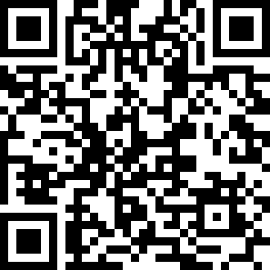

## Flare-On CTF 2020
# Challenge 06 : codeit

```
Reverse engineer this little compiled script to figure out what you need to do to make it give you the flag 
(as a QR code)
```

Open the binary up and you will see strings like "UPX" which means its UPX packed

I ran "upx -d" on it to unpack it

Throw the unpacked binary into IDA and you will see strings referring to "AutoIt"

My Windows Defender also helped me as it blocked a executable file when I tried to run the binary  
This executable file has strings like "Armadillo" which is a packer which is popular with AutoIt scripts

Eventually, I figured out that the exectuable is mostly likely an AutoIt script compiled into a binary

I found this [exe2aut decompiler](https://github.com/JacobPimental/exe2aut) and it managed to decompile the binary back into it's [AutoIt script form](codeit_orig.au3)
- It also dumped out **sprite.bmp** and **qr_encoder.dll**

### Deobfuscation

The script is heavily obfuscated

I wrote a [deobfuscation python script](deobfuscate.py) that will deobfuscate all the strings and replace them back into the script file  
I cleaned it up and then deobfuscated more of the functions and function variables  
At the end, I got this [fairly readable script file](codeit_deobfus.au3)

### Analysis

The most important function is the **DoSomeCrypto** function  
Below is a short pseudo-code of what its doing

```c++
// Treat all array index as 1-indexed (index starts at 1)
void DoSomeCrypto(&some_container){
  my_computer_name = lowercase(GetComputerNameA())
  doSomeShifting(&my_computer_name)
  csp_container = struct(..."struct;ptr;ptr;dword;byte[32];endstruct"...)
  
  CryptAcquireContextA(csp_container[1], 0, 0, 24, 0xF0000000)
  CryptCreateHash(csp_container[1], SHA-256, 0, 0, csp_container[2])
  CryptHashData(csp_container[2], my_computer_name, len(my_computer_name))
  CryptGetHashParam(csp_container[3], HP_HASHVAL, csp_container[4], csp_container[3])
  
  keydata = hexdecode("080200001066000020000000") + csp_container[4]
  // This is a PUBLICKEYSTRUC structure headers
  // https://docs.microsoft.com/en-us/windows/win32/api/wincrypt/ns-wincrypt-publickeystruc
  // This headers specify Plaintext Key and CALG_AES-256 algorithm
  encbytes = hexdecode("CD4B32C650CF21BDA184D8913E6F920A37A4F3963736C042C459EA07B79EA443FFD1898BAE49B115F6CB1E2A7C1AB3C4C25612A519035F18FB3B17528B3AECAF3D480E98BF8A635DAF974E0013535D231E4B75B2C38B804C7AE4D266A37B36F2C555BF3A9EA6A58BC8F906CC665EAE2CE60F2CDE38FD30269CC4CE5BB090472FF9BD26F9119B8C484FE69EB934F43FEEDEDCEBA791460819FB21F10F832B2A5D4D772DB12C3BED947F6F706AE4411A52")
  
  csp_containerB = struct(..."struct;ptr;ptr;dword;byte[8192];byte["+len($keydata)+"];dword;endstruct"...)
  // Treat csp_container as one-indexed
  csp_containerB[3] = len(encbytes)
  csp_containerB[4] = &encbytes
  csp_containerB[5] = &keydata
  csp_containerB[6] = len(keydata)
  
  CryptAcquireContextA(csp_containerB[1], 0, 0, 24, 0xF0000000)
  CryptImportKey(csp_containerB[1], csp_containerB[5], csp_containerB[6], 0, 0, csp_containerB[2])
  CryptDecrypt(csp_containerB[2], 0, 1, 0, csp_containerB[4], csp_containerB[3])
  
  decrypted = csp_containerB[4]
  if decrypted.startsWith("FLARE") and decrypted.endsWith("ERALF"){
    some_container[1] = substring(decrypted, 6, len=4)
    some_container[2] = substring(decrypted, 10, len=4)
    some_container[3] = substring(decrypted, 14, len=len(decrypted)-18)
  }
}
```

In summary, it does the following
- Gets the computer name and convert it to lowercase
- Calls the DoSomeShifting on this computer name
- Sha-256 the result
- This result is used a key to decrypt some encrypted bytes using Windows CALG_AES_256
- The decyrpted bytes are checked if they starts with "FLARE" and ends with "ERALF"
- If so, some of the decrypted bytes are saved in a structure and returned

Another important function is the **DoSomeShifting** function  
Here is it's psuedo-code as well

```c++
void DoSomeShifting(&compname){
  img_file = open("sprite.bmp", "rb")
  img_data = img_file.readall()
  img_data = substring(img_data, 54) // from offset 55 onwards
  
  img_index = 0
  output = ""
  foreach compname_byte in compname {
    for (shift_val=6; shift_val >= 0; shift_val--){
      compname_byte += ((img[img_index] & 0x01) << shift_val)
      img_index += 1
    }
    compname_byte = ror(compname_byte, 1)  // rotate right by 1
    output += compname_byte // string concat
  }
  compname = output
}
```

The **sprite.bmp** file is a resouce in the binary and it was extracted when we ran the exe2aut tool earlier

In summary, it does the following
- Reads in the data from sprite.bmp from byte 55 onwards
- For every byte in compname,
  - Use 7 bytes from the img data
    -  Extract the least significant bit of these 7 bytes
    -  Combine these 7 bits into 1 byte
  -  Add this new byte to the compname byte
  -  Rotate right this resultant byte by 1
- Return the "shifted" compname

The entire process seems to be
- Get the computer name via GetComputerNameA (and convert it to lowecase)
- call DoSomeShifting on this computer name
- Use it as a key to decrypt some encrypted bytes
- The decrypted bytes must start with "FLARE" and ends with "ERALF"

### Guesswork??

I was stuck here for the longest time as there wasn't any clue about what the computer name could be  
Brute-forcing also does not seem likely as we do not know how long the name is

This is when I went to twitter and saw some people suggesting to focus on the bytes from the bmp file and the shifting

If we look at the bytes in the BMP (from offset 55 onwards), extract the least significant bit of each byte (due to the "\& 0x01" operation) and combine every 7 bits.....

```py
def decode_imgdata(imgdata):
    img_index = 0
    out = b""
    for i in range(16):
        cur_byte = 0
        shift_val = 6
        while shift_val >= 0:
            cur_byte += (imgdata[img_index] & 0x01) << shift_val
            shift_val -= 1
            img_index += 1
        out += bytes([cur_byte])
    return out
    
imgdata = b""
with open("sprite.bmp", "rb") as f:
    imgdata = f.read()
            
imgdata = imgdata[54:]        
print(decode_imgdata(imgdata))
```

```
b'aut01tfan1999\x7f\x7f\x7f'
```

I then wrote a [decryption routine in python](decrypt.py) to test this key

```py
from Cryptodome.Cipher import AES
import hashlib
import struct

def do_some_shifting(compname, mask):
    output = b""
    mask_index = 0
    for i in range(len(compname)):
        tmp = compname[i]
        shift_val = 6
        while shift_val >= 0:
            tmp += ((mask[mask_index] & 0x01) << shift_val)
            shift_val -= 1
            mask_index += 1
        tmp = (tmp >> 1) + ((tmp & 0x01) << 7)
        output += bytes([tmp])
    
    return output 
    
BLOCK_SIZE = 16
pad = lambda s: s + (BLOCK_SIZE - len(s) % BLOCK_SIZE) * chr(BLOCK_SIZE - len(s) % BLOCK_SIZE)
unpad = lambda s: s[:-ord(s[len(s) - 1:])]
    
def decrypt(enc, password):
    private_key = hashlib.sha256(password).digest()
    # enc = base64.b64decode(enc)
    iv = b"\x00" * 16
    cipher = AES.new(private_key, AES.MODE_CBC, iv)
    return unpad(cipher.decrypt(enc))
    

def decode_imgdata(imgdata):
    img_index = 0
    out = b""
    for i in range(16):
        cur_byte = 0
        shift_val = 6
        while shift_val >= 0:
            cur_byte += (imgdata[img_index] & 0x01) << shift_val
            shift_val -= 1
            img_index += 1
        out += bytes([cur_byte])
    return out
        
def main():
    imgdata = b""
    with open("sprite.bmp", "rb") as f:
        imgdata = f.read()
        
    imgsize = len(imgdata)
    imgdata = imgdata[54:]
    
    print(decode_imgdata(imgdata))
    
    enc = bytes.fromhex("CD4B32C650CF21BDA184D8913E6F920A37A4F3963736C042C459EA07B79EA443FFD1898BAE49B115F6CB1E2A7C1AB3C4C25612A519035F18FB3B17528B3AECAF3D480E98BF8A635DAF974E0013535D231E4B75B2C38B804C7AE4D266A37B36F2C555BF3A9EA6A58BC8F906CC665EAE2CE60F2CDE38FD30269CC4CE5BB090472FF9BD26F9119B8C484FE69EB934F43FEEDEDCEBA791460819FB21F10F832B2A5D4D772DB12C3BED947F6F706AE4411A52")
    
    key = b"aut01tfan1999"
    #key = do_some_shifting(key, imgdata)
    decrypted = decrypt(enc, key)
    if decrypted[0:5] == b"FLARE" and decrypted[::-1][0:5] == b"FLARE":
        print(decrypted)
        result = []
        result.append(struct.unpack("<I", decrypted[5:5+4])[0]) # width
        result.append(struct.unpack("<I", decrypted[9:9+4])[0]) # height
        result.append(decrypted[14:-4]) # bmp data
        print(result)
    

if __name__ == "__main__":
    main()

```

```
>> python decrypt.py
b'aut01tfan1999\x7f\x7f\x7f'
b'FLARE!\x00\x00\x00\t\x00\x00\x00!\x7f\xee\xd1\xfc\x83\xc4\xa1\nv\xbd\xe2\xd4\xed\xcav\xaa\xdbU\xcaK7(\xff\xac\xe0_UU\x7f\x80\xeb\xb6\x00}Xs|&\x9a\xe4\x9f\x7f\x13\x82)\xb1\xc5\x8e\x8b\x86}()\xba\x93\xa8\xb3\xb8Xy\x14\x0c\x01\xb7p9\xe7\x1d\xf3\xea#\xb6~\x88\x06\xf1\x8eP{\xe8\xce\x87\x97g\xab\x0e\xb0\xf7\xeb\xc7D:\xf6\x18\xaf\x1e7\xda+y\xc2\t\xbf\x01\x8e\xf6#\xfe)\x8f\xd4\n\xfa\xa6\x8d\xd35k\xf4\xabk\xe1\x17x\xd7\xb9\xc8\x91 \x89|8\x7f\x7f\xc0\x8b\x00\x00\x00\x00\x00\x00\x00\x00\x00\x00ERALF'
[33, 9, b'\x7f\xee\xd1\xfc\x83\xc4\xa1\nv\xbd\xe2\xd4\xed\xcav\xaa\xdbU\xcaK7(\xff\xac\xe0_UU\x7f\x80\xeb\xb6\x00}Xs|&\x9a\xe4\x9f\x7f\x13\x82)\xb1\xc5\x8e\x8b\x86}()\xba\x93\xa8\xb3\xb8Xy\x14\x0c\x01\xb7p9\xe7\x1d\xf3\xea#\xb6~\x88\x06\xf1\x8eP{\xe8\xce\x87\x97g\xab\x0e\xb0\xf7\xeb\xc7D:\xf6\x18\xaf\x1e7\xda+y\xc2\t\xbf\x01\x8e\xf6#\xfe)\x8f\xd4\n\xfa\xa6\x8d\xd35k\xf4\xabk\xe1\x17x\xd7\xb9\xc8\x91 \x89|8\x7f\x7f\xc0\x8b\x00\x00\x00\x00\x00\x00\x00\x00\x00\x00E']
```

The decryption was successful

Unless I'm missing something, I have no idea how you are supposed to get that key other than pure guesswork

Not a fan of challenges requiring pure guesswork...

### Getting the flag

The decrypted bytes are then passed into a QR engine (qr_encoder.dll) to generate a QR Code image

I had no idea how to port this to python hence I downloaded [AutoIt3](https://www.autoitscript.com/site/autoit/downloads/), patched the script file and ran it
- Basically, I hardcoded the key to be "aut01tfan1999" regardless of the computer name

Here is the [patched AutoIt script file](codeit_patched.au3)

Running the patched script will produce the flag QR code



Decoding it will give the flag **L00ks_L1k3_Y0u_D1dnt_Run_Aut0_Tim3_0n_Th1s_0ne!@flare-on.com**
