## Flare-On CTF 2020
# Challenge 08 : Aardvark

```
Expect difficulty running this one. 
I suggest investigating why each error is occuring. 
Or not, whatever. You do you.
```

We are provided an x64 PE binary  
When I tried to run it, I got a "CoCreateInstance" error

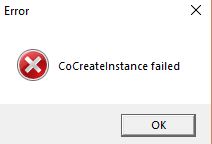

I used that error string as a starting point to start reversing the binary

Moving a little bit back from that MsgBox call, there is a function that checks your Windows Version

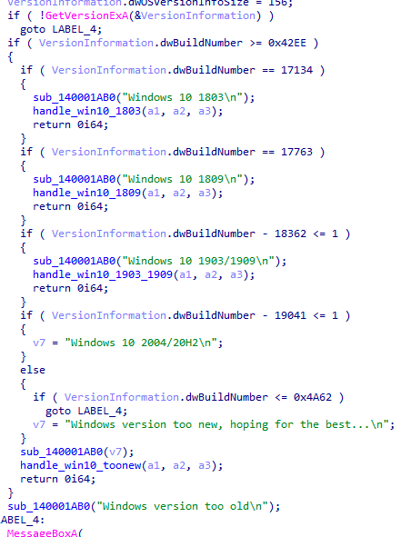

It seems like we need a Windows 10 machine of those listed versions  
My testing VM is running Windows 10 v1803 so it should be fine

The function that failed is **CoCreateInstance**  
Looking at its MSDN documentation, its creating an instance of a class specfied by a CLSID

I then looked at the CLSID passed into this call

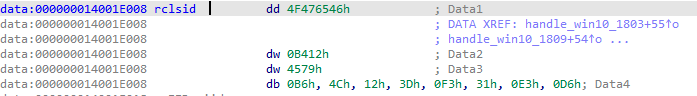

I searched google for this CLSID **4f476546-b412-4579-b64c-123df331e3d6** and found out this is the CLSID for WSL's bash.exe

WSL is Windows Subsystem for Linux  
I checked my own registry and could not find this key defined hence the call would fail

Turns out WSL is not installed by default, we need to install it  
I followed the [installation guide here](https://docs.microsoft.com/en-us/windows/wsl/install-win10) and installed WSL together with Ubuntu from the Windows Store

After installing, the binary ran succesfully  
It is a tic tac toe game

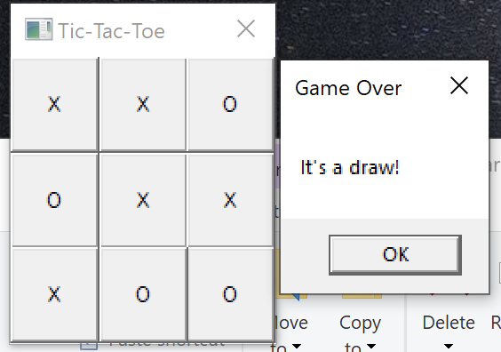

### Analyzing the game

It is impossible to win this game normally
- The computer always goes first
- The computer always takes the center location first

I used the draw message to see if I could cheat  
I could not find the string "It's a draw" in the binary at all  
However, the string "Game Over" exists

This string is used in the DialogFunc function which is like a handler for clicking/interactnig with the GUI elements

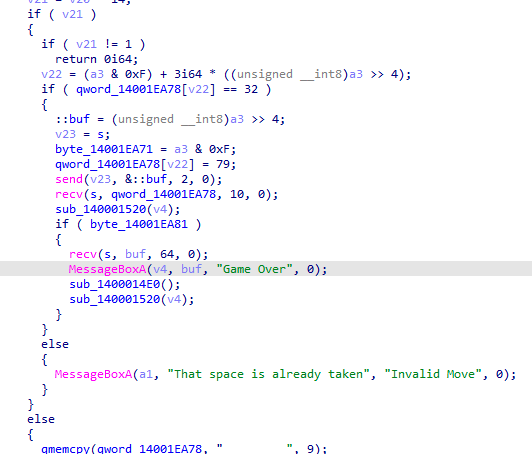

It seems to be sending and receiving stuffs but where is it sending/receiving stuff?

Going back to the function that checks your Windows version and looking at the function that called that

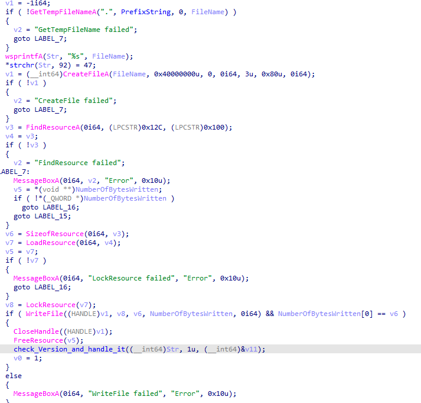

I noticed that a file was written to disk prior to calling that function  
This file seems to be stored as a resource

I started up Resource Hacker and checked the binary for resources

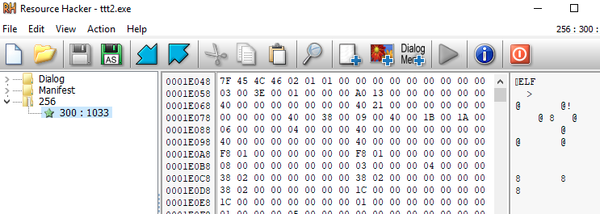

That looks like an ELF executable file  
Fits the logic of checking for WSL too

I extracted this resource and threw it into IDA  
This binary is basically the AI of the game

The player moves are sent to this AI and it replies with it's move

### Cheating the game

I started to look for ways to cheat the game  
I placed a breakpoint at the **send** function call to see how the moves are being sent  
After debugging for awhile, I noticed something in the RBX register when send is being called
- Note: RBX is not an argument register, so this string is not passed to the **send** function

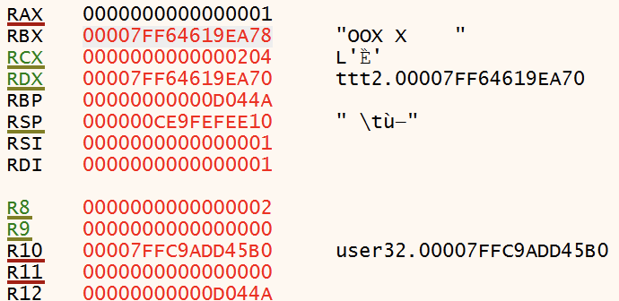

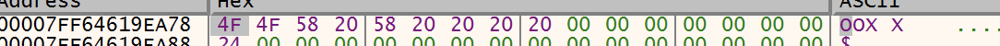

It looks like the "map" of the game (9 byte maps)
- 4F is O
- 58 is X
- 20 is empty square

If you look near the beginning of the **main** function of the AI ELF binary

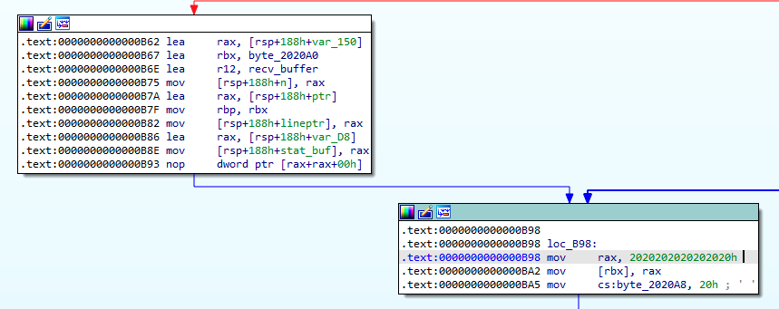

It looks like 9 bytes of "0x20" is moved to a certain memory location  
This looks like the initialization of the map

Can I initialize the map such that it is in my favor?  
Instead of **mov rax, 0x2020202020202020**, can I change it to **mov rax, 0x4f4f202020202020**  
This will give me 2 squares right at the beginning

I patched this ELF binary this way
- Open ttt.exe in a Hex Editor (I used HxD)
- Find "ELF"
- From there, find "0x2020202020202020" (thats 8 bytes of 'space')
- Patch the first 2 bytes to 0x4f4f

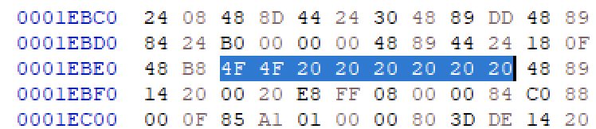

Run the patched binary and you should start with an unfair advantage

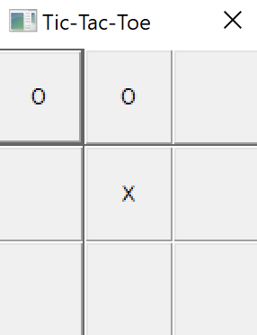

Complete the line and you will get the flag

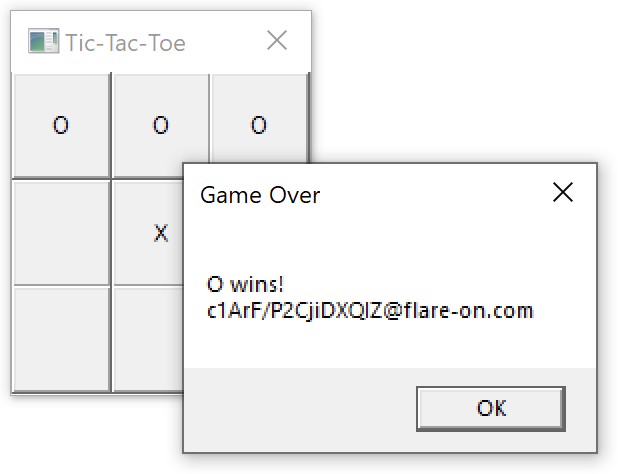

The flag is **c1ArF/P2CjiDXQIZ@flare-on.com**
