## Flare-On CTF 2020
# Challenge 09 : crackinstaller

```
What kind of crackme doesn't even ask for the password? 
We need to work on our COMmunication skills.
```

We are provided an x64 PE binary

### Crashing?

I ran the binary in a debugger normally, it will not even reach the **main** function  
I then started to trace it from the **start**

The binary will exit during the call to the **_initterm** function

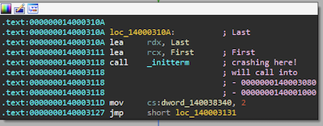

This function will then call 2 other functions (0x3080 and then 0x1000) using the **__guard_dispatch_icall_fptr** (which basically does a "jmp rax")

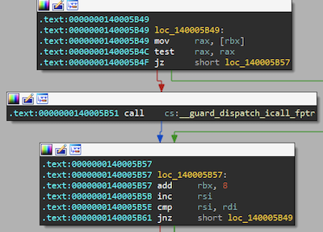

In particular interest is the second function at offset 0x1000, which will eventually reach this code here

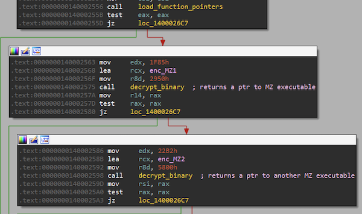

It first loads a bunch of function pointers and then decrypts 2 binaries with MZ file headers
- Let's call them **MZ1** and **MZ2** for now

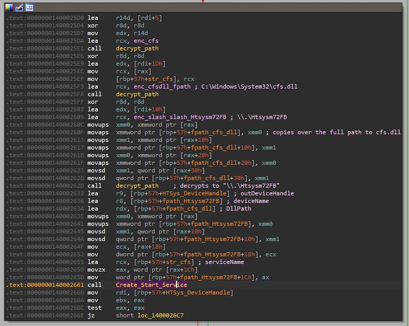

It then decrypted some file paths and then started a service  
- Decryted a file path "C:\\Windows\\System32\\cfs.dll" and mapped **MZ1** to it
  -  **MZ1** shall be referred to as **cfs.dll** now

This file paths also made me realized why the program is exiting before reaching main  
The "System32" folder is protected and you need elevated permissions to access it  
If you run the debugger in elevated mode (Run as Administrator), the code will reach **main**

### Capcom Sys Driver Vulnerability

Take note of the other decrypted string here "\\\\.\\Htsysm72FB"  
Googling about this string revealed that this is the Device name used by the vulnerable Capcom.sys Driver in 2016

I found [this article from fuzzysecurity](https://www.fuzzysecurity.com/tutorials/28.html) which led to this amazing [youtube video](https://www.youtube.com/watch?v=pJZjWXxUEl4) which basically explained how the exploit works in great details

I know its a 2 hour video but its worth it. Go watch the video, now. :)

After watching the video and looking at cfs.dll in IDA, I realized that cfs.dll re-creates this vulnerability
  - **cfs.dll** is the vulnerable driver, theres no need to reverse it anymore

Also from the video, I know that the exploit is triggered by a call to DeviceIOControl with the IOCTL code of 0xAA013044

A little bit of code after the service was created and started, I saw this code

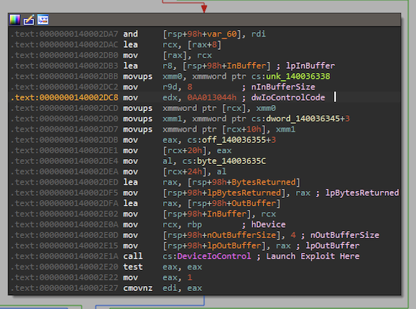

So, this binary will exploit this vulnerability

I also learnt that the shellcode is stored in the **InBuffer**  
Basically, the pointer stored in **InBuffer** will be called by the driver (with ring0 permissions)

Putting a breakpoint at the call to **DeviceIoControl** and inspecting the **InBuffer** (r8), I managed to get the shellcode

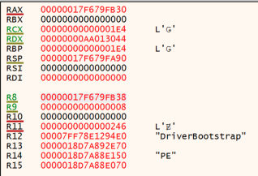

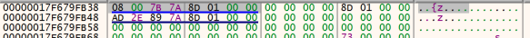

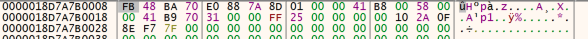

Putting the shellcode into a Disassembler

> FB 48 BA A0 E0 D3 84 FB 01 00 00 41 B8 00 58 00 00 41 B9 70 31 00 00 FF 25 00 00 00 00 10 2A 3D 0D F6 7F 00 00 00 00 00

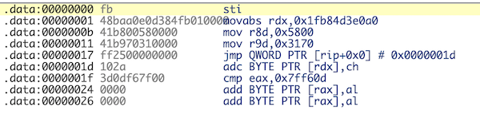

Take note of the arguments in r8 and r9
- r8 contains 0x5800 which is the size of MZ2
- r9 contains 0x3170 (still unsure what this is at this point but take note of it)

The last line is a trick that basically does "jmp [rip]" which actually interprets the rest of the shellcode as an address
- 0x00000000007ff60d3d2a10

If you are familiar with memory, this is a Userland address being jump to in kernel code

This shellcode will change everytime you run it as those addresses can only be determined at runtime

Unfortunately, a normal debugger cannot follow this code anymore, as this shellcode would actually be run by the Kernel driver

Here comes Kernel Debugging...

### Setting up Kernel Debugging

I'm using a MacOS host with 2 Windows VM (1 Debugger, 1 Debuggee) using VMWare Fusion

I followed the instructions [here](https://gist.github.com/cji/1afd0c1f8ed0f6a027cda41035d2ed21) which is fairly straight-forward  
I'll reproduce them here as well

#### Debuggee
Open the debuggee VM's .vmx file. delete the existing serial0 lines (used for printing, not needed) add these lines

```
serial0.present = "TRUE"
serial0.pipe.endPoint = "server"
serial0.fileType = "pipe"
serial0.yieldOnMsrRead = "TRUE"
serial0.startConnected = "TRUE"
serial0.tryNoRxLoss = "FALSE"
serial0.fileName = "/private/tmp/com1"
```

Then run these commands in an elevated command prompt in the VM

```
> bcdedit /set debug yes 
> bcdedit /dbgsettings serial debugport:1 baudrate:115200
```

#### Debugger

Open the debugger VM's .vmx file. delete the existing serial0 lines (used for printing, not needed) add these lines:

```
serial0.present = "TRUE"
serial0.pipe.endPoint = "client"
serial0.fileType = "pipe"
serial0.yieldOnMsrRead = "TRUE"
serial0.tryNoRxLoss = "FALSE"
serial0.startConnected = "TRUE"
serial0.fileName = "/private/tmp/com1"
```

Run WinDbg x64 and press Ctrl+K
- Use Serial Port 1 and baud rate of 115200

Alternatively, you can also create a desktop shortcut to WinDbg x64 with the following target 

```
"C:\Program Files (x86)\Windows Kits\10\Debuggers\x64\windbg.exe" -k com:port=com1,baud=115200
```

Now, restart the Debuggee and it should connect

PS: If you are getting a "VMX file is corrupt" error, double check that the lines in the VMX file does not define the same attribute more than once
  - i.e. you forgot to delete some serial0 lines when adding the new ones

### Stepping through in the Kernel

This part will be confusing as we are jumping across different binaries in the Kernel

This is the TLDR version first  
I will give a more detailed walkthrough at the bottom

```
windbg64> sxe ld cfs.dll
windbg64> g

BP Hit (cfs.dll has been loaded)
windbg64> bp cfs+0x573 # This is the vulnerability in the Capcom driver that would call our user provided function pointer
windbg64> g

BP Hit (Just before calling into our shellcode)

windbg64> t  # Step into our shellcode
windbg64> p  # Step until the jmp [rip+0x0] and step over it

Now we are back in crackstaller code at function 0x2a10

windbg64> bp 0x****2c26  # Just change the last 4 bytes of the current rip address
windbg64> g

We are now at the function call to PsCreateSystemThread
windbg64> bp rax # This is what the new system thread will execute
windbg64> g

We should be now in the DriverBootstrap method of MZ2
windbg64> bp cur_address+0x237 # call to IOCreateaDriver
windbg64> g

We should be just before the call to IoCreateDriver
windbg64> bp rdx  # This will point to MZ2's Driver Entry function
windbg64> g

We should now be in MZ2's Driver Entry
windbg64> bp cur_address + 0x13f # call to CMRegisterCallback
windbg64> g

We should now be just before the call to CMRegisterCallback
windbg64> bp rcx # This is the RegistryCallbackFunction
windbg64> g

We should now be in the callback function

windbg64> bp cur_address + 0x3c5 # this is just before all the sha/salsa20 code
Might wanna disable the prev breakpoint, because there may be multiple event fired that is not relevant

windbg64> g # Until the last breakpoint is hit
Only the relevant event will hit the latest breakpoint

windbg64> bp cur_address + 0x65e # call to CreateSystemThread
windbg64> p
Step through this part of the code to find the key
My guess for the functions called from this point are
- SHA256_Init
- SHA256_Update (Updated with string "BBACABA")
- SHA256_Final
- Salsa20_Init (or ChaCha20, not sure)
- Salsa20_Decrypt

At the end of the decrypt function you should get a string "H@n $h0t FiRst!"

windbg64> g

We should now be just before a call to PsCreateSystemThread
windbg64> bp rax  # The function which the thread will call

Subsequent code from here is not important, just deleting/unloading the driver
```

#### Detailed walkthrough

First, let's tell the debugger to break when cfs.dll is loaded

```
windbg64> sxe ld cfs.dll
```

Another thing I learnt from the video was where the vulnerability in the capcom driver is triggered  
Let's breakpoint on it

```
windbg64> bp cfs+0x573 # This is the vulnerability in the Capcom driver that would call our user provided function pointer
```

Step into and through the shellcode until it performs the "jmp [rip]" which will bring us to function 0x2a10 inside crackstaller's code

##### crackstaller (0x2a10)

The code here first finds a bunch of function pointers

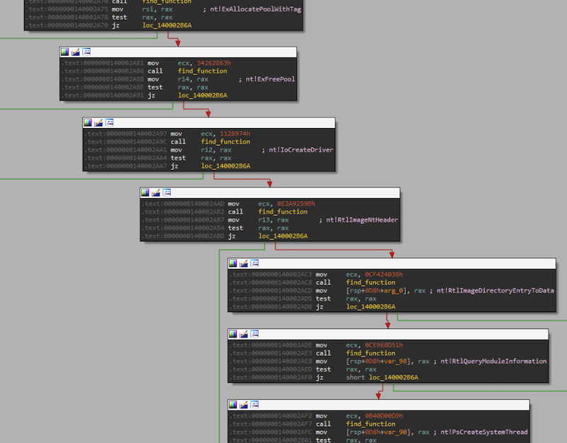

It then allocates some memory in the Pool with tag "FLAR" and copies the contents of MZ2 into it

Near the end, it calls **PsCreateSystemThread**

```
windbg64> bp 0x****2c26  # Just change the last 4 bytes of the current rip address
```

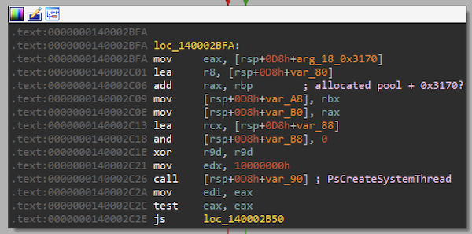

Notice that "0x3170"? 

Its one of the arguments passed from the shellcode  
Its actually a offset to a function within MZ2  
The exact address should be in rax at this point

```
windbg64> bp rax # This is what the new system thread will execute
```

##### MZ2 DriverBootstrap

The last breakpoint will lead us to the DriverBootstrap function in MZ2

```
windbg64> bp cur_address+0x237 # call to IOCreateaDriver
```

This function first loads a bunch of function pointers from a functable

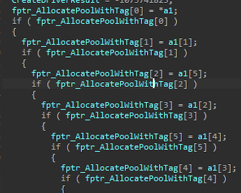

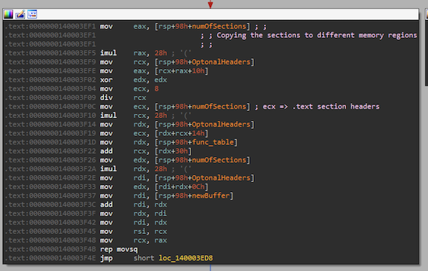

It then allocates more memory on the pool, copy the sections of itself into various parts of it, fixes the import table and relocations and finally calls **IoCreateDriver** (which is an undocumented NT function)

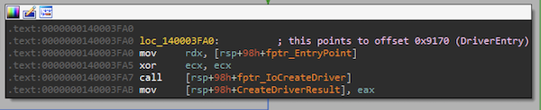

The **IoCreateDriver** will call the function point in rdx (which is pointing to DriverEntry of MZ2) 

Only after reversing, I came across this [Reflective Driver Loader](https://github.com/Professor-plum/Reflective-Driver-Loader/blob/master/reflective_driver/Stub.cpp) code which matches the assembly quite nicely

Basically, all these code does is copy a driver into kernel memory, fixes all the imports and relocations and then loads it (via it's DriverEntry function)

```
windbg64> bp rdx  # This will point to MZ2's Driver Entry function
```

##### MZ2 DriverEntry

The code here is fairly normal driver loading code  
It creates the Device for the driver and registers a Registry callback

The registry callback is the interesting part

```
windbg64> bp cur_address + 0x13f # call to CMRegisterCallback
```

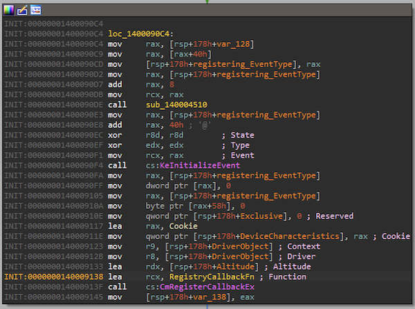

This function registers a callback function that will be triggered by certain Registry events

```
windbg64> bp rcx # This is the RegistryCallbackFunction
```

##### MZ2 RegistryCallbackFunction

This is the important function to get to  
We went through all the preivous hoops to get here

```
windbg64> bp cur_address + 0x3c5 # this is just before all the sha/salsa20 code
Might wanna disable the prev breakpoint, because there may be multiple event fired that is not relevant

windbg64> bp cur_address + 0x65e # call to CreateSystemThread
```

The first part of the code checks if the registry event is RegNtPreCreateKeyEx which is triggered when a new Registry Key is being created

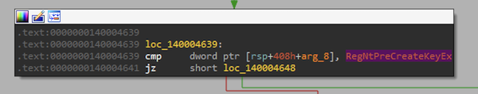

It then checks if this CLSID string is inside the event data (i.e. is this key being created?)

> {CEEACC6E-CCB2-4C4F-BCF6-D2176037A9A7}\Config

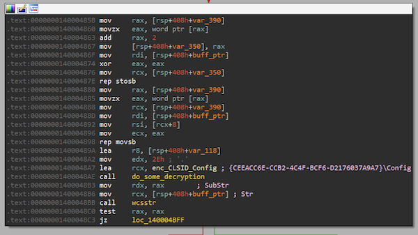

Take note of this CLSID for now

The first breakpoint will bring you to a part of the code that does some crypto

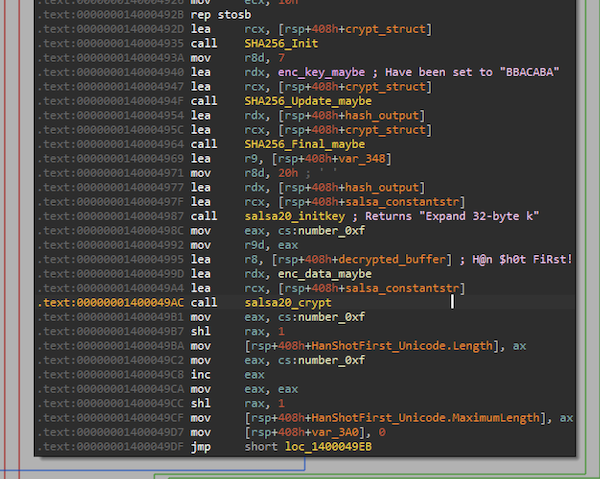

Stepping over the code here reveals that it first does a SHA256 on the string "BBACABA"  
It then uses the resultant hash (32 bytes) as a key into what seems like a Salsa20/ChaCha20 decryption of some 0xf bytes

I figured it was SHA256 as the **SHA256_Init** loaded a bunch of constants that matches the SHA256 constants

I guessed it was Salsa20/ChaCha20 because it also had the magic constants "Expand 32-byte k"

At the end of the decryption, the decrypted string was "H@n $h0t FiRst!"

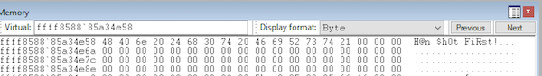

This string is used as a "ClassName" in a zwCreateKey call  
I'm not sure this was important but my solution does not need to use this key

The rest of the code is not so important  
It basically creates another system thread that will delete and unload this driver

### Credhelper.dll

What to do with this string?

Remember that all these code was performed before the **main** function of crackstaller is executed?

Now let's look at the **main** function of crackstaller

It firsts decrypt some binary data (its another MZ file)

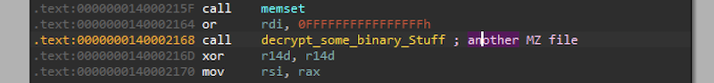

It then decrypts a file path

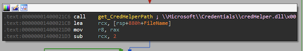

This filepath points to "%User%\\Appdata\\Local\\Microsoft\\Credentials\\credHelper.dll"

Finally, it writes the decrypted content into the file

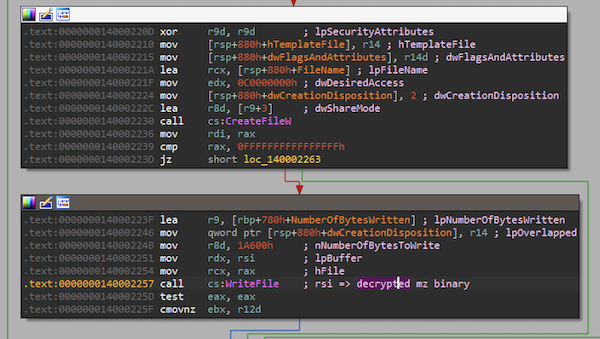

At the end, it loads this new dll file and calls its **DllRegisterServer** method

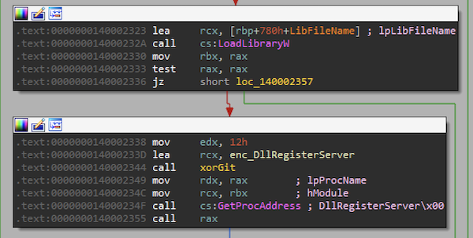

The **DllRegisterServer** function basically registers a DLL file as a COM server  
It does so by creating the related keys in the registry

Let's look at CredHelper's DllRegisterServer function  
It first creates a GUID string

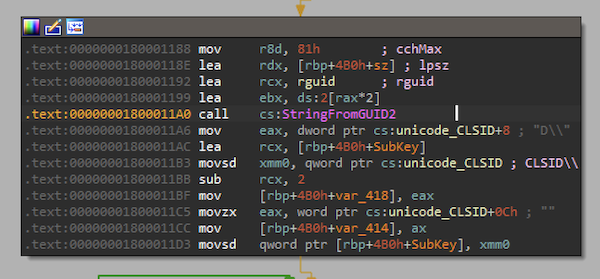

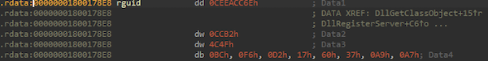

Does those bytes look familiar?  
Its the same as what the registry callback function of MZ2 is looking for

It then continues to create these keys

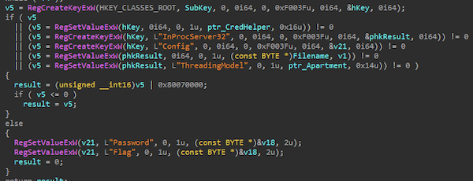

The creation of these keys is what triggered the Registry Callback that we looked at earlier

What's that **Password** and **Flag** values?

This is what the key looks like in Registry Editor

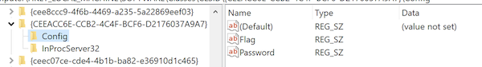

### How to get the flag?

At this point, I was guessing I have to write a client to connect to this COM object and talk to it that way but I could not get my CoCreateInstance code to work

Therefore, I went digging for more stuff in CredHelper.dll

Let's see if there are any functions using the value from **Password** or **Flag**

Just do a "x-ref" from the strings "Password" and "Flag"  
You will find 1 function for each


#### Flag

Function 0x16d8 does some xor decryption with an encrypted buffer and a "key"  
This "key" is from one of the arguments to this function

The decrypted string is then set into the **Flag** value in the registry key

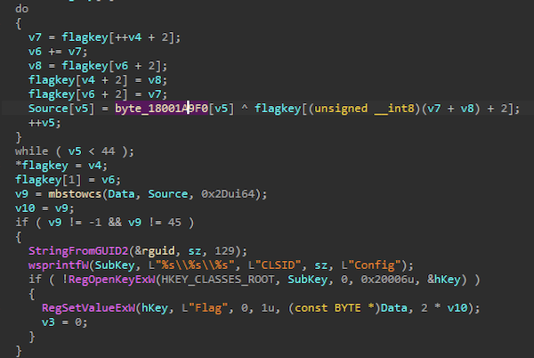

Looking at the encrypted buffer, it looks like an encrypted flag

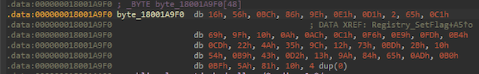

#### Password

Function 0x153c gets the data from the **Password** value and does some stuff with it


After which, this part of the code looks interesting

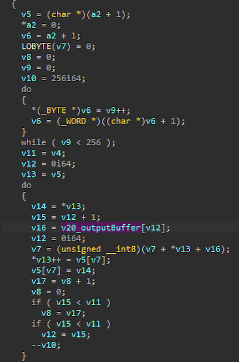

There is a loop of 256 iterations creating an sbox  
The bottom part of the code looks like some byte swapping  
Once again this screamed RC4 to me

#### Hmmmm

Putting 1 and 1 together...

I have a bunch of encrypted bytes which I believe is the encrypted flag  
I have a strange string "H@n $h0t FiRst!"  
I have some code doing what looks like RC4

I just tried the decryption and it worked

```py
from arc4 import ARC4

enc = bytes.fromhex("1656BC869EE1D10265C1699F100AACC1F6E9FDB4CD224A359C1273BD2B1054B943D2139A8465ADB0BF5A8110")
key = b"H@n $h0t FiRst!"
crypt = ARC4(key)
print(crypt.decrypt(enc))
```

The flag is **S0_m@ny_cl@sse$_in_th3_Reg1stry@flare-on.com**
